If the user is already signed in/has a session, we will redirect them to the dashboard

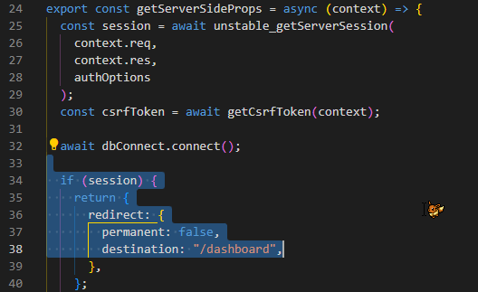

*** once the user successfully signs in, we want to redirect them to the dashboard ****
  if the session already exists, then the user is already signed in. So if this is true, push back to the homepage
  we need to use router (line 8) to redirect user
  we will have a useEffect which is dependent on session changing for this

  if the session did NOT already exist, we need useSession in order to grab session after the page is loaded/on the client-side, aka so we can grab session once we login
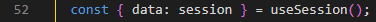

  ???????????? sign in seems to generate a CSRF AND a session??? nextauth.js?????/

"When you define a /pages/api/auth/[...nextauth] JS/TS file, you instruct NextAuth.js that every API request beginning with /api/auth/* should be handled by the code written in the [...nextauth] file."
https://next-auth.js.org/configuration/initialization

https://next-auth.js.org/getting-started/client#signin

I used the signIn() method which is only present on the client side (not server side). 

*** redirect:false *** 

However, next-auth will normally try to redirect the user to another page whether the signIn was valid or not. However, we want them the user to stay put and see the error or success message.

So we're using redirect:false

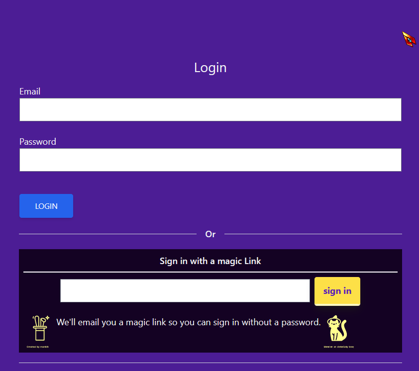

On submiting/clicking submit button, handleSubmit function is called
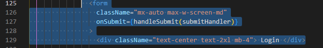

***** submitHandler calls the signIn function, recall that we entered "credientials" this will be important later 

we will store what signIn returns to us in the result variable. 
If result ends up with an error property ===> return a toast/popup error message (error message's text was created in [...nextauth].js, see next part).
Otherwise return a "successfully signed in! Sending to dashboard" toast/popup message.

If the try statement aborted, then send a toast error with the default error message

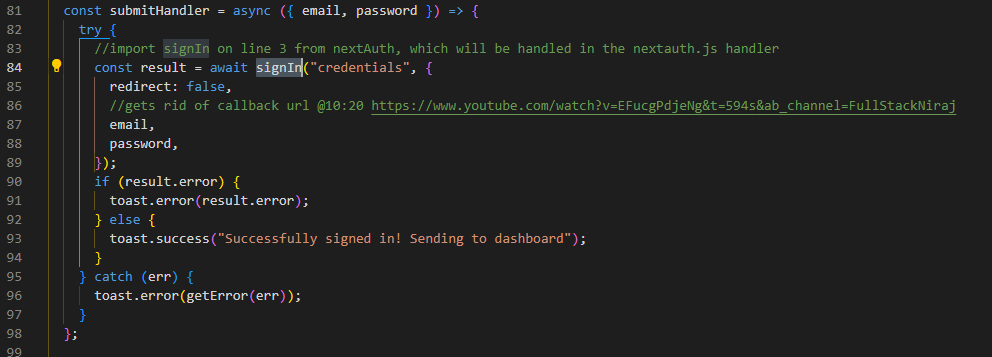

When we tell it signIn with credentials, it will look at [...nextauth].js for detailed instructions for signing in with the credentials provider, and it will go realize if:
1. sign in works: return a session with a user id, name, profilename, email and profile image
2. otherwise: return an error message "invalid email or password"
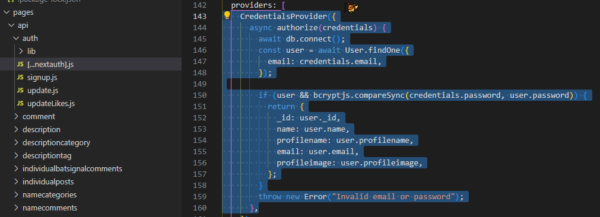

signIn is part of Next-Auth/react and handles grabbing the CSRF token
(https://next-auth.js.org/v3/configuration/pages)

What is a CSRF token https://brightsec.com/blog/csrf-token/

Go to node_modules, Next-Auth/react folder
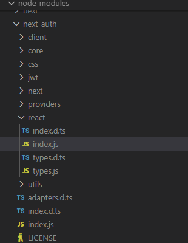

click index.d.ts
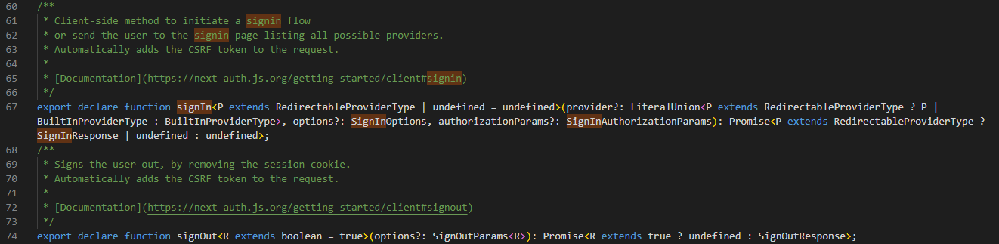

Click index.js
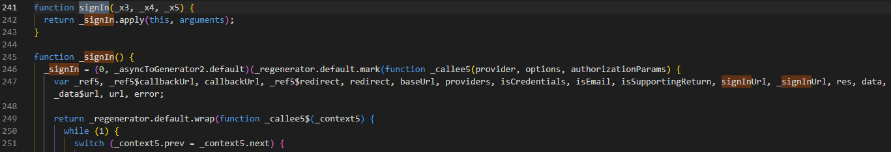

we want case 11, since we're using credentials (see *****)
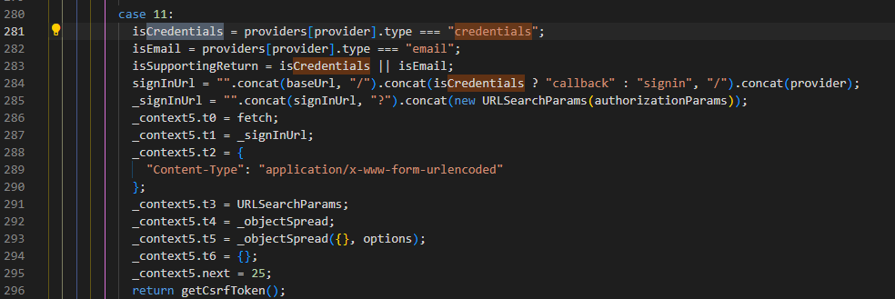

We now just to the csrf function which was called
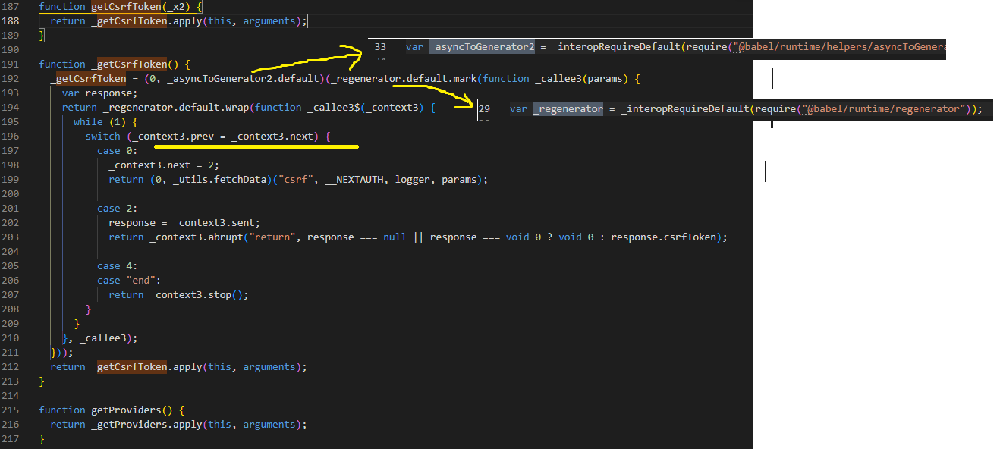
I belive the yellow part is probably where it compares if the email and password match what was in the database?

getCsrfToken uses some external babel packages

DIVING DEEPER: What changes when signing in, in storage! 

These two always appear in cookies

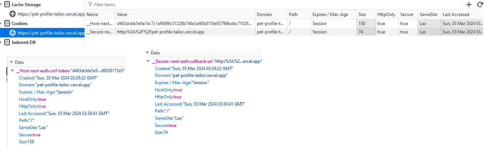

This local storage always has the one nextAuth message
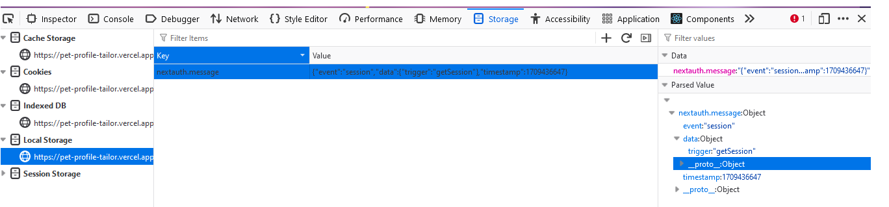

This session token only appears with a successful sign in
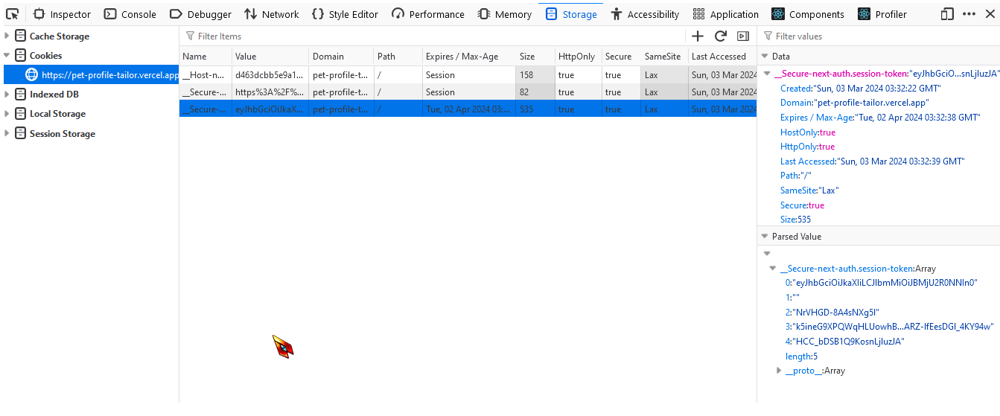

If the sign in fails, this session token will not appear
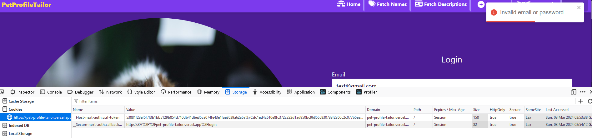