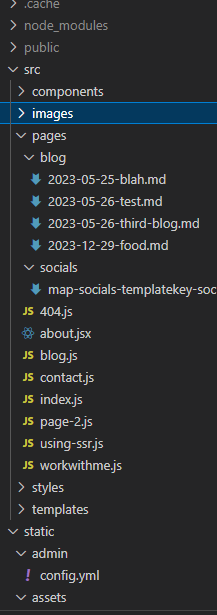
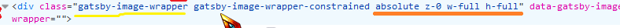
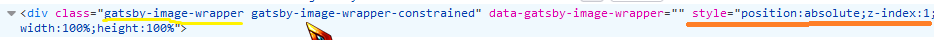
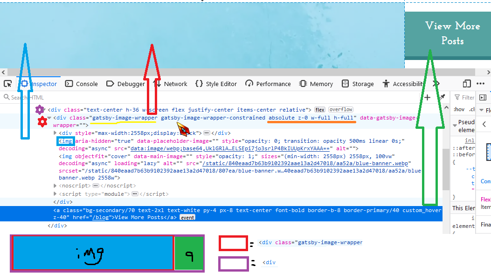
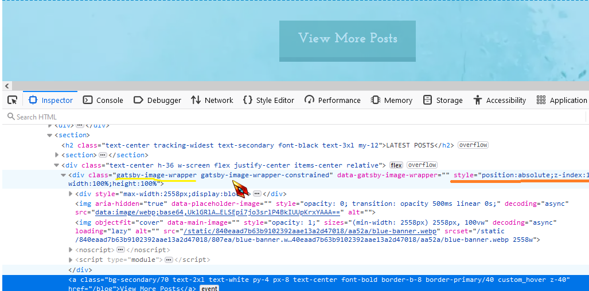
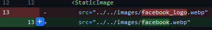
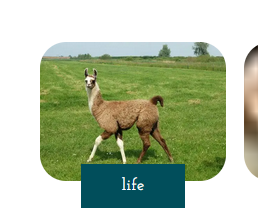

# Dynamic Image

Does not work with Drupal/Netlify CMS, using react-lazy-load-image-component as an alternative for dynamic images. Dyanmic images means images directly from the cms/not local images.

# StaticImage

## Where to store images

Store them in src==>images



## Props: lazy loading/placeholder, ect

https://www.gatsbyjs.com/docs/reference/built-in-components/gatsby-plugin-image

## How gatsby Static works

In this example, we're storing our elements in a div (purple)

Gatsby Static automatically wraps the < img > in a wrapper < div> element. This div wrapper has built in styling: "gatsby-image-wrapper"


```
General layout:

< div class="gatsby-image-wrapper...." > *** wrapper***

  < div style="max-width...>
      < img... role="presentation"
  </ div>

  < img... src="data:image/webp;base64...==">

  < img... src="/static/840....blue-banner.webp"> *** img location **
```

### Background Images ===> Inline Styling is Key

Because the gatsby image wrapper's built in css will take priority, unless you add your styling as higher priority inline-styling


To


- DON"T use className for Background Image Styling

  ```
  <StaticImage
            src="../images/blue-banner.webp"
            alt=""
            loading="lazy"
            objectfit="cover"
            placeholder="blurred"
            className="absolute z-0 w-full h-full" **
          />


  ```

  The styling you added with className, is actually is applied to the wrapper. And that wrappers css class "gatsby-image-wrapper" will take priority

  

- USE inline styling for background images

  Instead, we want to use inline styling, to tell the wrapper to pay more attention to our inline styling than the gatsby-image-wrapper class styling

  

  ````
    <StaticImage
            src="../images/blue-banner.webp"
            alt=""
            loading="lazy"
            objectfit="cover"
            placeholder="blurred"
            style={{
              position: "absolute",
              zIndex: "1",
              width: "100%",
              height: "100%",
            }}
          /> css class "gatsby-image-wrapper"
          ```
  ````

In more detail:

1. What happens with className styling (wrapper styling takes priority)



2. What happens with inline styling (our styling takes priority)



### Background Image with Gatsy Image Youtube Video

- "How to use Gatsby.js StaticImage as background image"

https://www.youtube.com/watch?v=QCs7vQiMsYA

### Naming Source Images, don't use \_\_

Don't use \_ in the name


ex:
Images worked find locally but the facebook icon had the name "facebook_logo"


The others didn't have \_ in the name. So I removed it, and now it works


### Sourcing Local Images to Gatsby Static Images

- wrap the src in {}

> adding as a string leads to the picture not loading

```
<StaticImage
         src="../../images/llama.webp"
      />
```


> Works if the string is placed in {}

```
<StaticImage
   key={`img ${tag}`}
        src={"../../images/llama.webp"}
    />
```


