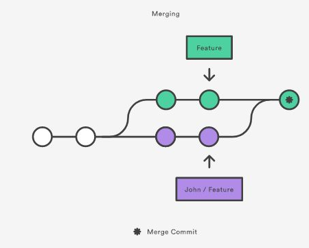
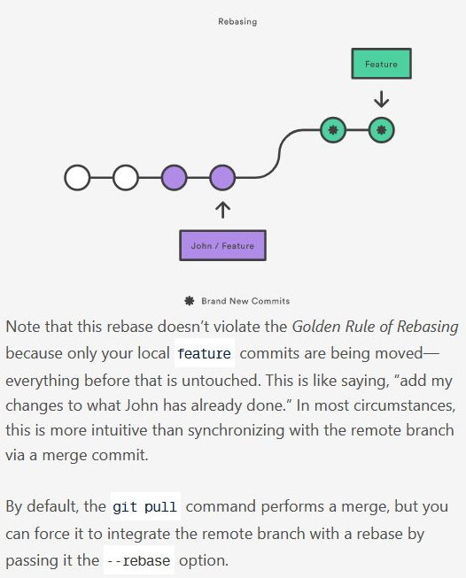

# 🎿📖 MOVEMENT AND OPENING

## change drive

> cd d:

## go back to home folder

> cd ~

## open a whole folder in vscode (once navigated to folder)

> code .

## open a whole folder on desktop (once navigated to folder)

> start .

 

# 👼 CREATION && Saving

## create folder

> mkdir (name)

## create file

> touch (name)

## Saving Changes in Git

> git add .

- puts it in staging area

> git commit -m "changes to gitbash.md"

- https://www.youtube.com/watch?v=uFRY6Gxw9EA

> git push

- git push: cleans up messy hisotry before merging a feature branch to main

## renaming a file

### not in git

> mv 6kyu-create-phone-number 6kyu-create-phone-number.js

### if you're renaming a file thats in git already

> git mv (old file) (new file)

## Backdating commit

- git commit --date="2022-08-12" -m "message"

## checking Git Contents

> git status

## View current directory

> pwd

 

 
 

## 🐣 1st time Uploading

### Initialize git

1. > git init
2. > git add .
3. > git commit -m "initial commit"

- commits a fancy way of saying snapshot/save point

  3.b you will want to commit something, otherwise you'll get an error:

- git fetch origin
- git checkout
- fatal: You are on a branch yet to be born
  > As ever, Git is right, it just has a quirky way of saying it: when you create a repository, the master branch actually doesn't exist yet because there's nothing for it to point to.
  > https://stackoverflow.com/questions/24001587/you-are-on-a-branch-yet-to-be-born

### Make folder on github

3. click +, new repo
4. click code, https ex: https://github.com/JSMarsh813/Reference.git

### In Bash Terminal

5. > git remote add origin [copied web address]
6. Push your branch to Github

- > git push -u origin main

 

## 🏠 Origin

### View Origin

> git remote -v

### Change Origin

> git remote set-url origin (new url)

## 📛 Change Branch Name ex: Master to Main

> git branch -m master main

- -m = not-yet-existing branch, ex new empty repo
- -m is useful since git requires you to be on "some" branch

 

## Removal & Undoing Changes

### Undo commited snapshot/faulty commit

When you discover a faulty commit, reverting is a safe and easy way to completely remove it from the code base.

> git revert

### Undo changes to files in working directory git

Usually just deals with tracked files

> git reset

### Removes untracked files from the working directory

> git clean

### Remove folder

> rm -r \<folder>

> rm -rf \<folder>

- -f ==> if you want to remove protected files too

### Remove files from staging

> git rm --cached \<index.html>

# Grabbing Temote Branch

## Grab branch but choose what to integrate

> git fetch

- Fetching downloads a branch from another repository, along with all of its associated commits and files. But, it doesn't try to integrate anything into your local repository.

- This gives you a chance to inspect changes before merging them with your project.

## Grab branch and automatically integrate it

> git pull

# Troubleshooting/Fixing Problems

## Fell into vim, forgot -m flag in git commit

i \<message> escape + :wq + enter

## Resurrect deleted branch or one that was merged with main branch

- branch must of been on your machine
- git's safety net

> git reflog

## Before commiting: clean up branches

> git merge

### git merge versus rebase

-non-destructive
-existing branches are not changed
-safer
-has traceability

## Before Commiting: Avoid unnecessary merge commits

- By moving branching arounds
- Creates a linear history that's easier to understand

> git rebase -i

- i ==> interactive
- cleans up messy hisotry before merging a feature branch to main

## folder has a space in name

- escape it with \
- or use tab

## clone repo && be able to make commits

- fork the code instead of cloning it
- if you cloned it, you wouldn't be able to make commits when we fork it

## Experiment with a specific old revision/commit

> git checkout 757c47d4

- you're checking out a commit which will result in a detached head state aka the changes you make do NOT belong to any branch, so its easy to lose the data/changes

-rarely used

- ex: want to experiment with a specific old revision so you need that revision's files in your working copy folder

## collaborating on the same feature && incorporate changes

option 1: Merge your local feature with john/feature

Option 2: rebase

- basically saying add my changes to what john has already done

- key point: only your local feature commits are being moved, everything before that is untouched

# 😨 Errors

## git push -u origin main ===> Current Branch Behind Main

Do:

> git pull origin main

- If fatal: refusing to merge unrelated histories add flag:

  > --allow-unrelated-histories

- If fatal background: This happened when I created a new repo with a readme and wanted to push new files from vscode

- "Warning: You should not use the --allow-unrelated-histories flag unless you **know what unrelated history is** and are **sure you need it**. The check was introduced just to prevent disasters when people merge unrelated projects by mistake." https://stackoverflow.com/questions/39761024/refusing-to-merge-unrelated-histories-failure-while-pulling-to-recovered-repos/39783462#39783462

## git push ===> The current branch main has no upstream branch.

Do:

> git push --set-upstream origin main

## Pushed a commit to github and by mistake

locally do

1. git rm (file name)

then do a normal

2. git add .

3. git add (file name)

4. git commit -m "mistake"

5. git push

then push to the repo
