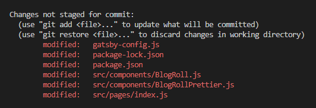

# 🎿📖 MOVEMENT AND OPENING

## change drive

> cd d:

## go back to home folder

> cd ~

## open a whole folder in vscode (once navigated to folder)

> code .

## open a whole folder on desktop (once navigated to folder)

> start .

<br>

# 👼 CREATION && Saving

## create folder

> mkdir (name)

## create file

> touch (name)

## Saving Changes in Git

> git add .

- puts it in staging area

> git commit -m "changes to gitbash.md"

- https://www.youtube.com/watch?v=uFRY6Gxw9EA

> git push

- git push: cleans up messy hisotry before merging a feature branch to main

## renaming a file

### not in git

> mv 6kyu-create-phone-number 6kyu-create-phone-number.js

### if you're renaming a file thats in git already

> git mv (old file) (new file)

## Backdating commit

- git commit --date="2022-08-12" -m "message"

## checking Git Contents

> git status

## View current directory

> pwd

<br>

<br>
<br>

## 🐣 1st time Uploading

### Initialize git

1. > git init
2. > git add .
3. > git commit -m "initial commit"

- commits a fancy way of saying snapshot/save point

  3.b you will want to commit something, otherwise you'll get an error:

- git fetch origin
- git checkout
- fatal: You are on a branch yet to be born
  > As ever, Git is right, it just has a quirky way of saying it: when you create a repository, the master branch actually doesn't exist yet because there's nothing for it to point to.
  > https://stackoverflow.com/questions/24001587/you-are-on-a-branch-yet-to-be-born

====== Make folder on github =======

3. click +, new repo
4. click code, https ex: https://github.com/JSMarsh813/Reference.git

====== In Bash Terminal ========

5. > git remote add origin [copied web address]
6. Push your branch to Github

- > git push -u origin main

### push an existing repository to github for the first time

as suggested by github

- git remote add origin https://github.com/~~~~/~~~~~.git
- git branch -M main
- git push -u origin main


<br>

## 🏠 Origin

### View Origin

> git remote -v

### Change Origin

> git remote set-url origin (new url)

## 📛 Change Branch Name ex: Master to Main

> git branch -m master main

- -m = not-yet-existing branch, ex new empty repo
- -m is useful since git requires you to be on "some" branch

<br>

## Removal & Undoing Changes

### Undo staged file before commit

```
git reset 6-allocating-hotel-rooms.js
```

But when you do git status, you will see it's still an untracked file


```
git clean -n

```


clean -n will tell you what git clean would get rid of

```
git clean -f

```


will get rid of that untracked file

### Undo commited snapshot/faulty commit

When you discover a faulty commit, reverting is a safe and easy way to completely remove it from the code base.

> git revert

- undoes a SINGLE commit
- able to target an individual commit at an arbitrary point in the history,

Safer:

- Git revert is a safer alternative to git reset in regards to losing work.
- it doesn’t change the project history, which makes it a “safe” operation for commits that have already been published to a shared repository.

https://www.atlassian.com/git/tutorials/undoing-changes/git-revert

### Remove Node_modules

> rm -r node_modules

### Undo changes to files in working directory git/more than one commit at once

> git reset (can only work backwards from current commit)

- Usually just deals with tracked files
- will "revert" back to the previous state of a project by removing all subsequent commits
- changes project history

> :( if you wanted to undo an old commit with git reset, you would have to remove all of the commits that occurred after the target commit, remove it, then re-commit all of the subsequent commits. Needless to say, this is not an elegant undo solution.

https://www.atlassian.com/git/tutorials/undoing-changes/git-revert

https://stackoverflow.com/questions/927358/how-do-i-undo-the-most-recent-local-commits-in-git

```
$ git commit -m "Something terribly misguided" # (0: Your Accident)
$ git reset HEAD~                              # (1)
[ edit files as necessary ]                    # (2)
$ git add .                                    # (3)
$ git commit -c ORIG_HEAD                      # (4)
```

"Commit the changes, reusing the old commit message. reset copied the old head to .git/ORIG_HEAD; commit with -c ORIG_HEAD will open an editor, which initially contains the log message from the old commit and allows you to edit it. If you do not need to edit the message, you could use the -C option."

### Removes untracked files from the working directory

> git clean

### Remove folder

> rm -r \<folder>

> rm -rf \<folder>

- -f ==> if you want to remove protected files too

### Remove files from staging

> git rm --cached \<index.html>

### remove files not staged for commit



> git reset --hard

if you're sure you don't want to save the changes, otherwise stash them
https://stackoverflow.com/questions/22424142/error-your-local-changes-to-the-following-files-would-be-overwritten-by-checkou

# Grabbing Temote Branch

## Grab branch but choose what to integrate

> git fetch

- Fetching downloads a branch from another repository, along with all of its associated commits and files. But, it doesn't try to integrate anything into your local repository.

- This gives you a chance to inspect changes before merging them with your project.

## Grab branch and automatically integrate it

> git pull

# Troubleshooting/Fixing Problems

## Fell into vim, forgot -m flag in git commit

i \<message> escape + :wq + enter

## Resurrect deleted branch or one that was merged with main branch

- branch must of been on your machine
- git's safety net

> git reflog

## Before commiting: clean up branches

> git merge

### git merge versus rebase

-non-destructive
-existing branches are not changed
-safer
-has traceability

## Before Commiting: Avoid unnecessary merge commits

- By moving branching arounds
- Creates a linear history that's easier to understand

> git rebase -i

- i ==> interactive
- cleans up messy hisotry before merging a feature branch to main

## folder has a space in name

- escape it with \
- or use tab

## clone repo && be able to make commits

- fork the code instead of cloning it
- if you cloned it, you wouldn't be able to make commits when we fork it

## Experiment with a specific old revision/commit

> git checkout 757c47d4

- you're checking out a commit which will result in a detached head state aka the changes you make do NOT belong to any branch, so its easy to lose the data/changes

-rarely used

- ex: want to experiment with a specific old revision so you need that revision's files in your working copy folder

## collaborating on the same feature && incorporate changes


option 1: Merge your local feature with john/feature


Option 2: rebase

- basically saying add my changes to what john has already done

- key point: only your local feature commits are being moved, everything before that is untouched


# 😨 Errors

## git push -u origin main ===> Current Branch Behind Main

Do:

> git pull origin main

- If fatal: refusing to merge unrelated histories add flag:

  > --allow-unrelated-histories

- If fatal background: This happened when I created a new repo with a readme and wanted to push new files from vscode

- "Warning: You should not use the --allow-unrelated-histories flag unless you **know what unrelated history is** and are **sure you need it**. The check was introduced just to prevent disasters when people merge unrelated projects by mistake." https://stackoverflow.com/questions/39761024/refusing-to-merge-unrelated-histories-failure-while-pulling-to-recovered-repos/39783462#39783462

## git push ===> The current branch main has no upstream branch.

Do:

> git push --set-upstream origin main

## Pushed a commit to github and by mistake

locally do

> git rm (file name)

- then do a normal git add, commit, push

IF you only want to stage the deletion but keep the file locally: use the --cached flag

> git rm --cached unwanted-file.txt

If the file we want to remove contains sensitive content:

- https://sentry.io/answers/delete-a-file-from-a-git-repository/
