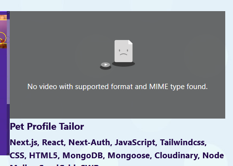

To send an image src prop down from the parent

to the child, its necessary to declare the prop in the function parameters. AND the tricky thing is you also need to put the src in double brackets

{{}}
a single bracket won't work

Oddly just doing {{ }} alone worked fro the webm source but the mp4 source broke when it was just {{}}

So i decided to put a template literal in { }, as this allows both formats to work?
