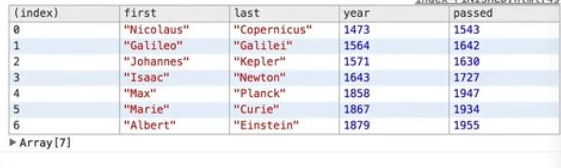
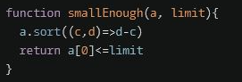

# Table of contents

1. Create an Array
   > Array.from(arrayLike, mapFn, thisArg)

- from a given length
- make an array of a specific size
- integer to array of integers

2. map(Number)

- integer to array of integers

2. Sum to one value/ Reduce
3. Filter/remove values
4. Sort

## Create An Array

### from a given length

1. Array.from(arrayLike, mapFn, thisArg)

```
Array.from( {length:n},
                   (_, index)
                        => index);
```

- \_ because the elements in our array are blank and not needed
- in this example, we fill all those blank spots with the index numbers

```
2. Array.from (new Array(b-a+i),
        //created as many blank slots as needed

                         (_, i)

                             => a + i);
                    //=> is the mapping function to put values in the new array

```

1. [...Array(n)] Empty array

```
[...Array(n)].map((_,i)=>" ".repeat(n-1-i)+"*".repeat(i*2+1)+" ".repeat(n-1-i))
```

returns an Array of length n where each element is undefined, until mapped

"by

- deconstructing the empty array using spread syntax (...)
- reconstructing the array with brackets,
- you can easily convert [ <n empty items> ] into [n * undefined]
- make an array of a specific size

2.  integer to array of integers

```

let n=942

function digitalRoot(n) {
   let convertStringToNumber= num => Number(num);

   let nToArray=Array.from(String(n),convertStringToNumber);

}

```

3. From a string

let goodLetters = "abcdefghijklm".split("");

## map(Number)

### integer to array of integers

```
n.toString(2)
  .split("")
      .map(Number)
          .reduce((a,b) => a+b,0);
```

//change number to binary string
//split to array
// turn it into an array of numbers
// add accumulator to each value (b)

> turn n into a string so its splitable

> use Array.from()'s mapping function' (second parameter)

- to change the arrays elements from strings ===? numbers, by "MAPPING" through it

## Sum to one value

## Reduce Function

```
function squareSum(numbers){
    return numbers.reduce(function(sum,n){
       return (n*n) +sum
    },0)
}
```

## Reduce Arrow

```
function squareSum(numbers){
    return numbers.reduce((sum,n)=>
            (n*n)+sum
            ,0)
}
```

## Reduce, combining arrays

```
const arr1=[1,2,3,4,5];
const arr2=[6,7,8,9,10];

let result= arr1.map(x=>x*x)
//new arr from squared arr1

.reduce((a,b,i,ar)
//(accumulator, current value (b), index, array)

=>a.concat(ar[i],arr2[i])
,[])
//we're concatting the accumulator [] to two arrays:
ar[i] [1,4,9,16,25]
arr2[i] [6,7,8,9,10]

console.log(result);
```

## Reduce, pushing values into accumulator (an empty array)

Array.reduce MUST return accumulator on every loop, since it will use the last value on the next loop

so if you're checking for a trait you CAN"T tell it to ignore that cycle

so in the following example, if check(item) returns false, then nothing gets pushed to the array

so the accumulator will use this undefined value for the next reduce cycle, aka it will no longer be an array and fail

```
ERROR ACC.PUSH() IS NOT A FUNCTION
return arr.reduce((acc,item)=>check(item)<=n&&acc.push(item)
                              ,[])


```

### GOOD EXAMPLES

push:

```
const deleteNthPush = arr.reduce((acc, item) => {
    check(item)<=n&&acc.push(item)
           //return must be on a new line, or we'll get an error
           //the accumulator for next iteration will be the return value of the callback for the current iteration
           //so  without return, it won't return anything
           //so the second time that the callback is called without return, acc will be undefined
    return acc
          // return acc so it can be used in the next cycle
},[])
```

concat:

```
return arr.reduce((acc,item)=>acc.concat(item)
                              ,[])
```

```
return arr.reduce((acc,item)=>
{return
                                     (check(item)<=n)?
                                                 acc.concat(item)
                                                 :acc}
                              ,[])


```

## Replace values

### Using Reduce with replace

```
function createPhoneNumber(numbers){
   return numbers.reduce((p,c) => p.replace('x',c), "(xxx) xxx-xxxx");
}

createPhoneNumber([1, 2, 3, 4, 5, 6, 7, 8, 9, 0])
// => returns "(123) 456-7890"

```

## Filter/remove values

### remove a specific type of value ==> filter && type of

```
return arrayList.filter(function(v)
       {return type of v =="number"})
```

### check an objects property, to determine what to filter

```
function deleteNth(arr,x) {
  var cache = {};
  return arr.filter(function(n) {
    cache[n] = (cache[n]||0) + 1;
    return cache[n] <= x;
  });
}

// for each item in an array, in this example 21
// cache["21"] = (whatever cache[21]'s previous value was or 0)
// +1 since 21 occured again
// return the item, 21, only if cache["21] <= 3, aka it occured less than or exactly 3 times
```

### Compare two arrays, use set.has() instead of Array.includes()

> set.has() is significantly faster than includes() for larger arrays (~>50)

> Array.includes() ==> o(n) (linear)

> set.has() has better time complexity of o(1) (constant)

See zloyrusskiy's explanation (a reply) here to understand why this is better for larger arrays

https://www.codewars.com/kata/523f5d21c841566fde000009/solutions/javascript

- let a= [1,2,2,2,3]
- let b= [2]
- If a value is present in b, all of its occurrences must be removed from the other:
- end result: [1,3]

```
function array_diff(a, b) {
  b = new Set(b)
  //get rid of the duplicates so theres less to iterate to and because it will give us access to .has()

  return a.filter(v => !b.has(v))

}
```

### Remove specific value from string

```
return string
        .split("!") //turns it into an array
        .join(") // turns it back into a string

```

## Sort

### Sort

```
let filteredArray = inventorsByYear.sort((a,b)=>
    a.year > b.year ? 1: -1
)
console.table(filteredArray)
```




