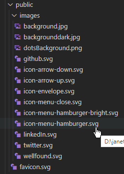

I had tried a few different things like conditionally changing the src name based on hover or onMouseEnter behavior
src={`images/icon-menu-hamburger${hover?"-bright":""}.svg`}
or
src={`images/icon-menu-hamburger${onMouseEnter?"-bright":""}.svg`}

but i finally figured out that I could store it in state to change it instead. In a perfect world, I would of liked to avoid the extra code but it works

Shout out to this link!

https://github.com/chakra-ui/chakra-ui/discussions/5766

```

export default function Header() {

const [hamburgerImage, setHamburgerImage] = useState("");

 return (
    <button
       onClick={() => setOpen(true)}
       aria-expanded={open}
       aria-controls="sidebar"
       aria-label="Open Menu"
       className={`pl-2 ${open && "hidden"} bg-mainColor`}
     >

        setHamburgerImage("-bright")}
         onMouseOut={() => setHamburgerImage("")}
       />
     </button>
 );
 }

```
