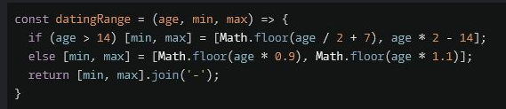
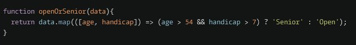

## General

\>= will automatically convert strings to numbers, so you don't have to do `Number(str[i]>=5)`
you can just do `str[i]>5`

## switch statements


## prompt

> let hour =(+prompt("what hour"))

## string

```
function hello(name) {
  return `Hello,
          ${name ? name[0].toUpperCase()+
          name.slice(1).toLowerCase()
          : "World"}
          !`;

}
```

## return string from mix of string and variables

```
return "Hello, " +
          name.substring(0,1).toUppercase +
          name.substring(1).toLowerCase +
          "!";

```

# Destructuring Assignment / multiple variables

1. naming and calculating values for new array
   if (age >600) [min,max] = [Math.floor(age/2+7), age* 2-14]



2.  renaming values from given array
    

# Looping

## for loop

```
function countSheeps(arrayOfSheep){
let sum = 0

for (let i=0; i< arrayOfSheep.length; ++i>){ //go through each sheep in the array

  if (arrayOfSheep[i]===true) // if sheep= true then do next thing

  sum ++; //add 1 to the sum of sheep
}

return sum // return sum to the place it was called

}

```

## If else and recursion

```
function isEven(num){

      if( num >= 0) {
        // if number is > 0, snd to nested if

         if (num == 0) {
               return true    }

            else if (num == 1) {
                return false

            }else {
                   return (isEven(num-2))
             // num gets 2 removed
             // relooped until it reaches 0 or 1
             }

    } else {
            return "negative"
    }
}
```
