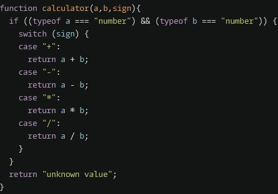

## General

\>= will automatically convert strings to numbers, so you don't have to do `Number(str[i]>=5)`
you can just do `str[i]>5`

## switch statements



## prompt

> let hour =(+prompt("what hour"))

## string

```
function hello(name) {
  return `Hello,
          ${name ? name[0].toUpperCase()+
          name.slice(1).toLowerCase()
          : "World"}
          !`;

}
```

## return string from mix of string and variables

```
return "Hello, " +
          name.substring(0,1).toUppercase +
          name.substring(1).toLowerCase +
          "!";

```
