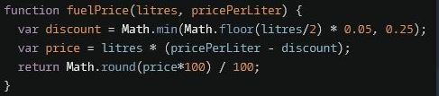

## is integer?

Number.isInteger()


## Square root

Math.sqrt(number)

## Power

Math.pow(number,power)

## use -- with % (subtract after valuating for divisibility )


1. would evaluate for n % 2 first
2. then it would reduce n's value by 1

## decrement and increment operators

x-- use x first then decrement by 1
++x increment x by 1 first, then use x

## Rounding

### Round up

> Math.ceil()

//5/2 =2.5 up to 3

### Round Down

> Math.floor()

//5/2 =2.5 down to 2

## Change to positive

Math.abs(n)

## Minimum or Maximum Value

### comparing just 2 values

```
Math.min(
     Math.floor(litres/2)*.05, //value 1
     0.25);                    // value 2
```




### values from array

> Math.min.apply(null, numbers)

> Math.max.apply(null, numbers)

1. null ==> not applying a this arguement
2. second bit works like spread operator ...

- saying spread the ages array into parameters


## rounding up but saving decimal values

> Math.round(price\*100)/100
