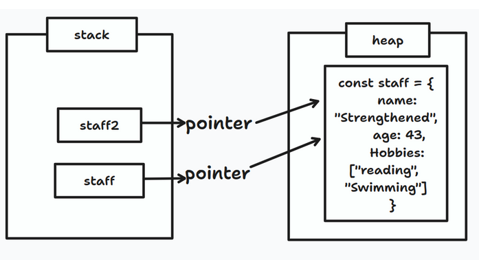
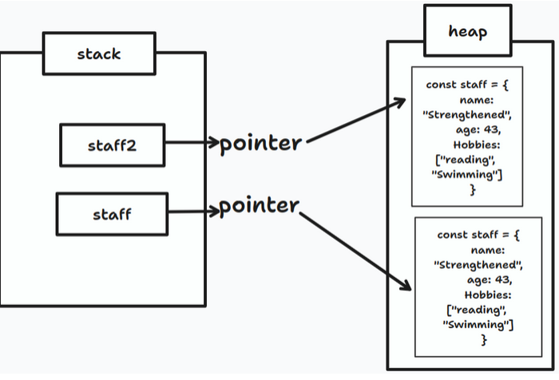
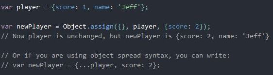

# Table Of contents

1. Create an object
2. iterate through object
3. copy an object
4. No-touchy/make an object immutable

## Create an Object

### with reduce from text/array

```
function duplicateCount(text){

  let count = text.split('')
                  .reduce((accum, curr) => {
    accum[curr] ?
             accum[curr] += 1 :
             accum[curr] = 1;
    return accum;

  }, {});


  return Object.keys(count).filter(key => count[key] > 1).length;

  //ex: bobobo

  //accum= {b:3
     o:3}
}

```

- use split to turn text to an array
- does the accumulator {} have a key equal to the current value "b" from the array?
- if add one to its value ex: b:2
- otherwise make a property which is equal to the current value (ex o), and give it a value of 1

## Iterate though Object

> for (key in Obj )

```
  let lettersAndNumbers=
  {
   "b":3,
   "o":3
  }

   let arrayOfMoreThanOne=[]


 for (key in lettersAndNumbers){
    lettersAndNumbers[key]>=2&& arrayOfMoreThanOne.push(key);
 }
```

## Copy an object, add old object to new one

X let Object1=object2 ==> will point to the same object in the heap
-  so its not copied
- Object1, object2 variables point to the same object in the heap 
the heap



- the following methods will allow the variable to point to a new cloned object in 



1. Spread syntax

- use spread syntax to say in a new object, spread out the player object into it

```
let player = {score: 1
              name:"jeff"
              }

let player2 = {...player,
                score:2
               };
                  // {score:2, name:"jeff"}
```

2. Object.assign(target, source)

- The target can == empty object/ {}
- if source.[keyname] == target.[keyname], the source object wins and overwrites target's key

```
let newPlayer= Object.assign({},
                                 player,
                                 {score:2}
                            )
```



## 4. No-touchy/make an object immutable

For all these methods Object.defineProperty() is better:

1. dot notation

- quietly fails to add the property, no error message

2.   Object.defineProperty(objectToAddTo, propertyToAddOrChange, valueOfProperty)

- Adding a NEW property throws error "Uncaught TypeError: Cannot define property age, object is not extensible"
- you can MODIFY an existing property

```
 Object.preventExtensions(makeNonExtensive)

   Object.defineProperty(makeNonExtensive, "age", {
      value: "twenty",
   })

   console.log(makeNonExtensive)
```


### Object.preventExtensions(obj)
- stops new properties from entering the object
- You can CHANGE and DELETE existing properties

```
   Object.preventExtensions(objectName)
  ```

### Object.seal(objectName)

- cannot add NEW properties
- cannot DELETE properties
- you CAN MODIFY existing properties

```
   Object.seal(objectName)
  ```

to check if an object is sealed: 
 > console.log(Object.isSealed(studentNames))


 ### Object.freeze(objectName)

- CANNOT have properties deleted, modified or added

BUT objects nested INSIDE this object:
- CAN have properties deleted, modified or added

to check if an object is frozen: 
 console.log(Object.isFrozen(obj))

### Deep Freeze Function

- object AND nested objects:
- CANNOT have properties deleted, modified or added

```
const deepVal = obj => {
        Object.keys(obj).forEach(prop => {
        if (typeof obj[prop] === 'object') deepVal(obj[prop]);
        });
        return Object.freeze(obj);
    };

   const teamplayers = deepVal( {
            player1: "Andrey",
            player2: "Abundance",
                    substitutes: {
                        player3: "Jeremiah",
                        player4: "Jayden"
                    }
            }
    )
   const squad = teamplayers;

   Object.freeze(teamplayers)

```