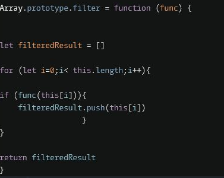
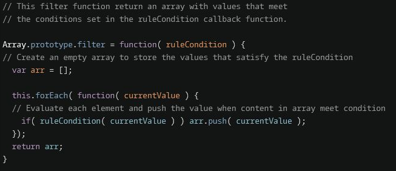

## creating a prototype method using a this value

//func ==> given rule condition
// we're passing each element (this[i]) through that function to see if they pass
// if it passes, then we push it into the arr array lastly we return the array
//https://www.youtube.com/watch?v=IgF5iYUG1AU&ab_channel=codeManSjavaScript

