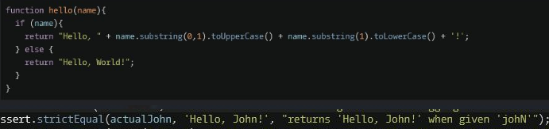
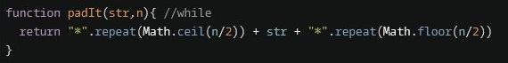
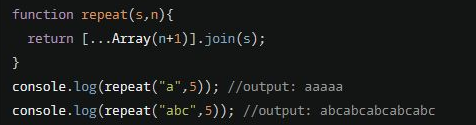

# Contents

1. Converting
2. Grabbing
3. Repeating

## Converting

### To upper or lowercase

> StringSelection.toUpperCase()

> StringSelection.toLowerCase()

### Number To Binary

> (a + b).toString(2)

> Number.toString(2)

<br>

## Grabbing

### substring( start index, length of string )

> name.substring(0,1).toUpperCase()



### grab a specific character

> name.charAt(0).toUpperCase()

<br>

## Repeating

### repeat a string value

> #".repeat(10)



### Repeating a seperator

```
 return [...Array(n+1)]
 //create an empty array of N+1 elements

 .join(s)
 // join the empty elements with a given seperator
 //if the length is 5, will only have 4 seperators
//ex: Fire-Air-Water
```


