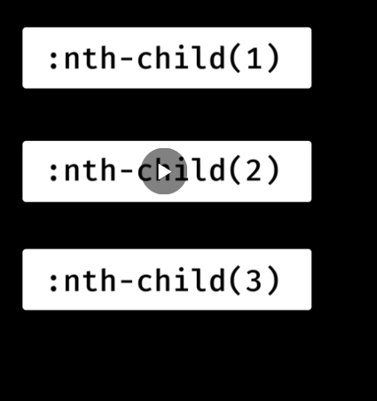
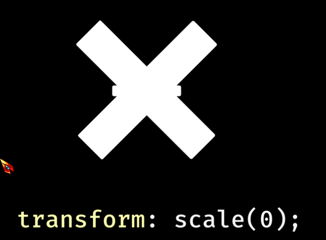

## have back of svg blend/appear transparent


- current color special term to tell svg to fill it with the parent elements color 

```
button {
    color:#FF73FD
}

button svg {
    fill: currentColor
}
```


@ 3:10
https://www.youtube.com/watch?v=1CDTw_UpQoQ

## Have SVG scale with text

button svg {
    width:1em;
    height:1em;
}

@ 4:00
https://www.youtube.com/watch?v=1CDTw_UpQoQ

## can move lines around

can select each child and transform them 


@6:17 https://www.youtube.com/watch?v=1CDTw_UpQoQ
