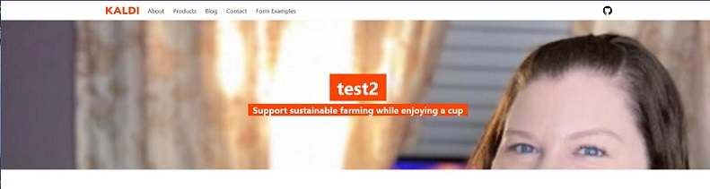
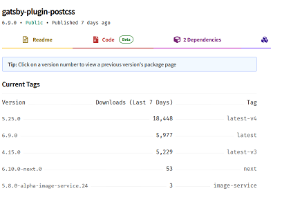

Woke up randomly so figured I might as well play with Gatsby!

Already did some troubleshooting 😂

installing the gatsby cli was easy, but when i tried to install the starter project I kept getting enoent errors

turns out I forgot to do npm init 🤦‍♀️

Twitter Post Link https://twitter.com/Janetthedev/status/1650134741897838592 6:49 AM · Apr 23, 2023

---

i installed the starter, but I keep getting an unknown error for a sanity document

looked in the starter and realized I had to install sanity separately! Starter said to go into studio so I installed i there

But the error is still there 🤔

okay! I think the issue is here

gatsby is looking in the env folder, but I don't have an env folder set up yet

ah! that removed one of the errors at least

yay new error code 😂

alright so promising progress!

I rebuild the sanity build, and then had graphql deploy. Before that I was getting an error (3rd image) 🥳

So i successfully deployed graphQL, did another build within the studio (backend) folder, the moved back to the frontend

But when i started it up from the frontend folder its doing THIS again 😒

welp, will be an adventure for another day, gotta try to nap for a few more hours!

Said that then tried one more idea, ran the server in one terminal and the front end in another terminal.

But alas, same error message `:(`

womp womp

> REPLY
> Rosy @zina_o_codes
> `:(` Just curious! Did you find a resolution? I can relate when you are sure you have addressed an issue but it pops its head again.

so this one was on me, i had tried to manually create my env file when I needed to follow step 6 in the readme. I played myself 😂
https://twitter.com/Janetthedev/status/1650472968353648642

Though sadly that official starter is extremely glitchy, so I gave up and used a different gatsby starter

> REPLY
> Rosy @zina_o_codes
> I'm glad you finally got it. It is painful sometimes but that is how we learn, right?
> Now i know who to come to when i have to use this package and i get stuck 😉.

---

So i completely deleted and reinstalled it, realized my issues before were because I didn't do the step 6th step, which automatically creates those documents. Instead I was trying to manually create them

https://www.gatsbyjs.com/starters/gatsbyjs/gatsby-starter-sanity-homepage/

However! The sanity template is very buggy? By console.logging I was able to figure out how to fix this issue (see img)

however theres 4 more...

It looks like the contentful starter is way more popular and more recently updated, so i'll probably switch
https://www.gatsbyjs.com/starters/gatsbyjs/gatsby-starter-contentful-homepage

words cannot express my relief that this starter works! https://github.com/gatsbyjs/gatsby-starter-datocms-homepage

Now to learn how to poke around and personalize it/ ect. Time to break and unbreak things in the name of learning haha
https://sparkly-sable-9c4f88.netlify.app

welp, when i try to boot up the cms it has an error and the error has been going on since 2022 🙃

Twitter Post Link https://twitter.com/Janetthedev/status/1650472968353648642

---

Never had I wished good karma on someone so much, this fix WORKED.

I could cry from happiness, yesss we're getting somewhere finally! 🥳 https://github.com/decaporg/gatsby-starter-decap-cms/issues/875

Twitter Post Link https://twitter.com/Janetthedev/status/1650523098226249728

---

So I was getting this issue about the api not persisting, and after seeing someone mention its due to netlify permissions, I realized it does seem to be that!

On the local version of the cms, it works but when I login through netlify it doesn't work 🤔

me, looking @ docs who kept saying that the error means its a git gateway issue in netlify

me, regenerates access token a few times, pulling out hair

me, hour later: "oh...for some reason it didn't automatically update the repository!"

I had to disable and re-enable it!🥳

issue was because I had renamed the repo, but git gateway doesn't automatically update the repo. Unless you disable and re-enable it

Never has lime green looked so beautiful

hmm....so its pushing to my github but netlify can't deploy the site with the changes 🤔

think it was caused by this bit i added in when I was trying to debug. going to comment it out and see...

oh whoops, need to git pull before I git push since netlify's cms added those edits to my github (aka not in my local folder/repo yet)!

now for the moment of truth!

HUZZAH it works!

but I definitely need to change how it handles images later, since how does the heading image get painful at larger screen sizes 😱

Twitter Post Link: https://twitter.com/Janetthedev/status/1650531554719068160 9:06 AM · Apr 24, 2023

---

🐢took friend to dealership to pick up his repaired car
🐢 went to work
🐢 Fought with client project, looks like it'll be netlify's cms and gatsby
🐢did some anki at work
🐦no new banki

now time to give my browser a break from these 20+ tabs and go to bed!

Twitter Post Link: https://twitter.com/Janetthedev/status/1650532908028030976 9:11 AM · Apr 24, 2023

---

So earlier tailwindcss wasn't working and I got this error. I realized that my version of gatsby was too old for the newest version

So i looked at its site, found the next newest was 5.25.0

did npm i gatsby-plugin-postcss

Now tailwindcss works with gatsby! 🥳

Twitter Post Link: https://twitter.com/Janetthedev/status/1650902501582053376 9:40 AM · Apr 25, 2023

---

🍈did some more client work && debugging. Sent her a figma file w/ a few color scheme ideas
🍈worked
🍈did some anki at work
🐦no new banki
🐦didn't go on linkedin

So, the above is a bit of a lie, I just went on linked in after all :P.

I reposted the bit about the gatsby tailwindcss debugging I did on there there, now time to finally sleep

Also did a tiny bit of walking while waging battle with code

And heres some cute cat pics of ember cause that's defintely what you all are really here for :P

Twitter Post Link: https://twitter.com/Janetthedev/status/1650903177531891712 9:42 AM · Apr 25, 2023

---

Spent 45 minutes scratching my head about why flexboxs justify center wasn't working 🤔

Even broke out the ol' colored border trick to see what was going on with the parent container

Turns out, it had an empty LargeSocialLinks component which was screwing with the centering!🤦‍♀️

<video src="assets/spent_45_mins.mp4" width="320" height="240" controls></video>

---

Made some progress on the rough draft of my client project!

Next major thing to focus on is to fix the nav bar, although the nav buttons are accessible, I need to change the selection rings color ect

also need to fix it at small screen sizes, so it turns into a hamburger menu

<video src="assets/made_some_progress.mp4" width="320" height="240" controls></video>

Figured out how to get the background images to behave like this!

Though I may of "cheated" a little by changing the opacity in gimp instead of with css 🤫

Twitter Post Link: https://twitter.com/Janetthedev/status/1659506883768782854 3:30 AM · May 19, 2023
