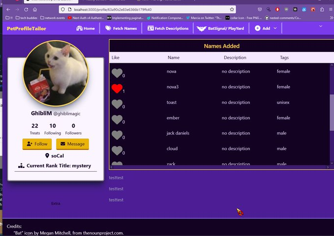
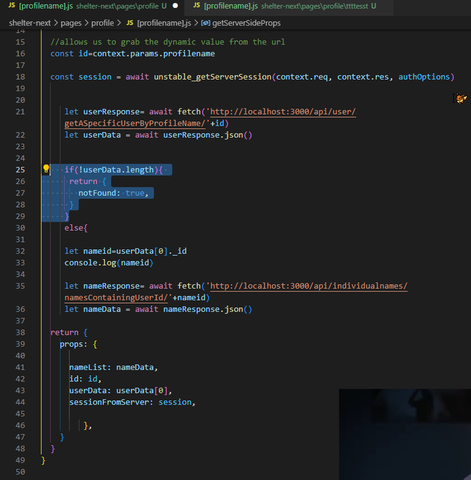
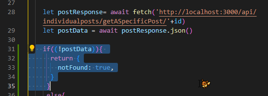
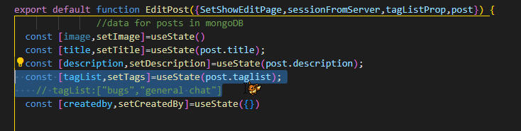
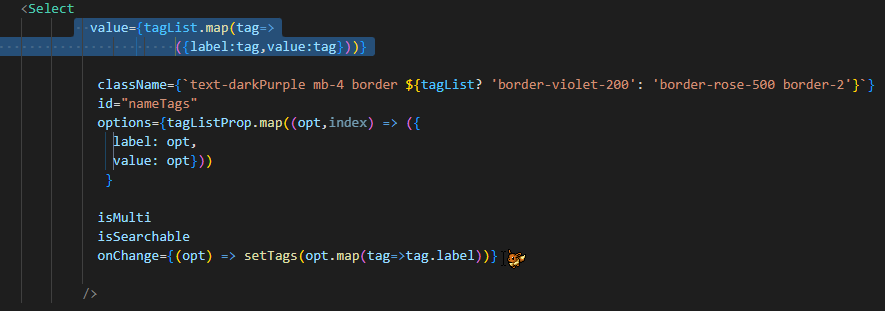
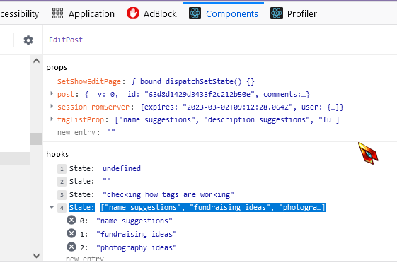
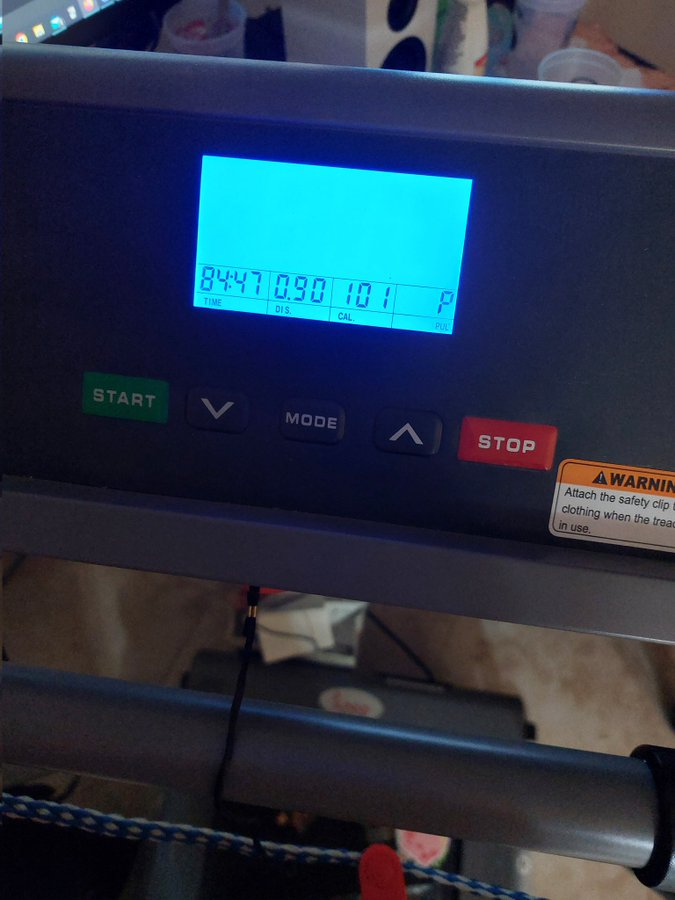
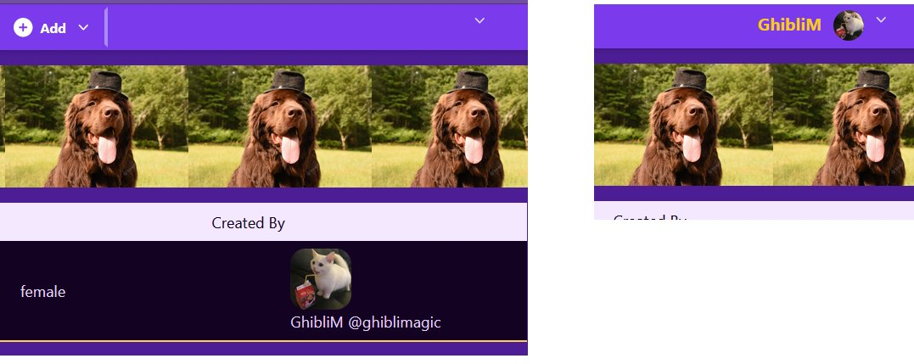
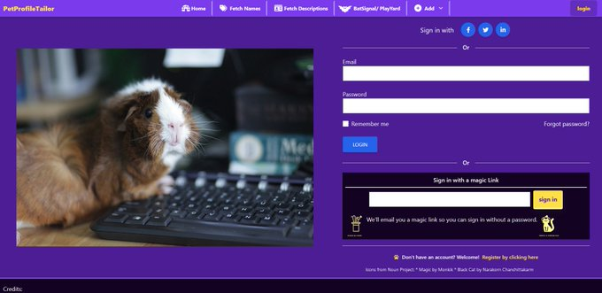

Made some progress with profile pages today! 🔥🔥🔥 now its 5am time to sleep



Twitter Post Link: https://twitter.com/Janetthedev/status/1619688376101376003 5:26 AM · Jan 29, 2023

---

Progress! Instead of using ids, i let users look up profiles by unique profilenames

Made the grid layout change depending on screen size, so it doesn't get jumbled on small screens 🥴

Took a hot minute but figured out how to force a 404 if I get nothing back from the api! 😤

<video src="images/2023-01-30-progress-instead-of-using-ids.mp4" width="320" height="240" controls></video>

For nextjs, the key was to return notFound: true if the .find() from the api returns [] (aka it found nothing)

```
let userResponse = await fetch ('http : / / localhost: 3000/api/user/getASpecificUserByProfileName/'+id)
let userData = await userResponse.json()

/ / Highlighted code below this / /
if (!userData.length)(
  return{
    notFound: true,
  }
)
else {
  ....
}
```



I also created the pages for individual posts! The likes feature ect also works here.

<video src="images/2023-01-30-I-also-created-the-pages.mp4" width="320" height="240" controls></video>

Start of the dynamic page for individual names, also redirects to 404 is the name is not found


When findById() finds nothing the redirect to 404 works now, but required slightly different wording

https://stackoverflow.com/questions/45172700/what-does-mongoose-return-when-a-find-query-is-empty

This thread was a gift🙏



```
let postResponse = await fetch('http : / / localhost: 3000/api/individualposts/getASpecificPost/'+id)

let postData = await postResponse.json()

/ / highlighted code below / /
if (!postData){
  return {
    notFound: true,
  }
}
```

Twitter Post Link: https://twitter.com/Janetthedev/status/1620014287468265472 3:01 AM · Jan 30, 2023

---

Big thing left is the lost password function. users can already reset their password if they're logged in, but I'll have to somehow email them a link so they can edit it

guessing I'll end up using nodemailer & setting up nextjs email provider? But ugh, not looking forward to it

Twitter Post Link: https://twitter.com/Janetthedev/status/1620043436832473090 4:57 AM · Jan 30, 2023

---

I worked on the front end bit of editing posts! I was dreading doing this and yeah it's taken hours 🥲

partly because I've never messed with modals before. But I'm proud of my progress so far!

<video src="images/2023-01-31-I-worked-on-the-front-end.mp4" width="320" height="240" controls></video>

What I"m especially proud of is the tags! They look simple but they kept appearing blank (aka text wasn't showing)

I Was about to give up and make the user manually reenter the tags, when I realized this uses a label AND value tag!

The tags were showing up fine in react state,...

```
export default function EditPost({setShowEditPage,sessionFromServer,tagListProp,post}){
  / / data for posts in mongoDB
  const [image, seetImage]= useState()
  const [title, setTitle]=useState(post.title)
  const [description, setDescription]= useState(post.description);

  / / highlighted code below
  const [tagList, setTags]=useState(post.tagList);
  / / tagList: ["bugs","general chat"]
 ....
}
```



```
<Select
    value={tagList.map(tag=>
    ({label:tag, value:tag}))}
    ......
    />

```



developer console react components screen

> hooks

> ...

> state: ["name suggestions","fundraising ideas", "photogra..."]

> 0: "name suggestions"

> 1: "fundraising ideas"

> 2: "photography ideas"



So since they were appearing fine in the state, I knew there was something making the text not appear to the user.

So what I did was make sure the value showed the values AND tags by mapping through the tags and turning each one into an object with a tag and label. 🥳

Twitter Post Link: https://twitter.com/Janetthedev/status/1620353109724897280 1:27 AM · Jan 31, 2023

---

Progress on the profile pages 🎊🎊🎊

Though I eventually need a different system than loading them in separate scrollable containers

maybe using a button and state, so when the button is clicked, the next 10 or so items are rendered? 🤔

🥴or maybe pagination...?

<video src="images/2023-01-31-progress-on-the-profile.mp4" width="320" height="240" controls></video>

Twitter Post Link: https://twitter.com/Janetthedev/status/1620358163601186817 1:47 AM · Jan 31, 2023

---

Forgot to post, I fixed up the front page the other day as an excuse to avoid apis for a bit 😂

All the links now work and they all play nice on mobile now

(I feel like I should add some silly effect/pic if someone clicks the impactful, fun, or tailor-fitted buttons 🤔)

<video src="images/2023-01-31-forgot-to-post-I.mp4" width="320" height="240" controls></video>

Twitter Post Link: https://twitter.com/Janetthedev/status/1620360251081109504 1:56 AM · Jan 31, 2023

---

Still a good chunk left, but getting there!

Though I'll be working lots this week so RIP productivity 🥲
But! On the other hand, I was feeling the early signs of burnout so it's probably for the best I'm forced away from the computer

- pagination/endless scroll/ect?

- grabbing current numbers for dashboard "treat" points + profile page
- Show edit and delete symbol if signed in:  
   names
  comments

- Do edit and delete api logic for:
  posts, names, comments

-do descriptions section (frontend, backend/api, individual pages, adding to profile page + dashboard)

-fixing the header on some pages (adding session to it ect)

LATER

- followers + followers (will be shown on separate pages like on twitter)
- add tags to existing name
- add comments to names
- lost password feature
- shares

Twitter Post Link: https://twitter.com/Janetthedev/status/1620366164445794307 2:19 AM · Jan 31, 2023

---

☘️did a tiiiny bit of walking while coding

☘️worked on 100 hours project, probably too much tbh i felt the edges of burnout

🦀no anki/banki



Twitter Post Link: https://twitter.com/Janetthedev/status/1620412529704058881 5:23 AM · Jan 31, 2023

---

Did a tiny bit before work!

Fixed some pages so the profile image and profile name shows

And got the backend logic for editing posts to work 🥳



Twitter Post Link: https://twitter.com/Janetthedev/status/1620916187441025024 2:45 PM · Feb 1, 2023

---

Wanted to add this on to the last post, but twitters vertical scroll bar is broken/unresponsive??😂

But anyway, users can now edit posts!

<video src="images/2023-02-01-wanted-to-add-this-on.mp4" width="320" height="240" controls></video>

Twitter Post Link: https://twitter.com/Janetthedev/status/1620919536483696641 2:58 PM · Feb 1, 2023

---

Looks like swr would be the answer to automatically reloading the data w/out the page flickering + pagination/endless scroll

But with how insane my work schedule is, might have to push that to the "a future feature, not a mvp level feature list"

Twitter Post Link: https://twitter.com/Janetthedev/status/1622455963038150657 8:43 PM · Feb 5, 2023

---

Worked more on my "100" hours project!

Users can now sign in with magic links through their email 🪄

Shame that for forgot passwords I can't just tell it, hey do this same exact thing, but redirect them to reset password page instead of the dashboard 🙃



I could just tell users in the email, hey if you want to reset your password go to your edit profile page after logging in with the magic link.

But alas that won't look as good as a direct link, curses 😂

I'm using next auth so the magic link setup is only for logins

I'd have to make a separate mongodb collection and write the logic myself for a lost pw magic link

But eh, I decided screw it. Users can use the magic link to login and go to edit profile to change their pw rn😂

Twitter Post Link: https://twitter.com/Janetthedev/status/1622576945774088194 4:44 AM · Feb 6, 2023

/ / left off here
<video src="images/" width="320" height="240" controls></video>

---

Narrowing down what things have to "actually" be done to make the mvp version of the project

- Edit and deletion logic for names and comments
- adding descriptions category (frontend, backend/api, individual pages, adding to profile page + dashboard)
- grabbing actual numbers for "treat" points for dashboard and profile
- shares
  Possibly:
- followers and following
- add tags to existing names

Just thinking about writing out the reset password logic and page felt like death, so screw it 😂for now, users can just use the magic password link and manually go to the edit profile page to reset the password

Twitter Post Link: https://twitter.com/Janetthedev/status/1622929366559899648 4:04 AM · Feb 7, 2023

---

I'm using next auth so the magic link setup is only for logins

I'd have to make a separate mongodb collection and write the logic myself for a lost pw magic link

But eh, I decided screw it. Users can use the magic link to login and go to edit profile to change their pw rn😂

Twitter Post Link: https://twitter.com/Janetthedev/status/1622931386033389569 4:12 AM · Feb 7, 2023

---
