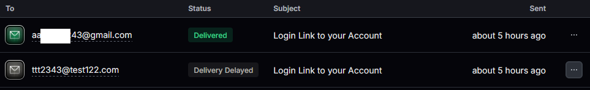

## NEW POSTS

I ended up deciding to cut áéíóúñü out as acceptable characters for name submissions since I'm not 100% sure if all shelter databases can support that input

(paranoia born of a horror story of when I was an adoption counselor and some invalid input shut down the db for a bit 😅)

However I want to do an invalid input check on the server side & client side

so i decided to pull out that function and put it in utils instead, so both files can easily import it

I tried using another utils file as a reference

```
utils\error.js

const getError = (err) =>
  err.response && err.response.data && err.response.data.message
    ? err.response.data.message
    : err.message;

export { getError };
```

```
Utils\stringManipulation\check-for-valid-names.tsx

const regexInvalidInput = (stringToCheck: string) => {
  let regexForInvalidCharacters = /[^a-z\d&'-]+/;
  return stringToCheck.match(regexForInvalidCharacters);
}

export default regexInvalidInput;

export {regexInvalidInput}

```

but then I got an error code

> Unhandled RunTime Error

> TypeError: >\_utils_stringManipulation_check_for_valid_names_WEBPACK_IMPORTED_MODULE_8\_\_["default"] is not a function

I found this reference on mdn
https://developer.mozilla.org/en-US/docs/Web/JavaScript/Reference/Errors/Not_a_function#import_the_exported_module_correctly

and the new version I made based on it works great

```
function regexInvalidInput(stringToCheck: string) {
  let regexForInvalidCharacters = /[^a-z\d&'-]+/;
  return stringToCheck.match(regexForInvalidCharacters);
}

/ / only strings not matching the a-z digits &'- will be returned
/ / aka if anything is returned, there was invalid input
export default regexInvalidInput;
```

```

    if (existingNameCheck && existingNameCheck.length != 0) {
      res.status(409).json({
        message: "Name already exists",
        existingName: existingNameCheck,
      });
    } else if (checkForInvalidInput.length) {
      res.status(409).json({
        message: `Invalid characters entered ${checkForInvalidInput}`,
      });
      return; <=== only one return
    } else
    ....
```

confirmed its still working client side!

But i'll have to temporarily turn off the check client side to make sure the server check is working


hmm okay the server check isn't working lets see what else i need to put

I noticed I accidentally put the statements in the same bracket lets separate them, Which lead to an error as we wanted!

Alas, its not the right error though, it should be that the name has invalid characters, not that it already exists 🤔

then i noticed i only have one return, but it turns out that wasn't the issue


```
    if (existingNameCheck && existingNameCheck.length != 0) {
      res.status(409).json({
        message: "Name already exists",
        existingName: existingNameCheck,
      });
   else if (checkForInvalidInput.length) {
      res.status(409).json({
        message: `Invalid characters entered ${checkForInvalidInput}`,
      });
      return; <=== only one return
    } <===bracket from original if

     else {
      try {
        const test = await Names.create(req.body);
        ....}}
```


then I looked an realized, wait, i set them both as having a status of 409

and my client side code is just looking at what the error code was to render the error message

```
Client side addingName.jsx

if (error.response.status == 409) {
          toast.error(
            `Ruh Roh! The name ${newName} already exists!`)
```

Changed the new eror message to 400 and ta-da it works!

```
    } else if (checkForInvalidInput.length) {
      res.status(400).json({ <=======changed from 409 to 400
        message: `Invalid characters entered ${checkForInvalidInput}`,
      });
      return;
    }
```


I was pretty sure what i needed was error.response.data.message but i started w/ stringify-ing error.response to be sure

and yep, thats what i needed!

Fixed up the toast errors so they grab the servers message

(so I'm using error.response.data.message instead of retyping "name does not exist" ect)

```
  } else if (error.response.status == 400) {
          toast.error(
            `Ruh Roh! The name ${newName} has invalid characters ${JSON.stringify(
              error.response,
            )}`,
          );
          ...}


```

> Ruh Roh! The name áó has invalid characters {"data":{"message":"Invalid characters entered áó"},"status":400,.....}

```
 if (error.response.status == 409) {
          toast.error(
            `Ruh Roh! The name ${newName} ${error.response.data.message}!`,
          );
        } else if (error.response.status == 400) {
          toast.error(
            `Ruh Roh! The name ${newName} has ${error.response.data.message}`,
          );
        } else
        .....
```

I wanted to confirm the original error message (name already exists)

still is properly working. And turns out it is 😁


I cleaned things up so the server creates the error messages

and the client side code is just reading back the error response message created on the server

```
server side

 if (existingNameCheck && existingNameCheck.length != 0) {
      res.status(409).json({
        message: `Ruh Roh! The name ${name} already exists`,
        existingName: existingNameCheck,
      });
      return;
    } else if (checkForInvalidInput.length) {
      res.status(400).json({
        message: `Ruh Roh! The name ${name} has invalid character(s) ${checkForInvalidInput}`,
      });
      return;
    }
```

```
client side

  if (error.response.status == 409) {
          toast.error(`${error.response.data.message}!`);
    } else if (error.response.status == 400) {
          toast.error(`${error.response.data.message}`);
    }

```

as for why one has an error of 400 and the other is 409:

409 fits a name already existing (conflicts arising from the current state of the resource)

400 fits the name having invalid syntax ( points to issues with the request's syntax or structure)

I un-commented out the client side checks for invalid characters

annnnd we're done with validating the entered text for new names 😁

https://bsky.app/profile/ghiblimagic.bsky.social/post/3leipgc2fy22p dec 29th 2024, 8:35 PM

---

# Can you feel the magic (links) tonight?!

Right now new users who want to just use magic links to sign in still have to enter a password at registration.

So I'm going to fix that so they don't have to

i only check the password if its long enough

(I got rid of the trim later when i tested the api w/ postman since .trim().length is invalid)

Original Code api/auth/signup.js

```
  const { name, email, password, profilename } = req.body;
  if (
    !name ||
    !email ||
    !profilename ||
    !email.includes("@") ||
    !password ||
    password.trim().length < 5
  ) {
    res.status(422).json({
      message: "Validation error",
    });
    return;
  }

```

which i changed to:

```
  const { name, email, password, profilename } = req.body;

  if (
    !name ||
    !email ||
    !profilename ||
    !email.includes("@")
  ) {
    res.status(422).json({
      message: "Validation error, please check the name, email, profilename and email fields",
    });
    return;
  }

  if (password.length && password.trim().length < 5) {
    res.status(422).json({
      message: "Invalid password length",
    });
    return;
  }
```

https://bsky.app/profile/ghiblimagic.bsky.social/post/3lg5cvustlc24

---

So if there no password, the new user object won't have a password property

I considered going the easy route and giving the password a default value like "" . But from what I've read its best to avoid bogging down mongodb with unnecessarily blank or null fields

The original code: api/auth/signup.js

```
  const newUser = new User({
    name,
    email,
    profilename: profilename.toLowerCase(),
    password: bcryptjs.hashSync(password),
  });


  const user = await newUser.save();
```

https://stackoverflow.com/questions/67157904/conditional-adding-object-property-in-javascript

---

I switched to my laptop to code outside and was confused for a moment why npm install was giving me this error

> bash: npm: command not

Then I went DOH! of course, i never installed node and npm for this machine since the markdown project didn't use any dependencies

the npm docs strongly recommended using a version control program rather than manually installed node and npm so i used nvm windows

https://github.com/coreybutler/nvm-windows?tab=readme-ov-file

WINDOWS POWERSHELL

> PS C:\Users\janet> nvm
> Running version 1.2.2.
> PS C:\Users\janet> nvm install latest
> 23.6.0
> Downloading node.js version 23.6.0 (64-bit)...
> Extracting node and npm...
> Complete
> Installation complete.
> If you want to use this version, type:
> nvm use 23.6.0
> PS C:\Users\janet> nvm use 23.6.0
> Now using node v23.6.0 (64-bit)
> PS C:\Users\janet>

nvm successfully installed!

then i went to do npm run dev and got

> Server Error
> Error: Add Mongo URI to .env.local

another doh! moment. Right, I need to remake my env file since for security reasons, its not added to my github

---

Now onto editing the form!

I originally was going to use dirtyFields to track if the password field has been edited or not. And then manually somehow clear the dirtyFields status if the text in the password field was deleted

Ex:

```
    formState: { errors, dirtyFields },
```

but after checking looking at the react hook examples
https://github.com/react-hook-form/react-hook-form/tree/master/examples

I found a better option, watch which acts like state. It stores the current value of the input (password) in a variable (passwordEntered)

https://codesandbox.io/p/sandbox/react-hook-form-conditional-fields-qgr41?file=%2Fsrc%2Findex.js

```
...
76   const {
77    handleSubmit,
78    register,
79    getValues,
80    formState: { errors },
81    watch,
82  } = useForm();
....
110  const passwordEntered = watch("password");
...
// this is the password input that we're watching
251          <label htmlFor="password">Password</label>
          <input
            type="password"
            {...register("password", {
              minLength: { value: 6, message: "password must be more than 5 chars" },
            })}
            className="w-full text-darkPurple"
            id="password"
            autoFocus
          ></input>
....
// checking if the watch works by having the string "this field is required" show if passwordEntered currently is truthy/has a value

268 { passwordEntered  && (<span>"this field is required"</span>)}
269
270 <div className="mb-4">
          <label htmlFor="confirmPassword">Confirm Password</label>
          <input
            className="w-full text-darkPurple"
            type="password"
            id="confirmPassword"
            {...register("confirmPassword", {
              required: passwordEntered&&"this field is required",
//the confirm password field is required if the password field has input
// so if it is required (has a truthy value, we will get the "this field is required message"). Otherwise it is falsey, so required: false

              validate: (value) => value === getValues("password"),
              minLength: {
                value: 6,
                message: "confirm password is more than 5 chars",
              },
            })}
          />

```

I was wondering why i was getting a validation error message

And when i went to my api i noticed that it didn't have any of the changes i made.

Whoops i forgot to move to the new branch were my changes were at!

So i used git stash, git stash apply and once i confirmed the changes were added, i did git stash drop

This person did a great job explaining why to use git stash apply instead of git stash pop:
https://stackoverflow.com/questions/15286075/difference-between-git-stash-pop-and-git-stash-apply

> git stash pop throws away the (topmost, by default) stash after applying it, whereas git stash apply leaves it in the stash list for possible later reuse (or you can then git stash drop it).
>
> This happens unless there are conflicts after git stash pop, in which case it will not remove the stash, leaving it to behave exactly like git stash apply.
>
> Another way to look at it: git stash pop is git stash apply && git stash drop.

What I entered in my terminal

> git stash -u
>
> git checkout fixing-registration-for-magic-link
>
> git stash apply
>
> On branch fixing-registration-for-magic-link
> Your branch is up to date with 'origin/fixing-registration-for-magic-link'.
>
> Changes not staged for commit:
>
> (use "git add <file>..." to update what will be committed)
> (use "git restore <file>..." to discard changes in working directory)
> modified: pages/register.js
>
> no changes added to commit (use "git add" and/or "git commit -a")
>
> $ git stash drop
> Dropped refs/stash@{0} (4de794e8e2333dc48132de8f9681b9eb0e2a6563)
>
> $ git add .
>
> $git commit -m "edited registration logic so passwords aren't required for magic link users"
>
> $ git push

---

alright so now i've got a new error

{"error":"Illegal arguments: string, undefined","status":401,"ok":false,"url":null}

Though the second time I signed up for the new account, without a password, it says "email is already in use"

so it successfully created the user

---

And as I guessed the error is because: when they successfully create an account I automatically sign them in

but the password: "" is an invalid password so the normal signin fails

---

register.js

```
const {
  handleSubmit,
  register,
  getValues,
  formState: { errors },
  watch,
} = useForm();

const submitHandler = async ({ name, email, password, profilename }) => {
  try {
    await axios.post("/api/auth/signup", {
      name,
      email,
      password,
      profilename: profilename.toLowerCase(),
    });

// then we'll split it into 2 paths.
- 1. for new magiclink users
- 2. for regular email & password users

  //########## PATH 1 ###############
    if (!password.length) {

      //magic link users use nextAuth's email provider signIn method, since we're signing in with an email link
      // so they are redirected to the magiclink page that tells them to check their email to sign in
      // so they are NOT automatically signed in

      const magicLinkSignUp = await signIn("email", {
        redirect: false,
        email,
      });

      if (magicLinkSignUp.error) {
        toast.error(magicLinkSignUp.error);
        console.log(JSON.stringify(magicLinkSignUp));
      } else {
        toast.success(
          "Successfully signed up! A magic link has been sent to your email",
        );

        router.push("/magiclink");
      }
      return;
    }

//########## PATH 2 ###############

  //password users are automatically signed in with nextAuth's credentials provider signIn method

     const result = await signIn("credentials", {
       redirect: false,
       email,
        password,
    });

    if (result.error) {
      toast.error(result.error);
      console.log(JSON.stringify(result));
    } else {
      toast.success("Successfully signed up! Sending to dashboard");

      router.push("/dashboard");
    }
  } catch (err) {
    toast.error(getError(err));
  }
};

```

tested the api w postman. I had to fix some things

1. trim().length being invalid

2. To check if they registered with a password, i had done password.length!=0. Which was invalid (dur, cause its null if it was "") I did enough codewars I should of remembered

so i switched to: password!=null


pages\api\auth\signup.js

```
//every user needs these values to be valid, but users signing up w/ a password will have a seperate extra check on line 26

12  if (!name || !email || !profilename || !email.includes("@")) {
    res.status(422).json({
      message: `Validation error, please check the name ${name},  profilename ${profilename} and email ${email} fields`,
    });
    return;
  }

//if the password exists, it must have a length greater than 5

26  if (password != null && password.length < 5) {
    res.status(422).json({
      message: "Invalid Password length",
    });
    return;
  }
```

I also wanted to make sure that profilenames only had certain characters, so they're easy to look up

setting up this check on the api/server side was easy

i just used the regex logic i set up before for the restrictions for pet names and imported it into the api file

pages\api\auth\signup.js:

```

4 import regexInvalidInput from "../../../utils/stringManipulation/check-for-valid-names"; //has my regex logic
...

19 let checkForInvalidInput = regexInvalidInput(profilename);

  if (checkForInvalidInput != null) {
    res.status(422).json({
      message: `Invalid characters entered ${checkForInvalidInput}`,
    });
  }

```

Regex Logic:

utils\stringManipulation\check-for-valid-names.tsx

```
function regexInvalidInput(stringToCheck: string) {
  let regexForInvalidCharacters = /[^a-z\d&'-]+/;
  return stringToCheck.match(regexForInvalidCharacters);
}
//only strings not matching the a-z digits &'- will be returned
//aka if anything is returned, there was invalid input
export default regexInvalidInput;
```

---

But the client side with useForm? OH BOY that was a mild nightmare

i really wanted to import my regex logic so I wasn't duplicating code

But useForm did NOT want to play nice. Eventually I decided instead of wasting more time i should just wave the white flag and just use validate

pages/register.js

```

        <div className="mb-4">
          <label htmlFor="profilename">
            Profile Name (this <strong>CAN&apos;T</strong> be changed later, it
            will be unique to you, 30 characters max)
          </label>

          <input
            type="text"
            className="w-full text-darkPurple lowercase"
            maxLength="30"
            id="profilename"
            autoFocus
            {...register("profilename", {
              required: "Please enter a profilename",
              validate: (value) =>                       <===== had to use validate
                value.match(/[^a-z\d&'-]+/) == null ||
                `invalid characters entered ${value.match(/[^a-z\d&'-]+/g)}`,
            })}
          />
          <span> Valid Characters: a-z, numbers, &, &apos; and - </span>

          {errors.profilename && (
            <div className="text-red-500">{errors.profilename.message}</div>
          )}
        </div>
```

also i kept trying everything to force the text for profilename into lowercase

and then I looked at what i did before and realized, dur i can just use tailwindcss instead of forcing .toLowerCase() on the value

pages/register.js

```
 <input
            type="text"
            className="w-full text-darkPurple lowercase"
```

pages/register.js

```

76   const {
    handleSubmit,
    register,
    getValues,
    formState: { errors },
    watch,  <=== watch imported
  } = useForm();
  ....

131 const passwordEntered = watch("password");

   // password input code

281   <label htmlFor="password">
            Password (recommended but not required for magic link users)
          </label>
          <input
            type="password"
            {...register("password", { <======= this is password, which is what we're watching
              minLength: {
                value: 6,
                message: "password must be more than 5 chars",
              },
            })}
            className="w-full text-darkPurple"
            id="password"
            autoFocus
          ></input>

  //confirm password input code

302  <input
            className="w-full text-darkPurple"
            type="password"
            id="confirmPassword"

            {...register("confirmPassword", {
              required: passwordEntered && "this field is required",
              // if the password field has input in it (its truthy), the confirm password field is required. Because it defaults to true. And the second statement shows

              validate: (value) =>
                value === getValues("password") || "Passwords do not match",
              minLength: {
                value: 6,
                message: "Confirm password is more than 5 chars",
              },
            })}
          />
          {errors.confirmPassword && (
            <div className="text-red-500 ">
              {errors.confirmPassword.message}
            </div>
          )}
```

Added some more explaination to the registeration page

> Notes for magic link users (logging in with an email link, not a password)
>
> We recommend magic link users also add a password. This way you will not be locked out of your account if you lose access to your email. However, we do not require this.
>
> To access their new account, magic link users will have to click the link sent to their email. This is done to ensure there were no typos in the email.
>
> If you decide you want to add a password later, you can add a password in settings

I also tested if it was working properly for magic link user signups

(should redirect to the magic link page and send an email)

And it worked, but one of the dummy emails was accidently a real email 🤣 whoops! I meant to avoid using gmail



---

I double checked that i convert profile names to lowercase on server side too and YEP

already got that done

api\auth\signup.js:

```

  const newUser = new User({
    name,
    email,
    profilename: profilename.toLowerCase(),
    ...(password != null && { password: bcryptjs.hashSync(password) }),
  });

```

Going back to postman for a sec

it took some troubleshooting because sending the data as

1. params
2. body & form data

both didn't work

It only worked when i finally sent the data as
body & raw


