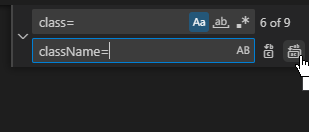

Thread for my 100 hours project progress!

Twitter Post Link: https://twitter.com/Janetthedev/status/1598391767682154497 11:01 AM · Dec 1, 2022

---

started off with a bang 🤣 did " npm run start" and was going what the hell why won't it show my edits unless I reboot it.

Realized I needed to do npm run dev 🤦‍♀️

Twitter Post Link: https://twitter.com/Janetthedev/status/1598392395091316736 Dec 1, 2022 Dec 1, 2022

---

Words alone cannot express my love for this next.js tutorial! Its so easy to understand so far 😍
https://youtube.com/watch?v=MFuwkrseXVE&ab_channel=Academind

Projects coming along at a decent pace (for now)

Twitter Post Link: https://twitter.com/Janetthedev/status/1598420569607016448 12:55 PM Dec 1, 2022

---

was getting a "Error: Element type is invalid: expected a string (for built-in components)" when importing a react component

Stared at my files for a second and realized I forgot to save the component's changes 🤡.

That immediate fix was instant serotonin!

Twitter Post Link: https://twitter.com/Janetthedev/status/1598442248626401280 2:21 PM Dec 1, 2022

---

Figured out how to change the placeholder text color using tailwindcss https://geeksforgeeks.org/tailwind-css-placeholder-color/ the normal text color tailwindcss property wasn't working

Twitter Post Link: https://twitter.com/Janetthedev/status/1598446531786735616 2:38 PM Dec 1, 2022

---

Was going to use this in the background, until I noticed one of them was "getting 💩 done " 😂

Twitter Post Link: https://twitter.com/Janetthedev/status/1598463897299976192 3:47 PM · Dec 1, 2022

---

Decent starting progress! Still more content to add and some styling to clean up, but its getting there 🔥

<video src="images/starting_progress.mp4" width="320" height="240" controls></video>

Twitter Post Link: https://twitter.com/Janetthedev/status/1598503599058788352 6:25 PM · Dec 1, 2022

---

Did a little bit more work on the landing page! Very rough, rough draft done.

The UI adjustments/colors ect are for future me to figure out 😂

Twitter Post Link: https://twitter.com/Janetthedev/status/1599834982406840320 10:35 AM · Dec 5, 2022

---

I was struggling this morning to figure out why local images kept appearing broken??🥴

After watching this video I realized, I had forgotten for the public folder you don't retype out the whole address!
https://youtube.com/watch?v=taMJct5oeoI&ab_channel=EsterlingAccime
It worked once I changed it to "profile.png"Huzzah

Twitter Post Link: https://twitter.com/Janetthedev/status/1599835681102389248 Dec 5, 2022

---

Although part of me wants to (FINALLY) start with the back-end, I know I'm too tired to work on it right now 😢

Time to nap 😴

Twitter Post Link: https://twitter.com/Janetthedev/status/1599842624755863553 11:06 AM · Dec 5, 2022

---

I was trying to add links to the navbar in nextjs but I was getting this error:
"Error: Multiple children were passed to <Link> with `href` of..."

Found this tip about removing any space between <Link> and <a> https://stackoverflow.com/questions/69667347/nextjs-multiple-children-were-passed-to-link-with-href-of-x-but-only-one/72754603

Fixed it! I would of NEVER of guessed 😂

Quotation from the stackOverflow Link: "Are you sure that's how its written in your source file? This error usually happens if you have a space in between <Link> and the <a> tags"

Twitter Post Link: https://twitter.com/Janetthedev/status/1600171174670893064 8:51 AM · Dec 6, 2022

---

used MongoDB playground to test if a basic read query to my database worked and it did! huzzah🎊

first backend step ✅

Twitter Post Link: https://twitter.com/Janetthedev/status/1600199940411572224 10:46 AM · Dec 6, 2022

---

appsloveworld.com/mongodb/100/160/express-returns-an-empty-req-body-to-a-postman-request

was trying to figure out why the test post request seemed to work, except the collection was blank!

Turns out the body was showing as "text" instead of "json!" Once I switched it to "json" in postman it worked

Twitter Post Link: https://twitter.com/Janetthedev/status/1600554807059615745 10:16 AM · Dec 7, 2022

---

Been trying to get chunks of the json data to show in a page but no luck so far🥴

Stopping for today before I go insane

Twitter Post Link: https://twitter.com/Janetthedev/status/1600585712826404864 12:19 PM · Dec 7, 2022

---

Couldn't resist trying to debug an axios error I kept getting: " OverwriteModelError: Cannot overwrite `test5` model once compiled"

Adding some code to the left of my exports helped it stop yelling about using the model again "mongoose.models['test5']" 🎊🎊

code snippet: "module.exports = mongoose.models['test5']|| mongoose.model("test5",CategoryCollectionSchema);

Twitter Post Link: https://twitter.com/Janetthedev/status/1600593040975929344 12:48 PM · Dec 7, 2022

---

now I don't need to reboot my entire app every time I redo a freaking get request! huzzah 😂

the great evil axios error has been defeated!

Twitter Post Link: https://twitter.com/Janetthedev/status/1600593513640435712 12:50 PM · Dec 7, 2022

---

my brain was melting earlier clearly, that was a mongoose error not axios!

Twitter Post Link:https://twitter.com/Janetthedev/status/1600616329249054720 2:20 PM · Dec 7, 2022

---

SWEET PROGRESS! The togglable accordion panels and checkboxes were made by mapping through these objects from my server!

I'm so happy🥺

Twitter Post Link: https://twitter.com/Janetthedev/status/1600757675037294592 11:42 PM · Dec 7, 2022

---

next step i suppose will be to store whats been clicked in a react state? and then send that to the server as a second get request. Oh boy, thats gonna take a while.

(an example: store christmas + male in state, and only get back animal names with both those tags)

Twitter Post Link: https://twitter.com/Janetthedev/status/1600758283861897216 11:44 PM · Dec 7, 2022

---

Made some slow but definite progress!

I can generate a list from the server and also by clicking the checkbox i can store the selected results in an array in the state. And clicking even removes it from the array (after lots of struggle haha)!

Twitter Post Link: https://twitter.com/Janetthedev/status/1601132154527703040 12:30 AM · Dec 9, 2022

---

Still trying to figure out how to make it so it'll let me narrow down/filter the search...
I want to start with all the names, and then have it look through the array of name objects (nameList here) and give me ones that have the given tags.

But thats for future me, Sleep time!

Twitter Post Link: https://twitter.com/Janetthedev/status/1601134316355846145 12:39 AM · Dec 9, 2022

---

Nothing like making a breakthrough while eating some chilli! 🎊
Bit embarrassing to admit it took me hours, since the logic ended up being pretty simple. 😅But eh, lots of learning done and success is success ~

Twitter Post Link: https://twitter.com/Janetthedev/status/1601346340629274626 2:41 PM · Dec 9, 2022

---

Though oddly it was chemistry of all things helped me! I had to think, what are the limiting factors and then write the code around the limiting factors

live pic of me fucking around and finding out with code before figuring things out. I'm a code arsonist today🔥🔥🔥

Twitter Post Link: https://twitter.com/Janetthedev/status/1601347067430854656 2:44 PM · Dec 9, 2022

---

Realized I didn't show off the end result!

The names (bottom of the screen) render based on what tags are chosen

Twitter Post Link: https://twitter.com/Janetthedev/status/1601348110080307201 2:48 PM · Dec 9, 2022

---

Now to make it render prettily on the side!

Twitter Post Link: https://twitter.com/Janetthedev/status/1601348874173829120 2:51 PM · Dec 9, 2022

---

Progress! The filtered results show in a table on the right

<video controls src="images/filtered_results_side.mp4" width="800px"></video>

Twitter Post Link: https://twitter.com/Janetthedev/status/1601434371084279808 8:31 PM · Dec 9, 2022

---

Next up I suppose will be to figure out how to add two requests to getStaticProps so I can grab the names from the server too

(right now I'm grabbing the names from a mock array in the document)

Twitter Post Link: https://twitter.com/Janetthedev/status/1601442682701635586 9:04 PM · Dec 9, 2022

---

I just screwed around and what do you know, it actually works!

So the name data is being sent from the server now into the page🎉🎉🍾

Twitter Post Link: https://twitter.com/Janetthedev/status/1601460207556567045 10:14 PM · Dec 9, 2022

---

Up next will be either making profiles/adding passport ect

Or adding a form so users can submit new names

Twitter Post Link: https://twitter.com/Janetthedev/status/1601460430878445569 10:14 PM · Dec 9, 2022

---

Ended up deciding to add a form to add new names 😄

I'm proud of my progress especially after working!

Users can select multiple tags (provided by a list from my server) and they can input a name. Both are saved in the state

Twitter Post Link: https://twitter.com/Janetthedev/status/1601803814935220224 8:59 PM · Dec 10, 2022

---

Next step will be to have the button click = post request.

When setting up the post request I

1. Need to give them an error message if an existing name is there
2. have the objects from the state match the schema of the individualNames collection

Twitter Post Link: https://twitter.com/Janetthedev/status/1601804814643437568 9:03 PM · Dec 10, 2022

---

Still need to work on the actual next steps, but progress for now

Twitter Post Link: https://twitter.com/Janetthedev/status/1601841303675113477 11:28 PM · Dec 10, 2022

---

So on one hand: I'm now able to submit form data, which was stored in react state, to the server successfully 🎊HUZZAH

However! The filter system is now broken?? 🙃😂

Twitter Post Link: https://twitter.com/Janetthedev/status/1602233022513745920 1:24 AM · Dec 12, 2022

---

Figured it out! It was because some of the tags were uppercase.

Filter system is unbroken again

Twitter Post Link: https://twitter.com/Janetthedev/status/1602233486882275329 1:26 AM · Dec 12, 2022

---

next up is to make it so users can add new tags to the database.

But alas, I've got to work tomorrow so time to sleep!

Twitter Post Link: https://twitter.com/Janetthedev/status/1602234911640780800 1:32 AM · Dec 12, 2022

---

Felt like I was going in circles trying to figure out why my TagList prop was working right but categoryList was undefined?! 🥴

Turns out it was the semicolons on line 10 and 11!

Twitter Post Link: https://twitter.com/Janetthedev/status/1603582817392201729 6:48 PM · Dec 15, 2022

---

realized I should change my data around a bit and change something from a post request to a put request 🤔

lets see how this goes!

Twitter Post Link: https://twitter.com/Janetthedev/status/1603663890323148800 12:10 AM · Dec 16, 2022

---

played a tiny bit with authentication after work, but too tired to dive in too deep.

Looks like i'll be using next-auth with this project

Twitter Post Link: https://twitter.com/Janetthedev/status/1605124423060639744 12:54 AM · Dec 20, 2022

---

making SOME progress with authentication! So far its console.logging correctly, now the real fun begins

Twitter Post Link: https://twitter.com/Janetthedev/status/1606178963935531008 10:44 PM · Dec 22, 2022

---

Users can now register for accounts!

Now to backtrack and get the sign in to work...

Twitter Post Link: https://twitter.com/Janetthedev/status/1606216870742200321 1:15 AM · Dec 23, 2022

---

welp login/session isn't working yet but made some progress today either way

Twitter Post Link: https://twitter.com/Janetthedev/status/1606235154942304256 2:27 AM · Dec 23, 2022

---

slowly going through to figure out why the login/sessions is so stubborn 🤔

Confirmed react useForm is working right, so step 1 done

Twitter Post Link: https://twitter.com/Janetthedev/status/1606412778763603968 2:13 PM · Dec 23, 2022

---

Been a struggle trying to get this app to work🙃
Got everything to work except the sessions won't authenticate for some reason?🤔
I've got a few things to try tomorrow otherwise I'll have to give in and ask on discord

Twitter Post Link: https://twitter.com/Janetthedev/status/1606623088648781824 4:09 AM · Dec 24, 2022

---

its maddening since

1. new registrations show up in DB, errors properly show up if a user exists already in the database

2. if the incorrect login combo is given, they won't be redirected and the error messages work
   it's literally just the sessions!🙃😭

me @ the docs

Twitter Post Link: https://twitter.com/Janetthedev/status/1606634202434523136 4:53 AM · Dec 24, 2022

---

I FIGURED IT OUT!! GUESS WHAT THE FUCKER WAS?!

the next-auth version broke the app!! 12+ hours of pain and all i needed was "npm install next-auth@4.3.4"😭😂

<video src="images/man_laughing.mp4" title="man laughing and crying in chair" width="320" height="240" controls></video>

Twitter Post Link: https://twitter.com/Janetthedev/status/1607291082706137088 12:23 AM · Dec 26, 2022

---

I may now know more than any sane person needs to know about react-auth hahaha...ha

12+ hours later 🙃😂

<video autoplay src="images/anime_man_sliding_down_stairs.mp4" title="anime person face down on stairs, sliding down" width="320" height="240" controls></video>

Twitter Post Link: https://twitter.com/Janetthedev/status/1607297360580980736 12:48 AM · Dec 26, 2022

---

also me explaining to my non-tech friends what a session is 😂

sessions are the powerhouse of the applications braincells! basically

"but uh, imagine a website is a doorman where you have to say the right password to get into the club

so you say "let me into the pokemon club", the correct password (usually this is your email and password). The doorman's braincells are a session, he goes ah! You said the right password i'll let you in.

if the doormans braincells are dead, then you can shout the password to him and he'll just blink blankly at you"

Twitter Post Link: https://twitter.com/Janetthedev/status/1607297985951723521 12:51 AM · Dec 26, 2022

---

me @ myself when I have a ton of features I need to add to make it a MVP (minimally viable product) but...wanting to focus on the unnecessary features😂

Twitter Post Link: https://twitter.com/Janetthedev/status/1607960536897183744 8:44 PM · Dec 27, 2022

---

alright self I'll stop trying to make it sortable (for now) 😢

so! right now I'm adding a feature where logged in users can save names they like

Twitter Post Link: https://twitter.com/Janetthedev/status/1607960973612306432 8:45 PM · Dec 27, 2022

---

which sounds simple but its going to need many parts...

so first up! if they click on the checkbox and they're not signed in,
show "you must be signed in to like names!"

Twitter Post Link: https://twitter.com/Janetthedev/status/1607963242164539393 8:54 PM · Dec 27, 2022

---

progress! If you're not signed in, the react-toastify alert will appear.

Buuut when you're signed in, if you click a heart icon, it will change them ALL red 🤔

which makes sense, as I told all the icons to get their color from "likesColor"

Twitter Post Link: https://twitter.com/Janetthedev/status/1607977539540221954 9:51 PM · Dec 27, 2022

---

Welp here I am again 😂
I need to get session.user.\_id to be usable in the return section of my next js's react component but alas I can't get it to work

Tried useEffect, async await and a few others things but no luck 🙃

Twitter Post Link: https://twitter.com/Janetthedev/status/1608064097345765376 3:35 AM · Dec 28, 2022

---

its not pretty but it works! annnd its 6am 😂

Twitter Post Link: https://twitter.com/Janetthedev/status/1608098676458811393 5:52 AM · Dec 28, 2022

---

laughed at myself today, I was wondering why some nav buttons always worked and others were always questionable?

Turns out for some buttons I had linked TO the text, not the button itself😂whoops! Yeah that'd def cause problems haha

Twitter Post Link: https://twitter.com/Janetthedev/status/1609521939307167745 4:08 AM · Jan 1, 2023

---

Today started like this, and ended like this!

Curious if anyone will remember what my avatar is from👀wink wink nudge nudge. Nothing like starting of the year with a dad joke😉

Twitter Post Link: https://twitter.com/Janetthedev/status/1609524358372032513 4:18 AM · Jan 1, 2023

---

gotta love simple fixes!

Noticed the grey space under some areas, so I simply set the height to the screen height. Fixed! 🎊

Twitter Post Link: https://twitter.com/Janetthedev/status/1609826417755435009 12:18 AM · Jan 2, 2023

---

Added a toast notification for when someone successfully and unsuccessfully adds a name

## Twitter Post Link: https://twitter.com/Janetthedev/status/1609835034978156544 12:52 AM · Jan 2, 2023

Biggest issue I'm facing is to be able to access the session.user.\_id, so i can use the unique \_id for mongoDb queries

Next Auth's getSession() only works on the CLIENT side NOT server side. so the session data can't be used to talk to mongoDB ☹️ unless I say AWAIT getSession()

Twitter Post Link: https://twitter.com/Janetthedev/status/1609857840415657985 2:23 AM · Jan 2, 2023

---

I currently save the current user's id in localStorage but this is ALSO only client side (and security wise, isn't a good option)

Thought over my options, and the best choice seems to be to use contextAPI and getSession (store user id so it can be used throughout the app)

Twitter Post Link: https://twitter.com/Janetthedev/status/1609858935145795589 2:27 AM · Jan 2, 2023

---

so when the user logins in, I'll have it set up so that it saves the current user's Id in the context (storage for global state objects)

When they sign out, it'll be removed from context

Twitter Post Link: https://twitter.com/Janetthedev/status/1609859499258707976 2:29 AM · Jan 2, 2023

---

So far I know:

1. Context object STORES the shared data
2. Provider DELIVERS the context object when requested

Creating the actual context itself seems dead simple! 🥳

But I can feel my brain go numb whenever I try to figure out how to write the provider bit 🥴

Twitter Post Link: https://twitter.com/Janetthedev/status/1609862959135879170 2:43 AM · Jan 2, 2023

---

huh seems I misunderstood the context API. Seems you have to declare the prop when you wrap something in <context.provider> . And my \_app.js page doesn't have access to session, only its children... so I can't place session in the context store?

Twitter Post Link: https://twitter.com/Janetthedev/status/1609896163578372099 4:55 AM · Jan 2, 2023

---

hoping someone will see my question on the 100devs discord, looks like I might have to use Next auth's unstable_getServerSession after all? 🥴

## Twitter Post Link: https://twitter.com/Janetthedev/status/1609896731600375808 4:57 AM · Jan 2, 2023

Yeah as I figured, I can't access useSession in \_app.js, since \_app.js can't be wrapped in a <SessionProvider session={session}> 😭 Still tried anyway for the wild thrill of trying impossible things haha

But confirmed that I got context to work with a normal string `:)`

Twitter Post Link: https://twitter.com/Janetthedev/status/1609902930702000128/photo/1 5:22 AM · Jan 2, 2023

---

Its times like these that I really LOVE💓 react!

Look at that, ONE beautiful line which secretly carries two reusable components

(MainChartComponent=54 lines and
nameListing which is inside MainChartComponent = 70ish lines if the comments were taken out)
🥰🥰🥰

Twitter Post Link: https://twitter.com/Janetthedev/status/1609913421931376641 6:04 AM · Jan 2, 2023

---

Small achievement! 🎊

Fixed the tags so when they show up there's a ", " between them 😁

Laughed when I tried to do ".split().Join(", ")" before my brain clicked on. Braincell: "aayy this is an array not a string friend `:)`"

Twitter Post Link: https://twitter.com/Janetthedev/status/1609916870056112129 6:17 AM · Jan 2, 2023

---

Success is mine! I could cry with joy and relief 🥺The put request for my likes features finally works!

been slooowly working on it with any spare time I've had this week, and it finally paid off 🔥

<video src="images/success_is_mine.mp4" width="320" height="240" controls></video>

Twitter Post Link: https://twitter.com/Janetthedev/status/1611349214780624897 5:09 AM · Jan 6, 2023

---

For a sec I couldn't figure out why I couldn't get my mobile menu's text to center 🤔

I had forgotten they were flexed, once that was removed it works!

Twitter Post Link: https://twitter.com/Janetthedev/status/1611728622100054016 6:17 AM · Jan 7, 2023

---

Was getting this error that what rendered was different than what the server had initially rendered

realized it was because the tagList from the fetch only was grabbed AFTER the server had rendered the page.

Once I told it to wait, no more error messages ~

Twitter Post Link: https://twitter.com/Janetthedev/status/1611945493722181632 8:38 PM · Jan 7, 2023

---

the user who submits the new names id is now added to the name in the database!
(I was having problems but then remembered getSession() has to be used on pages not components, so I passed the session as a prop)

Descriptions can now be added as well

<video src="images/the_user_who_submits.mp4" width="320" height="240" controls></video>

Twitter Post Link: https://twitter.com/Janetthedev/status/1611994453430120449 11:53 PM · Jan 7, 2023

---

Is anyone familiar with next Auth sessions for next js? I'm trying to add the profile image data to my session and I can't get it to work🤔

Below is my nextauth file, console.log, mongodb data and user model #SoftwareDeveloper #Nextjs #nextauth

Twitter Post Link: https://twitter.com/Janetthedev/status/1613201046473682947 7:47 AM · Jan 11, 2023

---

tried this and it didn't work either `:(`

Twitter Post Link: https://twitter.com/Janetthedev/status/1613201592920190979 7:50 AM · Jan 11, 2023

REPLY FROM Rawand Faraidun @rawandfaraidun https://twitter.com/rawandfaraidun

> try replacing the `callbacks` object with this:
> callbacks: {
> jwt({ token, user }) {
> if (user) token = user
> return token
> },
> session({ session, user, token }) {
> session.user = token
> return session
> }
> }
>
> Twitter Post Link: https://twitter.com/rawandfaraidun/status/1613989983915806722 12:02 PM · Jan 13, 2023

THANK YOU! That was it, words can't express my gratitude!

You're a lifesaver

Twitter Post Link: https://twitter.com/Janetthedev/status/1614200418107797506 1:59 AM · Jan 14, 2023

---

alright so on postman my api, which gives a list of all names the current user liked works, but I'm still trying to get it to work in the actual app...

Twitter Post Link: https://twitter.com/Janetthedev/status/1613820757137846275 12:50 AM · Jan 13, 2023

---

Got it to work! On the dashboard, now only the current user's favorite names show up!🥳

Twitter Post Link: https://twitter.com/Janetthedev/status/1613836487359098885 1:52 AM · Jan 13, 2023

---

Thanks to @rawandfaraidun (https://twitter.com/rawandfaraidun) I managed to fix my [...nextauth].js file so the session object will have the user's profile image link!

now when I load session in getServerSideProps with unstable_getServerSession, I can grab the profile image before rendering even starts 🥳

Twitter Post Link: https://twitter.com/Janetthedev/status/1614234032044396544 4:12 AM · Jan 14, 2023

---

Made it so if a user goes to the dashboard when not logged in, they'll be automatically redirected to the login page.

useRouter() is a bit of an odd one, it doesn't work unless I stuff it in a useEffect, because it only works on client side.

Twitter Post Link: https://twitter.com/Janetthedev/status/1614234667666010112 4:15 AM · Jan 14, 2023

---

Finished my component with the rank titles!

If they have more points than 40, then it defaults to the "A good Pupper title".

Was confused for a hot sec until I remember to do Math.floor! (so 1.2 ect becomes 1) All those codewars memories are flooding back to me

Twitter Post Link: https://twitter.com/Janetthedev/status/1614236185429250050 4:21 AM · Jan 14, 2023

---

I put the rank names component into the dashboard page. So it automatically adjusts the title, based on the users current number of points (treats)

Twitter Post Link: https://twitter.com/Janetthedev/status/1614236826302287872 4:23 AM · Jan 14, 2023

---

I'm going to have the user's name and profile image load in ServerSideProps, so theres no delay.

However components can't use ServerSideProps, so I'll need to pass them as props to the layout from EACH page that calls it ...

I'll fight with that tomorrow

Twitter Post Link: https://twitter.com/Janetthedev/status/1614238710152957954 4:31 AM · Jan 14, 2023

---

🙌 fixed the header so it grabs session from serversideprops
🙌 did a few small edits
🙌 Started working on making it possible for users to upload profile images with cloudinary, I got to the highlighted part tonight. Giving my brain a break for now 🥱

Twitter Post Link: https://twitter.com/Janetthedev/status/1614554408490250241 1:25 AM · Jan 15, 2023

---

My intention was to relax but, ended up started on the social area of the app (batsignal/playyard) 😂

Users can ask the community for suggestions for names, pet descriptions, fundraisers, ect or just show off images of their pets

<video src="images/my_intention_was_to_relax.mp4" width="320" height="240" controls></video>

Twitter Post Link: https://twitter.com/Janetthedev/status/1614589714857877509 3:46 AM · Jan 15, 2023

---

🐤worked a tiny bit on integrating cloudinary
🐤Started on the filtering system for the posts

Twitter Post Link: https://twitter.com/Janetthedev/status/1614973965583421440 5:12 AM · Jan 16, 2023

---

users can now upload profile image to cloudinary and have it replace the profile image in their mongoDB user document!

Wanted to use the widget but its extra broken for function components rn😅Look at all those error messages in that second sandbox
https://support.cloudinary.com/hc/en-us/artic

Twitter Post Link: https://twitter.com/Janetthedev/status/1615316730309660672 3:54 AM · Jan 17, 2023

---

Temporarily have a cool cat😎😼as a profile picture, eventually I'll go back to the turtle duck!

Twitter Post Link: https://twitter.com/Janetthedev/status/1615320136805937155 4:08 AM · Jan 17, 2023

---

Was confused why I had 2 toast containers for a moment, then remembered there was another in the nav bar!

so I got rid of the one in the nav bar for now. Phew, nice easy fix.

Twitter Post Link: https://twitter.com/Janetthedev/status/1615321177769259009 4:12 AM · Jan 17, 2023

---

time to de-uglyify this bad boy and reword some things (uploading avatar section)

Twitter Post Link: https://twitter.com/Janetthedev/status/1615488312789340161 3:16 PM · Jan 17, 2023

---

When styling I found out file input is a bit picky, it needs to be onCHANGE not onCLICK. If its switched to onClick, clicking it will do nothing (it will give back undefined)

Twitter Post Link: https://twitter.com/Janetthedev/status/1615510358525120512 4:44 PM · Jan 17, 2023

---

Looks MUCH better!

Also used state to decide when the upload button is disabled and what it looks like

<video src="images/looks_much_better.mp4" width="320" height="240" controls></video>

Twitter Post Link: https://twitter.com/Janetthedev/status/1615527956180504577 5:54 PM · Jan 17, 2023

---

Added a quick image too ~

Twitter Post Link: https://twitter.com/Janetthedev/status/1615537955862609922 6:33 PM · Jan 17, 2023

---

Future users on smaller screen sizes/mobile rejoice!

I made a toggle button so the user can get rid of the filter menu if they want!

(I'll be changing that banner later, the text on top of the image is mild torture for the eyes rn, but eh, future me will take care of that 😂)

<video src="images/future_users_on_smaller.mp4" width="320" height="240" controls></video>

Twitter Post Link: https://twitter.com/Janetthedev/status/1615546973695934464 7:09 PM · Jan 17, 2023

---

aaah so satisfying, its the little things in life ☺️

I imported a component and replaced all the class= with className= with one simple button click!

Twitter Post Link: https://twitter.com/Janetthedev/status/1615580915241226240 9:24 PM · Jan 17, 2023

---

Made progress on the front-end side of things on the community area!

Was struggling to get the buttons to center until I stumbled across a tip online to use text-center on its parent component

<video src="images/made_progress_on_the_frontend.mp4" width="320" height="240" controls></video>

Twitter Post Link: https://twitter.com/Janetthedev/status/1615678479303077888 3:52 AM · Jan 18, 2023

---

two of my pages keep making fast refresh do a full reload... not looking forward to debugging that ugh

Twitter Post Link: https://twitter.com/Janetthedev/status/1615683520839716864 4:12 AM · Jan 18, 2023

---

Fixed the full reload bug! the page's function component needed to be capitalized😂🤦‍♀️

Also fixed mobile view for the posts page! One of the components had been set to width max instead of width full.

<video src="images/fixed_the_full_reload_bug.mp4" width="320" height="240" controls></video>

Twitter Post Link: https://twitter.com/Janetthedev/status/1615902005570203648 6:40 PM · Jan 18, 2023

---

Added a footer, which decided to float on one of my pages!
🤪
Found out it was because one of the divs was set to h-screen, so it wasn't resizing to the content. Even though visually it had looked fine.

Removing that height fixed it!💪

Twitter Post Link: https://twitter.com/Janetthedev/status/1615914868472942597 7:31 PM · Jan 18, 2023

---

Got most of the post upload bits done!

- Model created,
- states created to store values,
- attached state to form behavior,
- finished cloudinary upload logic,

now to finish the logic for uploading the new post to mongoDB

<video src="images/got_most_of_the_upload_bits.mp4" width="320" height="240" controls></video>

Twitter Post Link: https://twitter.com/Janetthedev/status/1616007573588828161 1:40 AM · Jan 19, 2023

---

Spent a good chunk of time dealing w/ the insurance but I made progress!

🐶Did some form validation,
🐶hid the ugly file input field (input is now the image icon),
🐶clear the image when clicking the x,
🐶storing URL.createObjectURL in state to preview image

<video src="images/spent_a_good_chunk.mp4" width="320" height="240" controls></video>

Twitter Post Link: https://twitter.com/Janetthedev/status/1616311858511896576 9:49 PM · Jan 19, 2023

---

Small thing, added a little bit of drop shadow to the x font awesome icon!

That way its still possible to see even if someone uploads a bright image

Twitter Post Link: https://twitter.com/Janetthedev/status/1616346190836301824 12:05 AM · Jan 20, 2023

---

Here's a quick overview of what i've done so far for my 100 hours project! beware theres some glitches 😂esp on the add name page rn

<video src="images/heres_a_quick_overview.mp4" width="320" height="240" controls></video>

Twitter Post Link: https://twitter.com/Janetthedev/status/1617016132120244229 8:27 PM · Jan 21, 2023

---

I'm tired enough I was looking at this for a solid minute going ??? what error?

then laughed when I realized I basically told JS to do "function function" . Double raiiiiinbow javascript edition 🌈

Twitter Post Link: https://twitter.com/Janetthedev/status/1617030775949656064 9:25 PM · Jan 21, 2023

---

Success is mine!! I got my onclick function to run two functions. AND the second one correctly grabs the first one data!

Here i was thinking I had to do .then(), ect, when just doing this works:

nevermind, once I json.Stringified the object i realized it was coming back as empty. So the second function isn't waiting on the first to finish :(

makes sense, as this isn't a proper callback but hoped it'd be this easy. Oh well!

Figured it out. So in the function that creates the new post, I had it await for cloudinarys message to return so we got the url for the image from cloudinary, and then it continues the rest of the function

when I'm not wiped I'll work on making the actual api for sending the post request ect, but hey its still progress!

ngl i was stressing about how to make it /wait/ and for it to not freak out if the user didn't upload an image, didn't actually end up being too bad

nevermind I spoke too soon 🥲, looks like it ISN'T waiting to get data for that function to run. I have to click it twice for it to work
I'm using async await and then so i'm not sure why its not waiting for handleImageUpload() to finish running before the console.log goes off??

stackoverflow.com/questions/55960027/await-doesnt-wait

I've tried both after the function and within a .then() statement 🥲 why code won't you just work on the first click please

Thought maybe adding this would work, but no dice 😭at this rate might just have to try the 100devs help channel

Twitter Post Link: https://twitter.com/Janetthedev/status/1617038809212018688 9:57 PM · Jan 21, 2023

---

Alright so I posted this in the 100devs discord but wanted to ask here juuuust in case someone can figure out what I'm doing wrong 🥲
is it maybe correctly waiting for the handleImageUpload function, but since state variables are async maybe the image variable hasn't updated?

A-HA! my hunch was right! shoutout to breakpoint in 100 devs for being a hero 🎉 highlighted what I needed to change

100 devs is the best community i swear 😭🙏i would of been fighting this for HOURS.

here I was trying to create a second function to await, putting a setInterval in that function, ect which wasn't working.

when all I needed to do basically was return the state

Twitter Post Link: https://twitter.com/Janetthedev/status/1617361155617619969 7:18 PM · Jan 22, 2023

---

after lots of debugging:

IT WORKS, my users now have the power to upload new posts!!
🔥🔥🔥

only bug i'm noticing if that someone submits a post, it works fine the first time.

But the second time we get an error 🤔strange

figured it out! I had the description set to unique: true.

So I had to change it to unique: false and completely delete the original collection from mongoDB

Twitter Post Link: https://twitter.com/Janetthedev/status/1617401458533732358 9:58 PM · Jan 22, 2023

---

Getting the newest posts to show up first was easier than I thought!

I just had to add a sort({\_id:-1})

I thought i'd have to use the timestamps but here they mentioned the ids could be used instead, so I did some digging and.... (1/2)

https://mongodb.com/community/forums/t/sorting-with-mongoose-find/158594

I found out why .sort({ \_id:-1}) worked to get the most recent documents!

I found out why .sort({ \_id:-1}) worked to get the most recent documents!

Turns out each ObjectID in mongoDB contains a 4 byte timestamp! 🤯
https://www.mongodb.com/docs/manual/reference/bson-types/#std-label-objectid

Twitter Post Link: https://twitter.com/Janetthedev/status/1618229992416251905 4:51 AM · Jan 25, 2023

---

Been working on my project in little bits of time but its been adding up!

1. Filtering now works
2. Edited my api so the newest posts show first
3. Each post has the users id. So EACH post COMPONENT calls an api, finds a user w/ that id & grabs the posters username and picture

<video src="images/been_working_on_my_project.mp4" width="320" height="240" controls></video>

Twitter Post Link: https://twitter.com/Janetthedev/status/1618233433662316551 5:04 AM · Jan 25, 2023

---

hmm making the post's creation date show up correctly in the current users timezone is more complicated than I thought...

It looks like its not recommended to use the timestamps??
so i guess I'll have to add a dateCreated property. Then somehow convert it w/ luxon or something??

Twitter Post Link: https://twitter.com/Janetthedev/status/1618234181926150147 5:07 AM · Jan 25, 2023

REPLY

> Jesse Pence @JessePence5
>
> This sent me down a rabbit hole.
>
> So, you have to ask the user for their current time zone and save it as part of their model.
>
> Then, you can make a new Date object with localestring and a modifier.
>
> https://stackoverflow.com/a/54453990
>
> The other thing that comes to mind would be middleware in Next.JS that tries to figure out the user's location and set the time zone from there.
>
> https://www.jamesperkins.dev/post/using-next-middleware-for-geolocation

REPLY

> Jesse R @jesseranon
>
> I went down this rabbit hole too. Luckily, if you're using mongodb, it converts timestamps to UTC for storage and all that's left is doing conversion on the client's browser.
>
> For me, it meant passing date-fns addMinutes function to front-end templates and using Date.offset.
>
> I got the idea from reading this article:
>
> https://www.toptal.com/software/definitive-guide-to-datetime-manipulation
>
> It took a bit to get to my solution, as I had to really get down in the weeds of playing with Date objects. But it works for my project and I understand Date objects a bit better than when I started out. Happy to help if you still need it.

Janet(she/her) | ghiblimagic
@JessePence5 @skadadark amused that both of my fav jesses came rushing to my aid to fight time itself, I can now confirm jesse is clearly the name of time lords! Thanks both for sharing the gems of your deep dives 🙏

Funnily enough I stumped across a simple solution

@58:00 he goes over managing the time https://youtube.com/watch?v=lyNetvEfvT0&ab_channel=WebDevSimplified

So i was able to take my timestamp from mongodb/mongoose and convert it to a date that will show in the users timezone!

Thanks again both of you, you're the best truly 💖

REPLY

> Jesse Pence @JessePence5
>
> I heard about the Intl API, but I didn't know it could be used for this! That is super handy and easy to write out. Great tip, Janet! `:)`

---

alright I want to keep going but its 5am I really need to go to bed 😂
🐍 did some anki during work breaks
🐍 worked on my project when I got home, figured out a part that made me nervous: making an api that lets me grab user info from the database within a component!💪

Twitter Post Link: https://twitter.com/Janetthedev/status/1618236190339256320 5:15 AM · Jan 25, 2023

---

🤯This changes everything! https://youtube.com/watch?v=o7dZWGiXcA8&t=191s&ab_channel=HuzaifaAsif

Found out how to link two mongoDB collections and WOW, its SO much easier!

So now when I grab post data, and it automatically knows to look at the user collection and grab the data for that userID!🎉🎉🎉

now i can delete that extra api I made, where i had the userID as an end point to grab all their data from the database 😁

Twitter Post Link: https://twitter.com/Janetthedev/status/1618839109526773760 9:11 PM · Jan 26, 2023

---

me, wondering why an async function was being console.logged when it wasnt called???

So! turns out I forgot I had console.logged the variable earlier for something else, before reusing it for this function😂

whoops!

Twitter Post Link: https://twitter.com/Janetthedev/status/1618886932158889985

---

FINALLY figured out how to get populate to work with an array of objectIds

I had to change the formatting a bit and change up the type 🥳

Twitter Post Link: https://twitter.com/Janetthedev/status/1619061498365751296

---

Welp turns out that populate doesn't like it when some objects don't have any object ids for the field you want to populate 💀

so I either need to find a way to tell mongoose, hey if theres no object id in the path, do not populate. Or switch to apis for grabbing comments 😢

populate works fine when every post has comments though! So for now, I figured out the api logic for adding comments, and replies to comments ect, not letting replies nest too far ect ect

Twitter Post Link: https://twitter.com/Janetthedev/status/1619284632775823360 2:41 AM · Jan 28, 2023

---

Made some progress with profile pages today! 🔥🔥🔥 now its 5am time to sleep

Twitter Post Link: https://twitter.com/Janetthedev/status/1619688376101376003 5:26 AM · Jan 29, 2023

---

Progress! Instead of using ids, i let users look up profiles by unique profilenames

Made the grid layout change depending on screen size, so it doesn't get jumbled on small screens 🥴

Took a hot minute but figured out how to force a 404 if I get nothing back from the api! 😤

<video src="images/progress_instead_of_using_ids.mp4" width="320" height="240" controls></video>

For nextjs, the key was to return notFound: true if the .find() from the api returns [] (aka it found nothing)

I also created the pages for individual posts! The likes feature ect also works here.

<video src="images/I_also_created_the_pages.mp4" width="320" height="240" controls></video>

Start of the dynamic page for individual names, also redirects to 404 is the name is not found

When findById() finds nothing the redirect to 404 works now, but required slightly different wording

https://stackoverflow.com/questions/45172700/what-does-mongoose-return-when-a-find-query-is-empty

This thread was a gift🙏

Twitter Post Link: https://twitter.com/Janetthedev/status/1620014287468265472 3:01 AM · Jan 30, 2023

---

Big thing left is the lost password function. users can already reset their password if they're logged in, but I'll have to somehow email them a link so they can edit it

guessing I'll end up using nodemailer & setting up nextjs email provider? But ugh, not looking forward to it

Twitter Post Link: https://twitter.com/Janetthedev/status/1620043436832473090 4:57 AM · Jan 30, 2023

---

Worked on the front end bit of editing posts! Was dreading doing this and yeah it's taken hours 🥲

partly because I've never messed with modals before. But proud of my progress so far!

<video src="images/worked_on_the_front_end.mp4" width="320" height="240" controls></video>

What I"m especially proud of is the tags! They look simple but they kept appearing blank (aka text wasn't showing)
Was about to give up and make the user manually reenter the tags, when I realized this uses a label AND value tag!
The tags were showing up fine in react state,...

So since they were appearing fine in the state, I knew there was something making the text not appear to the user.

So what I did was make sure the value showed the values AND tags by mapping through the tags and turning each one into an object with a tag and label. 🥳

Twitter Post Link: https://twitter.com/Janetthedev/status/1620353109724897280 1:27 AM · Jan 31, 2023

---

Progress on the profile pages 🎊🎊🎊

Though I eventually need a different system than loading them in separate scrollable containers

maybe using a button and state, so when the button is clicked, the next 10 or so items are rendered? 🤔

🥴or maybe pagination...?

<video src="images/progress_on_the_profile.mp4" width="320" height="240" controls></video>

Twitter Post Link: https://twitter.com/Janetthedev/status/1620358163601186817 1:47 AM · Jan 31, 2023

---

Forgot to post, I fixed up the front page the other day as an excuse to avoid apis for a bit 😂

All the links now work and they all play nice on mobile now

(I feel like I should add some silly effect/pic if someone clicks the impactful, fun, or tailor-fitted buttons 🤔)

<video src="images/forgot_to_post_I.mp4" width="320" height="240" controls></video>

Twitter Post Link: https://twitter.com/Janetthedev/status/1620360251081109504 1:56 AM · Jan 31, 2023

---

Still a good chunk left, but getting there!

Though I'll be working lots this week so RIP productivity 🥲
But! On the other hand, I was feeling the early signs of burnout so it's probably for the best I'm forced away from the computer

- pagination/endless scroll/ect?

- grabbing current numbers for dashboard "treat" points + profile page
- Show edit and delete symbol if signed in:  
   names
  comments

- Do edit and delete api logic for:
  posts, names, comments

-do descriptions section (frontend, backend/api, individual pages, adding to profile page + dashboard)

-fixing the header on some pages (adding session to it ect)

LATER

- followers + followers (will be shown on separate pages like on twitter)
- add tags to existing name
- add comments to names
- lost password feature
- shares

Twitter Post Link: https://twitter.com/Janetthedev/status/1620366164445794307 2:19 AM · Jan 31, 2023

---

☘️did a tiiiny bit of walking while coding
☘️worked on 100 hours project, probably too much tbh i felt the edges of burnout
🦀no anki/banki

Twitter Post Link: https://twitter.com/Janetthedev/status/1620412529704058881 5:23 AM · Jan 31, 2023

---

Did a tiny bit before work!

Fixed some pages so the profile image and profile name shows

And got the backend logic for editing posts to work 🥳

Twitter Post Link: https://twitter.com/Janetthedev/status/1620916187441025024 2:45 PM · Feb 1, 2023

---

Wanted to add this on to the last post, but twitters vertical scroll bar is broken/unresponsive??😂

But anyway, users can now edit posts!

<video src="images/wanted_to_add_this_on.mp4" width="320" height="240" controls></video>

Twitter Post Link: https://twitter.com/Janetthedev/status/1620919536483696641 2:58 PM · Feb 1, 2023

---

Looks like swr would be the answer to automatically reloading the data w/out the page flickering + pagination/endless scroll

But with how insane my work schedule is, might have to push that to the "a future feature, not a mvp level feature list"

Twitter Post Link: https://twitter.com/Janetthedev/status/1622455963038150657 8:43 PM · Feb 5, 2023

---

Worked more on my "100" hours project!

Users can now sign in with magic links through their email 🪄

Shame that for forgot passwords I can't just tell it, hey do this same exact thing, but redirect them to reset password page instead of the dashboard 🙃

Could just tell users in the email, hey if you want to reset your password go to your edit profile page after logging in with the magic link.

But alas that won't look as good as a direct link, curses 😂

I'm using next auth so the magic link setup is only for logins

I'd have to make a separate mongodb collection and write the logic myself for a lost pw magic link

But eh, I decided screw it. Users can use the magic link to login and go to edit profile to change their pw rn😂

Twitter Post Link: https://twitter.com/Janetthedev/status/1622576945774088194 4:44 AM · Feb 6, 2023

<video src="images/" width="320" height="240" controls></video>

---

Narrowing down what things have to "actually" be done to make the mvp version of the project

- Edit and deletion logic for names and comments
- adding descriptions category (frontend, backend/api, individual pages, adding to profile page + dashboard)
- grabbing actual numbers for "treat" points for dashboard and profile
- shares
  Possibly:
- followers and following
- add tags to existing names

Just thinking about writing out the reset password logic and page felt like death, so screw it 😂for now, users can just use the magic password link and manually go to the edit profile page to reset the password

Twitter Post Link: https://twitter.com/Janetthedev/status/1622929366559899648 4:04 AM · Feb 7, 2023

---

I'm using next auth so the magic link setup is only for logins

I'd have to make a separate mongodb collection and write the logic myself for a lost pw magic link

But eh, I decided screw it. Users can use the magic link to login and go to edit profile to change their pw rn😂

Twitter Post Link: https://twitter.com/Janetthedev/status/1622931386033389569 4:12 AM · Feb 7, 2023

##

##

##

##

##

🐢fixed share links so they no longer use localhost but instead grab the correct url from the env
🐢fixed next image issues
🐢improved filtering, so it doesn't flash at the user. Ended up being a dead simple fix that hit me as a random epiphany while showering
🐢changed headers!

Main pages have the same background image (thanks everyone who commented on the poll earlier for this!)

Pages for one specific item (ex: one name) I've decided to get rid of the header for

💫test everything to double check if everythings working, especially as a signed out user
💫 considering adding swr to the mvp, I was going to wait to implement it until later, but it really bugs me to not have this set up

Twitter Post Link: https://twitter.com/Janetthedev/status/1634953439758389249 9:24 AM · Mar 12, 2023

---

Think I may of turned into a bear for real, these two days off i've basically just been sleeping! aka waking up for a few hours, and then sleeping again.

Don't think i've ever slept this much, fam was checking on me to make sure i was alive

Twitter Post Link: https://twitter.com/Janetthedev/status/1636649948510048256 1:45 AM · Mar 17, 2023

---

Almost have swr to work but its being stubborn, I'm following the doc example but i'm confused why its loading all the names instead of just 10 at a time 😅ugggh so close!

Twitter Post Link: https://twitter.com/Janetthedev/status/1636768832068161537 9:37 AM · Mar 17, 2023

---

Couldn't get it to work with a true infinite scroll (aka grabs 10 more pieces of data when you scroll down). But I've got it to work with a load more button and it plays nicely with my filtering, after lots of fine tuning! 🎊

Though now it doesn't automatically show new data 🙃

So I figured out I can revalidate/mutate the data when the user clicks, so they'll get any new data without having to refresh the page.

Although I'd be nice to automatically have new names pop up, I worry having mutate run constantly would be too resource intensive 🤔

Twitter Post Link: https://twitter.com/Janetthedev/status/1637111512778309637 8:19 AM · Mar 18, 2023

REPLY

> Adam Morsa https://twitter.com/RamblingAdam
>
> If your mutate function is running too often, you could either throttle its execution, or debounce it!
>
> This article is discusses functions that run on window resize, but you could definitely adapt the technique for your purposes!

---

Thinking about making it so users can personalize how many names ect they want to show on each page.

And they can give a page number, so they can jump back and forth through their filtered list 🤔

Twitter Post Link: https://twitter.com/Janetthedev/status/1637137770035679232 10:03 AM · Mar 18, 2023

---

Been squeezing in tiny bits of code here and there, since i've been extra tired from getting that bread/working 😪

But I made some progress on pagination! I had to make it from scratch because of my apps filtering system & because I didn't want to overtax my free mongo account🎊

Ideally I would of liked to make a "real" pagination, where we know exactly how many items match the filters/know how many pages there are. Aka, filtered on mongodbs side before starting swr/grabbing the data in bunches.

But that would require users submitting a new mongodb request EVERY time they change their filters.
So instead, users will get the data from mongodb, and the page numbers will increase the further along they go, until the server tells us "I got nothing!". Filtering is done client side, to avoid extra requests

Going to move the pagination logic into a component, then add it to the bottom as well so the user won't have to scroll alllll the way back up

Then its time to add the pagination && swr to the description listings and community areas of the site

<video src="images/been_squeezing_in_tiny.mp4" width="320" height="240" controls></video>

Twitter Post Link: https://twitter.com/Janetthedev/status/1638266915868254208 12:50 PM · Mar 21, 2023
