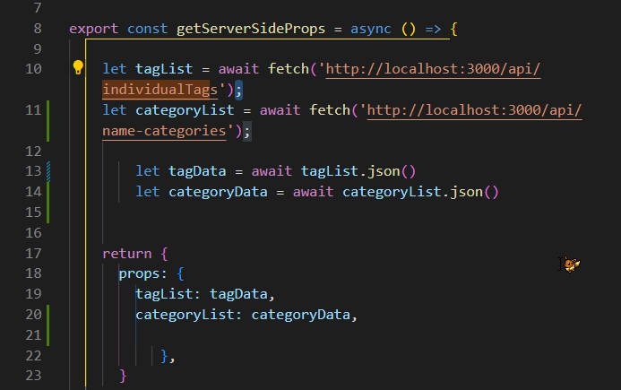

Thread for my 100 hours project progress!

Twitter Post Link: https://twitter.com/Janetthedev/status/1598391767682154497 11:01 AM · Dec 1, 2022

---

started off with a bang 🤣 did " npm run start" and was going what the hell why won't it show my edits unless I reboot it.

Realized I needed to do npm run dev 🤦‍♀️

Twitter Post Link: https://twitter.com/Janetthedev/status/1598392395091316736 Dec 1, 2022 Dec 1, 2022

---

Words alone cannot express my love for this next.js tutorial! Its so easy to understand so far 😍
https://youtube.com/watch?v=MFuwkrseXVE&ab_channel=Academind

Projects coming along at a decent pace (for now)

Twitter Post Link: https://twitter.com/Janetthedev/status/1598420569607016448 12:55 PM Dec 1, 2022

---

was getting a "Error: Element type is invalid: expected a string (for built-in components)" when importing a react component

Stared at my files for a second and realized I forgot to save the component's changes 🤡.

That immediate fix was instant serotonin!

Twitter Post Link: https://twitter.com/Janetthedev/status/1598442248626401280 2:21 PM Dec 1, 2022

---

Figured out how to change the placeholder text color using tailwindcss https://geeksforgeeks.org/tailwind-css-placeholder-color/ the normal text color tailwindcss property wasn't working

Twitter Post Link: https://twitter.com/Janetthedev/status/1598446531786735616 2:38 PM Dec 1, 2022

---

Was going to use this in the background, until I noticed one of them was "getting 💩 done " 😂

Twitter Post Link: https://twitter.com/Janetthedev/status/1598463897299976192 3:47 PM · Dec 1, 2022

---

Decent starting progress! Still more content to add and some styling to clean up, but its getting there 🔥

<video src="images/starting_progress.mp4" width="320" height="240" controls></video>

Twitter Post Link: https://twitter.com/Janetthedev/status/1598503599058788352 6:25 PM · Dec 1, 2022

---

Did a little bit more work on the landing page! Very rough, rough draft done.

The UI adjustments/colors ect are for future me to figure out 😂

Twitter Post Link: https://twitter.com/Janetthedev/status/1599834982406840320 10:35 AM · Dec 5, 2022

---

I was struggling this morning to figure out why local images kept appearing broken??🥴

After watching this video I realized, I had forgotten for the public folder you don't retype out the whole address!
https://youtube.com/watch?v=taMJct5oeoI&ab_channel=EsterlingAccime
It worked once I changed it to "profile.png"Huzzah

Twitter Post Link: https://twitter.com/Janetthedev/status/1599835681102389248 Dec 5, 2022

---

Although part of me wants to (FINALLY) start with the back-end, I know I'm too tired to work on it right now 😢

Time to nap 😴

Twitter Post Link: https://twitter.com/Janetthedev/status/1599842624755863553 11:06 AM · Dec 5, 2022

---

I was trying to add links to the navbar in nextjs but I was getting this error:
"Error: Multiple children were passed to <Link> with `href` of..."

Found this tip about removing any space between <Link> and <a> https://stackoverflow.com/questions/69667347/nextjs-multiple-children-were-passed-to-link-with-href-of-x-but-only-one/72754603

Fixed it! I would of NEVER of guessed 😂

Quotation from the stackOverflow Link: "Are you sure that's how its written in your source file? This error usually happens if you have a space in between <Link> and the <a> tags"

Twitter Post Link: https://twitter.com/Janetthedev/status/1600171174670893064 8:51 AM · Dec 6, 2022

---

used MongoDB playground to test if a basic read query to my database worked and it did! huzzah🎊

first backend step ✅

Twitter Post Link: https://twitter.com/Janetthedev/status/1600199940411572224 10:46 AM · Dec 6, 2022

---

appsloveworld.com/mongodb/100/160/express-returns-an-empty-req-body-to-a-postman-request

was trying to figure out why the test post request seemed to work, except the collection was blank!

Turns out the body was showing as "text" instead of "json!" Once I switched it to "json" in postman it worked

Twitter Post Link: https://twitter.com/Janetthedev/status/1600554807059615745 10:16 AM · Dec 7, 2022

---

Been trying to get chunks of the json data to show in a page but no luck so far🥴

Stopping for today before I go insane

Twitter Post Link: https://twitter.com/Janetthedev/status/1600585712826404864 12:19 PM · Dec 7, 2022

---

Couldn't resist trying to debug an axios error I kept getting: " OverwriteModelError: Cannot overwrite `test5` model once compiled"

Adding some code to the left of my exports helped it stop yelling about using the model again "mongoose.models['test5']" 🎊🎊

code snippet: "module.exports = mongoose.models['test5']|| mongoose.model("test5",CategoryCollectionSchema);

Twitter Post Link: https://twitter.com/Janetthedev/status/1600593040975929344 12:48 PM · Dec 7, 2022

---

now I don't need to reboot my entire app every time I redo a freaking get request! huzzah 😂

the great evil axios error has been defeated!

Twitter Post Link: https://twitter.com/Janetthedev/status/1600593513640435712 12:50 PM · Dec 7, 2022

---

my brain was melting earlier clearly, that was a mongoose error not axios!

Twitter Post Link:https://twitter.com/Janetthedev/status/1600616329249054720 2:20 PM · Dec 7, 2022

---

SWEET PROGRESS! The togglable accordion panels and checkboxes were made by mapping through these objects from my server!

I'm so happy🥺

Twitter Post Link: https://twitter.com/Janetthedev/status/1600757675037294592 11:42 PM · Dec 7, 2022

---

next step i suppose will be to store whats been clicked in a react state? and then send that to the server as a second get request. Oh boy, thats gonna take a while.

(an example: store christmas + male in state, and only get back animal names with both those tags)

Twitter Post Link: https://twitter.com/Janetthedev/status/1600758283861897216 11:44 PM · Dec 7, 2022

---

Made some slow but definite progress!

I can generate a list from the server and also by clicking the checkbox i can store the selected results in an array in the state. And clicking even removes it from the array (after lots of struggle haha)!

Twitter Post Link: https://twitter.com/Janetthedev/status/1601132154527703040 12:30 AM · Dec 9, 2022

---

Still trying to figure out how to make it so it'll let me narrow down/filter the search...
I want to start with all the names, and then have it look through the array of name objects (nameList here) and give me ones that have the given tags.

But thats for future me, Sleep time!

Twitter Post Link: https://twitter.com/Janetthedev/status/1601134316355846145 12:39 AM · Dec 9, 2022

---

Nothing like making a breakthrough while eating some chilli! 🎊
Bit embarrassing to admit it took me hours, since the logic ended up being pretty simple. 😅But eh, lots of learning done and success is success ~

Twitter Post Link: https://twitter.com/Janetthedev/status/1601346340629274626 2:41 PM · Dec 9, 2022

---

Though oddly it was chemistry of all things helped me! I had to think, what are the limiting factors and then write the code around the limiting factors

live pic of me fucking around and finding out with code before figuring things out. I'm a code arsonist today🔥🔥🔥

Twitter Post Link: https://twitter.com/Janetthedev/status/1601347067430854656 2:44 PM · Dec 9, 2022

---

Realized I didn't show off the end result!

The names (bottom of the screen) render based on what tags are chosen

Twitter Post Link: https://twitter.com/Janetthedev/status/1601348110080307201 2:48 PM · Dec 9, 2022

---

Now to make it render prettily on the side!

Twitter Post Link: https://twitter.com/Janetthedev/status/1601348874173829120 2:51 PM · Dec 9, 2022

---

Progress! The filtered results show in a table on the right

<video controls src="images/filtered_results_side.mp4" width="800px"></video>

Twitter Post Link: https://twitter.com/Janetthedev/status/1601434371084279808 8:31 PM · Dec 9, 2022

---

Next up I suppose will be to figure out how to add two requests to getStaticProps so I can grab the names from the server too

(right now I'm grabbing the names from a mock array in the document)

Twitter Post Link: https://twitter.com/Janetthedev/status/1601442682701635586 9:04 PM · Dec 9, 2022

---

I just screwed around and what do you know, it actually works!

So the name data is being sent from the server now into the page🎉🎉🍾

Twitter Post Link: https://twitter.com/Janetthedev/status/1601460207556567045 10:14 PM · Dec 9, 2022

---

Up next will be either making profiles/adding passport ect

Or adding a form so users can submit new names

Twitter Post Link: https://twitter.com/Janetthedev/status/1601460430878445569 10:14 PM · Dec 9, 2022

---

Ended up deciding to add a form to add new names 😄

I'm proud of my progress especially after working!

Users can select multiple tags (provided by a list from my server) and they can input a name. Both are saved in the state

Twitter Post Link: https://twitter.com/Janetthedev/status/1601803814935220224 8:59 PM · Dec 10, 2022

---

Next step will be to have the button click = post request.

When setting up the post request I

1. Need to give them an error message if an existing name is there
2. have the objects from the state match the schema of the individualNames collection

Twitter Post Link: https://twitter.com/Janetthedev/status/1601804814643437568 9:03 PM · Dec 10, 2022

---

Still need to work on the actual next steps, but progress for now

Twitter Post Link: https://twitter.com/Janetthedev/status/1601841303675113477 11:28 PM · Dec 10, 2022

---

So on one hand: I'm now able to submit form data, which was stored in react state, to the server successfully 🎊HUZZAH

However! The filter system is now broken?? 🙃😂

Twitter Post Link: https://twitter.com/Janetthedev/status/1602233022513745920 1:24 AM · Dec 12, 2022

---

Figured it out! It was because some of the tags were uppercase.

Filter system is unbroken again

Twitter Post Link: https://twitter.com/Janetthedev/status/1602233486882275329 1:26 AM · Dec 12, 2022

---

next up is to make it so users can add new tags to the database.

But alas, I've got to work tomorrow so time to sleep!

Twitter Post Link: https://twitter.com/Janetthedev/status/1602234911640780800 1:32 AM · Dec 12, 2022

---

Felt like I was going in circles trying to figure out why my TagList prop was working right but categoryList was undefined?! 🥴

Turns out it was the semicolons on line 10 and 11!

Twitter Post Link: https://twitter.com/Janetthedev/status/1603582817392201729 6:48 PM · Dec 15, 2022

---

realized I should change my data around a bit and change something from a post request to a put request 🤔

lets see how this goes!

Twitter Post Link: https://twitter.com/Janetthedev/status/1603663890323148800 12:10 AM · Dec 16, 2022

---

played a tiny bit with authentication after work, but too tired to dive in too deep.

Looks like i'll be using next-auth with this project

Twitter Post Link: https://twitter.com/Janetthedev/status/1605124423060639744 12:54 AM · Dec 20, 2022

---

making SOME progress with authentication! So far its console.logging correctly, now the real fun begins

Twitter Post Link: https://twitter.com/Janetthedev/status/1606178963935531008 10:44 PM · Dec 22, 2022

---

Users can now register for accounts!

Now to backtrack and get the sign in to work...

Twitter Post Link: https://twitter.com/Janetthedev/status/1606216870742200321 1:15 AM · Dec 23, 2022

---

welp login/session isn't working yet but made some progress today either way

Twitter Post Link: https://twitter.com/Janetthedev/status/1606235154942304256 2:27 AM · Dec 23, 2022

---

slowly going through to figure out why the login/sessions is so stubborn 🤔

Confirmed react useForm is working right, so step 1 done

Twitter Post Link: https://twitter.com/Janetthedev/status/1606412778763603968 2:13 PM · Dec 23, 2022

---

Been a struggle trying to get this app to work🙃
Got everything to work except the sessions won't authenticate for some reason?🤔
I've got a few things to try tomorrow otherwise I'll have to give in and ask on discord

Twitter Post Link: https://twitter.com/Janetthedev/status/1606623088648781824 4:09 AM · Dec 24, 2022

---

its maddening since

1. new registrations show up in DB, errors properly show up if a user exists already in the database

2. if the incorrect login combo is given, they won't be redirected and the error messages work
   it's literally just the sessions!🙃😭

me @ the docs

Twitter Post Link: https://twitter.com/Janetthedev/status/1606634202434523136 4:53 AM · Dec 24, 2022

---

I FIGURED IT OUT!! GUESS WHAT THE FUCKER WAS?!

the next-auth version broke the app!! 12+ hours of pain and all i needed was "npm install next-auth@4.3.4"😭😂

<video src="images/man_laughing.mp4" title="man laughing and crying in chair" width="320" height="240" controls></video>

Twitter Post Link: https://twitter.com/Janetthedev/status/1607291082706137088 12:23 AM · Dec 26, 2022

---

I may now know more than any sane person needs to know about react-auth hahaha...ha

12+ hours later 🙃😂

<video autoplay src="images/anime_man_sliding_down_stairs.mp4" title="anime person face down on stairs, sliding down" width="320" height="240" controls></video>

Twitter Post Link: https://twitter.com/Janetthedev/status/1607297360580980736 12:48 AM · Dec 26, 2022

---

also me explaining to my non-tech friends what a session is 😂

sessions are the powerhouse of the applications braincells! basically

"but uh, imagine a website is a doorman where you have to say the right password to get into the club

so you say "let me into the pokemon club", the correct password (usually this is your email and password). The doorman's braincells are a session, he goes ah! You said the right password i'll let you in.

if the doormans braincells are dead, then you can shout the password to him and he'll just blink blankly at you"

Twitter Post Link: https://twitter.com/Janetthedev/status/1607297985951723521 12:51 AM · Dec 26, 2022

---

me @ myself when I have a ton of features I need to add to make it a MVP (minimally viable product) but...wanting to focus on the unnecessary features😂

Twitter Post Link: https://twitter.com/Janetthedev/status/1607960536897183744 8:44 PM · Dec 27, 2022

---

alright self I'll stop trying to make it sortable (for now) 😢

so! right now I'm adding a feature where logged in users can save names they like

Twitter Post Link: https://twitter.com/Janetthedev/status/1607960973612306432 8:45 PM · Dec 27, 2022

---

which sounds simple but its going to need many parts...

so first up! if they click on the checkbox and they're not signed in,
show "you must be signed in to like names!"

Twitter Post Link: https://twitter.com/Janetthedev/status/1607963242164539393 8:54 PM · Dec 27, 2022

---

progress! If you're not signed in, the react-toastify alert will appear.

Buuut when you're signed in, if you click a heart icon, it will change them ALL red 🤔

which makes sense, as I told all the icons to get their color from "likesColor"

Twitter Post Link: https://twitter.com/Janetthedev/status/1607977539540221954 9:51 PM · Dec 27, 2022

---

Welp here I am again 😂
I need to get session.user.\_id to be usable in the return section of my next js's react component but alas I can't get it to work

Tried useEffect, async await and a few others things but no luck 🙃

Twitter Post Link: https://twitter.com/Janetthedev/status/1608064097345765376 3:35 AM · Dec 28, 2022

---

its not pretty but it works! annnd its 6am 😂

Twitter Post Link: https://twitter.com/Janetthedev/status/1608098676458811393 5:52 AM · Dec 28, 2022

---

laughed at myself today, I was wondering why some nav buttons always worked and others were always questionable?

Turns out for some buttons I had linked TO the text, not the button itself😂whoops! Yeah that'd def cause problems haha

Twitter Post Link: https://twitter.com/Janetthedev/status/1609521939307167745 4:08 AM · Jan 1, 2023
