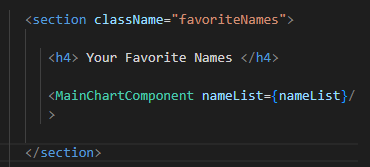
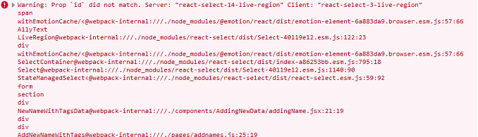

Buckle up, this is going to be a long series! I have been posting updates about building Tailored Pet Names since December 2022, but I have just decided to store them all in one (long) informal blog series.

These updates will be split into many separate blog posts so I don’t accidentally fry your browser with that much content 😉

Note: If you notice some extra spaces in the code blocks, you're not seeing things! Alas markdown applies some weird styling in code blocks that couldn't be defeated by:

1. escaping the characters (ex: \ . is not working inside markdown code blocks to escape the periods)
2. using their html entity codes

so the humble space reigns supreme here to defeat the weird markdown styling


# What is Tailored Pet Names?

**Link**: https://www.tailoredpetnames.com

A Next.js website which allows users to either

1. find the purr-fect name for their pet or

2. help adoption counselors improve pet adoption rates with unique names and/or descriptions!

Users can easily search and filter through community submitted names and descriptions. After signing up, users can save favorites, follow other users, and submit new names and descriptions. In the future, I’m considering allowing users to choose a preferred theme, so they’re not stuck with purple forever.

**Technology**: Next.js, React, Next-Auth, JavaScript, TailwindCSS, MongoDB, Mongoose, Cloudinary, Node /Mailer, SendGrid, SWR, resend, react-mail, CSS, HTML5

<iframe width="560" height="315" 
src="https://ucarecdn.com/9ef4046c-0dd2-4915-8e63-33536c72ac39/petProfileTailor.mp4" title="YouTube video player" frameborder="0" allow="accelerometer; autoplay; clipboard-write; encrypted-media; gyroscope; picture-in-picture; web-share" referrerpolicy="strict-origin-when-cross-origin" allowfullscreen></iframe>

## Thread for my project progress!


Twitter Post Link: https://twitter.com/Janetthedev/status/1598391767682154497 11:01 AM · Dec 1, 2022

---

I started off with a bang 🤣 did " npm run start" and was going what the hell why won't it show my edits unless I reboot it.

I realized I needed to do npm run dev 🤦‍♀️


Twitter Post Link: https://twitter.com/Janetthedev/status/1598392395091316736 Dec 1, 2022 Dec 1, 2022

---

Words alone cannot express my love for this next.js tutorial! Its so easy to understand so far 😍
https://youtube.com/watch?v=MFuwkrseXVE&ab_channel=Academind

The projects coming along at a decent pace (for now)


Twitter Post Link: https://twitter.com/Janetthedev/status/1598420569607016448 12:55 PM Dec 1, 2022

---

I was getting a "Error: Element type is invalid: expected a string (for built-in components)" when importing a react component

I stared at my files for a second and realized I forgot to save the component's changes 🤡.

That immediate fix was instant serotonin!


Twitter Post Link: https://twitter.com/Janetthedev/status/1598442248626401280 2:21 PM Dec 1, 2022

---

I figured out how to change the placeholder text color using tailwindcss https://geeksforgeeks.org/tailwind-css-placeholder-color/ the normal text color tailwindcss property wasn't working

Twitter Post Link: https://twitter.com/Janetthedev/status/1598446531786735616 2:38 PM Dec 1, 2022

---

I was going to use this in the background, until I noticed one of them was "getting 💩 done " 😂


Twitter Post Link: https://twitter.com/Janetthedev/status/1598463897299976192 3:47 PM · Dec 1, 2022

---

Decent starting progress! Still more content to add and some styling to clean up, but its getting there 🔥


Twitter Post Link: https://twitter.com/Janetthedev/status/1598503599058788352 6:25 PM · Dec 1, 2022

---

I did a little bit more work on the landing page! Very rough, rough draft done.

The UI adjustments/colors ect are for future me to figure out 😂


Twitter Post Link: https://twitter.com/Janetthedev/status/1599834982406840320 10:35 AM · Dec 5, 2022

---

I was struggling this morning to figure out why local images kept appearing broken??🥴

After watching this video I realized, I had forgotten for the public folder you don't retype out the whole address!
https://youtube.com/watch?v=taMJct5oeoI&ab_channel=EsterlingAccime
It worked once I changed it to "profile.png" Huzzah

```

```

```

```

Twitter Post Link: https://twitter.com/Janetthedev/status/1599835681102389248 Dec 5, 2022

---

Although part of me wants to (FINALLY) start with the back-end, I know I'm too tired to work on it right now 😢

Time to nap 😴


Twitter Post Link: https://twitter.com/Janetthedev/status/1599842624755863553 11:06 AM · Dec 5, 2022

---

I was trying to add links to the navbar in nextjs but I was getting this error:

```
Error: Multiple children were passed to <Link> with `href` of...
```

I found this tip about removing any space between <Link> and <a> https://stackoverflow.com/questions/69667347/nextjs-multiple-children-were-passed-to-link-with-href-of-x-but-only-one/72754603

This fixed it! I would of NEVER of guessed 😂

Quotation from the stackOverflow Link:

> "Are you sure that's how its written in your source file? This error usually happens if you have a space in between <Link> and the <a> tags"

Twitter Post Link: https://twitter.com/Janetthedev/status/1600171174670893064 8:51 AM · Dec 6, 2022

---

I used MongoDB playground to test if a basic read query to my database worked and it did! huzzah🎊

first backend step ✅

```
/ /  MongoDB Playground untitled-1

/ /  select the database to use.
use('main_site)

db.name_tags.findOne(
  {
     "_id":ObjectId("63423dafasf4324")
  }
)

```

```
Playground Result:
{
  "_id":{
    "$oid":"63423dafasf4324"
  },
  "tag_name":"male",
  "categories":[
    "638f31fasdflkjadsfs"
  ]
}

```

Twitter Post Link: https://twitter.com/Janetthedev/status/1600199940411572224 10:46 AM · Dec 6, 2022

---

https://www.appsloveworld.com/mongodb/100/160/express-returns-an-empty-req-body-to-a-postman-request

I was trying to figure out why the test post request seemed to work, except the collection was blank!

Turns out the body was showing as "text" instead of "json!" Once I switched it to "json" in postman it worked


Twitter Post Link: https://twitter.com/Janetthedev/status/1600554807059615745 10:16 AM · Dec 7, 2022

---

I've been trying to get chunks of the json data to show in a page but no luck so far🥴

I'm stopping for today before I go insane


Twitter Post Link: https://twitter.com/Janetthedev/status/1600585712826404864 12:19 PM · Dec 7, 2022

---

I couldn't resist trying to debug an axios error I kept getting: " OverwriteModelError: Cannot overwrite `test5` model once compiled"

Adding some code to the left of my exports helped it stop yelling about using the model again "mongoose.models['test5']" 🎊🎊

code snippet:

```
"module.exports = mongoose.models['test5']|| mongoose.model("test5",CategoryCollectionSchema)
```

Twitter Post Link: https://twitter.com/Janetthedev/status/1600593040975929344 12:48 PM · Dec 7, 2022

---

now I don't need to reboot my entire app every time I redo a freaking get request! huzzah 😂

the great evil axios error has been defeated!


Twitter Post Link: https://twitter.com/Janetthedev/status/1600593513640435712 12:50 PM · Dec 7, 2022

---

my brain was melting earlier clearly, that was a mongoose error not axios!

Twitter Post Link:https://twitter.com/Janetthedev/status/1600616329249054720 2:20 PM · Dec 7, 2022

---

SWEET PROGRESS! The toggable accordion panels and checkboxes were made by mapping through these objects from my server!

I'm so happy🥺


```
   _id: ObjectId('6666666666')
   name: "holiday"
   links: Array
      0: "Christmas"
      1: "Easter"
      2: "Halloween"
    _ _v:0

    _id: ObjectId('777777')
    name: "gender"
    links: Array
       0: "Male"
       1: "Female"
       2: "Unisex"
```

Twitter Post Link: https://twitter.com/Janetthedev/status/1600757675037294592 11:42 PM · Dec 7, 2022

---

next step i suppose will be to store whats been clicked in a react state? and then send that to the server as a second get request. Oh boy, thats gonna take a while.

(an example: store christmas + male in state, and only get back animal names with both those tags)

Twitter Post Link: https://twitter.com/Janetthedev/status/1600758283861897216 11:44 PM · Dec 7, 2022

---

I made some slow but definite progress!

I can generate a list from the server and also by clicking the checkbox i can store the selected results in an array in the state. And clicking even removes it from the array (after lots of struggle haha)!


Twitter Post Link: https://twitter.com/Janetthedev/status/1601132154527703040 12:30 AM · Dec 9, 2022

---

I'm still trying to figure out how to make it so it'll let me narrow down/filter the search...
I want to start with all the names, and then have it look through the array of name objects (nameList here) and give me ones that have the given tags.

But that's for future me, Sleep time!


```
  let nameList= [
    {name:"santa", tags: ["Christmas","Male"]},
    {name:"beans", tags: ["food","Male"]}
  ]
```

```
<div> { nameList. map((name)=>(

   / /  if the name does not have ALL those tags stored in the state, exclude it
   / /  name: stanta, with tags christmas, male
    tags in filter: christmas, female, so it'd be excluded

   names.tags.every((element)=>
   tagFilters.includes(element))&&
   <div key={name&#46;name}>{name&#46;name} </div>>)
)}
</div>
```

Twitter Post Link: https://twitter.com/Janetthedev/status/1601134316355846145 12:39 AM · Dec 9, 2022

---

Nothing like making a breakthrough while eating some chili! 🎊
It's a bit embarrassing to admit it took me hours, since the logic ended up being pretty simple. 😅But eh, lots of learning done and success is success ~

```
{ nameList. map((name)=>(

  / /  we want ONe result for each name, so map through names
     / /  names ex: beans, santa
    / /   then we want to look through EVERY tag filter ONCE
         / /  ex: filters: Male and Christmas
             / /  does the name have all these tags?
                 / /  ex: beans has male, but not christmas, so it'd return false
                 / /  while santa would return true, so it's rendered

    tagsFilters.every((tag)=>
              name.tags.includes(tag)&&
              <div key={ name .name}>{name .name}</div>
                )
))}
```

Twitter Post Link: https://twitter.com/Janetthedev/status/1601346340629274626 2:41 PM · Dec 9, 2022

---

Though oddly it was chemistry of all things helped me! I had to think, what are the limiting factors and then write the code around the limiting factors

live pic of me fucking around and finding out with code before figuring things out. I'm a code arsonist today🔥🔥🔥


Twitter Post Link: https://twitter.com/Janetthedev/status/1601347067430854656 2:44 PM · Dec 9, 2022

---

I realized I didn't show off the end result!

The names (bottom of the screen) render based on what tags are chosen


Twitter Post Link: https://twitter.com/Janetthedev/status/1601348110080307201 2:48 PM · Dec 9, 2022

---

Now to make it render prettily on the side!

Twitter Post Link: https://twitter.com/Janetthedev/status/1601348874173829120 2:51 PM · Dec 9, 2022

---

Progress! The filtered results show in a table on the right

<iframe width="560" height="315" 
src="https://ucarecdn.com/d7575c9e-6f3d-4112-af4d-42a0c5ab2ebb/20221209filtered_results_side.mp4" title="filtered results" frameborder="0" allow="accelerometer; autoplay; clipboard-write; encrypted-media; gyroscope; picture-in-picture; web-share" referrerpolicy="strict-origin-when-cross-origin" allowfullscreen></iframe>

Twitter Post Link: https://twitter.com/Janetthedev/status/1601434371084279808 8:31 PM · Dec 9, 2022

---

Next up I suppose will be to figure out how to add two requests to getStaticProps so I can grab the names from the server too

(right now I'm grabbing the names from a mock array in the document)

Twitter Post Link: https://twitter.com/Janetthedev/status/1601442682701635586 9:04 PM · Dec 9, 2022

---

I just screwed around and what do you know, it actually works!

So the name data is being sent from the server now into the page🎉🎉🍾

```
Export const getStaticProps = async () => {

let response= await fetch(‘http: / /localhost: 3000/api/name-categories’);
let nameResponse = await fetch (‘http: / /localhost: 3000/api/individualNames’)

let data = await response.json()
let nameData= await nameResponse.json()

/ /   console.log(data)
/ /  getServerSideProps allows us to fetch data from an api
/ /  runs only on server side, will never run client side
/ /   can run server-side code directly in getStaticProps

  return {
      props: {
         category: data,
         nameList: nameData,
            },
        }
}
```

Twitter Post Link: https://twitter.com/Janetthedev/status/1601460207556567045 10:14 PM · Dec 9, 2022

---

Up next will be either making profiles/adding passport ect

Or adding a form so users can submit new names

Twitter Post Link: https://twitter.com/Janetthedev/status/1601460430878445569 10:14 PM · Dec 9, 2022

---

Ended up deciding to add a form to add new names 😄

I'm proud of my progress especially after working!

Users can select multiple tags (provided by a list from my server) and they can input a name. Both are saved in the state


```
console.log Results:

name: l tags: Christmas, Male
name: le tags: Christmas, Male
name: leo tags: Christmas, Male
name: leon tags: Christmas, Male

```

```
import Select from 'react-select'
import React, {useState} from 'react';

export const getStaticProps = async () => {
  let tagList = await fetch('http: / /localhost:3000/api/individualTags');

  let tagData = await tagList.json()

  return {
    props:{
      tagList: tagData,
    }
  }
}
```

```
function AddNewNameWithTags({tagList}) {
  const [newName,setNewName=useState("")]
  const [tags,setTags]= useState([])

return (
  <div style={{width:"700px"}} className="mx-auto mt-4">
 {/*console.log(tagList[0].individualTag) */}
 {console.log(`name: ${newName} tags ${tags}`)}

 <form>
     {/* needs label and value for Select to work*/}
    <input type="text"
       placeholder="enter a name to add"
       onChange={(e)=> setNewName(e.target.value)}></input>

  <Select
      options={tagList. map((opt,index)=> ({label: opt. individualTag, value:opt. individualTag}))}
      isMulti
      isSearchable
      placeholder="select tags..."
      onChange={(opt)=>settings(opt. map(tag=>tag.label))}

       / /  update STATE of section of object
      />

      <button className="btn"> Add Name </button>
      {/*  submit state to server in correct format */}
      {/* if name already exists, send an error message */}
  </form>
  </div>
 );
}
export default AddNewNameWithTags;
```

Twitter Post Link: https://twitter.com/Janetthedev/status/1601803814935220224 8:59 PM · Dec 10, 2022

---

Next step will be to have the button click = post request.

When setting up the post request I

1. Need to give them an error message if an existing name is there
2. have the objects from the state match the schema of the individualNames collection

Twitter Post Link: https://twitter.com/Janetthedev/status/1601804814643437568 9:03 PM · Dec 10, 2022

---

Still need to work on the actual next steps, but progress for now


Twitter Post Link: https://twitter.com/Janetthedev/status/1601841303675113477 11:28 PM · Dec 10, 2022

---

So on one hand: I'm now able to submit form data, which was stored in react state, to the server successfully 🎊HUZZAH

However! The filter system is now broken?? 🙃😂


Twitter Post Link: https://twitter.com/Janetthedev/status/1602233022513745920 1:24 AM · Dec 12, 2022

---

Figured it out! It was because some of the tags were uppercase.

Filter system is unbroken again


Twitter Post Link: https://twitter.com/Janetthedev/status/1602233486882275329 1:26 AM · Dec 12, 2022

---

next up is to make it so users can add new tags to the database.

But alas, I've got to work tomorrow so time to sleep!


Twitter Post Link: https://twitter.com/Janetthedev/status/1602234911640780800 1:32 AM · Dec 12, 2022

---

Felt like I was going in circles trying to figure out why my TagList prop was working right but categoryList was undefined?! 🥴

Turns out it was the semicolons on line 10 and 11!

```
export const getServerSideProps = async () => {

  let tagList = await fetch('http: / /localhost:3000/api/individualTags');
  let categoryList = await fetch('http: / /localhost:3000/api/name-categories');

        let tagData = await tagList.json()
        let categoryData = await categoryList.json()

  return {
    props: {
      tagList: tagData,
      categoryList: categoryData,
    }
  }
}
```

```
function AddNewNameWithTags({tagList,categoryLIst}){

  return (
    <div style={{width:"700px"}} className="mx-auto mt-4">

        <NewNameWithTagsData tagList={tagList}/>
        <AddNewTag categoryList={categoryList}/>

    </div>
  );
}

export default AddNewNameWithTags;
```

Twitter Post Link: https://twitter.com/Janetthedev/status/1603582817392201729 6:48 PM · Dec 15, 2022

---

realized I should change my data around a bit and change something from a post request to a put request 🤔

lets see how this goes!

Twitter Post Link: https://twitter.com/Janetthedev/status/1603663890323148800 12:10 AM · Dec 16, 2022

---

played a tiny bit with authentication after work, but too tired to dive in too deep.

Looks like i'll be using next-auth with this project

Twitter Post Link: https://twitter.com/Janetthedev/status/1605124423060639744 12:54 AM · Dec 20, 2022

---

making SOME progress with authentication! So far its console.logging correctly, now the real fun begins


Twitter Post Link: https://twitter.com/Janetthedev/status/1606178963935531008 10:44 PM · Dec 22, 2022

---

Users can now register for accounts!

Now to backtrack and get the sign in to work...

```
users

  _id: ObjectId('6354345435')
  name: "testingredirect"
  email: "ttt @gmail .com"
  password: "242423afafasfd3424"
  image: "https: / / placekitten .com/250/250"
  createdAt: 2022-12-23T09:05:55.892+00:00
  updatedAt: 2022-12-23T09:05:55.892+00:00
  __v: 0

```


Twitter Post Link: https://twitter.com/Janetthedev/status/1606216870742200321 1:15 AM · Dec 23, 2022

---

welp login/session isn't working yet but made some progress today either way

Twitter Post Link: https://twitter.com/Janetthedev/status/1606235154942304256 2:27 AM · Dec 23, 2022

---

slowly going through to figure out why the login/sessions is so stubborn 🤔

Confirmed react useForm is working right, so step 1 done

```
console showing:

Object {email: "test@ gmail .com, password: "testtest}
     email: "test@ gmail .com"
     password: "testtest"
 Prototype: Object {....}

```

```
export default function LoginScreen(){
    const {data: session} = useSession();

    const router: useRouter();
    const {redirect} = router.query;

  useEffect(()=> {
    if (session?.user){
      router.push(redirect||'/');
    }
  }, [router, session, redirect]);

  const {
    handleSubmit,
    register,
    formState: {errors},
    } = useForm();

const submitHandler = data => console.log(data)
  ...
}
```

Twitter Post Link: https://twitter.com/Janetthedev/status/1606412778763603968 2:13 PM · Dec 23, 2022

---

Been a struggle trying to get this app to work🙃
Got everything to work except the sessions won't authenticate for some reason?🤔
I've got a few things to try tomorrow otherwise I'll have to give in and ask on discord

```
console showing:

Object {error: null, status: 200, OK: true, url: "http: / /localhost:3000/api/auth/signin?csrf=true"}

email: kyu1312323@ gmail .com pass:testtest
session on login.js:[object Object]

Object {data: null, status: "unauthenticated"}

session on _app.js: "undefined"

```

Twitter Post Link: https://twitter.com/Janetthedev/status/1606623088648781824 4:09 AM · Dec 24, 2022

---

its maddening since

1. new registrations show up in DB, errors properly show up if a user exists already in the database

2. if the incorrect login combo is given, they won't be redirected and the error messages work
   it's literally just the sessions!🙃😭

me @ the docs


Twitter Post Link: https://twitter.com/Janetthedev/status/1606634202434523136 4:53 AM · Dec 24, 2022

---

I FIGURED IT OUT!! GUESS WHAT THE FUCKER WAS?!

the next-auth version broke the app!! 12+ hours of pain and all i needed was "npm install next-auth@4.3.4"😭😂


Twitter Post Link: https://twitter.com/Janetthedev/status/1607291082706137088 12:23 AM · Dec 26, 2022

---

I may now know more than any sane person needs to know about react-auth hahaha...ha

12+ hours later 🙃😂


Twitter Post Link: https://twitter.com/Janetthedev/status/1607297360580980736 12:48 AM · Dec 26, 2022

---

also me explaining to my non-tech friends what a session is 😂

sessions are the powerhouse of the applications braincells! basically

"but uh, imagine a website is a doorman where you have to say the right password to get into the club

so you say "let me into the club" and you give the correct password.

The doorman's braincells are a session, he goes ah! You said the right password i'll let you in.

if the doormans braincells are dead, then you can shout the password to him and he'll just blink blankly at you"

Twitter Post Link: https://twitter.com/Janetthedev/status/1607297985951723521 12:51 AM · Dec 26, 2022

---

me @ myself when I have a ton of features I need to add to make it a MVP (minimally viable product) but...wanting to focus on the unnecessary features😂


Twitter Post Link: https://twitter.com/Janetthedev/status/1607960536897183744 8:44 PM · Dec 27, 2022

---

alright self I'll stop trying to make it sortable (for now) 😢

so! right now I'm adding a feature where logged in users can save names they like

Twitter Post Link: https://twitter.com/Janetthedev/status/1607960973612306432 8:45 PM · Dec 27, 2022

---

which sounds simple but its going to need many parts...

so first up! if they click on the checkbox and they're not signed in,
show "you must be signed in to like names!"

Twitter Post Link: https://twitter.com/Janetthedev/status/1607963242164539393 8:54 PM · Dec 27, 2022

---

progress! If you're not signed in, the react-toastify alert will appear.

Buuut when you're signed in, if you click a heart icon, it will change them ALL red 🤔

which makes sense, as I told all the icons to get their color from "likesColor"


```
/ / ############# LIKES FEATURE ##########/ /

const [nameLiked, setNameLiked]=useState(false)
let likesColor= nameLiked? "red":"grey"

const handleLikes = (e) => {

  {(status==="authenticated")?
    setNameLiked(!nameLiked):

    toast.error("you must be signed in to use this feature")
    }
};
```

```
tagFilters.every((tag)=>
   name.tags.includes(tag)&&
   <tr key={name._id}>
        <td className="text-purple-200 border-b-2 border-amber-300 px-4 py-2 text-left font-black">
       <label>

        <input
               style={{display:"none}}
               type="checkbox"
               checked={nameLiked}
               onChange={handleLikes}
               data-name-id={name._id}
               / / data-amount-of-likes={names.likedby.length}
               />

         <fontAwesomeIcon
              icon={faHeart}
              className="text-4xl"
              color={likesColor}/>
                 {name.name.length}
         </label>

         </td>
     ......
   )
```

Twitter Post Link: https://twitter.com/Janetthedev/status/1607977539540221954 9:51 PM · Dec 27, 2022

---

Welp here I am again 😂
I need to get session.user.\_id to be usable in the return section of my next js's react component but alas I can't get it to work

Tried useEffect, async await and a few others things but no luck 🙃


Twitter Post Link: https://twitter.com/Janetthedev/status/1608064097345765376 3:35 AM · Dec 28, 2022

---

its not pretty but it works! annnd its 6am 😂

```
export default function Example ({category, nameList, pageProps}){

  const {data: session, status} = useSession()

  let [userId, setUserId]=useState()

  useEffect(()=> {
    const UserId=localStorage.getItem("session")
    console.log(userId);
    setUserId(userId)
  },[])
  .......
}
```

Twitter Post Link: https://twitter.com/Janetthedev/status/1608098676458811393 5:52 AM · Dec 28, 2022

---

laughed at myself today, I was wondering why some nav buttons always worked and others were always questionable?

Turns out for some buttons I had linked TO the text, not the button itself😂whoops! Yeah that'd def cause problems haha


```
<Menu as "div" className="inline-block text-left">

<Menu.button className="inline-flex px-4 py-2 text-sm font-medium text-white

border-r-4 border r-violet-400

hover:bg-opacity-30 hover:border-b-4 border-b-yellow-400
focus:outline-none focus-visible:ring-2
focus-visible:ring-white focus-visible:ring-opacity-75">

<FontAwesomeIcon icon={faIgloo} className="text-xl mr-1 text-violet-100"/>  <====this should be in the Link too
    <Link href="/"> / /

       <a> Home </a>
    </Link>
   <Menu.Button>
</Menu>
```

Twitter Post Link: https://twitter.com/Janetthedev/status/1609521939307167745 4:08 AM · Jan 1, 2023

---

Today started like this, and ended like this!

Curious if anyone will remember what my avatar is from👀wink wink nudge nudge. Nothing like starting of the year with a dad joke😉


Twitter Post Link: https://twitter.com/Janetthedev/status/1609524358372032513 4:18 AM · Jan 1, 2023

---

You gotta love simple fixes!

I noticed the grey space under some areas, so I simply set the height to the screen height. Fixed! 🎊

```
return (
  <div className="bg-violet-900 h-screen">
      <Layout> </Layout>
      .....
)
```


Twitter Post Link: https://twitter.com/Janetthedev/status/1609826417755435009 12:18 AM · Jan 2, 2023

---

Added a toast notification for when someone successfully and unsuccessfully adds a name


Twitter Post Link: https://twitter.com/Janetthedev/status/1609835034978156544 12:52 AM · Jan 2, 2023

Biggest issue I'm facing is to be able to access the session.user.\_id, so i can use the unique \_id for mongoDb queries

Next Auth's getSession() only works on the CLIENT side NOT server side. so the session data can't be used to talk to mongoDB ☹️ unless I say AWAIT getSession()

Twitter Post Link: https://twitter.com/Janetthedev/status/1609857840415657985 2:23 AM · Jan 2, 2023

---

I currently save the current user's id in localStorage but this is ALSO only client side (and security wise, isn't a good option)

Thought over my options, and the best choice seems to be to use contextAPI and getSession (store user id so it can be used throughout the app)

```

export default function LoginScreen(){
   / / grab data from useSession and rename data to session

  const {data: session} = useSession();

  const router: useRouter();
  const {redirect} = router.query;
  / / extract redirect from router.query

  / / import this from line 2/react

  useEffect(()=>{
    if(session?.user){
      localStorage.setItem("session",JSON.stringify(session.user._id))
       / / console.log(session.user._id),

       router.push(redirect || '/');
    }
  }, [router, session, redirect]);
  / / if the session exists, then the user is already signed in. so if this is true, go back to the homepage
  / / we need to use router (line 8) to redirect our user
}

```

My Options:

1. When logging in, use the contextAPI with getSession() to save session in a stored state

   when logging out, remove session from stored state

   con: will have to use await to access session data when first adding it to the context api

   pro: won't have to use unstable_getServerSession

2. use unstable_getServerSession with ContextAPI

   Pro: won't need to use await to access session data like we would with getSession() since this is server side not client side

   con: unstable, aka its experimental and may be removed one day

3. use unstable_getServerSession by itself

   con: will have to call it every time its used

   con: unstable aka its experimental and may be removed one day

   pro: won't have to set up contextAPi

Twitter Post Link: https://twitter.com/Janetthedev/status/1609858935145795589 2:27 AM · Jan 2, 2023

---

so when the user logins in, I'll have it set up so that it saves the current user's Id in the context (storage for global state objects)

When they sign out, it'll be removed from context

Twitter Post Link: https://twitter.com/Janetthedev/status/1609859499258707976 2:29 AM · Jan 2, 2023

---

So far I know:

1. Context object STORES the shared data
2. Provider DELIVERS the context object when requested

Creating the actual context itself seems dead simple! 🥳

But I can feel my brain go numb whenever I try to figure out how to write the provider bit 🥴

```
import React, {useContext, createContext, useState, useEffect} from 'react'

/ /  create context
const UserSessionContext= createContext(null)
/ /  https:/ / www. youtube .com/watch?v=t9WmZFnE6Hg&ab_channel=PedroTech
/ /  6:53 null is good for testing

```

Twitter Post Link: https://twitter.com/Janetthedev/status/1609862959135879170 2:43 AM · Jan 2, 2023

---

huh seems I misunderstood the context API. Seems you have to declare the prop when you wrap something in < context . provider> . And my \_app.js page doesn't have access to session, only its children... so I can't place session in the context store?

```
import UserSessionContext from '../src/context/UserSessionContext';

function MyApp({

  component,
  pageProps: { session, ...pageProps}

})
{
  / / setting up the prop for UserSessionContext, grabbing session information
  / / ????

    return (

      <SessionProvider session={session}>

      {/* <UserSessionContext.Provider value={sessionInfo}>

         Every context Object comes with a Provider React component

         The Provider component accepts a value prop to be passed to consuming components that are descendants of this Provider,

         in this case ALL components */}

         <Component {...pageProps}/>

         {/* </UserSessionContext.Provider> */}
      .......
    )
}
```

```
_app.js

import React, {useContext, creatContext, useState, useEffect} from 'react'

/ /  create context

const UserSessionContext=createContext(null)
```

Twitter Post Link: https://twitter.com/Janetthedev/status/1609896163578372099 4:55 AM · Jan 2, 2023

---

hoping someone will see my question on the 100devs discord, looks like I might have to use Next auth's unstable_getServerSession after all? 🥴

What I submitted:

> hi everyone, I need some advice for my next.js project which uses Next auth for authentication.

> The main problem is that I'm trying to figure out the best way to grab the current user's id from the current session so its available immediately server side. This way I can use it to query my mongoDB database.

Follow up comment from me:

> My thought process:

> So I understand getSession() is client side only, so it would have to wrapped in an await to grab session data. Otherwise it would return null.

> So what is the best way to make it so session data is available RIGHT AWAY, server side, so I can use the current user_id when sending queries to the MongoDb database?

> (my [ ... nextAuth].js is set up so that user_id is included in the returned session object. My session strategy is JWT)
> https://github.com/JSMarsh813/PetProfileTailor/blob/liking-name-feature/pages/api/auth/%5B...nextauth%5D.js

> For example, on my dashboard page I want to grab the user's id from the current session and then query my mongodb database, so I can grab the users most current information. I would then use that information to fill out the dashboard page (user's likes, user's profile image, user's username, ect).

> Another Example, my app gives users a list of names they can like or dislike. I want to grab the userID to query the MongoDB database to see if the current user already liked a name. And then sent a get or patch request when the user likes or dislikes the name.

> 1. I thought about using react context in \_app.js but I believe session isn't available in \_app.js? Aka only its child components have access to session, so theres no way to set the current session prop for the userSessionContext right?

> 2. use unstable_getServerSession, though I'd rather not center a large part of my app on an experimental feature that could be removed if possible. https://next-auth.js.org/tutorials/securing-pages-and-api-routes#server-side

> 3. Some other method?

> https://www.jmfurlott.com/handling-user-session-react-context/ I had found this, would you all say js cookies with context is a good option to grab user ids?

Twitter Post Link: https://twitter.com/Janetthedev/status/1609896731600375808 4:57 AM · Jan 2, 2023

Yeah as I figured, I can't access useSession in \_app .js, since \_app .js can't be wrapped in a

```
<SessionProvider session={session}>
```

😭 Still tried anyway for the wild thrill of trying impossible things haha

But confirmed that I got context to work with a normal string `:)`


Twitter Post Link: https://twitter.com/Janetthedev/status/1609902930702000128/photo/1 5:22 AM · Jan 2, 2023

---

Its times like these that I really LOVE💓 react!

Look at that, ONE beautiful line which secretly carries two reusable components

(MainChartComponent=54 lines and
nameListing which is inside MainChartComponent = 70ish lines if the comments were taken out)
🥰🥰🥰




Twitter Post Link: https://twitter.com/Janetthedev/status/1609913421931376641 6:04 AM · Jan 2, 2023

---

Small achievement! 🎊

Fixed the tags so when they show up there's a ", " between them 😁

Laughed when I tried to do ".split().Join(", ")" before my brain clicked on. Braincell: "aayy this is an array not a string friend `:)`"


Twitter Post Link: https://twitter.com/Janetthedev/status/1609916870056112129 6:17 AM · Jan 2, 2023

---

Success is mine! I could cry with joy and relief 🥺The put request for my likes features finally works!

been slooowly working on it with any spare time I've had this week, and it finally paid off 🔥

<video src="images/success_is_mine.mp4" width="320" height="240" controls></video>

Twitter Post Link: https://twitter.com/Janetthedev/status/1611349214780624897 5:09 AM · Jan 6, 2023

---

For a sec I couldn't figure out why I couldn't get my mobile menu's text to center 🤔

I had forgotten they were flexed, once that was removed it works!


Twitter Post Link: https://twitter.com/Janetthedev/status/1611728622100054016 6:17 AM · Jan 7, 2023

---

Was getting this error that what rendered was different than what the server had initially rendered

realized it was because the tagList from the fetch only was grabbed AFTER the server had rendered the page.

Once I told it to wait, no more error messages ~





Twitter Post Link: https://twitter.com/Janetthedev/status/1611945493722181632 8:38 PM · Jan 7, 2023

---

the user who submits the new names id is now added to the name in the database!
(I was having problems but then remembered getSession() has to be used on pages not components, so I passed the session as a prop)

Descriptions can now be added as well

<video src="images/the_user_who_submits.mp4" width="320" height="240" controls></video>

Twitter Post Link: https://twitter.com/Janetthedev/status/1611994453430120449 11:53 PM · Jan 7, 2023

---

Is anyone familiar with next Auth sessions for next js? I'm trying to add the profile image data to my session and I can't get it to work🤔

Below is my nextauth file, console.log, mongodb data and user model #SoftwareDeveloper #Nextjs #nextauth


Twitter Post Link: https://twitter.com/Janetthedev/status/1613201046473682947 7:47 AM · Jan 11, 2023

---

tried this and it didn't work either `:(`


Twitter Post Link: https://twitter.com/Janetthedev/status/1613201592920190979 7:50 AM · Jan 11, 2023

REPLY FROM Rawand Faraidun @rawandfaraidun https://twitter.com/rawandfaraidun

> try replacing the `callbacks` object with this:
> callbacks: {
> jwt({ token, user }) {
> if (user) token = user
> return token
> },
> session({ session, user, token }) {
> session.user = token
> return session
> }
> }
>
> Twitter Post Link: https://twitter.com/rawandfaraidun/status/1613989983915806722 12:02 PM · Jan 13, 2023

THANK YOU! That was it, words can't express my gratitude!

You're a lifesaver


Twitter Post Link: https://twitter.com/Janetthedev/status/1614200418107797506 1:59 AM · Jan 14, 2023

---

alright so on postman my api, which gives a list of all names the current user liked works, but I'm still trying to get it to work in the actual app...


Twitter Post Link: https://twitter.com/Janetthedev/status/1613820757137846275 12:50 AM · Jan 13, 2023

---

Got it to work! On the dashboard, now only the current user's favorite names show up!🥳


Twitter Post Link: https://twitter.com/Janetthedev/status/1613836487359098885 1:52 AM · Jan 13, 2023

---

Thanks to @rawandfaraidun (https://twitter.com/rawandfaraidun) I managed to fix my [...nextauth].js file so the session object will have the user's profile image link!

now when I load session in getServerSideProps with unstable_getServerSession, I can grab the profile image before rendering even starts 🥳


Twitter Post Link: https://twitter.com/Janetthedev/status/1614234032044396544 4:12 AM · Jan 14, 2023

---

Made it so if a user goes to the dashboard when not logged in, they'll be automatically redirected to the login page.

useRouter() is a bit of an odd one, it doesn't work unless I stuff it in a useEffect, because it only works on client side.


Twitter Post Link: https://twitter.com/Janetthedev/status/1614234667666010112 4:15 AM · Jan 14, 2023

---

Finished my component with the rank titles!

If they have more points than 40, then it defaults to the "A good Pupper title".

Was confused for a hot sec until I remember to do Math.floor! (so 1.2 ect becomes 1) All those codewars memories are flooding back to me


Twitter Post Link: https://twitter.com/Janetthedev/status/1614236185429250050 4:21 AM · Jan 14, 2023

---

I put the rank names component into the dashboard page. So it automatically adjusts the title, based on the users current number of points (treats)


Twitter Post Link: https://twitter.com/Janetthedev/status/1614236826302287872 4:23 AM · Jan 14, 2023

---

I'm going to have the user's name and profile image load in ServerSideProps, so theres no delay.

However components can't use ServerSideProps, so I'll need to pass them as props to the layout from EACH page that calls it ...

I'll fight with that tomorrow


Twitter Post Link: https://twitter.com/Janetthedev/status/1614238710152957954 4:31 AM · Jan 14, 2023

---

🙌 fixed the header so it grabs session from serversideprops
🙌 did a few small edits
🙌 Started working on making it possible for users to upload profile images with cloudinary, I got to the highlighted part tonight. Giving my brain a break for now 🥱


Twitter Post Link: https://twitter.com/Janetthedev/status/1614554408490250241 1:25 AM · Jan 15, 2023

---

My intention was to relax but, ended up started on the social area of the app (batsignal/playyard) 😂

Users can ask the community for suggestions for names, pet descriptions, fundraisers, ect or just show off images of their pets

<video src="images/my_intention_was_to_relax.mp4" width="320" height="240" controls></video>

Twitter Post Link: https://twitter.com/Janetthedev/status/1614589714857877509 3:46 AM · Jan 15, 2023

---

🐤worked a tiny bit on integrating cloudinary
🐤Started on the filtering system for the posts

Twitter Post Link: https://twitter.com/Janetthedev/status/1614973965583421440 5:12 AM · Jan 16, 2023

---

users can now upload profile image to cloudinary and have it replace the profile image in their mongoDB user document!

Wanted to use the widget but its extra broken for function components rn😅Look at all those error messages in that second sandbox
https://support.cloudinary.com/hc/en-us/artic


Twitter Post Link: https://twitter.com/Janetthedev/status/1615316730309660672 3:54 AM · Jan 17, 2023

---

Temporarily have a cool cat😎😼as a profile picture, eventually I'll go back to the turtle duck!


Twitter Post Link: https://twitter.com/Janetthedev/status/1615320136805937155 4:08 AM · Jan 17, 2023

---

Was confused why I had 2 toast containers for a moment, then remembered there was another in the nav bar!

so I got rid of the one in the nav bar for now. Phew, nice easy fix.


Twitter Post Link: https://twitter.com/Janetthedev/status/1615321177769259009 4:12 AM · Jan 17, 2023

---

time to de-uglyify this bad boy and reword some things (uploading avatar section)


Twitter Post Link: https://twitter.com/Janetthedev/status/1615488312789340161 3:16 PM · Jan 17, 2023

---

When styling I found out file input is a bit picky, it needs to be onCHANGE not onCLICK. If its switched to onClick, clicking it will do nothing (it will give back undefined)


Twitter Post Link: https://twitter.com/Janetthedev/status/1615510358525120512 4:44 PM · Jan 17, 2023

---

Looks MUCH better!

Also used state to decide when the upload button is disabled and what it looks like

<video src="images/looks_much_better.mp4" width="320" height="240" controls></video>

Twitter Post Link: https://twitter.com/Janetthedev/status/1615527956180504577 5:54 PM · Jan 17, 2023

---

Added a quick image too ~


Twitter Post Link: https://twitter.com/Janetthedev/status/1615537955862609922 6:33 PM · Jan 17, 2023

---

Future users on smaller screen sizes/mobile rejoice!

I made a toggle button so the user can get rid of the filter menu if they want!

(I'll be changing that banner later, the text on top of the image is mild torture for the eyes rn, but eh, future me will take care of that 😂)

<video src="images/future_users_on_smaller.mp4" width="320" height="240" controls></video>

Twitter Post Link: https://twitter.com/Janetthedev/status/1615546973695934464 7:09 PM · Jan 17, 2023

---

aaah so satisfying, its the little things in life ☺️

I imported a component and replaced all the class= with className= with one simple button click!


Twitter Post Link: https://twitter.com/Janetthedev/status/1615580915241226240 9:24 PM · Jan 17, 2023

---

Made progress on the front-end side of things on the community area!

Was struggling to get the buttons to center until I stumbled across a tip online to use text-center on its parent component

<video src="images/made_progress_on_the_frontend.mp4" width="320" height="240" controls></video>

Twitter Post Link: https://twitter.com/Janetthedev/status/1615678479303077888 3:52 AM · Jan 18, 2023

---

two of my pages keep making fast refresh do a full reload... not looking forward to debugging that ugh


Twitter Post Link: https://twitter.com/Janetthedev/status/1615683520839716864 4:12 AM · Jan 18, 2023

---

Fixed the full reload bug! the page's function component needed to be capitalized😂🤦‍♀️

Also fixed mobile view for the posts page! One of the components had been set to width max instead of width full.

<video src="images/fixed_the_full_reload_bug.mp4" width="320" height="240" controls></video>

Twitter Post Link: https://twitter.com/Janetthedev/status/1615902005570203648 6:40 PM · Jan 18, 2023

---

Added a footer, which decided to float on one of my pages!
🤪
Found out it was because one of the divs was set to h-screen, so it wasn't resizing to the content. Even though visually it had looked fine.

Removing that height fixed it!💪


Twitter Post Link: https://twitter.com/Janetthedev/status/1615914868472942597 7:31 PM · Jan 18, 2023

---

Got most of the post upload bits done!

- Model created,
- states created to store values,
- attached state to form behavior,
- finished cloudinary upload logic,

now to finish the logic for uploading the new post to mongoDB

<video src="images/got_most_of_the_upload_bits.mp4" width="320" height="240" controls></video>

Twitter Post Link: https://twitter.com/Janetthedev/status/1616007573588828161 1:40 AM · Jan 19, 2023

---

Spent a good chunk of time dealing w/ the insurance but I made progress!

🐶Did some form validation,
🐶hid the ugly file input field (input is now the image icon),
🐶clear the image when clicking the x,
🐶storing URL.createObjectURL in state to preview image

<video src="images/spent_a_good_chunk.mp4" width="320" height="240" controls></video>

Twitter Post Link: https://twitter.com/Janetthedev/status/1616311858511896576 9:49 PM · Jan 19, 2023

---

Small thing, added a little bit of drop shadow to the x font awesome icon!

That way its still possible to see even if someone uploads a bright image


Twitter Post Link: https://twitter.com/Janetthedev/status/1616346190836301824 12:05 AM · Jan 20, 2023

---

Here's a quick overview of what i've done so far for my 100 hours project! beware theres some glitches 😂esp on the add name page rn

<video src="images/heres_a_quick_overview.mp4" width="320" height="240" controls></video>

Twitter Post Link: https://twitter.com/Janetthedev/status/1617016132120244229 8:27 PM · Jan 21, 2023

---

I'm tired enough I was looking at this for a solid minute going ??? what error?

then laughed when I realized I basically told JS to do "function function" . Double raiiiiinbow javascript edition 🌈


Twitter Post Link: https://twitter.com/Janetthedev/status/1617030775949656064 9:25 PM · Jan 21, 2023

---

Success is mine!! I got my onclick function to run two functions. AND the second one correctly grabs the first one data!

Here i was thinking I had to do .then(), ect, when just doing this works:


nevermind, once I json.Stringified the object i realized it was coming back as empty. So the second function isn't waiting on the first to finish :(

makes sense, as this isn't a proper callback but hoped it'd be this easy. Oh well!

Figured it out. So in the function that creates the new post, I had it await for cloudinarys message to return so we got the url for the image from cloudinary, and then it continues the rest of the function


when I'm not wiped I'll work on making the actual api for sending the post request ect, but hey its still progress!

ngl i was stressing about how to make it /wait/ and for it to not freak out if the user didn't upload an image, didn't actually end up being too bad

nevermind I spoke too soon 🥲, looks like it ISN'T waiting to get data for that function to run. I have to click it twice for it to work
I'm using async await and then so i'm not sure why its not waiting for handleImageUpload() to finish running before the console.log goes off??


stackoverflow.com/questions/55960027/await-doesnt-wait

I've tried both after the function and within a .then() statement 🥲 why code won't you just work on the first click please


Thought maybe adding this would work, but no dice 😭at this rate might just have to try the 100devs help channel


Twitter Post Link: https://twitter.com/Janetthedev/status/1617038809212018688 9:57 PM · Jan 21, 2023

---

Alright so I posted this in the 100devs discord but wanted to ask here juuuust in case someone can figure out what I'm doing wrong 🥲
is it maybe correctly waiting for the handleImageUpload function, but since state variables are async maybe the image variable hasn't updated?


A-HA! my hunch was right! shoutout to breakpoint in 100 devs for being a hero 🎉 highlighted what I needed to change


100 devs is the best community i swear 😭🙏i would of been fighting this for HOURS.

here I was trying to create a second function to await, putting a setInterval in that function, ect which wasn't working.

when all I needed to do basically was return the state

Twitter Post Link: https://twitter.com/Janetthedev/status/1617361155617619969 7:18 PM · Jan 22, 2023

---

after lots of debugging:

IT WORKS, my users now have the power to upload new posts!!
🔥🔥🔥


only bug i'm noticing if that someone submits a post, it works fine the first time.

But the second time we get an error 🤔strange

figured it out! I had the description set to unique: true.

So I had to change it to unique: false and completely delete the original collection from mongoDB

Twitter Post Link: https://twitter.com/Janetthedev/status/1617401458533732358 9:58 PM · Jan 22, 2023

---

Getting the newest posts to show up first was easier than I thought!

I just had to add a sort({\_id:-1})

I thought i'd have to use the timestamps but here they mentioned the ids could be used instead, so I did some digging and.... (1/2)

https://mongodb.com/community/forums/t/sorting-with-mongoose-find/158594


I found out why .sort({ \_id:-1}) worked to get the most recent documents!

I found out why .sort({ \_id:-1}) worked to get the most recent documents!

Turns out each ObjectID in mongoDB contains a 4 byte timestamp! 🤯
https://www.mongodb.com/docs/manual/reference/bson-types/#std-label-objectid


Twitter Post Link: https://twitter.com/Janetthedev/status/1618229992416251905 4:51 AM · Jan 25, 2023

---

Been working on my project in little bits of time but its been adding up!

1. Filtering now works
2. Edited my api so the newest posts show first
3. Each post has the users id. So EACH post COMPONENT calls an api, finds a user w/ that id & grabs the posters username and picture

<video src="images/been_working_on_my_project.mp4" width="320" height="240" controls></video>

Twitter Post Link: https://twitter.com/Janetthedev/status/1618233433662316551 5:04 AM · Jan 25, 2023

---

hmm making the post's creation date show up correctly in the current users timezone is more complicated than I thought...

It looks like its not recommended to use the timestamps??
so i guess I'll have to add a dateCreated property. Then somehow convert it w/ luxon or something??

Twitter Post Link: https://twitter.com/Janetthedev/status/1618234181926150147 5:07 AM · Jan 25, 2023

REPLY

> Jesse Pence @JessePence5
>
> This sent me down a rabbit hole.
>
> So, you have to ask the user for their current time zone and save it as part of their model.
>
> Then, you can make a new Date object with localestring and a modifier.
>
> https://stackoverflow.com/a/54453990
>
> The other thing that comes to mind would be middleware in Next.JS that tries to figure out the user's location and set the time zone from there.
>
> https://www.jamesperkins.dev/post/using-next-middleware-for-geolocation

REPLY

> Jesse R @jesseranon
>
> I went down this rabbit hole too. Luckily, if you're using mongodb, it converts timestamps to UTC for storage and all that's left is doing conversion on the client's browser.
>
> For me, it meant passing date-fns addMinutes function to front-end templates and using Date.offset.
>
> I got the idea from reading this article:
>
> https://www.toptal.com/software/definitive-guide-to-datetime-manipulation
>
> It took a bit to get to my solution, as I had to really get down in the weeds of playing with Date objects. But it works for my project and I understand Date objects a bit better than when I started out. Happy to help if you still need it.

Janet(she/her) | ghiblimagic
@JessePence5 @skadadark amused that both of my fav jesses came rushing to my aid to fight time itself, I can now confirm jesse is clearly the name of time lords! Thanks both for sharing the gems of your deep dives 🙏

Funnily enough I stumped across a simple solution


@58:00 he goes over managing the time https://youtube.com/watch?v=lyNetvEfvT0&ab_channel=WebDevSimplified

So i was able to take my timestamp from mongodb/mongoose and convert it to a date that will show in the users timezone!

Thanks again both of you, you're the best truly 💖

REPLY

> Jesse Pence @JessePence5
>
> I heard about the Intl API, but I didn't know it could be used for this! That is super handy and easy to write out. Great tip, Janet! `:)`

---

alright I want to keep going but its 5am I really need to go to bed 😂
🐍 did some anki during work breaks
🐍 worked on my project when I got home, figured out a part that made me nervous: making an api that lets me grab user info from the database within a component!💪

Twitter Post Link: https://twitter.com/Janetthedev/status/1618236190339256320 5:15 AM · Jan 25, 2023

---

🤯This changes everything! https://youtube.com/watch?v=o7dZWGiXcA8&t=191s&ab_channel=HuzaifaAsif

Found out how to link two mongoDB collections and WOW, its SO much easier!

So now when I grab post data, and it automatically knows to look at the user collection and grab the data for that userID!🎉🎉🎉


now i can delete that extra api I made, where i had the userID as an end point to grab all their data from the database 😁

Twitter Post Link: https://twitter.com/Janetthedev/status/1618839109526773760 9:11 PM · Jan 26, 2023

---

me, wondering why an async function was being console.logged when it wasnt called???

So! turns out I forgot I had console.logged the variable earlier for something else, before reusing it for this function😂

whoops!


Twitter Post Link: https://twitter.com/Janetthedev/status/1618886932158889985

---

FINALLY figured out how to get populate to work with an array of objectIds

I had to change the formatting a bit and change up the type 🥳


Twitter Post Link: https://twitter.com/Janetthedev/status/1619061498365751296

---

Welp turns out that populate doesn't like it when some objects don't have any object ids for the field you want to populate 💀

so I either need to find a way to tell mongoose, hey if theres no object id in the path, do not populate. Or switch to apis for grabbing comments 😢

populate works fine when every post has comments though! So for now, I figured out the api logic for adding comments, and replies to comments ect, not letting replies nest too far ect ect


Twitter Post Link: https://twitter.com/Janetthedev/status/1619284632775823360 2:41 AM · Jan 28, 2023

---

Made some progress with profile pages today! 🔥🔥🔥 now its 5am time to sleep


Twitter Post Link: https://twitter.com/Janetthedev/status/1619688376101376003 5:26 AM · Jan 29, 2023

---

Progress! Instead of using ids, i let users look up profiles by unique profilenames

Made the grid layout change depending on screen size, so it doesn't get jumbled on small screens 🥴

Took a hot minute but figured out how to force a 404 if I get nothing back from the api! 😤

<video src="images/progress_instead_of_using_ids.mp4" width="320" height="240" controls></video>

For nextjs, the key was to return notFound: true if the .find() from the api returns [] (aka it found nothing)


I also created the pages for individual posts! The likes feature ect also works here.

<video src="images/I_also_created_the_pages.mp4" width="320" height="240" controls></video>

Start of the dynamic page for individual names, also redirects to 404 is the name is not found


When findById() finds nothing the redirect to 404 works now, but required slightly different wording

https://stackoverflow.com/questions/45172700/what-does-mongoose-return-when-a-find-query-is-empty

This thread was a gift🙏


Twitter Post Link: https://twitter.com/Janetthedev/status/1620014287468265472 3:01 AM · Jan 30, 2023

---

Big thing left is the lost password function. users can already reset their password if they're logged in, but I'll have to somehow email them a link so they can edit it

guessing I'll end up using nodemailer & setting up nextjs email provider? But ugh, not looking forward to it

Twitter Post Link: https://twitter.com/Janetthedev/status/1620043436832473090 4:57 AM · Jan 30, 2023

---

Worked on the front end bit of editing posts! Was dreading doing this and yeah it's taken hours 🥲

partly because I've never messed with modals before. But proud of my progress so far!

<video src="images/worked_on_the_front_end.mp4" width="320" height="240" controls></video>

What I"m especially proud of is the tags! They look simple but they kept appearing blank (aka text wasn't showing)
Was about to give up and make the user manually reenter the tags, when I realized this uses a label AND value tag!
The tags were showing up fine in react state,...


So since they were appearing fine in the state, I knew there was something making the text not appear to the user.

So what I did was make sure the value showed the values AND tags by mapping through the tags and turning each one into an object with a tag and label. 🥳

Twitter Post Link: https://twitter.com/Janetthedev/status/1620353109724897280 1:27 AM · Jan 31, 2023

---

Progress on the profile pages 🎊🎊🎊

Though I eventually need a different system than loading them in separate scrollable containers

maybe using a button and state, so when the button is clicked, the next 10 or so items are rendered? 🤔

🥴or maybe pagination...?

<video src="images/progress_on_the_profile.mp4" width="320" height="240" controls></video>

Twitter Post Link: https://twitter.com/Janetthedev/status/1620358163601186817 1:47 AM · Jan 31, 2023

---

Forgot to post, I fixed up the front page the other day as an excuse to avoid apis for a bit 😂

All the links now work and they all play nice on mobile now

(I feel like I should add some silly effect/pic if someone clicks the impactful, fun, or tailor-fitted buttons 🤔)

<video src="images/forgot_to_post_I.mp4" width="320" height="240" controls></video>

Twitter Post Link: https://twitter.com/Janetthedev/status/1620360251081109504 1:56 AM · Jan 31, 2023

---

Still a good chunk left, but getting there!

Though I'll be working lots this week so RIP productivity 🥲
But! On the other hand, I was feeling the early signs of burnout so it's probably for the best I'm forced away from the computer

- pagination/endless scroll/ect?

- grabbing current numbers for dashboard "treat" points + profile page
- Show edit and delete symbol if signed in:  
   names
  comments

- Do edit and delete api logic for:
  posts, names, comments

-do descriptions section (frontend, backend/api, individual pages, adding to profile page + dashboard)

-fixing the header on some pages (adding session to it ect)

LATER

- followers + followers (will be shown on separate pages like on twitter)
- add tags to existing name
- add comments to names
- lost password feature
- shares

Twitter Post Link: https://twitter.com/Janetthedev/status/1620366164445794307 2:19 AM · Jan 31, 2023

---

☘️did a tiiiny bit of walking while coding
☘️worked on 100 hours project, probably too much tbh i felt the edges of burnout
🦀no anki/banki


Twitter Post Link: https://twitter.com/Janetthedev/status/1620412529704058881 5:23 AM · Jan 31, 2023

---

Did a tiny bit before work!

Fixed some pages so the profile image and profile name shows

And got the backend logic for editing posts to work 🥳


Twitter Post Link: https://twitter.com/Janetthedev/status/1620916187441025024 2:45 PM · Feb 1, 2023

---

Wanted to add this on to the last post, but twitters vertical scroll bar is broken/unresponsive??😂

But anyway, users can now edit posts!

<video src="images/wanted_to_add_this_on.mp4" width="320" height="240" controls></video>

Twitter Post Link: https://twitter.com/Janetthedev/status/1620919536483696641 2:58 PM · Feb 1, 2023

---

Looks like swr would be the answer to automatically reloading the data w/out the page flickering + pagination/endless scroll

But with how insane my work schedule is, might have to push that to the "a future feature, not a mvp level feature list"

Twitter Post Link: https://twitter.com/Janetthedev/status/1622455963038150657 8:43 PM · Feb 5, 2023

---

Worked more on my "100" hours project!

Users can now sign in with magic links through their email 🪄

Shame that for forgot passwords I can't just tell it, hey do this same exact thing, but redirect them to reset password page instead of the dashboard 🙃


Could just tell users in the email, hey if you want to reset your password go to your edit profile page after logging in with the magic link.

But alas that won't look as good as a direct link, curses 😂

I'm using next auth so the magic link setup is only for logins

I'd have to make a separate mongodb collection and write the logic myself for a lost pw magic link

But eh, I decided screw it. Users can use the magic link to login and go to edit profile to change their pw rn😂

Twitter Post Link: https://twitter.com/Janetthedev/status/1622576945774088194 4:44 AM · Feb 6, 2023

<video src="images/" width="320" height="240" controls></video>

---

Narrowing down what things have to "actually" be done to make the mvp version of the project

- Edit and deletion logic for names and comments
- adding descriptions category (frontend, backend/api, individual pages, adding to profile page + dashboard)
- grabbing actual numbers for "treat" points for dashboard and profile
- shares
  Possibly:
- followers and following
- add tags to existing names

Just thinking about writing out the reset password logic and page felt like death, so screw it 😂for now, users can just use the magic password link and manually go to the edit profile page to reset the password

Twitter Post Link: https://twitter.com/Janetthedev/status/1622929366559899648 4:04 AM · Feb 7, 2023

---

I'm using next auth so the magic link setup is only for logins

I'd have to make a separate mongodb collection and write the logic myself for a lost pw magic link

But eh, I decided screw it. Users can use the magic link to login and go to edit profile to change their pw rn😂

Twitter Post Link: https://twitter.com/Janetthedev/status/1622931386033389569 4:12 AM · Feb 7, 2023

---

> Meg @megfdev
>
> Do you like suffering? Why not try getting your react form to accept your img file path from the input, send that off to cloudinary to do whatev it needs to do, get that img url back n add that to the post request with the other form data and send that to your DB without an error
>
> https://twitter.com/megfdev/status/1623184981873885193 9:00 PM · Feb 7, 2023

My Reply:
Oh hey! a pain i know all too well :D we're twinsies in suffering! Here's how I bound cloudinary's power to my will in my project


the general code https://github.com/JSMarsh813/PetProfileTailor/blob/adding-edit-and-deletion-capabilities-to-comments-and-names/components/AddingNewData/AddPost.js  
my api https://github.com/JSMarsh813/Pet

> Janet! Sorry just one question but in your controllers on the server side, in your .create() does your object include a key for the image url and the cloudinaryId?

My Reply: For my app, I just stored the url in a variable because its all I needed.
But most people do end up using the public_id from my understanding.
You could have imagefromcloudinary store the entire data object, then take use the keys "url" and "public_id" to take out what you need


---

Finished adding the deletion option for names! And had a 🤯 moment and realized I could easily turn it into a reusable component for all items.

Twitter Post Link: https://twitter.com/Janetthedev/status/1623288655564648448 3:52 AM · Feb 8, 2023

---

Was having a hell of a time updating my data for filtering names. Ex: Category: "Gender" Tags: Unisex, male, female.

So I wanted to split it into 2 collections, a category and a tags collection

So the category populate tags based on their objectID. But no matter how I tried


mongodb REFUSED to work with the individual tags collection. Yet It worked with the user collection easily!
So created a new model and it works🤷‍♀️

maybe since I didn't use a plural name ("NameTag" not "NameTags")?

I had tried every casing w/ the old model so it shouldn't be that


Annnndd after killing and restarting the development server it now doesn't work 😂(smiling face with tears)

why are you like this???

Glad my paranoia paid off I i did this before posting this update on linkedin

It was working again when I briefly switched to the user model, then back to the NameTag model .... but once I killed and restarted the development server its returning {} when populate is run. Aka not working
WELP time to sleep. I'm now more confused than ever (smiling face with tears)


Twitter Post Link: https://twitter.com/Janetthedev/status/1625116999729942528 4:57 AM · Feb 13, 2023

---

🐢fought with my project when I got home, thought we came to a truce. But! alas, mongodb decided to go the ol' julius caesar route, et tu mongodb 🥲
🐢 went to work
🦀 no anki

the last few days at work have been busy, so not much time for much, other than sleeping and working

## Twitter Post Link: https://twitter.com/Janetthedev/status/1625134363645206529 6:06 AM · Feb 13, 2023

Posted this to the 100devs discord, hopefully someone will have an idea why mongoose's populate() is being so funky 🥴

"Hey everyone o/ happy valentines day! Speaking of valentines, I'll love you forever if you manage to help me solve this annoying mystery ;). Corny jokes aside, I've tried messing with mongoose's populate for hours but I'm having no luck. I'm trying to populate my namecategories collection's TAGS property, with TAGS from my tags collection.

However, it seems like something must be wrong with the tags collection, because populate works perfectly with my users collection, but returns an empty object when I use my tags collection???

Tried:

1. dropping collections for name categories and tags in mongodb and recreating them by creating new apis and new models, and submitting the new data to the api.

2. Dropping the tags collection and trying different names for the tags collection (NameTags, IndividualTags)

3. adjusting wording in the models, ect

Its so weird that it works perfectly with the users collection but it hates any version of the tags collection I've tried?"


I could return to the old school route of manually typing the tags to the collection in mongodb.

Or create an api which submits a put request to the name categories collection to add tags

But this seems like the most professional solution? And its ALMOST working uggghhh

update in case someone stumbles across this thread later: https://twitter.com/Janetthedev/status/1626464366886518784 (unlikely with twitters algo but juuuust in case)

> REPLY (user deleted their account, but I was replying to something here)

Knew there was something I forgot to mention! I started out by using ref in my schema but it didn't work either.

So I ended up using this as an alternative, since it was easier to switch between the user and tag model for troubleshooting

Thanks though for the suggestion


Twitter Post Link: https://twitter.com/Janetthedev/status/1625564893570306048

---

Thiiink i figured out the issue with populate! looks like it might be a nextjs specific bug, I'll mess around with it more tomorrow to confirm then i'll reply to everyone and post about it

In the meantime, HUGE thanks to everyone who passed around my question and offered ideas!

Twitter Post Link: https://twitter.com/Janetthedev/status/1626208623570616320 5:15 AM · Feb 16, 2023

---

slept 12 hours 😂

now time to confirm the fix i found yesterday still works!

eyyy it still works huzzah! Going to explain what happened in a blog post since it'd otherwise turn into hellishly long twitter post thread 😂

Twitter Post Link: https://twitter.com/Janetthedev/status/1626433068792971264 8:07 PM · Feb 16, 2023

---

Victory is mine! Found out why populate wasn't working in next js! 😤

I had to import the model we're using to populate the objectId (nametags in the case)! 🤷

Wrote it out in detail here if you're curious

https://dev.to/janetthedev/using-mongooses-populate-in-nextjs-4jof

---

started working on descriptions! I've got the models set up and the basic apis

tomorrow I've got some errands to run then I can maybe work on the fetchdescriptions page


Twitter Post Link: https://twitter.com/Janetthedev/status/1626539978149994496 3:12 AM · Feb 17, 2023

---

Huh, I finished the description area in a day 😳?! Wow, All the CRUD features work already? guess I am learning after all😂

welp time to review the to-do list again


Okay so next I'll focus on

1. Profile page: adding the descriptions the user has added to their profile page
2. Points system: adding the descriptions likes and added descriptions to the points system
3. Dashboard: adding liked descriptions to the dashboard

done! I suppose the next main things to focus on will be

1. making a single page for each description
2. sharing
   🤔

Twitter Post Link: https://twitter.com/Janetthedev/status/1626864852114325506 12:43 AM · Feb 18, 2023

---

Finished the individual pages for descriptions!

Now that its 4am 🤪time to sleep and get ready for a week of work


Twitter Post Link: https://twitter.com/Janetthedev/status/1626924140274888710 4:38 AM · Feb 18, 2023

---

Huh letting users share links by clicking a button, which automatically copies the link to their clipboard is easier than I thought!

I already had the individual pages set up, so I just had to follow the instructions here!

https://medium.com/nerd-for-tech/how-to-add-copy-to-clipboard-functionality-in-a-reactjs-app-45404413fdb2

<video src="images/huh_lettings_users_share_links.mp4" width="320" height="240" controls></video>

I still have to add a toastify popup that says its copied to clipboard.

And I want the share links section to pop up when the share button is clicked, but good progress for now!


Twitter Post Link: https://twitter.com/Janetthedev/status/1627281310212575233 4:17 AM · Feb 19, 2023

---

Did some more work on the shares area!

Ended up not adding facebook messenger since the appID ect process was starting to be a pain, and I don't think it would add much value anyway 🤷‍♀️

Now to make it into a reusable component!

<video src="images/did_some_more_work_on_the_shares.mp4" width="320" height="240" controls></video>

Twitter Post Link: https://twitter.com/Janetthedev/status/1627650479156264965 4:44 AM · Feb 20, 2023

---

Finished the followers/following function today and other edits. man am i wiped but I'm one step closer to finishing the mvp!

<video src="images/finished_the_followers.mp4" width="320" height="240" controls></video>

Twitter Post Link: https://twitter.com/Janetthedev/status/1628733325950214144 4:27 AM · Feb 23, 2023

---

Started to add a function to let a users check if a name exists before trying to add it
But its almost 5am! time to sleep and battle with it again tomorrow😴


Twitter Post Link: https://twitter.com/Janetthedev/status/1628736548668866560 4:40 AM · Feb 23, 2023

---

🐍Did lots of project work, I feel like i'm getting SO close to finishing the mvp! So its hard to take breaks but I know I will need to soon, before I go cross eyed/lost my sanity 🥴
🦀 didn't work out
🦀 didn't do anki/banki

Twitter Post Link: https://twitter.com/Janetthedev/status/1628736974235521025 4:42 AM · Feb 23, 2023

---

Funny how its the small features that end up being a pain 😂
but I'm victorious! The check if a name exists feature now works!

<video src="images/funny_how_its_the_small.mp4" width="620" controls></video>

Twitter Post Link: https://twitter.com/Janetthedev/status/1628980564744364032 8:50 PM · Feb 23, 2023

---

Figured out how to push object ids into a documents comments array in mongodb!

buuut then I remembered that .populate will fail since some of my name documents arrays will be empty 🥲

So I have to scrap it, well learned something new anyway


So I'll end up doing the same workaround as I did for the posts page.

So the namelisting will call on an api to fetch all comments with that have its nameid, on rendering (thus the useEffect)


sweet so the fetch in each component is working, now I just have to map through them and display them


Alright so now each one shows!

Phew that's enough for tonight. Later I'll just need to make it possible for users to reply to the comment for the name, like I did for posts, and it'll be done


> REPLY mattie.eth @EthMattie
> You should consider using a code formatter. There is a vscode extension called prettier which will format your code and give consistent style and spacing.

Thanks mattie! Its funny I've heard of prettier in passing but for some reason I thought it was more involved to implement? I was surprised how easy it looks to get set up

You've saved me a ton of time going through and cleaning up my code's formatting manually, thank you!

Twitter Post Link: https://twitter.com/Janetthedev/status/1629084793077108737 3:44 AM · Feb 24, 2023

---

Update on my progress so far! If my job & the code is nice to me, with any luck I might release the 1st version in ~2 weeks!

After that, I'll probably wait until I've done most of the "future" features before sharing with the animal welfare community (maddie's pet forum ect)

Leftover Tasks

1. Finishing comment feature for names
2. Improve validation (description can include only so many letters, so no clowns can upload the bee movie script ect :P)
3. Checking if things are working, minor changes such as text sizes ect
4. Fix nav/clean up code
5. Move everything to a clean database
6. Host on render

FUTURE

1. SWR/pagination
2. add comments to descriptions
3. Notification feature
4. Advanced name search (begins with, contains, ends with)
5. Advanced description search (begins with, contains, ends with)
6. Advanced user search (begins with, contains, ends with)
7. Messaging feature, probably with socket io
8. Add inspiration section (users can share adoption listing examples they found or came up with, that they thought were cool)

Potential Future ideas:

1. Add giphy api/gifs support
2. Adoption campaign ideas section? It technically already exists in the community section but if it suprisingly becomes big enough, I could give it its own section
3. Add a "cookies" feature, where users can send virtual cookies as a special thank you. For example, if a user used a specific name they can send the user that created that description a cookie.
4. how to get involved and or/other tips. Example: explaining what goes on with fostering. Letting users find shelters with unique programs like doggydayout programs (can take specific shelter pets out in the community, to help them get adopted)
5. helpful sites/resources

Twitter Post Link: https://twitter.com/Janetthedev/status/1629101162556440581 4:49 AM · Feb 24, 2023

---

My sites officially big enough now, that my video of clicking through everything quickly is still too long to post on twitter in one vid 😂

Not how I planned to measure my progress but I'll take it!

Twitter Post Link: https://twitter.com/Janetthedev/status/1629111664477106176 5:31 AM · Feb 24, 2023

---

🐍some anki at work, slooowly catching back up!
🐍 some more project work, I realized I have to adjust my models property names so I can reuse some components. They're basically the same but /one/ property is named slightly differently so its screwing up the components ugh

Twitter Post Link: https://twitter.com/Janetthedev/status/1629503290034778112 7:27 AM · Feb 25, 2023

---

🥲 Lost 2nd/anki break again but on the flip side, i'll probably get killer tips
🐸did some more project when I got home, the comment section seems to be fixed! 🎊Just scared to say its fixed in case the code hears me and decides to mess up again :P
🐸went to gym before work

Twitter Post Link https://twitter.com/Janetthedev/status/1630176312433463298 4:01 AM · Feb 27, 2023

---

Slept for a bit then:
🐸 added maxlength for various input fields, so users can't submit the bee movie script, ect :P
🐸 fixed the pages for viewing a single comment from posts, and a single comment from names
🐸users now can't submit descriptions if it already exists🥳

Twitter Post Link: https://twitter.com/Janetthedev/status/1630644282192437249 11:01 AM · Feb 28, 2023

---

Thanks sephiroth for helping me test out some validation!

no army of sephiroth mimics in this database, there can only be one (sorry @ kadaj, Loz, and Yazoo)
Image


Twitter Post Link: https://twitter.com/Janetthedev/status/1630669601498624000 12:41 PM · Feb 28, 2023

---

Users can now check if a profile name exists!🥳

<video src="images/users_can_now_check.mp4" width="520" controls></video>

Twitter Post Link: https://twitter.com/Janetthedev/status/1631084438229757952 4:10 PM · Mar 1, 2023

---

🐊did some anki while picking up groceries
🐊worked on the project, buttons are now all in the BUTTON folder, ect. Sadly VSC is glitchy with updating the routes, so I had to manually update most of the paths, ugh
🐻keep falling asleep, body how about we not be a bear 😂?

getting close! What's left:

1. fix nav
2. clean up code (basically getting rid of console.logs)
3. move everything to a clean database
4. make sure things work
5. host on render

Twitter Post Link: https://twitter.com/Janetthedev/status/1631224685492080640 1:27 AM · Mar 2, 2023

---

Prettiers pretty simple to set up but liked the little snippets he mentioned here https://youtube.com/watch?v=DqfQ4DPnRqI&ab_channel=WebDevSimplified

SO grateful for prettier, it would of been a nightmare to manually go through and clean up the formatting

Twitter Post Link: https://twitter.com/Janetthedev/status/1631225524130291713 1:30 AM · Mar 2, 2023

---

switching to a new database was easy as I hoped! 😁
So now I'm making the official categories and tags. I tried to condense things into as few categories while also not adding too many tags to any one category


Ended up spoiling myself by creating a page just for me, where I can create a name tag, and then add it to several categories, that way I don't have to copy and paste ids manually!


still torn on whether to eventually allow for users to access this page, if they have very high levels of points and opt into it.

But eh, not expecting this site to go viral or anything so telling myself to put that off for maybe the future

Twitter Post Link: https://twitter.com/Janetthedev/status/1631607836097789953 2:49 AM · Mar 3, 2023

---

Finished the name categories and name tags!😤🔥 one step closer!

now to do the same for the descriptions, and then its time to deploy and test everything again 😁

<video src="images/finished_the_name_categories.mp4" width="720"  controls></video>

Twitter Post Link: https://twitter.com/Janetthedev/status/1631653284170842119 5:50 AM · Mar 3, 2023

---

Fixed a thing!

My text was coming back correctly with its formatting information (/n) but it wasn't showing in the browser.

After a decent amount of googling (it was weirdly hard to find the right words!), I figured out it was a html thing and was able to fix it w/ tailwindcss


Heres some of the links that helped me figure out how to handle getting the /n formatting to show ! https://stackoverflow.com/questions/29608841/how-do-i-store-display-paragraphs-with-mongodb

Twitter Post Link: https://twitter.com/Janetthedev/status/1632383852491702272 6:13 AM · Mar 5, 2023

---

Moved the edit/delete buttons around to things mesh better. Figured I'd rather have them arranged like a spaced out triangle, so its a little harder to accidentally click on the wrong button.


changed the text to be a slightly more subtle yellow, so hopefully it looks sliiiightly better


Twitter Post Link: https://twitter.com/Janetthedev/status/1632387814049587206 6:29 AM · Mar 5, 2023

---

🐸did some project work when I got home, ended up deciding to redo the layout for descriptions since I'm going to allow longer descriptions
I'm soooo close to finishing the 1st version of the site, I wish I had more time to work on it uuuggh 🥲
🌶️no anki/banki

Twitter Post Link: https://twitter.com/Janetthedev/status/1632390735092928512 6:40 AM · Mar 5, 2023

---

🐊Worked (got my 2nd break/anki time today! huzzah)
🐊did a TINY bit of project work (just changing the visuals a little bit). Alas, as much as I want to work on it more I've got to sleep 🥲


Did another small visual adjustment, was a bit of a pain to get the flex to do exactly what I wanted. But I was victorious in the end! 🔥


Twitter Post Link: https://twitter.com/Janetthedev/status/1632693995875995649 2:45 AM · Mar 6, 2023

---

🐸did anki during work breaks today and yesterday
🐸did a little bit of project work before going into work at 8pm

Twitter Post Link: https://twitter.com/Janetthedev/status/1633463441003511812 5:43 AM · Mar 8, 2023

---

Finished with the description tags!

But now i'm going back and adding a "related names" section for descriptions, so users can easily find descriptions that are tailored to specific names

https://twitter.com/Janetthedev/status/1633733753301512192 11:37 PM · Mar 8, 2023

---

Did more project work! Decided instead of saving the tag directly ex: "dog". I'm saving the tag ids to the listings, and then using a populate to get all the information.

This way if the tags change, the filter option will still work, since the tags will update automatically


Twitter Post Link: https://twitter.com/Janetthedev/status/1633818776260218883 5:15 AM · Mar 9, 2023

---

🐸Did more project work (slowly, very slowly inching closer) 🐌
🐸Played a little bit of ff14
🌶️no anki
🐸caught up on sleep

tomorrow:
💫fix name/description listing deletion
💫fix description edit button
💫take the inspiration menu option off the nav, since I combined that idea with the description section
💫play some ff14
❓ gym/walk on treadmill?

Twitter Post Link: https://twitter.com/Janetthedev/status/1633819699975954433 5:19 AM · Mar 9, 2023

---

Got it mostly working on vercel! However when I try to load the dashboard page and profile page I'm getting this error 🤔

https://github.com/JSMarsh813/PetProfileTailor/blob/main/pages/dashboard.js
https://nextjs.org/docs/messages/client-side-exception-occurred

I'll fight with it tomorrow


uh the profile page is working now suddenly? still no luck with the dashboard though hmmm

or it was working, went i went back to it again, the profile page flashes and then that error message appears (smiling face with a tear)😂

even though getServerSideProps is working fine on other pages, I have a feeling this is because I was naughty and basically calling the internal api 🙈

Tomorrow I'll copy over the parts of the api i need, like the documentation says to, and see if it likes that better

Twitter Post Link: https://twitter.com/Janetthedev/status/1634173205991813126 4:43 AM · Mar 10, 2023

---

Slowly but surely making progress on debugging my next.js app!🫠
Moved the api logic into the getServerSideProps and oddly, I have to use JSON.Parse(JSON.Stringify()) to get the prop to pass correctly

Found the perfect thread for my issue
https://stackoverflow.com/questions/72176573/object-object-object-cannot-be-serialized-as-json-please-only-return-js

> REPLY
>
> Joe Prisk @jeprisk
>
> object Object might be getting logged because console.log returns a string value, you could try console.log(JSON.stringify(data)) to see the full payload

Thanks Joe for taking the time to offer some help!

My bad I should of clarified the bit of the question I was looking at was for the returned props, not the console.log. I need to use JSON.parse(JSON.stringify()) for it to be passed correctly, otherwise I get a client error.

Twitter Post Link https://twitter.com/Janetthedev/status/1634401162161197056 7:49 PM · Mar 10, 2023

---

🐸Moved most of the api logic into getserverside props
🐸 managed to replace most imgs with Next Image...and now i understand why so many people hate next image (for 12 not 13) 😭
🐸 added more alt tags
🐸 deleted used variables, notes ect

almost done (for the mvp version anyway) 🫠!
Need to:
💫fix a few errors
💫change the related name input for descriptions, so the user can enter any names rather than selecting from existing names. It works for now, but grabbing a list of EVERY name would be unweildly eventually

I'm thinking about removing the repeating image banners, but I'm not sure yet 🤔


This image is misbehaving juuuust a wee bit 😂Its grown to powerful with the power of next image!

ngl i cackled coming across this ridiculous error

<video src="images/moved_most_of_the_api.mp4" width="320" height="240" controls></video>

Rejoice! the dino gif has been contained already, it was a nice escape attempt though I got to admit 😉


Twitter Post Link https://twitter.com/Janetthedev/status/1634556497287086082 6:06 AM · Mar 11, 2023

---

Hoping to borrow some of your big brains!

For the headers do you think it'd be better to

1. keep the repeating images
2. replace all header images with the one used in the dashboard
3. leave it blank
   🤔


Here's a poll for those who prefer them:

Keep the repeating image (0%)
use the dashboard image (72.7%)
leave it blank (27.3%)

> REPLY
> Jeremiah @acesupmedia
> Leaving it blank may look nice and also make it easier for testing responsiveness on different screen sizes ☺️

Very good point! And thanks Jeremiah taking a look and giving feedback, I might leave it blank for a few pages 😁

> REPLY
> Adam Morsa🏕 @RamblingAdam
> Dashboard image 100%!

Thanks adam for taking a look, super appreciate it! Looks like the dashboard image is the winner 🔥🔥🔥😁

Thanks everyone for the feedback! You'll all appreciated ❤️ looks like the dashboard image wins!

Twitter Post Link: https://twitter.com/Janetthedev/status/1634567376040787968 6:50 AM · Mar 11, 2023

---

🐢fixed share links so they no longer use localhost but instead grab the correct url from the env
🐢fixed next image issues
🐢improved filtering, so it doesn't flash at the user. Ended up being a dead simple fix that hit me as a random epiphany while showering
🐢changed headers!


Main pages have the same background image (thanks everyone who commented on the poll earlier for this!)

Pages for one specific item (ex: one name) I've decided to get rid of the header for

💫test everything to double check if everythings working, especially as a signed out user
💫 considering adding swr to the mvp, I was going to wait to implement it until later, but it really bugs me to not have this set up

Twitter Post Link: https://twitter.com/Janetthedev/status/1634953439758389249 9:24 AM · Mar 12, 2023

---

🐢fixed share links so they no longer use localhost but instead grab the correct url from the env
🐢fixed next image issues
🐢improved filtering, so it doesn't flash at the user. Ended up being a dead simple fix that hit me as a random epiphany while showering
🐢changed headers!


Main pages have the same background image (thanks everyone who commented on the poll earlier for this!)

Pages for one specific item (ex: one name) I've decided to get rid of the header for

💫test everything to double check if everythings working, especially as a signed out user
💫 considering adding swr to the mvp, I was going to wait to implement it until later, but it really bugs me to not have this set up

Twitter Post Link: https://twitter.com/Janetthedev/status/1634953439758389249 9:24 AM · Mar 12, 2023

---

Think I may of turned into a bear for real, these two days off i've basically just been sleeping! aka waking up for a few hours, and then sleeping again.

Don't think i've ever slept this much, fam was checking on me to make sure i was alive


Twitter Post Link: https://twitter.com/Janetthedev/status/1636649948510048256 1:45 AM · Mar 17, 2023

---

Almost have swr to work but its being stubborn, I'm following the doc example but i'm confused why its loading all the names instead of just 10 at a time 😅ugggh so close!

Twitter Post Link: https://twitter.com/Janetthedev/status/1636768832068161537 9:37 AM · Mar 17, 2023

---

Couldn't get it to work with a true infinite scroll (aka grabs 10 more pieces of data when you scroll down). But I've got it to work with a load more button and it plays nicely with my filtering, after lots of fine tuning! 🎊

Though now it doesn't automatically show new data 🙃

So I figured out I can revalidate/mutate the data when the user clicks, so they'll get any new data without having to refresh the page.

Although I'd be nice to automatically have new names pop up, I worry having mutate run constantly would be too resource intensive 🤔


Twitter Post Link: https://twitter.com/Janetthedev/status/1637111512778309637 8:19 AM · Mar 18, 2023

REPLY

> Adam Morsa https://twitter.com/RamblingAdam
>
> If your mutate function is running too often, you could either throttle its execution, or debounce it!
>
> This article is discusses functions that run on window resize, but you could definitely adapt the technique for your purposes!

---

Thinking about making it so users can personalize how many names ect they want to show on each page.

And they can give a page number, so they can jump back and forth through their filtered list 🤔

Twitter Post Link: https://twitter.com/Janetthedev/status/1637137770035679232 10:03 AM · Mar 18, 2023

---

Been squeezing in tiny bits of code here and there, since i've been extra tired from getting that bread/working 😪

But I made some progress on pagination! I had to make it from scratch because of my apps filtering system & because I didn't want to overtax my free mongo account🎊

<video src="images/been_squeezing_in_tiny.mp4" width="320" height="240" controls></video>

Ideally I would of liked to make a "real" pagination, where we know exactly how many items match the filters/know how many pages there are. Aka, filtered on mongodbs side before starting swr/grabbing the data in bunches.

But that would require users submitting a new mongodb request EVERY time they change their filters.
So instead, users will get the data from mongodb, and the page numbers will increase the further along they go, until the server tells us "I got nothing!". Filtering is done client side, to avoid extra requests

Going to move the pagination logic into a component, then add it to the bottom as well so the user won't have to scroll alllll the way back up

Then its time to add the pagination && swr to the description listings and community areas of the site

Twitter Post Link: https://twitter.com/Janetthedev/status/1638266915868254208 12:50 PM · Mar 21, 2023

---

Pagination is now in its own cozy and private component. Its also now on the top and the bottom 🥳
Progress!

Now time to roll back into bed for a before-work nap 😴

<video src="images/pagination_is_now_in.mp4" width="320" height="240" controls></video>

> REPLY
> Adam Morsa🏕 @RamblingAdam
> Custom pagination! Super cool. Good way to limit Mongo traffic. Nice work Janet!

Thanks adam means a lot coming from you! my fellow 300+ hour long "100 project" friend😉

---

I was going to sleep but then noticed huntober standup going on 👀its been months since I was able to catch one! I've missed hearing leons voice so much and seeing the community hyping out in chat!

Also ended up working on pagination more, cause I just can't stop myself 😂

<video src="images/i_was_going_to_sleep.mp4" width="320" height="240" controls></video>

Twitter Post Link: https://twitter.com/Janetthedev/status/1638291369717547009 2:27 PM · Mar 21, 2023

---

alright time for bed for real this time!

But looks like all thats left for the project is:

- adding pagination and swr to the community section && description
- bug hunting!/testing

Twitter Post Link: https://twitter.com/Janetthedev/status/1638311276068888580 3:47 PM · Mar 21, 2023

---

Finally fixed the bug that made me want to punt my code off a cliff!

The width wasn't being respected (see how the div with the white border respects it, but the one in red doesn't)

The reason? a very long "word" from a hyperlink!
Fixed it by telling it to break-all

<video src="images/finally_fixed_the_bug.mp4" width="320" height="240" controls></video>

Twitter Post Link: https://twitter.com/Janetthedev/status/1638858527568719873 4:01 AM · Mar 23, 2023

---

Managed to find a way to make this image bow to the users' will! aka found a way to make a Next JS image to be responsive

<video src="images/managed_to_find_a.mp4" width="320" height="240" controls></video>

Twitter Post Link: https://twitter.com/Janetthedev/status/1638930568795815939 8:47 AM · Mar 23, 2023

---

Wow, it doesn't feel real to say but, swr and pagination is done for the main pages!
Eventually I'll want to add it to the profile pages/ect but got to leave some things to future me haha

<video src="images/wow_it_doesnt_feel_real.mp4" width="320" height="240" controls></video>

Now its just a matter of checking for bugs and deleting the dummy data from the database 🥳

Twitter Post Link: https://twitter.com/Janetthedev/status/1638932784155869187 8:56 AM · Mar 23, 2023

---

youtube.com/watch?v=qkdyum3L-kg&ab_channel=SanjayTechNPet Not me seeing how short this is and being tempted to add chatgpt to petProfileTailor😂

that way if the user submitted names and descriptions aren't cutting it, they can use it as a backup.

But! no, saving that for the maybe future


Twitter Post Link: https://twitter.com/Janetthedev/status/1638942533408673792 9:35 AM · Mar 23, 2023

---

Alas! Figures deployment wouldn't go without some hitches 🥲 not sure why its giving me 500 when it works perfectly in the dev build?

and its showing me the message that pops up when the swr api file has been found...so its managed to get inside the right file?

<video src="images/alas_figures_deployment.mp4" width="320" height="240" controls></video>

this is such a weird error to me... running the dev and build locally work fine? But when deployed, i'll see all the data load and then woosh, theres 500 and client side errors?


the error isn't with swr infinite, since the error returned undefined.

Mongodb access is for all IPs (0.00 ect). Also its accessing the correct api file, since it shows the console.log at the start of the doc

not sure why the deployed version keeps getting 500 errors?? 🥴

removed everything besides logging the various forms of the data

weird that its getting nothing back when in production mode 🤔triple checked my env variable and its correct with what i have in vercel...


okay phew looks like i'm not insane! for some reason the production mode doesn't like the populates? (why is it always populate 😂)


My life as a dev in a nutshell 😂


Alright, trying to add one of the populates back. Added the model it needs to find at the top, in case we're running into THAT issue again 🙄


flashed as undefined for a second but then figured itself out, time to add the second populate back


IT WAS POPULATE! Ugghhhh, my nemesis returns.

I had to add the models populate will use, since .populate() is a dumb little gremlin that is easily lost 🙃


Twitter Post Link: https://twitter.com/Janetthedev/status/1638984856574230528 10:42 AM · Mar 23, 2023

---

alright now that the populate bug is defeated (again 🙃), time to sleep then hunt for some bugs && clear out the dummy data!

Twitter Post Link: https://twitter.com/Janetthedev/status/1638986900278226944 12:31 PM · Mar 23, 2023

---

Ended up adding sorting, because why not be an overachiever! 😂

sadly sorting by likes/popularity looks like it'd be more complicated than just comparing the likedby property lengths, so alas maybe one day.

<video src="images/ended_up_adding_sorting.mp4" width="320" height="240" controls></video>

> Reply
> User was deleted

Swr complicates things sadly `:(`
I get chunks of data at a time (because of swr) so it would have to be sorted on mongodb's end so i'm grabbing the most popular posts firsts.
Looks like aggregation would work but eh saving that for later. Thanks though for the thought!

Twitter Post Link: https://twitter.com/Janetthedev/status/1639096488394641408 7:47 PM · Mar 23, 2023

---

Felt like i was going a bit crosseyed by the end of it, but now users can sort by the most and least popular posts!

Thanks to the power of mongodb's aggregration 🥳
now to have a celebratory nap for 2 hours before work

<video src="images/felt_like_i_was_going_a_bit.mp4" width="320" height="240" controls></video>

surprisingly aggregation wasn't too difficult despite lots of troubleshooting.

Found out the hard way you can't pass an object to sort like this =>
let sortObject = {"\_id": -1}
{ $sort: sortObject },

Instead you have to:
let sortObject= {};
sortObject["_id"] = -1🥴


Twitter Post Link: https://twitter.com/Janetthedev/status/1639367607643176960 1:44 PM · Mar 24, 2023

---

Wild how much a few seconds (milliseconds) can change

Although my names page worked locally, when deployed to vercel I kept getting 504 errors (took too long for the api respond)
SO! I found out the hobby plan vercel will give up and send a 504 if your api is taking too long

So I ended up changing some logic around, and it now FINALLY works on vercel 🥳

Sorting value and property was split on the client side, before being sent to the api

parseInt was added within the aggregation


now to add to add the new sorting options to description!

or actually wait, realized i only have 3 hours to try to nap before work 😅

well good luck to tomorrow me!

Twitter Post Link: https://twitter.com/Janetthedev/status/1639702046915063808 11:53 AM · Mar 25, 2023

---

I had wondered why swr was throwing 500 errors for the descriptions page, then I realized my butterfingers accidentally deleted a part of the query string! That'll do it 😂

But its working now!


Twitter Post Link: https://twitter.com/Janetthedev/status/1640078702280318976 12:50 PM · Mar 26, 2023

---

Community section also uses aggregate sorting now!

ngl feel accomplished because my brain feels like fluff right now 🥴luckily any problems i faced were minor, no way I could of thought through anything major rn

welp time for a nap before work

<video src="images/community_section_also_uses.mp4" width="320" height="240" controls></video>

https://twitter.com/Janetthedev/status/1640082816112402432 1:06 PM · Mar 26, 2023

---

Take that forcedReload whenever an item is edited or deleted! now with the power of swr, I can call mutate() and it'll automatically refresh and show the user the updated data!


Funny how the little things in life get so exciting!
I was laying in bed on the edge of sleep last night and mentally went !!! when I realized i could FINALLY get rid of that clunky forceReload 🥳

Twitter Post Link: https://twitter.com/Janetthedev/status/1640297986268991489 3:20 AM · Mar 27, 2023

---

next share can be great. But even though a press on the enter key correctly sends the user to the right app (email, reddit, ect) its DETERMINED to not show the focus ring

But fear not I managed to make next-share behave with tailwindcss' focus-within option! 😤

<video src="images/next_share_can_be_great.mp4" width="320" height="240" controls></video>

Twitter Post Link: https://twitter.com/Janetthedev/status/1640641300994355201 2:05 AM · Mar 28, 2023

---

me: at the stage to just test bugs

also me: decides I should give users the option to add an alt tag when uploading an image for a post

one of these days i'll stop thinking of "little improvements" and just debug

It has begun! Alas going to need to sleep soon 😴


Twitter Post Link: https://twitter.com/Janetthedev/status/1640650819333935104 2:43 AM · Mar 28, 2023

---

🍈worked
🍈did a tiny bit of project work, tomorrow I'm going to edit the email sign in process. Instead of using sendgrid smtp i'm going to switch the web api
🍅no anki

Twitter Post Link: https://twitter.com/Janetthedev/status/1641075135989022720 6:49 AM · Mar 29, 2023

---

Well thats annoying, next auth pushes us to use smtp so I'll probably have to keep that.

BUT even though the smtp sendgrid magic email link works in production, vercels determined to say "the e-mail could not be sent" 🫠


This seemed promising!
https://vercel.com/guides/can-i-get-a-fixed-ip-address
turns out vercel can't used a fix IP address. So I added 0.0.0.0 to sendgrid's allowed ips

no dice 😔

alright so found the actual error message in vercel 🧐

```[next-auth][error][SIGNIN_EMAIL_ERROR]
https://next-auth.js.org/errors#signin_email_error Invalid login: 535 Authentication failed: The provided authorization grant is invalid, expired, or revoked {
 error: {
   message: 'Invalid login: 535 Authentication failed: The provided authorization grant is invalid, expired, or revoked',
   stack: 'Error: Invalid login: 535 Authentication failed: The provided authorization grant is invalid, expired, or revoked\n' +
     '    at SMTPConnection._formatError (/var/task/node_modules/nodemailer/lib/smtp-connection/index.js:790:19)\n' +
     '    at SMTPConnection._actionAUTHComplete (/var/task/node_modules/nodemailer/lib/smtp-connection/index.js:1542:34)\n' +
     '    at SMTPConnection.<anonymous> (/var/task/node_modules/nodemailer/lib/smtp-connection/index.js:546:26)\n' +
     '    at SMTPConnection._processResponse (/var/task/node_modules/nodemailer/lib/smtp-connection/index.js:953:20)\n' +
     '    at SMTPConnection._onData (/var/task/ .....
     )
 }
```


weird, the database is showing the verification token is created? So thats not the problem

Seems like somehow theres an error with the email?


this gave me pause to double check my form

https://github.com/nextauthjs/next-auth/discussions/4990

and what do you know, it WAS my form. I forgot to set the buttons type to submit! 😂

why where you working locally then friend?!? WELP at least the button has been purified and plays nicely with vercel now


Today I committed the cardinal sin of forgetting to put a type on a button. Unforgivable!

may the world one day forgive me like vercel has 😔


Twitter Post Link: https://twitter.com/Janetthedev/status/1641191719583776769 2:32 PM · Mar 29, 2023

---

It was a journey of many, many small steps forwards and back. But! victory is mine!😤

I ended up being an overachiever again (suprise suprise). And I really, really wanted to figure out how to personalize the magic login link with next auth & add an image to the email

<video src="images/it_was_a_journey.mp4" width="320" height="240" controls></video>

path.join(process.cwd()) was especially a lil' fun bug to figure out and squish!
I figured out process.cwd but vercel also required path.join() to work
three cheers for googling skills && gratitude for those many helpful threads

https://nextjs.org/docs/api-reference/data-fetching/get-static-props#reading-files-use-processcwd
https://vercel.com/guides/how-can-i-use-files-in-serverless-functions

One thing that was a bummer is I was hoping to make two buttons

Button 1. signs user in and sends them to dashboard
Button 2. signs user in and redirects to the settings page

seems that next auth only likes one callback for magic links though?

Thought of a workaround but its unweildly and ehh, i really need to get other stuff done 😂

Could of added a Boolean "wantsToResetPassword" property to the user objects in mongo. When the user clicks the forgot password button, it would send a put request.

when the magic link spits them out @ login.Then look at session.user.resetPassword...if false ==> redirect to dashboard. if true, send to settings

When the user goes to the settings page, check if session.user.resetPassword is true. If it is send a put request to change it to false

so. it'd be a lot of tedious code, AND I feel like it should be possible to do this more simply. So in the end I'd be tossing out all that code anyway

but eh as cumbersome as it feels to tell them how to manually reset their password, it works for now 🤷‍♀️


thought i was going to get ready for sleep, but ended up adding one more image! 😂

In the animal welfare industry, some users aren't tech literate. So i want to make the experience as painless as possible for them.


Twitter Post Link: https://twitter.com/Janetthedev/status/1641349466711281665 12:59 AM · Mar 30, 2023

---

so tomorrow should HOPEFULLY be the day i finish the last bits

mostly fixing some wonky width/margin properties on mobile

pray for me that no other feature occurs to me 😂

Twitter Post Link: https://twitter.com/Janetthedev/status/1641363162862882816 1:54 AM · Mar 30, 2023

---

Got lucky today that i was juuuust under the 100 maximum email requests from sendgrid :P.

Nothing like a good ol' debugging/developing party


Twitter Post Link: https://twitter.com/Janetthedev/status/1641371280917299201 2:26 AM · Mar 30, 2023

---

Even though your first instinct can be to look at the wonky element, usually its because another element later on is stubbornly demanding it be bigger than the screen width allows!

the problem child here was the filtering area demanding that it wanted to be 80px. Not perfect


but close enough for my needs. Especially since that sliver only shows on super small mobile screens

Made it so the pages where tags and categories can be submitted are currently only submittable for me (my user id)

sooooomething terrible happened on the register page 😂 that image is supposed to be the size of a chicken not a t-rex!


I realized i had converted it to a NextImage component from an img but hadn't checked on it 🙄ugh

<Image> my nemesis. Luckily flex continues to be my best bro!


Twitter Post Link: https://twitter.com/Janetthedev/status/1641702978582380545 12:24 AM · Mar 31, 2023

---

So, I was getting a client side error sometimes on the community page.
But luckily I'm familiar with this tantrum! It was because these smaller apis still use populate, which needs the user model imported (its greyed out but trust me, its an extremely annoying bug with populate)


Twitter Post Link: https://twitter.com/Janetthedev/status/1641713303255941120 1:05 AM · Mar 31, 2023

---

so far most things are working but I discovered a tricky little problem! The blank space wasn't escaped as %20, so the twitter share link broke
hmm 🤔


twitters share link works properly now! just had to break out my good ol' friend split and join


Error messages for uses who aren't logged in are showing propertly!

Though I realized I wanted to change the buttons text to "close" when the new post form is opened


fixed! now the button shows as cancel when the add comment form shows


Fixed this so both cancel buttons will close the post form!

Had to pass a state update down as a function ect


Twitter Post Link: https://twitter.com/Janetthedev/status/1641714938988359680 1:11 AM · Mar 31, 2023

---

Fixed a small bit of code that was keeping not-signed-in users from viewing profiles.

Fixed the mage that appears when followers/following is empty 🥳

<video src="images/fixed_a_small_bit_of_code.mp4" width="320" height="240" controls></video>

Twitter Post Link: https://twitter.com/Janetthedev/status/1641892584682561537 12:57 PM · Mar 31, 2023

---

Huh weirdly though it works fine locally, the likes button is acting weird in builds

in builds, you can click the likes heart. but if you click a second you get this error. If you click a third time, it works like it should of on that second click?
"new connection" 🤔strange


So turns out, i'm a 🤡! i was TELLING it to disconnect. And turns out disconnect only works in production builds, thus the problem only appearing on builds

Got rid of that and the likes button works with npm run build && vercel


Twitter Post Link: https://twitter.com/Janetthedev/status/1641907144395202560 1:55 PM · Mar 31, 2023

---

Fixed another width problem! This time it was the nav bar 🙈

But its nothing "hidden && sm:block" won't fix!

(hidden in tailwind is short for display:none in css. So the logo is hidden until it reaches a small screen width)

<video src="images/fixed_another_width_problem.mp4" width="320" height="240" controls></video>

Twitter Post Link: https://twitter.com/Janetthedev/status/1642296941047599104 3:44 PM · Apr 1, 2023

---

Fixed a few issues!
Adding a comment lead to a 500 error, looked in the code and noticed there was a db.disconnect 🤦‍♀️removing that fixed it.

Realized the like, share and comment button we're accessible so i fixed that with tabindex="0". It looks a bit odd when focused on but eh

Twitter Post Link: https://twitter.com/Janetthedev/status/1642775602695643136 11:26 PM · Apr 2, 2023

---

🦠trying to mostly chill as my body fights covid 😤
🦠played ff14 for the first time in a long while
🦠caught some accessibility issues and database issues, issues seem to be fixed!

Twitter Post Link: https://twitter.com/Janetthedev/status/1642832141628342279 3:11 AM · Apr 3, 2023

---

Nothing like making changes to your local file and getting annoyed/wondering why it isn't showing on the live site 😂took me a minute to realize 🙈

Covid brain is real!

Twitter Post Link: https://twitter.com/Janetthedev/status/1643132105088696321 11:03 PM · Apr 3, 2023

---

made a few small changes, like saying if the error response code is 409 directly tell the user that the name already exists, versus the general error message


Twitter Post Link: https://twitter.com/Janetthedev/status/1643284064835891201 9:07 AM · Apr 4, 2023

---

Still working out a few bugs but if anyones dying to poke around here ya go! https://pet-profile-tailor.vercel.app

dummy account if anyone wants to use it instead:
email: test@ gmail.com
pass: testtest

Feel free to poke around but please don't change the email (in settings) because other users need that email to sign in

No biggie I can change it back if you make a goof though

> REPLY
> Adam Morsa🏕 @RamblingAdam
> I'm getting an error code 500 when I try to make an account 😿

noooo curses, luckily I was able to catch it in the vercel logs! It seems to be related to mongodb & nextauth, so i changed around the db file.

If you have time, give it another shot?

I need more devices to test with, 3 isn't enough! Running fine here but I don't trust it 😂

> REPLY
> Adam Morsa🏕 @RamblingAdam
> Success!
> 

this is EVERYTHING i hoped for in a name with a description! A cute little summary as well as some helpful life tips to help them along their way 10/10 hamster squeaks! 😂

Seriously, words can't do justice to how much this made me laugh. Excellent work friend!

> REPLY
> Adam Morsa🏕 @RamblingAdam
> Yay!🐹🤣
>
> Notes:
> -Profile page is a 404 (you're prolly still building it)
> -The /dashboard route, if not logged in, returns a 500 if not logged in.
> -Related: Any /_randomtext_ route returns 404. Recommend setting up redirects to the main page if an unknown route is plugged in

Alright so I figured out what happened there! I was a goof and forgot to make it so profilenames are always lowercase! so when the url changed it to lowercase, it could never match the capitalization in the profilename! Should be fixed now 🙏🙇‍♀️

ah! Good idea about the redirect

Turns out next js has custom 500 & 404 pages, so I was able to create customized pages that still have a working nav bar, so users can easily escape the error messages!🥳

You're a real one! Seriously, thanks a mill for testing, the notes and ideas. You're a huge, huge help💕

> REPLY
> Khanh Tran 🌈 @khanhtncva
> I love the name "Bilbo Waggins", Janet! 😍
>
> By the way, just for your info, there's a 500 error.

hehe thanks! I must admit i shamelessly stole it, its such a fun name!

Boo @ mongodb/mongoose for being a brat, thanks for the heads up! Weirdly that particular error says its connected but mongo says it isn't? But I realized I didn't have an await, so hopefully thats it 🤷‍♀️


> REPLY
> ⚡️Shah⚡️@Shahx95
> I get a 500 Internal Server Error when i click on the link 😶

huh first time I saw an error for the landing page, but found it in the vercel logs!

Looks to be related to mongodb, so I changed the db file a bit. If you have some free time can you give it another shot?

I need more than 3 devices, its working fine here but I don't trust it😂

> REPLY
> ⚡️Shah⚡️@Shahx95
> i was able to login! yay! 😸😸

> REPLY
> ⚡️Shah⚡️@Shahx95
> When attempting to set my username (not previously set due to the magic link), I get a 500 error. And when attempting to add a description, it seems to continue forever. Probably because of no username.😄

ah! It feels silly it didn't even occur to me it would try to create a new user if the email didn't already exist/ was already registered versus just throwing an error! Thanks

Edited your profile in mongo so you have all the basic info/username ect now, thanks for your patience!

> REPLY
> ⚡️Shah⚡️@Shahx95
> Thanks for the vip access. 😆😸

> Reply
> Jason Jugo @HondaCivicChan
> 

GLORIOUS! I am honored to have such a 11/10 name in the database and you are so right about that.

Honda really aught to be a name of a husky, whoosh there it gooooes


> Reply
> Jason Jugo @HondaCivicChan
> Haha so far the app is awesome! Works well on my end and I can see all the hard work you put in to it! 🔥

Twitter Post Link: https://twitter.com/Janetthedev/status/1644477741079887872 4:10 PM · Apr 7, 2023

---

🥝did banki for the first time in a long time!
🥝bit of project bug testing
🥝meditated
🥝played some ff14, read some omniscient reader on webtoon
🥝and most importantly gave ember some pets😜


Twitter Post Link: https://twitter.com/Janetthedev/status/1644612699962359809 1:06 AM · Apr 8, 2023

---

Alright my first experience of working around existing users!

I discovered a bug where the profile link was using the user's name, instead of profilename🤦

I added profilename to session, but users who have an old session don't have it, so their nav bar freaks out and fails. So


So i made it so the profile link only shows on the nav bar, if session.user.profilename exists! This way they can still logout if they have an old session

Twitter Post Link: https://twitter.com/Janetthedev/status/1645054342821732356 6:21 AM · Apr 9, 2023

---

alright so the error logs I got earlier was basically this and the core issue between them seems to be the mongoserver timing out?

So I switched db files (I had 2 different db files, one simplier and one more complex, no real good reason for it haha). & added extra logic


stackoverflow.com/questions/66231038/mongodb-failed-to-connect-connection-timed-out-connects-via-atlas

added that new bit based on this, heres for hoping that the first fix is miraculously the solution! working on all 3 of my devices but I only saw it pop up once in a blue moon before so 🤷‍♀️

This was the older simplier db file I got rid of. So I basically combined the two


Twitter Post Link: https://twitter.com/Janetthedev/status/1645061354473295878 6:49 AM · Apr 9, 2023

---

Well!

thats a weird and new one 🤔either it was freaking out while the page was idling or someone got a weird error when trying it out

All IPs have access so 🤷‍♀️just a weird glitch maybe?


Twitter Post Link: https://twitter.com/Janetthedev/status/1645065281474265089 7:05 AM · Apr 9, 2023

---

nooo the errors still continue (occassionally) 🥲 1st one is strange one! since it says its connected but mongo doesn't see it?

But I realized some of the db.connect()s didn't have await, so hopefully changing it to async await will help...


Twitter Post Link: https://twitter.com/Janetthedev/status/1645350753941463040 1:59 AM · Apr 10, 2023

---

Alright so I'm pretty sure the server problem is in here https://github.com/JSMarsh813/PetProfileTailor/blob/main/utils/db.js
But its frustrating that it very, very rarely occurs for me! Wish it was easier to test for 🥲

with any luck this tiny line on 28 I added will of fixed it, but I doubt it

```
The error message 2023-04-10T08:06:35.275Z	7d3e76dc-39b2-4d35-a27b-90adfe53ff2d	ERROR	Unhandled Promise Rejection 	{"errorType":"Runtime.UnhandledPromiseRejection","errorMessage":"MongoNetworkTimeoutError: connection timed out","reason":{"errorType":"MongoNetworkTimeoutError","errorMessage":"connection timed out","connectionGeneration":0,"stack":["MongoNetworkTimeoutError: connection timed out","    at connectionFailureError (/var/task/node_modules/mongodb/lib/cmap/connect.js:389:20)","    at TLSSocket.<anonymous> (/var/task/node_modules/mongodb/lib/cmap/connect.js:310:22)","    at Object.onceWrapper (node:events:627:28)","    at TLSSocket.emit (node:events:513:28)","    at TLSSocket.Socket._onTimeout (node:net:550:8)","    at listOnTimeout (node:internal/timers:559:17)","    at processTimers (node:internal/timers:502:7)"]},"promise":{},"stack":["Runtime.UnhandledPromiseRejection: MongoNetworkTimeoutError: connection timed out","    at process.<anonymous> (file:///var/runtime/index.mjs......)]}
```

I had originally grabbed that code from coding with bashir https://youtube.com/watch?v=3kYkEVIZNZY&t=6964s&ab_channel=CodingwithBasir
at 1:51:55. But the tutorial is 2 years old, so maybe the codes too old to work properly with the current mongodb ect? 🤷‍♀️
https://github.com/basir/next-amazona/blob/main/utils/db.js

I could try to use this example from vercel/next js https://github.com/vercel/next.js/blob/canary/examples/with-mongodb/lib/mongodb.ts but I liked how the other one would maintain the connection if one already existed. Versus remaking the connection a ton of times...

Yeah nope that didn't fix it 🥲 didn't have high hopes but ugggh https://github.com/JSMarsh813/PetProfileTailor/blob/main/pages/api/auth/%5B...nextauth%5D.js Doubt next auth itself is the issues, especially since its an await inside an async ... and the db.connect in the utils file has catch blocks... 🥴


once I wake up I guess my only choice at this point is to post in the 100devs discord and hope really hard that someone can point me in the right direction 🥲

hoping its just my code syntax ect.

I really don't want to update any dependencies if I can avoid it, though maybe its just because my mongodb and/or next auth is slightly older 🤷‍♀️

Its frustrating since it seems most people fixed this issue by making it so all IPs are allowed, but my database is already set up to allow all IPS 🙃
https://www.mongodb.com/community/forums/t/serverselectiontimeouterror-networktimeout-topology-type-replicasetnoprimary/179979


Its not my config/env since it usually DOES work?

WELP for better or worse I installed the newest versions of mongodb and mongoose. So far nothings on fire so it didn't seem to do any harm at least 🤷‍♀️


Twitter Post Link: https://twitter.com/Janetthedev/status/1646130426493431809 5:37 AM · Apr 12, 2023

---

🐢did overtime for the last two days
🐢built a custom 404 and 500 pages, got session working on the static pages so the nav works right on those pages
🐤still fighting with the server error on pet profile tailor, lets see if updating mongodb & mongoose helped
🦀no anki/banki

Twitter Post Link: https://twitter.com/Janetthedev/status/1646173081889820672 8:27 AM · Apr 12, 2023

---

psst can any of you amazing people click around a bit and see if any errors pop up/it redirects you to a 500 page? https://pet-profile-tailor.vercel.app 🥺

Heres a begging shiba ina gif to pay the cute animal picture tax 🙏

Its working fine for 2 of my buddies but don't know if thats because we're all in california 🤔
Vercel had logged one 500 error, but it didn't effect them so _SHRUG_


if anyone wants to try logging in the dummy account is

test@ gmail.com
password: testtest

> REPLY
> Taeho @mcwhopper63
> awesome job!
>
> i used the dummy credentials and haven't come across a 500error. I did find the textArea doesn't clear after hitting the Post Comment button. This is in the Profile page section.

> REPLY
> Sophie @soph_m_e
> Cool project! I had a look and uploaded a post and didn’t see any errors or issues, I’m in England

> REPLY
> Cory N ✨death cab for coding✨ @3MonitorNelson
> I’m giving it a test and so far so good. Really great work!

> REPLY
> David Lenh @dlenh425
> Clicked around and didn't find any error pop-ups. I added Chris P. Bacon as a test. Aside from a pop-up that says name was added successfully, user doesn't get redirected elsewhere; it stays on the page with the form still filled out. Not sure if that was intended :)

Twitter Post Link: https://twitter.com/Janetthedev/status/1646375985061969920 9:53 PM · Apr 12, 2023

---

Plans for today 🚀
☄️ Write a letter of rec for one of my buddies
☄️ Make it so users can't register with the magic link
☄️ Fight w/ any errors petprofiletailor is still throwing if any
☄️get back on the anki/banki saddle
☄️ Some overdue down time w/ ff14 & friends

magic link is fixed! new users will be redirected to the registration page

only con is the registration page requires they add a password, so not ideal for users that will always be signing in with the magic link

🤷‍♀️not important enough to focus on for now though

Twitter Post Link: https://twitter.com/Janetthedev/status/1646380095635099648 10:09 PM · Apr 12, 2023

---

Okay looks like I have to create a sign in callback to make sure users can't sign up with the magic link

https://github.com/nextauthjs/next-auth/issues/1229

and if the email doesn't already exist in the database, send them to the registration page 🤔

this is the cutest typo😂

now picturing people having to sing to sign in to their app 🎵 software dev meets musical!


Alright so the docs are annoying since they ONLY show the properties of Oauth provider and only vaguely hint at one property of the email provider 🙄

luckily i'm stubborn and figured out how to grab the error from the url to piece together the object https://next-auth.js.org/configuration/callbacks#sign-in-callback


it works locally! Now to deploy and make sure its working on the build version/vercel too

Users who use the magic link will be redirected to the registration page if the email does not exist in the users collection yet 🥳

<video src="images/it_works_locally.mp4" width="320" height="240" controls></video>

So theres 3 properties for the email provider:user, account and email

I need the email they enter, so I can ask my database if the user collection has a document with that email.

So I grabbed user. email . If it doesn't exist (null), they'll be punted to the registration page


sweet the fix also works on the deployed version 🥳

Twitter Post Link: https://twitter.com/Janetthedev/status/1646395922434375680 11:12 PM · Apr 12, 2023

---

Fixed the error that @Polymath_Jesus found! Turns out I had forgotten to add the edit function for names to the profile page, whoops 😂🤦‍♀️


Thanks for the heads up friend!

Twitter Post Link: https://twitter.com/Janetthedev/status/1646853634100191235 5:31 AM · Apr 14, 2023

---

Got home from work and did a bit of project work.

Guess what, those three buttons on the landing page have finally found their lives purpose! 🥳

Thanks @alexisintech for reminding me! I had half-forgotten about finding a job for those buttons

<video src="images/got_home_from_work.mp4" width="320" height="240" controls></video>

Ended up being a bit interesting since iframes tend to flash white at first.

So I stored the onLoad property in the "loaded" state. And made it so the iframe and button only shows when the iframe is fully loaded

On vercel it still shows a brief flash🤷‍♀️better than it was though


also I'm still SO in love with modules/react!

It was so satisfying to set up allll the embedding logic in a component, so the index page has the minimal needed information 😊


> REPLY
> Mujibur Rahman @devMujib
> You can use headless ui, that's Simple and you can easy make

Thanks 😁! I used headless ui for other parts of my app, but for this section I preferred just to use state && my own components ect. And its already done at this point

Twitter Post Link: https://twitter.com/Janetthedev/status/1647586882501619713 6:04 AM · Apr 16, 2023

---

stackoverflow.com/questions/71159356/nextauth-throwing-client-fetch-error-error-in-session-callback Found this little tidbit and crossings fingers this will cure the randomly occuring next auth 500 errors!

Basically, I realized jwt and session weren't async and I added extra if statements


so far logging in still works, so it seems like those additions didn't break everything at least!

Promising so far but I'm wary to get my hopes up


Twitter Post Link: https://twitter.com/Janetthedev/status/1647596091125415936 6:41 AM · Apr 16, 2023

---

alright, I need to stop fiddling with the app and finally pass out 😂
🦎mostly just slept and worked today
🦎 knocked out a few more hours of project work

Tomorrow:
🚀work
🚀anki/banki
❓improve SEO of pet profile tailor

Twitter Post Link: https://twitter.com/Janetthedev/status/1647602496783929344 7:07 AM · Apr 16, 2023

---

wow adding Pet Profile Tailors meta info for SEO took all of 5 minutes, I feel like a goof for not adding this earlier! 😂but thought for sure it'd be more of a pain https://shopify.com/blog/how-to-write-meta-descriptions ah well, alls well that ends well

In the future maybe I'll add some personalization for some pages, but for now this should be good enough! 🎊


Twitter Post Link: https://twitter.com/Janetthedev/status/1647898116828565507 2:41 AM · Apr 17, 2023

---

🦎finally added a head to pet profile tailor (getting those SEO gains 💪!)
🦎fixed bug in pet profiles followers list (showed follow button instead of unfollow)
🦎added most of my recent projects to portfolio
🦎worked
🦎did a tiny bit of anki/banki

its 5am, time to sleep! 😴

https://twitter.com/Janetthedev/status/1647947324147265537 5:57 AM · Apr 17, 2023

---

I finished the 1st version of my project Pet Profile Tailor (my "100" hours project for 100devs)! 🎊 https://lnkd.in/gFttmaxh

It empowers animal lovers to help adoption counselors create impactful, fun, and tailor-fitted adoption profiles!
code: https://lnkd.in/gizc8zPV #100devs

<video src="images/I_finished_the_1st.mp4" width="320" height="240" controls></video>

I worked as an adoption counselor in animal shelters for ~5 years. Although pet profiles are vital to boost adoption rates, there's only so much creativity a person can have at the crack of dawn.

Coffee can only do so much 😛 So I was inspired to create this site!

<video src="images/I_worked_as_an_adoption.mp4" width="320" height="240" controls></video>

After signing up, users can submit new names and descriptions,save favorites and follow other users.

Users can easily search and filter through community submitted names and descriptions.

New pet parents can also use it to brainstorm pet names for their new family member 😁

I just noticed this vid still had the likes number glitch 😂 whoops! thats what I get for using an oldish file

> REPLY
> Katy Smith @thesewhocan
> Hi Janet, I saw your 100 hour project -love it! I’d never thought that the adoption counsellors have to make up new names and stories etc for all of the animals! I made a cat name/cat backstory generator at the weekend using OpenAI:
> https://the-cats-meow.netlify.app
>
> If you’re interested in adding something like this to your project just let me know and I can share my GitHub repo with you!
> ☺️(I love the community/crowdsourcing aspect of your site though!)

!!! So cool to see someone use chatGPT for this! I've been playing around with using chatGPT as a little section to my site so this gives me hope it won't be pain itself to setup

CatPastLives cracks me up, super cute & unique feature 😂

Also may I say, your UI is gorgeous 👌🔥

> REPLY
> Katy Smith @thesewhocan
> Thanks Janet! I can’t take any credit for the UI as I just got a bootstrap theme for it (my eye for design is abysmal, but I really loved the colours and buttons on this one! ☺️)

Twitter Post Link: https://twitter.com/Janetthedev/status/1649658183273828353 11:15 PM · Apr 21, 2023

<video src="images/been_squeezing_in_tiny.mp4" width="320" height="240" controls></video>
