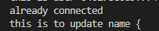

> Meg @megfdev
>
> Do you like suffering? Why not try getting your react form to accept your img file path from the input, send that off to cloudinary to do whatev it needs to do, get that img url back n add that to the post request with the other form data and send that to your DB without an error
>
> https://twitter.com/megfdev/status/1623184981873885193 9:00 PM · Feb 7, 2023

My Reply:
Oh hey! a pain i know all too well :D we're twinsies in suffering! Here's how I bound cloudinary's power to my will in my project


the general code https://github.com/JSMarsh813/PetProfileTailor/blob/adding-edit-and-deletion-capabilities-to-comments-and-names/components/AddingNewData/AddPost.js  
my api https://github.com/JSMarsh813/Pet

> Janet! Sorry just one question but in your controllers on the server side, in your .create() does your object include a key for the image url and the cloudinaryId?

My Reply: For my app, I just stored the url in a variable because its all I needed.
But most people do end up using the public_id from my understanding.
You could have imagefromcloudinary store the entire data object, then take use the keys "url" and "public_id" to take out what you need


---

I finished adding the deletion option for names! And had a 🤯 moment and realized I could easily turn it into a reusable component for all items.

Twitter Post Link: https://twitter.com/Janetthedev/status/1623288655564648448 3:52 AM · Feb 8, 2023

---

I was having a hell of a time updating my data for filtering names. Ex: Category: "Gender" Tags: Unisex, male, female.

So I wanted to split it into 2 collections, a category and a tags collection

So the category populate tags based on their objectID. But no matter how I tried


mongodb REFUSED to work with the individual tags collection. Yet It worked with the user collection easily!
So created a new model and it works🤷‍♀️

maybe since I didn't use a plural name ("NameTag" not "NameTags")?

I had tried every casing w/ the old model so it shouldn't be that


Annnndd after killing and restarting the development server it now doesn't work 😂(smiling face with tears)

why are you like this???

Glad my paranoia paid off I i did this before posting this update on linkedin

It was working again when I briefly switched to the user model, then back to the NameTag model .... but once I killed and restarted the development server its returning {} when populate is run. Aka not working
WELP time to sleep. I'm now more confused than ever (smiling face with tears)


Twitter Post Link: https://twitter.com/Janetthedev/status/1625116999729942528 4:57 AM · Feb 13, 2023

---

🐢fought with my project when I got home, thought we came to a truce. But! alas, mongodb decided to go the ol' julius caesar route, et tu mongodb 🥲
🐢 went to work
🦀 no anki

the last few days at work have been busy, so not much time for much, other than sleeping and working

## Twitter Post Link: https://twitter.com/Janetthedev/status/1625134363645206529 6:06 AM · Feb 13, 2023

Posted this to the 100devs discord, hopefully someone will have an idea why mongoose's populate() is being so funky 🥴

> "Hey everyone o/ happy valentines day! Speaking of valentines, I'll love you forever if you manage to help me solve this annoying mystery ;). Corny jokes aside, I've tried messing with mongoose's populate for hours but I'm having no luck. I'm trying to populate my namecategories collection's TAGS property, with TAGS from my tags collection.

> However, it seems like something must be wrong with the tags collection, because populate works perfectly with my users collection, but returns an empty object when I use my tags collection???

> I Tried:

> 1.  dropping collections for name categories and tags in mongodb and recreating them by creating new apis and new models, and submitting the new data to the api.

> 2.  Dropping the tags collection and trying different names for the tags collection (NameTags, IndividualTags)

> 3.  adjusting wording in the models, ect

> Its so weird that it works perfectly with the users collection but it hates any version of the tags collection I've tried?"


I could return to the old school route of manually typing the tags to the collection in mongodb.

Or create an api which submits a put request to the name categories collection to add tags

But this seems like the most professional solution? And its ALMOST working uggghhh

update in case someone stumbles across this thread later: https://twitter.com/Janetthedev/status/1626464366886518784 (unlikely with twitters algo but juuuust in case)

> REPLY (user deleted their account, but I was replying to something here)

Knew there was something I forgot to mention! I started out by using ref in my schema but it didn't work either.

So I ended up using this as an alternative, since it was easier to switch between the user and tag model for troubleshooting

Thanks though for the suggestion

```
await category.find()
  .populate({path:"tags",
             model: "Tag"})
res.status(200).json(category)

```


Twitter Post Link: https://twitter.com/Janetthedev/status/1625564893570306048

---

I thiiink I figured out the issue with populate! It looks like it might be a nextjs specific bug, I'll mess around with it more tomorrow to confirm then i'll reply to everyone and post about it

In the meantime, HUGE thanks to everyone who passed around my question and offered ideas!

Twitter Post Link: https://twitter.com/Janetthedev/status/1626208623570616320 5:15 AM · Feb 16, 2023

---

slept 12 hours 😂

now time to confirm the fix i found yesterday still works!

eyyy it still works huzzah! Going to explain what happened in a blog post since it'd otherwise turn into hellishly long twitter post thread 😂

Twitter Post Link: https://twitter.com/Janetthedev/status/1626433068792971264 8:07 PM · Feb 16, 2023

---

Victory is mine! Found out why populate wasn't working in next js! 😤

I had to import the model we're using to populate the objectId (nametags in the case)! 🤷

I wrote it out in detail here if you're curious

https://dev.to/janetthedev/using-mongooses-populate-in-nextjs-4jof

---

I started working on descriptions! I've got the models set up and the basic apis

tomorrow I've got some errands to run then I can maybe work on the fetchdescriptions page


Twitter Post Link: https://twitter.com/Janetthedev/status/1626539978149994496 3:12 AM · Feb 17, 2023

---

Huh, I finished the description area in a day 😳?! Wow, All the CRUD features work already? guess I am learning after all😂

welp time to review the to-do list again


fix erros from

1. nametag model ===> renaming nametag to tag

2. category model === name to category

-shares

possibly:

- followers and following

- add tags to existing names

- followers and follwing (will be shown on seperate pages like on twitter)

add comments to names


Okay so next I'll focus on

1. Profile page: adding the descriptions the user has added to their profile page
2. Points system: adding the descriptions likes and added descriptions to the points system
3. Dashboard: adding liked descriptions to the dashboard

done! I suppose the next main things to focus on will be

1. making a single page for each description
2. sharing
   🤔

Twitter Post Link: https://twitter.com/Janetthedev/status/1626864852114325506 12:43 AM · Feb 18, 2023

---

Finished the individual pages for descriptions!

Now that its 4am 🤪time to sleep and get ready for a week of work


Twitter Post Link: https://twitter.com/Janetthedev/status/1626924140274888710 4:38 AM · Feb 18, 2023

---

Huh letting users share links by clicking a button, which automatically copies the link to their clipboard is easier than I thought!

I already had the individual pages set up, so I just had to follow the instructions here!

https://medium.com/nerd-for-tech/how-to-add-copy-to-clipboard-functionality-in-a-reactjs-app-45404413fdb2

<video src="images/2023-02-19-huh-letting-users-share-links.mp4" width="320" height="240" controls></video>

I still have to add a toastify popup that says its copied to clipboard.

And I want the share links section to pop up when the share button is clicked, but good progress for now!

```
{/ * SHARING OPTIONS SCREEN * /}

<section>

  <button
   onClick={()=>{
    navigator.clipboard.writeText(textForShare);
   }}>

    <FontAwesomeIcon
     icon={faLink}
     className="mr-2"/>
          Copy Link

  </button>
</section>
```


```
function BatsignalPost({
    className,
    sessionFromServer,
    post
    / / commentList,
    tagListProp,
})
 let textForShare=`http : / / localhost: 3000/posts/${post._id}
```


Twitter Post Link: https://twitter.com/Janetthedev/status/1627281310212575233 4:17 AM · Feb 19, 2023

---

I did some more work on the shares area!

Ended up not adding facebook messenger since the appID ect process was starting to be a pain, and I don't think it would add much value anyway 🤷‍♀️

Now to make it into a reusable component!

<video src="images/did_some_more_work_on_the_shares.mp4" width="320" height="240" controls></video>

Twitter Post Link: https://twitter.com/Janetthedev/status/1627650479156264965 4:44 AM · Feb 20, 2023

---

Finished the followers/following function today and other edits. man am i wiped but I'm one step closer to finishing the mvp!

<video src="images/finished_the_followers.mp4" width="320" height="240" controls></video>

Twitter Post Link: https://twitter.com/Janetthedev/status/1628733325950214144 4:27 AM · Feb 23, 2023

---

I started to add a function to let a users check if a name exists before trying to add it

But its almost 5am! time to sleep and battle with it again tomorrow😴


Twitter Post Link: https://twitter.com/Janetthedev/status/1628736548668866560 4:40 AM · Feb 23, 2023

---

🐍Did lots of project work, I feel like i'm getting SO close to finishing the mvp! So its hard to take breaks but I know I will need to soon, before I go cross eyed/lost my sanity 🥴

🦀 didn't work out

🦀 didn't do anki/banki

Twitter Post Link: https://twitter.com/Janetthedev/status/1628736974235521025 4:42 AM · Feb 23, 2023

---

Funny how its the small features that end up being a pain 😂
but I'm victorious! The check if a name exists feature now works!

<video src="images/2023-02-23-funny-how-its-the-small.mp4" width="620" controls></video>

Twitter Post Link: https://twitter.com/Janetthedev/status/1628980564744364032 8:50 PM · Feb 23, 2023

---

I figured out how to push object ids into a documents comments array in mongodb!

buuut then I remembered that .populate will fail since some of my name documents arrays will be empty 🥲

So I have to scrap it, well learned something new anyway

```
import db from '../../../../utils/db'
const mongoose = require('mongoose');
import Name from "../../../../models/Names"

export default async function handler(req,res){
  const {method} = req;

  await db.connect();

  if (method ==="PUT"){
    console.log(`this is req body ${JSON.stringify(req.body)}`)

  const {
    commentid,
    nameid
  } = req.body.commentIdToNameDoc

  try {
    const toUpdateName = await Name.findOneAndUpdate(
      {"_id":nameid},
       {$push: {comments: commentid}})
      console.log(toUpdateName)

    await toUpdateName.save();
    await db.disconnect();

    res.send({
      message: 'Comment added to name listing'
    });

  }
  catch(err){
     res.status(500).json(err)
     console.log(err)
  }
  }
}
```


So I'll end up doing the same workaround as I did for the posts page.

So the namelisting will call on an api to fetch all comments with that have its nameid, on rendering (thus the useEffect)

const handleFetchPosts = async () => {
const response = await fetch('http : / / localhost: 3000/api/individualbatsignalcomments/commentscontainingpostid/'+postId)

const data= await response.json()

console.log(data)

setPostsCommentsFromFetch(data)
}

useEffect(()=>{
handleFetchPosts();
})


sweet so the fetch in each component is working, now I just have to map through them and display them


Alright so now each one shows!

Phew that's enough for tonight. Later I'll just need to make it possible for users to reply to the comment for the name, like I did for posts, and it'll be done


> REPLY mattie.eth @EthMattie

> You should consider using a code formatter. There is a vscode extension called prettier which will format your code and give consistent style and spacing.

Thanks mattie! Its funny I've heard of prettier in passing but for some reason I thought it was more involved to implement? I was surprised how easy it looks to get set up

You've saved me a ton of time going through and cleaning up my code's formatting manually, thank you!

Twitter Post Link: https://twitter.com/Janetthedev/status/1629084793077108737 3:44 AM · Feb 24, 2023

---

Update on my progress so far! If my job & the code is nice to me, with any luck I might release the 1st version in ~2 weeks!

After that, I'll probably wait until I've done most of the "future" features before sharing with the animal welfare community (maddie's pet forum ect)

Leftover Tasks

1. Finishing comment feature for names

2. Improve validation (description can include only so many letters, so no clowns can upload the bee movie script ect :P)

3. Checking if things are working, minor changes such as text sizes ect

4. Fix nav/clean up code

5. Move everything to a clean database

6. Host on render

FUTURE

1. SWR/pagination

2. add comments to descriptions

3. Notification feature

4. Advanced name search (begins with, contains, ends with)

5. Advanced description search (begins with, contains, ends with)

6. Advanced user search (begins with, contains, ends with)

7. Messaging feature, probably with socket io

8. Add inspiration section (users can share adoption listing examples they found or came up with, that they thought were cool)

Potential Future ideas:

1. Add giphy api/gifs support

2. Adoption campaign ideas section? It technically already exists in the community section but if it suprisingly becomes big enough, I could give it its own section

3. Add a "cookies" feature, where users can send virtual cookies as a special thank you. For example, if a user used a specific name they can send the user that created that description a cookie.

4. how to get involved and or/other tips. Example: explaining what goes on with fostering. Letting users find shelters with unique programs like doggydayout programs (can take specific shelter pets out in the community, to help them get adopted)

5. helpful sites/resources

Twitter Post Link: https://twitter.com/Janetthedev/status/1629101162556440581 4:49 AM · Feb 24, 2023

---

My sites officially big enough now, that my video of clicking through everything quickly is still too long to post on twitter in one vid 😂

Not how I planned to measure my progress but I'll take it!

Twitter Post Link: https://twitter.com/Janetthedev/status/1629111664477106176 5:31 AM · Feb 24, 2023

---

🐍some anki at work, slooowly catching back up!

🐍 some more project work, I realized I have to adjust my models property names so I can reuse some components. They're basically the same but /one/ property is named slightly differently so its screwing up the components ugh

Twitter Post Link: https://twitter.com/Janetthedev/status/1629503290034778112 7:27 AM · Feb 25, 2023

---

🥲 Lost 2nd/anki break again but on the flip side, i'll probably get killer tips

🐸did some more project when I got home, the comment section seems to be fixed! 🎊Just scared to say its fixed in case the code hears me and decides to mess up again :P

🐸went to gym before work

Twitter Post Link https://twitter.com/Janetthedev/status/1630176312433463298 4:01 AM · Feb 27, 2023

---

Slept for a bit then:

🐸 added maxlength for various input fields, so users can't submit the bee movie script, ect :P

🐸 fixed the pages for viewing a single comment from posts, and a single comment from names

🐸users now can't submit descriptions if it already exists🥳

Twitter Post Link: https://twitter.com/Janetthedev/status/1630644282192437249 11:01 AM · Feb 28, 2023

---

Thanks sephiroth for helping me test out some validation!

no army of sephiroth mimics in this database, there can only be one (sorry @ kadaj, Loz, and Yazoo)


Twitter Post Link: https://twitter.com/Janetthedev/status/1630669601498624000 12:41 PM · Feb 28, 2023

---

Users can now check if a profile name exists!🥳

<video src="images/03-01-2023-users-can-now-check.mp4" width="520" controls></video>

Twitter Post Link: https://twitter.com/Janetthedev/status/1631084438229757952 4:10 PM · Mar 1, 2023

---

🐊did some anki while picking up groceries

🐊worked on the project, buttons are now all in the BUTTON folder, ect. Sadly VSC is glitchy with updating the routes, so I had to manually update most of the paths, ugh

🐻keep falling asleep, body how about we not be a bear 😂?

getting close! What's left:

1. fix nav

2. clean up code (basically getting rid of console.logs)

3. move everything to a clean database

4. make sure things work

5. host on render

Twitter Post Link: https://twitter.com/Janetthedev/status/1631224685492080640 1:27 AM · Mar 2, 2023

---

Prettiers pretty simple to set up but I liked the little snippets he mentioned here https://youtube.com/watch?v=DqfQ4DPnRqI&ab_channel=WebDevSimplified

SO grateful for prettier, it would of been a nightmare to manually go through and clean up the formatting

Twitter Post Link: https://twitter.com/Janetthedev/status/1631225524130291713 1:30 AM · Mar 2, 2023

---

switching to a new database was easy as I hoped! 😁

So now I'm making the official categories and tags. I tried to condense things into as few categories while also not adding too many tags to any one category


I ended up spoiling myself by creating a page just for me, where I can create a name tag, and then add it to several categories, that way I don't have to copy and paste ids manually!


I'm still torn on whether to eventually allow for users to access this page, if they have very high levels of points and opt into it.

But eh, I'm not expecting this site to go viral or anything so telling myself to put that off for maybe the future

Twitter Post Link: https://twitter.com/Janetthedev/status/1631607836097789953 2:49 AM · Mar 3, 2023

---

I finished the name categories and name tags!😤🔥 one step closer!

now to do the same for the descriptions, and then its time to deploy and test everything again 😁

<video src="images/finished_the_name_categories.mp4" width="720"  controls></video>

Twitter Post Link: https://twitter.com/Janetthedev/status/1631653284170842119 5:50 AM · Mar 3, 2023

---

Fixed a thing!

My text was coming back correctly with its formatting information (/n) but it wasn't showing in the browser.

After a decent amount of googling (it was weirdly hard to find the right words!), I figured out it was a html thing and was able to fix it w/ tailwindcss


Heres some of the links that helped me figure out how to handle getting the /n formatting to show ! https://stackoverflow.com/questions/29608841/how-do-i-store-display-paragraphs-with-mongodb

Twitter Post Link: https://twitter.com/Janetthedev/status/1632383852491702272 6:13 AM · Mar 5, 2023

---

Moved the edit/delete buttons around to things mesh better. Figured I'd rather have them arranged like a spaced out triangle, so its a little harder to accidentally click on the wrong button.


changed the text to be a slightly more subtle yellow, so hopefully it looks sliiiightly better


Twitter Post Link: https://twitter.com/Janetthedev/status/1632387814049587206 6:29 AM · Mar 5, 2023

---

🐸did some project work when I got home, ended up deciding to redo the layout for descriptions since I'm going to allow longer descriptions
I'm soooo close to finishing the 1st version of the site, I wish I had more time to work on it uuuggh 🥲
🌶️no anki/banki

Twitter Post Link: https://twitter.com/Janetthedev/status/1632390735092928512 6:40 AM · Mar 5, 2023

---

🐊Worked (got my 2nd break/anki time today! huzzah)
🐊did a TINY bit of project work (just changing the visuals a little bit). Alas, as much as I want to work on it more I've got to sleep 🥲


Did another small visual adjustment, was a bit of a pain to get the flex to do exactly what I wanted. But I was victorious in the end! 🔥


Twitter Post Link: https://twitter.com/Janetthedev/status/1632693995875995649 2:45 AM · Mar 6, 2023

---

🐸did anki during work breaks today and yesterday
🐸did a little bit of project work before going into work at 8pm

Twitter Post Link: https://twitter.com/Janetthedev/status/1633463441003511812 5:43 AM · Mar 8, 2023

---

Finished with the description tags!

But now i'm going back and adding a "related names" section for descriptions, so users can easily find descriptions that are tailored to specific names

https://twitter.com/Janetthedev/status/1633733753301512192 11:37 PM · Mar 8, 2023

---

Did more project work! Decided instead of saving the tag directly ex: "dog". I'm saving the tag ids to the listings, and then using a populate to get all the information.

This way if the tags change, the filter option will still work, since the tags will update automatically


Twitter Post Link: https://twitter.com/Janetthedev/status/1633818776260218883 5:15 AM · Mar 9, 2023

---

🐸Did more project work (slowly, very slowly inching closer) 🐌
🐸Played a little bit of ff14
🌶️no anki
🐸caught up on sleep

tomorrow:
💫fix name/description listing deletion
💫fix description edit button
💫take the inspiration menu option off the nav, since I combined that idea with the description section
💫play some ff14
❓ gym/walk on treadmill?

Twitter Post Link: https://twitter.com/Janetthedev/status/1633819699975954433 5:19 AM · Mar 9, 2023

---

Got it mostly working on vercel! However when I try to load the dashboard page and profile page I'm getting this error 🤔

https://github.com/JSMarsh813/PetProfileTailor/blob/main/pages/dashboard.js
https://nextjs.org/docs/messages/client-side-exception-occurred

I'll fight with it tomorrow


uh the profile page is working now suddenly? still no luck with the dashboard though hmmm

or it was working, went i went back to it again, the profile page flashes and then that error message appears (smiling face with a tear)😂

even though getServerSideProps is working fine on other pages, I have a feeling this is because I was naughty and basically calling the internal api 🙈

Tomorrow I'll copy over the parts of the api i need, like the documentation says to, and see if it likes that better

Twitter Post Link: https://twitter.com/Janetthedev/status/1634173205991813126 4:43 AM · Mar 10, 2023

---

Slowly but surely making progress on debugging my next.js app!🫠
Moved the api logic into the getServerSideProps and oddly, I have to use JSON.Parse(JSON.Stringify()) to get the prop to pass correctly

Found the perfect thread for my issue
https://stackoverflow.com/questions/72176573/object-object-object-cannot-be-serialized-as-json-please-only-return-js

> REPLY
>
> Joe Prisk @jeprisk
>
> object Object might be getting logged because console.log returns a string value, you could try console.log(JSON.stringify(data)) to see the full payload

Thanks Joe for taking the time to offer some help!

My bad I should of clarified the bit of the question I was looking at was for the returned props, not the console.log. I need to use JSON.parse(JSON.stringify()) for it to be passed correctly, otherwise I get a client error.

Twitter Post Link https://twitter.com/Janetthedev/status/1634401162161197056 7:49 PM · Mar 10, 2023

---

🐸Moved most of the api logic into getserverside props
🐸 managed to replace most imgs with Next Image...and now i understand why so many people hate next image (for 12 not 13) 😭
🐸 added more alt tags
🐸 deleted used variables, notes ect

almost done (for the mvp version anyway) 🫠!
Need to:
💫fix a few errors
💫change the related name input for descriptions, so the user can enter any names rather than selecting from existing names. It works for now, but grabbing a list of EVERY name would be unweildly eventually

I'm thinking about removing the repeating image banners, but I'm not sure yet 🤔


This image is misbehaving juuuust a wee bit 😂Its grown to powerful with the power of next image!

ngl i cackled coming across this ridiculous error

<video src="images/moved_most_of_the_api.mp4" width="320" height="240" controls></video>

Rejoice! the dino gif has been contained already, it was a nice escape attempt though I got to admit 😉


Twitter Post Link https://twitter.com/Janetthedev/status/1634556497287086082 6:06 AM · Mar 11, 2023

---

Hoping to borrow some of your big brains!

For the headers do you think it'd be better to

1. keep the repeating images
2. replace all header images with the one used in the dashboard
3. leave it blank
   🤔


Here's a poll for those who prefer them:

Keep the repeating image (0%)
use the dashboard image (72.7%)
leave it blank (27.3%)

> REPLY
> Jeremiah @acesupmedia
> Leaving it blank may look nice and also make it easier for testing responsiveness on different screen sizes ☺️

Very good point! And thanks Jeremiah taking a look and giving feedback, I might leave it blank for a few pages 😁

> REPLY
> Adam Morsa🏕 @RamblingAdam
> Dashboard image 100%!

Thanks adam for taking a look, super appreciate it! Looks like the dashboard image is the winner 🔥🔥🔥😁

Thanks everyone for the feedback! You'll all appreciated ❤️ looks like the dashboard image wins!

Twitter Post Link: https://twitter.com/Janetthedev/status/1634567376040787968 6:50 AM · Mar 11, 2023

---

🐢fixed share links so they no longer use localhost but instead grab the correct url from the env
🐢fixed next image issues
🐢improved filtering, so it doesn't flash at the user. Ended up being a dead simple fix that hit me as a random epiphany while showering
🐢changed headers!


Main pages have the same background image (thanks everyone who commented on the poll earlier for this!)

Pages for one specific item (ex: one name) I've decided to get rid of the header for

💫test everything to double check if everythings working, especially as a signed out user
💫 considering adding swr to the mvp, I was going to wait to implement it until later, but it really bugs me to not have this set up

Twitter Post Link: https://twitter.com/Janetthedev/status/1634953439758389249 9:24 AM · Mar 12, 2023

---

🐢fixed share links so they no longer use localhost but instead grab the correct url from the env
🐢fixed next image issues
🐢improved filtering, so it doesn't flash at the user. Ended up being a dead simple fix that hit me as a random epiphany while showering
🐢changed headers!


Main pages have the same background image (thanks everyone who commented on the poll earlier for this!)

Pages for one specific item (ex: one name) I've decided to get rid of the header for

💫test everything to double check if everythings working, especially as a signed out user
💫 considering adding swr to the mvp, I was going to wait to implement it until later, but it really bugs me to not have this set up

Twitter Post Link: https://twitter.com/Janetthedev/status/1634953439758389249 9:24 AM · Mar 12, 2023

---

Think I may of turned into a bear for real, these two days off i've basically just been sleeping! aka waking up for a few hours, and then sleeping again.

Don't think i've ever slept this much, fam was checking on me to make sure i was alive


Twitter Post Link: https://twitter.com/Janetthedev/status/1636649948510048256 1:45 AM · Mar 17, 2023

---

Almost have swr to work but its being stubborn, I'm following the doc example but i'm confused why its loading all the names instead of just 10 at a time 😅ugggh so close!

Twitter Post Link: https://twitter.com/Janetthedev/status/1636768832068161537 9:37 AM · Mar 17, 2023

---

Couldn't get it to work with a true infinite scroll (aka grabs 10 more pieces of data when you scroll down). But I've got it to work with a load more button and it plays nicely with my filtering, after lots of fine tuning! 🎊

Though now it doesn't automatically show new data 🙃

So I figured out I can revalidate/mutate the data when the user clicks, so they'll get any new data without having to refresh the page.

Although I'd be nice to automatically have new names pop up, I worry having mutate run constantly would be too resource intensive 🤔


Twitter Post Link: https://twitter.com/Janetthedev/status/1637111512778309637 8:19 AM · Mar 18, 2023

REPLY

> Adam Morsa https://twitter.com/RamblingAdam
>
> If your mutate function is running too often, you could either throttle its execution, or debounce it!
>
> This article is discusses functions that run on window resize, but you could definitely adapt the technique for your purposes!

---

Thinking about making it so users can personalize how many names ect they want to show on each page.

And they can give a page number, so they can jump back and forth through their filtered list 🤔

Twitter Post Link: https://twitter.com/Janetthedev/status/1637137770035679232 10:03 AM · Mar 18, 2023

---

Been squeezing in tiny bits of code here and there, since i've been extra tired from getting that bread/working 😪

But I made some progress on pagination! I had to make it from scratch because of my apps filtering system & because I didn't want to overtax my free mongo account🎊

<video src="images/been_squeezing_in_tiny.mp4" width="320" height="240" controls></video>

Ideally I would of liked to make a "real" pagination, where we know exactly how many items match the filters/know how many pages there are. Aka, filtered on mongodbs side before starting swr/grabbing the data in bunches.

But that would require users submitting a new mongodb request EVERY time they change their filters.
So instead, users will get the data from mongodb, and the page numbers will increase the further along they go, until the server tells us "I got nothing!". Filtering is done client side, to avoid extra requests

Going to move the pagination logic into a component, then add it to the bottom as well so the user won't have to scroll alllll the way back up

Then its time to add the pagination && swr to the description listings and community areas of the site

Twitter Post Link: https://twitter.com/Janetthedev/status/1638266915868254208 12:50 PM · Mar 21, 2023

---

Pagination is now in its own cozy and private component. Its also now on the top and the bottom 🥳
Progress!

Now time to roll back into bed for a before-work nap 😴

<video src="images/pagination_is_now_in.mp4" width="320" height="240" controls></video>

> REPLY
> Adam Morsa🏕 @RamblingAdam
> Custom pagination! Super cool. Good way to limit Mongo traffic. Nice work Janet!

Thanks adam means a lot coming from you! my fellow 300+ hour long "100 project" friend😉

---

I was going to sleep but then noticed huntober standup going on 👀its been months since I was able to catch one! I've missed hearing leons voice so much and seeing the community hyping out in chat!

Also ended up working on pagination more, cause I just can't stop myself 😂

<video src="images/i_was_going_to_sleep.mp4" width="320" height="240" controls></video>

Twitter Post Link: https://twitter.com/Janetthedev/status/1638291369717547009 2:27 PM · Mar 21, 2023

---

alright time for bed for real this time!

But looks like all thats left for the project is:

- adding pagination and swr to the community section && description
- bug hunting!/testing

Twitter Post Link: https://twitter.com/Janetthedev/status/1638311276068888580 3:47 PM · Mar 21, 2023

---

Finally fixed the bug that made me want to punt my code off a cliff!

The width wasn't being respected (see how the div with the white border respects it, but the one in red doesn't)

The reason? a very long "word" from a hyperlink!
Fixed it by telling it to break-all

<video src="images/finally_fixed_the_bug.mp4" width="320" height="240" controls></video>

Twitter Post Link: https://twitter.com/Janetthedev/status/1638858527568719873 4:01 AM · Mar 23, 2023

---

Managed to find a way to make this image bow to the users' will! aka found a way to make a Next JS image to be responsive

<video src="images/managed_to_find_a.mp4" width="320" height="240" controls></video>

Twitter Post Link: https://twitter.com/Janetthedev/status/1638930568795815939 8:47 AM · Mar 23, 2023

---

Wow, it doesn't feel real to say but, swr and pagination is done for the main pages!
Eventually I'll want to add it to the profile pages/ect but got to leave some things to future me haha

<video src="images/wow_it_doesnt_feel_real.mp4" width="320" height="240" controls></video>

Now its just a matter of checking for bugs and deleting the dummy data from the database 🥳

Twitter Post Link: https://twitter.com/Janetthedev/status/1638932784155869187 8:56 AM · Mar 23, 2023

---

youtube.com/watch?v=qkdyum3L-kg&ab_channel=SanjayTechNPet Not me seeing how short this is and being tempted to add chatgpt to petProfileTailor😂

that way if the user submitted names and descriptions aren't cutting it, they can use it as a backup.

But! no, saving that for the maybe future


Twitter Post Link: https://twitter.com/Janetthedev/status/1638942533408673792 9:35 AM · Mar 23, 2023

---

Alas! Figures deployment wouldn't go without some hitches 🥲 not sure why its giving me 500 when it works perfectly in the dev build?

and its showing me the message that pops up when the swr api file has been found...so its managed to get inside the right file?

<video src="images/alas_figures_deployment.mp4" width="320" height="240" controls></video>

this is such a weird error to me... running the dev and build locally work fine? But when deployed, i'll see all the data load and then woosh, theres 500 and client side errors?


the error isn't with swr infinite, since the error returned undefined.

Mongodb access is for all IPs (0.00 ect). Also its accessing the correct api file, since it shows the console.log at the start of the doc

not sure why the deployed version keeps getting 500 errors?? 🥴

removed everything besides logging the various forms of the data

weird that its getting nothing back when in production mode 🤔triple checked my env variable and its correct with what i have in vercel...


okay phew looks like i'm not insane! for some reason the production mode doesn't like the populates? (why is it always populate 😂)


My life as a dev in a nutshell 😂


Alright, trying to add one of the populates back. Added the model it needs to find at the top, in case we're running into THAT issue again 🙄


flashed as undefined for a second but then figured itself out, time to add the second populate back


IT WAS POPULATE! Ugghhhh, my nemesis returns.

I had to add the models populate will use, since .populate() is a dumb little gremlin that is easily lost 🙃


Twitter Post Link: https://twitter.com/Janetthedev/status/1638984856574230528 10:42 AM · Mar 23, 2023

---

alright now that the populate bug is defeated (again 🙃), time to sleep then hunt for some bugs && clear out the dummy data!

Twitter Post Link: https://twitter.com/Janetthedev/status/1638986900278226944 12:31 PM · Mar 23, 2023

---

Ended up adding sorting, because why not be an overachiever! 😂

sadly sorting by likes/popularity looks like it'd be more complicated than just comparing the likedby property lengths, so alas maybe one day.

<video src="images/ended_up_adding_sorting.mp4" width="320" height="240" controls></video>

> Reply
> User was deleted

Swr complicates things sadly `:(`
I get chunks of data at a time (because of swr) so it would have to be sorted on mongodb's end so i'm grabbing the most popular posts firsts.
Looks like aggregation would work but eh saving that for later. Thanks though for the thought!

Twitter Post Link: https://twitter.com/Janetthedev/status/1639096488394641408 7:47 PM · Mar 23, 2023

---

Felt like i was going a bit crosseyed by the end of it, but now users can sort by the most and least popular posts!

Thanks to the power of mongodb's aggregration 🥳
now to have a celebratory nap for 2 hours before work

<video src="images/felt_like_i_was_going_a_bit.mp4" width="320" height="240" controls></video>

surprisingly aggregation wasn't too difficult despite lots of troubleshooting.

Found out the hard way you can't pass an object to sort like this =>
let sortObject = {"\_id": -1}
{ $sort: sortObject },

Instead you have to:
let sortObject= {};
sortObject["_id"] = -1🥴


Twitter Post Link: https://twitter.com/Janetthedev/status/1639367607643176960 1:44 PM · Mar 24, 2023

---

Wild how much a few seconds (milliseconds) can change

Although my names page worked locally, when deployed to vercel I kept getting 504 errors (took too long for the api respond)
SO! I found out the hobby plan vercel will give up and send a 504 if your api is taking too long

So I ended up changing some logic around, and it now FINALLY works on vercel 🥳

Sorting value and property was split on the client side, before being sent to the api

parseInt was added within the aggregation


now to add to add the new sorting options to description!

or actually wait, realized i only have 3 hours to try to nap before work 😅

well good luck to tomorrow me!

Twitter Post Link: https://twitter.com/Janetthedev/status/1639702046915063808 11:53 AM · Mar 25, 2023

---

I had wondered why swr was throwing 500 errors for the descriptions page, then I realized my butterfingers accidentally deleted a part of the query string! That'll do it 😂

But its working now!


Twitter Post Link: https://twitter.com/Janetthedev/status/1640078702280318976 12:50 PM · Mar 26, 2023

---

Community section also uses aggregate sorting now!

ngl feel accomplished because my brain feels like fluff right now 🥴luckily any problems i faced were minor, no way I could of thought through anything major rn

welp time for a nap before work

<video src="images/community_section_also_uses.mp4" width="320" height="240" controls></video>

https://twitter.com/Janetthedev/status/1640082816112402432 1:06 PM · Mar 26, 2023

---

Take that forcedReload whenever an item is edited or deleted! now with the power of swr, I can call mutate() and it'll automatically refresh and show the user the updated data!


Funny how the little things in life get so exciting!
I was laying in bed on the edge of sleep last night and mentally went !!! when I realized i could FINALLY get rid of that clunky forceReload 🥳

Twitter Post Link: https://twitter.com/Janetthedev/status/1640297986268991489 3:20 AM · Mar 27, 2023

---

next share can be great. But even though a press on the enter key correctly sends the user to the right app (email, reddit, ect) its DETERMINED to not show the focus ring

But fear not I managed to make next-share behave with tailwindcss' focus-within option! 😤

<video src="images/next_share_can_be_great.mp4" width="320" height="240" controls></video>

Twitter Post Link: https://twitter.com/Janetthedev/status/1640641300994355201 2:05 AM · Mar 28, 2023

---

me: at the stage to just test bugs

also me: decides I should give users the option to add an alt tag when uploading an image for a post

one of these days i'll stop thinking of "little improvements" and just debug

It has begun! Alas going to need to sleep soon 😴


Twitter Post Link: https://twitter.com/Janetthedev/status/1640650819333935104 2:43 AM · Mar 28, 2023

---

🍈worked
🍈did a tiny bit of project work, tomorrow I'm going to edit the email sign in process. Instead of using sendgrid smtp i'm going to switch the web api
🍅no anki

Twitter Post Link: https://twitter.com/Janetthedev/status/1641075135989022720 6:49 AM · Mar 29, 2023

---

Well thats annoying, next auth pushes us to use smtp so I'll probably have to keep that.

BUT even though the smtp sendgrid magic email link works in production, vercels determined to say "the e-mail could not be sent" 🫠


This seemed promising!
https://vercel.com/guides/can-i-get-a-fixed-ip-address
turns out vercel can't used a fix IP address. So I added 0.0.0.0 to sendgrid's allowed ips

no dice 😔

alright so found the actual error message in vercel 🧐

```[next-auth][error][SIGNIN_EMAIL_ERROR]
https://next-auth.js.org/errors#signin_email_error Invalid login: 535 Authentication failed: The provided authorization grant is invalid, expired, or revoked {
 error: {
   message: 'Invalid login: 535 Authentication failed: The provided authorization grant is invalid, expired, or revoked',
   stack: 'Error: Invalid login: 535 Authentication failed: The provided authorization grant is invalid, expired, or revoked\n' +
     '    at SMTPConnection._formatError (/var/task/node_modules/nodemailer/lib/smtp-connection/index.js:790:19)\n' +
     '    at SMTPConnection._actionAUTHComplete (/var/task/node_modules/nodemailer/lib/smtp-connection/index.js:1542:34)\n' +
     '    at SMTPConnection.<anonymous> (/var/task/node_modules/nodemailer/lib/smtp-connection/index.js:546:26)\n' +
     '    at SMTPConnection._processResponse (/var/task/node_modules/nodemailer/lib/smtp-connection/index.js:953:20)\n' +
     '    at SMTPConnection._onData (/var/task/ .....
     )
 }
```


weird, the database is showing the verification token is created? So thats not the problem

Seems like somehow theres an error with the email?


this gave me pause to double check my form

https://github.com/nextauthjs/next-auth/discussions/4990

and what do you know, it WAS my form. I forgot to set the buttons type to submit! 😂

why where you working locally then friend?!? WELP at least the button has been purified and plays nicely with vercel now


Today I committed the cardinal sin of forgetting to put a type on a button. Unforgivable!

may the world one day forgive me like vercel has 😔


Twitter Post Link: https://twitter.com/Janetthedev/status/1641191719583776769 2:32 PM · Mar 29, 2023

---

It was a journey of many, many small steps forwards and back. But! victory is mine!😤

I ended up being an overachiever again (suprise suprise). And I really, really wanted to figure out how to personalize the magic login link with next auth & add an image to the email

<video src="images/it_was_a_journey.mp4" width="320" height="240" controls></video>

path.join(process.cwd()) was especially a lil' fun bug to figure out and squish!
I figured out process.cwd but vercel also required path.join() to work
three cheers for googling skills && gratitude for those many helpful threads

https://nextjs.org/docs/api-reference/data-fetching/get-static-props#reading-files-use-processcwd
https://vercel.com/guides/how-can-i-use-files-in-serverless-functions

One thing that was a bummer is I was hoping to make two buttons

Button 1. signs user in and sends them to dashboard
Button 2. signs user in and redirects to the settings page

seems that next auth only likes one callback for magic links though?

Thought of a workaround but its unweildly and ehh, i really need to get other stuff done 😂

Could of added a Boolean "wantsToResetPassword" property to the user objects in mongo. When the user clicks the forgot password button, it would send a put request.

when the magic link spits them out @ login.Then look at session.user.resetPassword...if false ==> redirect to dashboard. if true, send to settings

When the user goes to the settings page, check if session.user.resetPassword is true. If it is send a put request to change it to false

so. it'd be a lot of tedious code, AND I feel like it should be possible to do this more simply. So in the end I'd be tossing out all that code anyway

but eh as cumbersome as it feels to tell them how to manually reset their password, it works for now 🤷‍♀️


thought i was going to get ready for sleep, but ended up adding one more image! 😂

In the animal welfare industry, some users aren't tech literate. So i want to make the experience as painless as possible for them.


Twitter Post Link: https://twitter.com/Janetthedev/status/1641349466711281665 12:59 AM · Mar 30, 2023

---

so tomorrow should HOPEFULLY be the day i finish the last bits

mostly fixing some wonky width/margin properties on mobile

pray for me that no other feature occurs to me 😂

Twitter Post Link: https://twitter.com/Janetthedev/status/1641363162862882816 1:54 AM · Mar 30, 2023

---

Got lucky today that i was juuuust under the 100 maximum email requests from sendgrid :P.

Nothing like a good ol' debugging/developing party


Twitter Post Link: https://twitter.com/Janetthedev/status/1641371280917299201 2:26 AM · Mar 30, 2023

---

Even though your first instinct can be to look at the wonky element, usually its because another element later on is stubbornly demanding it be bigger than the screen width allows!

the problem child here was the filtering area demanding that it wanted to be 80px. Not perfect


but close enough for my needs. Especially since that sliver only shows on super small mobile screens

I made it so the pages where tags and categories can be submitted are currently only submittable for me (my user id)

sooooomething terrible happened on the register page 😂 that image is supposed to be the size of a chicken not a t-rex!


I realized i had converted it to a NextImage component from an img but hadn't checked on it 🙄ugh

<Image> my nemesis. Luckily flex continues to be my best bro!


Twitter Post Link: https://twitter.com/Janetthedev/status/1641702978582380545 12:24 AM · Mar 31, 2023

---

So, I was getting a client side error sometimes on the community page.
But luckily I'm familiar with this tantrum! It was because these smaller apis still use populate, which needs the user model imported (its greyed out but trust me, its an extremely annoying bug with populate)


Twitter Post Link: https://twitter.com/Janetthedev/status/1641713303255941120 1:05 AM · Mar 31, 2023

---

so far most things are working but I discovered a tricky little problem! The blank space wasn't escaped as %20, so the twitter share link broke
hmm 🤔


twitters share link works properly now! just had to break out my good ol' friend split and join


Error messages for uses who aren't logged in are showing propertly!

Though I realized I wanted to change the buttons text to "close" when the new post form is opened


fixed! now the button shows as cancel when the add comment form shows


Fixed this so both cancel buttons will close the post form!

Had to pass a state update down as a function ect


Twitter Post Link: https://twitter.com/Janetthedev/status/1641714938988359680 1:11 AM · Mar 31, 2023

---

Fixed a small bit of code that was keeping not-signed-in users from viewing profiles.

Fixed the mage that appears when followers/following is empty 🥳

<video src="images/fixed_a_small_bit_of_code.mp4" width="320" height="240" controls></video>

Twitter Post Link: https://twitter.com/Janetthedev/status/1641892584682561537 12:57 PM · Mar 31, 2023

---

Huh weirdly though it works fine locally, the likes button is acting weird in builds

in builds, you can click the likes heart. but if you click a second you get this error. If you click a third time, it works like it should of on that second click?
"new connection" 🤔strange




So turns out, i'm a 🤡! i was TELLING it to disconnect. And turns out disconnect only works in production builds, thus the problem only appearing on builds

Got rid of that and the likes button works with npm run build && vercel


Twitter Post Link: https://twitter.com/Janetthedev/status/1641907144395202560 1:55 PM · Mar 31, 2023

---

Fixed another width problem! This time it was the nav bar 🙈

But its nothing "hidden && sm:block" won't fix!

(hidden in tailwind is short for display:none in css. So the logo is hidden until it reaches a small screen width)

<video src="images/fixed_another_width_problem.mp4" width="320" height="240" controls></video>

Twitter Post Link: https://twitter.com/Janetthedev/status/1642296941047599104 3:44 PM · Apr 1, 2023

---

Fixed a few issues!
Adding a comment lead to a 500 error, looked in the code and noticed there was a db.disconnect 🤦‍♀️removing that fixed it.

Realized the like, share and comment button we're accessible so i fixed that with tabindex="0". It looks a bit odd when focused on but eh

Twitter Post Link: https://twitter.com/Janetthedev/status/1642775602695643136 11:26 PM · Apr 2, 2023

---

🦠trying to mostly chill as my body fights covid 😤
🦠played ff14 for the first time in a long while
🦠caught some accessibility issues and database issues, issues seem to be fixed!

Twitter Post Link: https://twitter.com/Janetthedev/status/1642832141628342279 3:11 AM · Apr 3, 2023

---

Nothing like making changes to your local file and getting annoyed/wondering why it isn't showing on the live site 😂took me a minute to realize 🙈

Covid brain is real!

Twitter Post Link: https://twitter.com/Janetthedev/status/1643132105088696321 11:03 PM · Apr 3, 2023

---

made a few small changes, like saying if the error response code is 409 directly tell the user that the name already exists, versus the general error message


Twitter Post Link: https://twitter.com/Janetthedev/status/1643284064835891201 9:07 AM · Apr 4, 2023

---

Still working out a few bugs but if anyones dying to poke around here ya go! https://pet-profile-tailor.vercel.app

dummy account if anyone wants to use it instead:
email: test@ gmail.com
pass: testtest

Feel free to poke around but please don't change the email (in settings) because other users need that email to sign in

No biggie I can change it back if you make a goof though

> REPLY
> Adam Morsa🏕 @RamblingAdam
> I'm getting an error code 500 when I try to make an account 😿

noooo curses, luckily I was able to catch it in the vercel logs! It seems to be related to mongodb & nextauth, so i changed around the db file.

If you have time, give it another shot?

I need more devices to test with, 3 isn't enough! Running fine here but I don't trust it 😂

> REPLY
> Adam Morsa🏕 @RamblingAdam
> Success!
> 

this is EVERYTHING i hoped for in a name with a description! A cute little summary as well as some helpful life tips to help them along their way 10/10 hamster squeaks! 😂

Seriously, words can't do justice to how much this made me laugh. Excellent work friend!

> REPLY
> Adam Morsa🏕 @RamblingAdam
> Yay!🐹🤣
>
> Notes:
> -Profile page is a 404 (you're prolly still building it)
> -The /dashboard route, if not logged in, returns a 500 if not logged in.
> -Related: Any /_randomtext_ route returns 404. Recommend setting up redirects to the main page if an unknown route is plugged in

Alright so I figured out what happened there! I was a goof and forgot to make it so profilenames are always lowercase! so when the url changed it to lowercase, it could never match the capitalization in the profilename! Should be fixed now 🙏🙇‍♀️

ah! Good idea about the redirect

Turns out next js has custom 500 & 404 pages, so I was able to create customized pages that still have a working nav bar, so users can easily escape the error messages!🥳

You're a real one! Seriously, thanks a mill for testing, the notes and ideas. You're a huge, huge help💕

> REPLY
> Khanh Tran 🌈 @khanhtncva
> I love the name "Bilbo Waggins", Janet! 😍
>
> By the way, just for your info, there's a 500 error.

hehe thanks! I must admit i shamelessly stole it, its such a fun name!

Boo @ mongodb/mongoose for being a brat, thanks for the heads up! Weirdly that particular error says its connected but mongo says it isn't? But I realized I didn't have an await, so hopefully thats it 🤷‍♀️


> REPLY
> ⚡️Shah⚡️@Shahx95
> I get a 500 Internal Server Error when i click on the link 😶

huh first time I saw an error for the landing page, but found it in the vercel logs!

Looks to be related to mongodb, so I changed the db file a bit. If you have some free time can you give it another shot?

I need more than 3 devices, its working fine here but I don't trust it😂

> REPLY
> ⚡️Shah⚡️@Shahx95
> i was able to login! yay! 😸😸

> REPLY
> ⚡️Shah⚡️@Shahx95
> When attempting to set my username (not previously set due to the magic link), I get a 500 error. And when attempting to add a description, it seems to continue forever. Probably because of no username.😄

ah! It feels silly it didn't even occur to me it would try to create a new user if the email didn't already exist/ was already registered versus just throwing an error! Thanks

Edited your profile in mongo so you have all the basic info/username ect now, thanks for your patience!

> REPLY
> ⚡️Shah⚡️@Shahx95
> Thanks for the vip access. 😆😸

> Reply
> Jason Jugo @HondaCivicChan
> 

GLORIOUS! I am honored to have such a 11/10 name in the database and you are so right about that.

Honda really aught to be a name of a husky, whoosh there it gooooes


> Reply
> Jason Jugo @HondaCivicChan
> Haha so far the app is awesome! Works well on my end and I can see all the hard work you put in to it! 🔥

Twitter Post Link: https://twitter.com/Janetthedev/status/1644477741079887872 4:10 PM · Apr 7, 2023

---

🥝did banki for the first time in a long time!
🥝bit of project bug testing
🥝meditated
🥝played some ff14, read some omniscient reader on webtoon
🥝and most importantly gave ember some pets😜


Twitter Post Link: https://twitter.com/Janetthedev/status/1644612699962359809 1:06 AM · Apr 8, 2023

---

Alright my first experience of working around existing users!

I discovered a bug where the profile link was using the user's name, instead of profilename🤦

I added profilename to session, but users who have an old session don't have it, so their nav bar freaks out and fails. So


So i made it so the profile link only shows on the nav bar, if session.user.profilename exists! This way they can still logout if they have an old session

Twitter Post Link: https://twitter.com/Janetthedev/status/1645054342821732356 6:21 AM · Apr 9, 2023

---

alright so the error logs I got earlier was basically this and the core issue between them seems to be the mongoserver timing out?

So I switched db files (I had 2 different db files, one simplier and one more complex, no real good reason for it haha). & added extra logic


stackoverflow.com/questions/66231038/mongodb-failed-to-connect-connection-timed-out-connects-via-atlas

added that new bit based on this, heres for hoping that the first fix is miraculously the solution! working on all 3 of my devices but I only saw it pop up once in a blue moon before so 🤷‍♀️

This was the older simplier db file I got rid of. So I basically combined the two


Twitter Post Link: https://twitter.com/Janetthedev/status/1645061354473295878 6:49 AM · Apr 9, 2023

---

Well!

thats a weird and new one 🤔either it was freaking out while the page was idling or someone got a weird error when trying it out

All IPs have access so 🤷‍♀️just a weird glitch maybe?


Twitter Post Link: https://twitter.com/Janetthedev/status/1645065281474265089 7:05 AM · Apr 9, 2023

---

nooo the errors still continue (occassionally) 🥲 1st one is strange one! since it says its connected but mongo doesn't see it?

But I realized some of the db.connect()s didn't have await, so hopefully changing it to async await will help...


Twitter Post Link: https://twitter.com/Janetthedev/status/1645350753941463040 1:59 AM · Apr 10, 2023

---

Alright so I'm pretty sure the server problem is in here https://github.com/JSMarsh813/PetProfileTailor/blob/main/utils/db.js
But its frustrating that it very, very rarely occurs for me! Wish it was easier to test for 🥲

with any luck this tiny line on 28 I added will of fixed it, but I doubt it

```
The error message 2023-04-10T08:06:35.275Z	7d3e76dc-39b2-4d35-a27b-90adfe53ff2d	ERROR	Unhandled Promise Rejection 	{"errorType":"Runtime.UnhandledPromiseRejection","errorMessage":"MongoNetworkTimeoutError: connection timed out","reason":{"errorType":"MongoNetworkTimeoutError","errorMessage":"connection timed out","connectionGeneration":0,"stack":["MongoNetworkTimeoutError: connection timed out","    at connectionFailureError (/var/task/node_modules/mongodb/lib/cmap/connect.js:389:20)","    at TLSSocket.<anonymous> (/var/task/node_modules/mongodb/lib/cmap/connect.js:310:22)","    at Object.onceWrapper (node:events:627:28)","    at TLSSocket.emit (node:events:513:28)","    at TLSSocket.Socket._onTimeout (node:net:550:8)","    at listOnTimeout (node:internal/timers:559:17)","    at processTimers (node:internal/timers:502:7)"]},"promise":{},"stack":["Runtime.UnhandledPromiseRejection: MongoNetworkTimeoutError: connection timed out","    at process.<anonymous> (file:///var/runtime/index.mjs......)]}
```

I had originally grabbed that code from coding with bashir https://youtube.com/watch?v=3kYkEVIZNZY&t=6964s&ab_channel=CodingwithBasir
at 1:51:55. But the tutorial is 2 years old, so maybe the codes too old to work properly with the current mongodb ect? 🤷‍♀️
https://github.com/basir/next-amazona/blob/main/utils/db.js

I could try to use this example from vercel/next js https://github.com/vercel/next.js/blob/canary/examples/with-mongodb/lib/mongodb.ts but I liked how the other one would maintain the connection if one already existed. Versus remaking the connection a ton of times...

Yeah nope that didn't fix it 🥲 didn't have high hopes but ugggh https://github.com/JSMarsh813/PetProfileTailor/blob/main/pages/api/auth/%5B...nextauth%5D.js Doubt next auth itself is the issues, especially since its an await inside an async ... and the db.connect in the utils file has catch blocks... 🥴


once I wake up I guess my only choice at this point is to post in the 100devs discord and hope really hard that someone can point me in the right direction 🥲

hoping its just my code syntax ect.

I really don't want to update any dependencies if I can avoid it, though maybe its just because my mongodb and/or next auth is slightly older 🤷‍♀️

Its frustrating since it seems most people fixed this issue by making it so all IPs are allowed, but my database is already set up to allow all IPS 🙃
https://www.mongodb.com/community/forums/t/serverselectiontimeouterror-networktimeout-topology-type-replicasetnoprimary/179979


Its not my config/env since it usually DOES work?

WELP for better or worse I installed the newest versions of mongodb and mongoose. So far nothings on fire so it didn't seem to do any harm at least 🤷‍♀️


Twitter Post Link: https://twitter.com/Janetthedev/status/1646130426493431809 5:37 AM · Apr 12, 2023

---

🐢did overtime for the last two days
🐢built a custom 404 and 500 pages, got session working on the static pages so the nav works right on those pages
🐤still fighting with the server error on pet profile tailor, lets see if updating mongodb & mongoose helped
🦀no anki/banki

Twitter Post Link: https://twitter.com/Janetthedev/status/1646173081889820672 8:27 AM · Apr 12, 2023

---

psst can any of you amazing people click around a bit and see if any errors pop up/it redirects you to a 500 page? https://pet-profile-tailor.vercel.app 🥺

Heres a begging shiba ina gif to pay the cute animal picture tax 🙏

Its working fine for 2 of my buddies but don't know if thats because we're all in california 🤔
Vercel had logged one 500 error, but it didn't effect them so _SHRUG_


if anyone wants to try logging in the dummy account is

test@ gmail.com
password: testtest

> REPLY
> Taeho @mcwhopper63
> awesome job!
>
> i used the dummy credentials and haven't come across a 500error. I did find the textArea doesn't clear after hitting the Post Comment button. This is in the Profile page section.

> REPLY
> Sophie @soph_m_e
> Cool project! I had a look and uploaded a post and didn’t see any errors or issues, I’m in England

> REPLY
> Cory N ✨death cab for coding✨ @3MonitorNelson
> I’m giving it a test and so far so good. Really great work!

> REPLY
> David Lenh @dlenh425
> Clicked around and didn't find any error pop-ups. I added Chris P. Bacon as a test. Aside from a pop-up that says name was added successfully, user doesn't get redirected elsewhere; it stays on the page with the form still filled out. Not sure if that was intended :)

Twitter Post Link: https://twitter.com/Janetthedev/status/1646375985061969920 9:53 PM · Apr 12, 2023

---

Plans for today 🚀
☄️ Write a letter of rec for one of my buddies
☄️ Make it so users can't register with the magic link
☄️ Fight w/ any errors petprofiletailor is still throwing if any
☄️get back on the anki/banki saddle
☄️ Some overdue down time w/ ff14 & friends

magic link is fixed! new users will be redirected to the registration page

only con is the registration page requires they add a password, so not ideal for users that will always be signing in with the magic link

🤷‍♀️not important enough to focus on for now though

Twitter Post Link: https://twitter.com/Janetthedev/status/1646380095635099648 10:09 PM · Apr 12, 2023

---

Okay looks like I have to create a sign in callback to make sure users can't sign up with the magic link

https://github.com/nextauthjs/next-auth/issues/1229

and if the email doesn't already exist in the database, send them to the registration page 🤔

this is the cutest typo😂

now picturing people having to sing to sign in to their app 🎵 software dev meets musical!


Alright so the docs are annoying since they ONLY show the properties of Oauth provider and only vaguely hint at one property of the email provider 🙄

luckily i'm stubborn and figured out how to grab the error from the url to piece together the object https://next-auth.js.org/configuration/callbacks#sign-in-callback


it works locally! Now to deploy and make sure its working on the build version/vercel too

Users who use the magic link will be redirected to the registration page if the email does not exist in the users collection yet 🥳

<video src="images/it_works_locally.mp4" width="320" height="240" controls></video>

So theres 3 properties for the email provider:user, account and email

I need the email they enter, so I can ask my database if the user collection has a document with that email.

So I grabbed user. email . If it doesn't exist (null), they'll be punted to the registration page


sweet the fix also works on the deployed version 🥳

Twitter Post Link: https://twitter.com/Janetthedev/status/1646395922434375680 11:12 PM · Apr 12, 2023

---

Fixed the error that @Polymath_Jesus found! Turns out I had forgotten to add the edit function for names to the profile page, whoops 😂🤦‍♀️


Thanks for the heads up friend!

Twitter Post Link: https://twitter.com/Janetthedev/status/1646853634100191235 5:31 AM · Apr 14, 2023

---

Got home from work and did a bit of project work.

Guess what, those three buttons on the landing page have finally found their lives purpose! 🥳

Thanks @alexisintech for reminding me! I had half-forgotten about finding a job for those buttons

<video src="images/got_home_from_work.mp4" width="320" height="240" controls></video>

Ended up being a bit interesting since iframes tend to flash white at first.

So I stored the onLoad property in the "loaded" state. And made it so the iframe and button only shows when the iframe is fully loaded

On vercel it still shows a brief flash🤷‍♀️better than it was though


also I'm still SO in love with modules/react!

It was so satisfying to set up allll the embedding logic in a component, so the index page has the minimal needed information 😊


> REPLY
> Mujibur Rahman @devMujib
> You can use headless ui, that's Simple and you can easy make

Thanks 😁! I used headless ui for other parts of my app, but for this section I preferred just to use state && my own components ect. And its already done at this point

Twitter Post Link: https://twitter.com/Janetthedev/status/1647586882501619713 6:04 AM · Apr 16, 2023

---

stackoverflow.com/questions/71159356/nextauth-throwing-client-fetch-error-error-in-session-callback Found this little tidbit and crossings fingers this will cure the randomly occuring next auth 500 errors!

Basically, I realized jwt and session weren't async and I added extra if statements


so far logging in still works, so it seems like those additions didn't break everything at least!

Promising so far but I'm wary to get my hopes up


Twitter Post Link: https://twitter.com/Janetthedev/status/1647596091125415936 6:41 AM · Apr 16, 2023

---

alright, I need to stop fiddling with the app and finally pass out 😂
🦎mostly just slept and worked today
🦎 knocked out a few more hours of project work

Tomorrow:
🚀work
🚀anki/banki
❓improve SEO of pet profile tailor

Twitter Post Link: https://twitter.com/Janetthedev/status/1647602496783929344 7:07 AM · Apr 16, 2023

---

wow adding Pet Profile Tailors meta info for SEO took all of 5 minutes, I feel like a goof for not adding this earlier! 😂but thought for sure it'd be more of a pain https://shopify.com/blog/how-to-write-meta-descriptions ah well, alls well that ends well

In the future maybe I'll add some personalization for some pages, but for now this should be good enough! 🎊


Twitter Post Link: https://twitter.com/Janetthedev/status/1647898116828565507 2:41 AM · Apr 17, 2023

---

🦎finally added a head to pet profile tailor (getting those SEO gains 💪!)
🦎fixed bug in pet profiles followers list (showed follow button instead of unfollow)
🦎added most of my recent projects to portfolio
🦎worked
🦎did a tiny bit of anki/banki

its 5am, time to sleep! 😴

https://twitter.com/Janetthedev/status/1647947324147265537 5:57 AM · Apr 17, 2023

---

I finished the 1st version of my project Pet Profile Tailor (my "100" hours project for 100devs)! 🎊 https://lnkd.in/gFttmaxh

It empowers animal lovers to help adoption counselors create impactful, fun, and tailor-fitted adoption profiles!
code: https://lnkd.in/gizc8zPV #100devs

<video src="images/I_finished_the_1st.mp4" width="320" height="240" controls></video>

I worked as an adoption counselor in animal shelters for ~5 years. Although pet profiles are vital to boost adoption rates, there's only so much creativity a person can have at the crack of dawn.

Coffee can only do so much 😛 So I was inspired to create this site!

<video src="images/I_worked_as_an_adoption.mp4" width="320" height="240" controls></video>

After signing up, users can submit new names and descriptions,save favorites and follow other users.

Users can easily search and filter through community submitted names and descriptions.

New pet parents can also use it to brainstorm pet names for their new family member 😁

I just noticed this vid still had the likes number glitch 😂 whoops! thats what I get for using an oldish file

> REPLY
> Katy Smith @thesewhocan
> Hi Janet, I saw your 100 hour project -love it! I’d never thought that the adoption counsellors have to make up new names and stories etc for all of the animals! I made a cat name/cat backstory generator at the weekend using OpenAI:
> https://the-cats-meow.netlify.app
>
> If you’re interested in adding something like this to your project just let me know and I can share my GitHub repo with you!
> ☺️(I love the community/crowdsourcing aspect of your site though!)

!!! So cool to see someone use chatGPT for this! I've been playing around with using chatGPT as a little section to my site so this gives me hope it won't be pain itself to setup

CatPastLives cracks me up, super cute & unique feature 😂

Also may I say, your UI is gorgeous 👌🔥

> REPLY
> Katy Smith @thesewhocan
> Thanks Janet! I can’t take any credit for the UI as I just got a bootstrap theme for it (my eye for design is abysmal, but I really loved the colours and buttons on this one! ☺️)

Twitter Post Link: https://twitter.com/Janetthedev/status/1649658183273828353 11:15 PM · Apr 21, 2023

<video src="images/been_squeezing_in_tiny.mp4" width="320" height="240" controls></video>

## NEW POSTS

I ended up deciding to cut áéíóúñü out as acceptable characters for name submissions since I'm not 100% sure if all shelter databases can support that input

(paranoia born of a horror story of when I was an adoption counselor and some invalid input shut down the db for a bit 😅)

However I want to do an invalid input check on the server side & client side

so i decided to pull out that function and put it in utils instead, so both files can easily import it

I tried using another utils file as a reference

```
utils\error.js

const getError = (err) =>
  err.response && err.response.data && err.response.data.message
    ? err.response.data.message
    : err.message;

export { getError };
```

```
Utils\stringManipulation\check-for-valid-names.tsx

const regexInvalidInput = (stringToCheck: string) => {
  let regexForInvalidCharacters = /[^a-z\d&'-]+/;
  return stringToCheck.match(regexForInvalidCharacters);
}

export default regexInvalidInput;

export {regexInvalidInput}

```

but then I got an error code

> Unhandled RunTime Error

> TypeError: >\_utils_stringManipulation_check_for_valid_names_WEBPACK_IMPORTED_MODULE_8\_\_["default"] is not a function

I found this reference on mdn
https://developer.mozilla.org/en-US/docs/Web/JavaScript/Reference/Errors/Not_a_function#import_the_exported_module_correctly

and the new version I made based on it works great

```
function regexInvalidInput(stringToCheck: string) {
  let regexForInvalidCharacters = /[^a-z\d&'-]+/;
  return stringToCheck.match(regexForInvalidCharacters);
}

/ / only strings not matching the a-z digits &'- will be returned
/ / aka if anything is returned, there was invalid input
export default regexInvalidInput;
```

```

    if (existingNameCheck && existingNameCheck.length != 0) {
      res.status(409).json({
        message: "Name already exists",
        existingName: existingNameCheck,
      });
    } else if (checkForInvalidInput.length) {
      res.status(409).json({
        message: `Invalid characters entered ${checkForInvalidInput}`,
      });
      return; <=== only one return
    } else
    ....
```

confirmed its still working client side!

But i'll have to temporarily turn off the check client side to make sure the server check is working


hmm okay the server check isn't working lets see what else i need to put

I noticed I accidentally put the statements in the same bracket lets separate them, Which lead to an error as we wanted!

Alas, its not the right error though, it should be that the name has invalid characters, not that it already exists 🤔

then i noticed i only have one return, but it turns out that wasn't the issue


```
    if (existingNameCheck && existingNameCheck.length != 0) {
      res.status(409).json({
        message: "Name already exists",
        existingName: existingNameCheck,
      });
   else if (checkForInvalidInput.length) {
      res.status(409).json({
        message: `Invalid characters entered ${checkForInvalidInput}`,
      });
      return; <=== only one return
    } <===bracket from original if

     else {
      try {
        const test = await Names.create(req.body);
        ....}}
```


then I looked an realized, wait, i set them both as having a status of 409

and my client side code is just looking at what the error code was to render the error message

```
Client side addingName.jsx

if (error.response.status == 409) {
          toast.error(
            `Ruh Roh! The name ${newName} already exists!`)
```

Changed the new eror message to 400 and ta-da it works!

```
    } else if (checkForInvalidInput.length) {
      res.status(400).json({ <=======changed from 409 to 400
        message: `Invalid characters entered ${checkForInvalidInput}`,
      });
      return;
    }
```


I was pretty sure what i needed was error.response.data.message but i started w/ stringify-ing error.response to be sure

and yep, thats what i needed!

Fixed up the toast errors so they grab the servers message

(so I'm using error.response.data.message instead of retyping "name does not exist" ect)

```
  } else if (error.response.status == 400) {
          toast.error(
            `Ruh Roh! The name ${newName} has invalid characters ${JSON.stringify(
              error.response,
            )}`,
          );
          ...}


```

> Ruh Roh! The name áó has invalid characters {"data":{"message":"Invalid characters entered áó"},"status":400,.....}

```
 if (error.response.status == 409) {
          toast.error(
            `Ruh Roh! The name ${newName} ${error.response.data.message}!`,
          );
        } else if (error.response.status == 400) {
          toast.error(
            `Ruh Roh! The name ${newName} has ${error.response.data.message}`,
          );
        } else
        .....
```

I wanted to confirm the original error message (name already exists)

still is properly working. And turns out it is 😁


I cleaned things up so the server creates the error messages

and the client side code is just reading back the error response message created on the server

```
server side

 if (existingNameCheck && existingNameCheck.length != 0) {
      res.status(409).json({
        message: `Ruh Roh! The name ${name} already exists`,
        existingName: existingNameCheck,
      });
      return;
    } else if (checkForInvalidInput.length) {
      res.status(400).json({
        message: `Ruh Roh! The name ${name} has invalid character(s) ${checkForInvalidInput}`,
      });
      return;
    }
```

```
client side

  if (error.response.status == 409) {
          toast.error(`${error.response.data.message}!`);
    } else if (error.response.status == 400) {
          toast.error(`${error.response.data.message}`);
    }

```

as for why one has an error of 400 and the other is 409:

409 fits a name already existing (conflicts arising from the current state of the resource)

400 fits the name having invalid syntax ( points to issues with the request's syntax or structure)

I un-commented out the client side checks for invalid characters

annnnd we're done with validating the entered text for new names 😁

https://bsky.app/profile/ghiblimagic.bsky.social/post/3leipgc2fy22p dec 29th 2024, 8:35 PM
