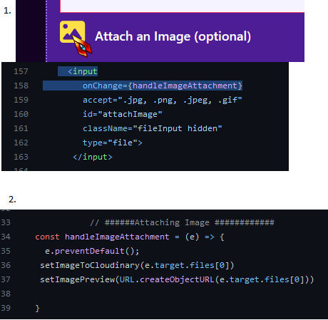

# Taming Cloudinary & The Great Battle of MongoDB Vs Next.JS

> Meg @megfdev (this post is not a reply, this is a vent post she made lol)
>
> Do you like suffering? Why not try getting your react form to accept your img file path from the input, send that off to cloudinary to do whatev it needs to do, get that img url back n add that to the post request with the other form data and send that to your DB without an error
>
> https://twitter.com/megfdev/status/1623184981873885193 9:00 PM · Feb 7, 2023

My Reply:

Oh hey! a pain i know all too well :D we're twinsies in suffering! Here's how I bound cloudinary's power to my will in my project

1. users select a file

2. handlImageAttachment runs, which saves it in two state objects

1 setImageToCloudinary ==> stores the file, which will later be sent to Cloudinary, in this state object

2 setImagePreview ==> turns the file into a url so it can be viewed by the user, WITHOUT having to upload it to cloudinary yet, and stores it in this state object



3. when they click post, handlePostCreate runs


handlepostCreate() calls another function, handleImageUpload()

so only AFTER the image has finished uploading (aka hafter handleImageUpload has finished submissting the image to cloudinary). It allows the submission to continue


the general code https://github.com/JSMarsh813/PetProfileTailor/blob/adding-edit-and-deletion-capabilities-to-comments-and-names/components/AddingNewData/AddPost.js  
my api https://github.com/JSMarsh813/Pet

> Reply from megfdev
>
> Janet! Sorry just one question but in your controllers on the server side, in your .create() does your object include a key for the image url and the cloudinaryId?

My Reply: For my app, I just stored the url in a variable because its all I needed.

But most people do end up using the public_id from my understanding.
You could have imagefromcloudinary store the entire data object, then take use the keys "url" and "public_id" to take out what you need


---

I finished adding the deletion option for names! And had a 🤯 moment and realized I could easily turn it into a reusable component for all items.

Twitter Post Link: https://twitter.com/Janetthedev/status/1623288655564648448 3:52 AM · Feb 8, 2023

---

I was having a hell of a time updating my data for filtering the list of names

Ex:

- Category: "Gender"
- Tags: Unisex, male, female.

So I wanted to split it into 2 collections, a category and a tags collection

So category populate's tags based on their objectID. But no matter how I tried mongodb REFUSED to work with the individual tags collection. Yet It worked with the user collection easily!


So I created a new model and it works🤷‍♀️

maybe since I didn't use a plural name ("NameTag" not "NameTags")?

I had tried every casing w/ the old model so it shouldn't be that


Annnndd after killing and restarting the development server it now doesn't work 😂(smiling face with tears)

why are you like this???

Glad my paranoia paid off I i did this before posting this update on linkedin

It was working again when I briefly switched to the user model, then back to the NameTag model .... but once I killed and restarted the development server its returning {} when populate is run. Aka not working

WELP time to sleep. I'm now more confused than ever (smiling face with tears)


Twitter Post Link: https://twitter.com/Janetthedev/status/1625116999729942528 4:57 AM · Feb 13, 2023

---

🐢I fought with my project when I got home, I thought we came to a truce. But! alas, mongodb decided to go the ol' julius caesar route, et tu mongodb

🐢 went to work

🦀 no anki

the last few days at work have been busy, so not much time for much, other than sleeping and working

## Twitter Post Link: https://twitter.com/Janetthedev/status/1625134363645206529 6:06 AM · Feb 13, 2023

Posted this to the 100devs discord, hopefully someone will have an idea why mongoose's populate() is being so funky 🥴

> "Hey everyone o/ happy valentines day! Speaking of valentines, I'll love you forever if you manage to help me solve this annoying mystery ;). Corny jokes aside, I've tried messing with mongoose's populate for hours but I'm having no luck. I'm trying to populate my namecategories collection's TAGS property, with TAGS from my tags collection.

> However, it seems like something must be wrong with the tags collection, because populate works perfectly with my users collection, but returns an empty object when I use my tags collection???

> I Tried:

> 1.  Dropping collections for name categories and tags in mongodb and recreating them by creating new apis and new models, and submitting the new data to the api.

> 2.  Dropping the tags collection and trying different names for the tags collection (NameTags, IndividualTags)

> 3.  Adjusting wording in the models, ect

> Its so weird that it works perfectly with the users collection but it hates any version of the tags collection I've tried?"


I could

1. return to the old school route of manually typing the tags to the collection in mongodb.

2. Or create an api which submits a put request to the name categories collection to add tags

But using populate seems like the most professional solution? And its ALMOST working uggghhh

update in case someone stumbles across this thread later: https://twitter.com/Janetthedev/status/1626464366886518784 (unlikely with twitters algo but juuuust in case)

> REPLY (user deleted their account, but I was replying to something here)

I knew there was something I forgot to mention! I started out by using ref in my schema but it didn't work either.

So I ended up using this as an alternative, since it was easier to switch between the user and tag model for troubleshooting

Thanks though for the suggestion

```
await Category.find()
  .populate({path:"tags",
             model: "Tag"})
res.status(200).json(category)

```

Twitter Post Link: https://twitter.com/Janetthedev/status/1625564893570306048

---

I thiiink I figured out the issue with populate! It looks like it might be a nextjs specific bug, I'll mess around with it more tomorrow to confirm then i'll reply to everyone and post about it

In the meantime, HUGE thanks to everyone who passed around my question and offered ideas!

Twitter Post Link: https://twitter.com/Janetthedev/status/1626208623570616320 5:15 AM · Feb 16, 2023

---

slept 12 hours 😂

now time to confirm the fix i found yesterday still works!

eyyy it still works huzzah! Going to explain what happened in a blog post since it'd otherwise turn into hellishly long twitter post thread 😂

Twitter Post Link: https://twitter.com/Janetthedev/status/1626433068792971264 8:07 PM · Feb 16, 2023

---

Victory is mine! I found out why populate wasn't working in next js! 😤

I had to import the model we're using to populate the objectId (nametags in the case)! 🤷

I wrote it out in detail here if you're curious

https://dev.to/janetthedev/using-mongooses-populate-in-nextjs-4jof

---

I started working on descriptions! I've got the models set up and the basic apis

tomorrow I've got some errands to run then I can maybe work on the fetchdescriptions page


Twitter Post Link: https://twitter.com/Janetthedev/status/1626539978149994496 3:12 AM · Feb 17, 2023

---

Huh, I finished the description area in a day 😳?! Wow, All the CRUD features work already? I guess I am learning after all😂


welp time to review the to-do list again

fix errors from

1. nametag model ===> renaming nametag to tag

2. category model ===> name to category

- shares

possibly:

- followers and following

- add tags to existing names

- followers and follwing (will be shown on seperate pages like on twitter)

add comments to names

Okay so next I'll focus on

1. Profile page: adding the descriptions the user has added to their profile page
2. Points system: adding the descriptions and likes to the points system
3. Dashboard: adding liked descriptions to the dashboard

---

Done! I suppose the next main things to focus on will be

1. making a single page for each description
2. sharing
   🤔

Twitter Post Link: https://twitter.com/Janetthedev/status/1626864852114325506 12:43 AM · Feb 18, 2023

---

I finished the individual pages for the descriptions!

Now that its 4am 🤪 its time to sleep and get ready for a week of work


Twitter Post Link: https://twitter.com/Janetthedev/status/1626924140274888710 4:38 AM · Feb 18, 2023

---

Huh letting users share links by clicking a button, which automatically copies the link to their clipboard is easier than I thought!

I already had the individual pages set up, so I just had to follow the instructions here!

https://medium.com/nerd-for-tech/how-to-add-copy-to-clipboard-functionality-in-a-reactjs-app-45404413fdb2

<video src="images/2023-02-19-huh-letting-users-share-links.mp4" width="320" height="240" controls></video>

I still have to add a toastify popup that says it copied to clipboard.

And when the share button is clicked, I want the share links section to pop up, but good progress for now!

```
{/ * SHARING OPTIONS SCREEN * /}

<section>

  <button
   onClick={()=>{
    navigator.clipboard.writeText(textForShare);
   }}>

    <FontAwesomeIcon
     icon={faLink}
     className="mr-2"/>
          Copy Link

  </button>
</section>
```


```
function BatsignalPost({
    className,
    sessionFromServer,
    post
    / / commentList,
    tagListProp,
})
 let textForShare=`http : / / localhost: 3000/posts/${post._id}
```


Twitter Post Link: https://twitter.com/Janetthedev/status/1627281310212575233 4:17 AM · Feb 19, 2023

---

I did some more work on the shares area!

I ended up not adding facebook messenger since the appID ect process was starting to be a pain, and I don't think it would add much value anyway 🤷‍♀️

Now to make it into a reusable component!

<video src="images/2023-02-20-did-some-more-work-on-the-shares.mp4" width="320" height="240" controls></video>

Twitter Post Link: https://twitter.com/Janetthedev/status/1627650479156264965 4:44 AM · Feb 20, 2023

---

I finished the followers/following function today and other edits. Man am i wiped but I'm one step closer to finishing the mvp!

<video src="images/2023-02-23-finished-the-followers.mp4" width="320" height="240" controls></video>

Twitter Post Link: https://twitter.com/Janetthedev/status/1628733325950214144 4:27 AM · Feb 23, 2023

---
