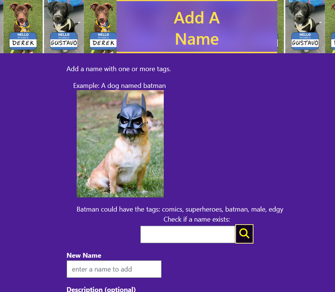
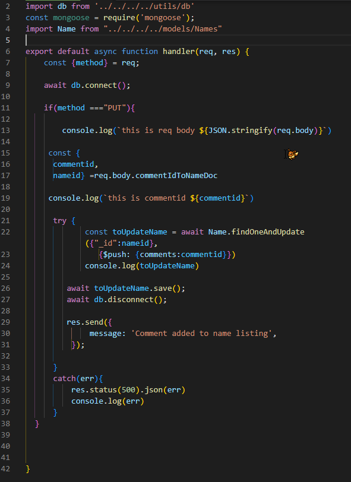
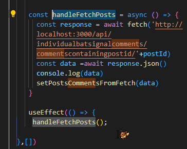
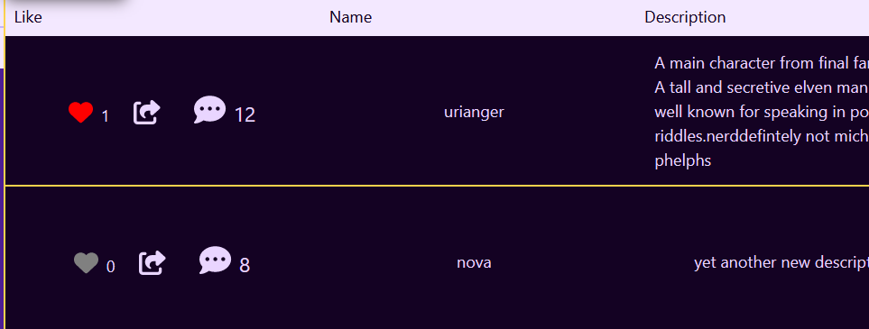
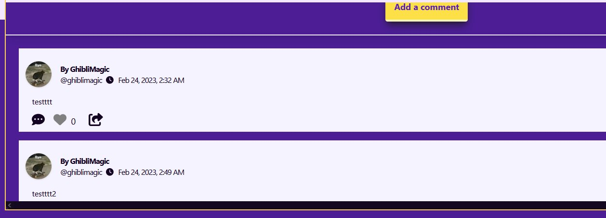
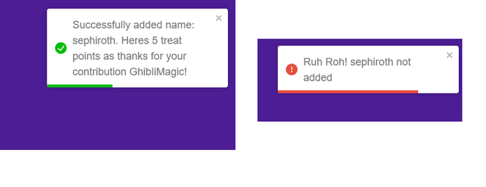
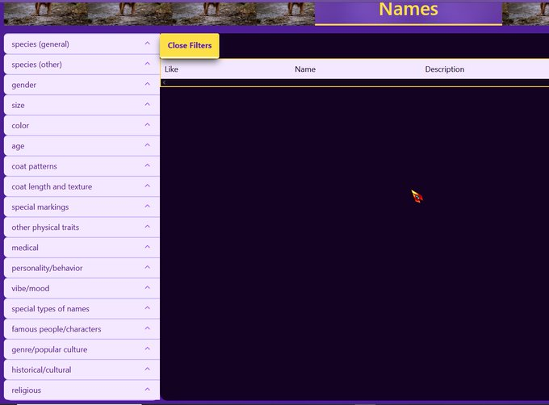
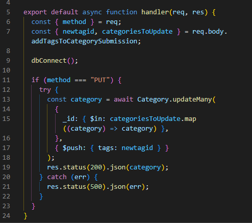
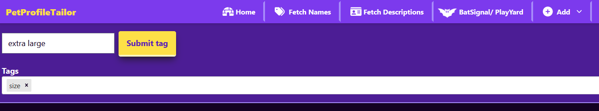

I started to add a function to let a users check if a name exists before trying to add it

But its almost 5am! time to sleep and battle with it again tomorrow😴



Twitter Post Link: https://twitter.com/Janetthedev/status/1628736548668866560 4:40 AM · Feb 23, 2023

---

🐍Did lots of project work, I feel like i'm getting SO close to finishing the mvp! So its hard to take breaks but I know I will need to soon, before I go cross eyed/lost my sanity 🥴

🦀 didn't work out

🦀 didn't do anki/banki

Twitter Post Link: https://twitter.com/Janetthedev/status/1628736974235521025 4:42 AM · Feb 23, 2023

---

Funny how its the small features that end up being a pain 😂
but I'm victorious! The check if a name exists feature now works!

<video src="images/2023-02-23-funny-how-its-the-small.mp4" width="620" controls></video>

Twitter Post Link: https://twitter.com/Janetthedev/status/1628980564744364032 8:50 PM · Feb 23, 2023

---

I figured out how to push object ids into a documents comments array in mongodb!

buuut then I remembered that .populate will fail since some of my name documents arrays will be empty 🥲

So I have to scrap it, well learned something new anyway

```
import db from '../../../../utils/db'
const mongoose = require('mongoose');
import Name from "../../../../models/Names"

export default async function handler(req,res){
  const {method} = req;

  await db.connect();

  if (method ==="PUT"){
    console.log(`this is req body ${JSON.stringify(req.body)}`)

  const {
    commentid,
    nameid
  } = req.body.commentIdToNameDoc

  try {
    const toUpdateName = await Name.findOneAndUpdate(
      {"_id":nameid},
       {$push: {comments: commentid}})
      console.log(toUpdateName)

    await toUpdateName.save();
    await db.disconnect();

    res.send({
      message: 'Comment added to name listing'
    });

  }
  catch(err){
     res.status(500).json(err)
     console.log(err)
  }
  }
}
```



So I'll end up doing the same workaround as I did for the posts page.

So the namelisting will call on an api to fetch all comments with that have its nameid, on rendering (thus the useEffect)

const handleFetchPosts = async () => {
const response = await fetch('http : / / localhost: 3000/api/individualbatsignalcomments/commentscontainingpostid/'+postId)

const data= await response.json()

console.log(data)

setPostsCommentsFromFetch(data)
}

useEffect(()=>{
handleFetchPosts();
})



sweet so the fetch in each component is working, now I just have to map through them and display them



Alright so now each one shows!

Phew that's enough for tonight. Later I'll just need to make it possible for users to reply to the comment for the name, like I did for posts, and it'll be done



> REPLY mattie.eth @EthMattie

> You should consider using a code formatter. There is a vscode extension called prettier which will format your code and give consistent style and spacing.

Thanks mattie! Its funny I've heard of prettier in passing but for some reason I thought it was more involved to implement? I was surprised how easy it looks to get set up

You've saved me a ton of time going through and cleaning up my code's formatting manually, thank you!

Twitter Post Link: https://twitter.com/Janetthedev/status/1629084793077108737 3:44 AM · Feb 24, 2023

---

Update on my progress so far! If my job & the code is nice to me, with any luck I might release the 1st version in ~2 weeks!

After that, I'll probably wait until I've done most of the "future" features before sharing with the animal welfare community (maddie's pet forum ect)

Leftover Tasks

1. Finishing comment feature for names

2. Improve validation (description can include only so many letters, so no clowns can upload the bee movie script ect :P)

3. Checking if things are working, minor changes such as text sizes ect

4. Fix nav/clean up code

5. Move everything to a clean database

6. Host on render

FUTURE

1. SWR/pagination

2. add comments to descriptions

3. Notification feature

4. Advanced name search (begins with, contains, ends with)

5. Advanced description search (begins with, contains, ends with)

6. Advanced user search (begins with, contains, ends with)

7. Messaging feature, probably with socket io

8. Add inspiration section (users can share adoption listing examples they found or came up with, that they thought were cool)

Potential Future ideas:

1. Add giphy api/gifs support

2. Adoption campaign ideas section? It technically already exists in the community section but if it suprisingly becomes big enough, I could give it its own section

3. Add a "cookies" feature, where users can send virtual cookies as a special thank you. For example, if a user used a specific name they can send the user that created that description a cookie.

4. how to get involved and or/other tips. Example: explaining what goes on with fostering. Letting users find shelters with unique programs like doggydayout programs (can take specific shelter pets out in the community, to help them get adopted)

5. helpful sites/resources

Twitter Post Link: https://twitter.com/Janetthedev/status/1629101162556440581 4:49 AM · Feb 24, 2023

---

My sites officially big enough now, that my video of clicking through everything quickly is still too long to post on twitter in one vid 😂

Not how I planned to measure my progress but I'll take it!

Twitter Post Link: https://twitter.com/Janetthedev/status/1629111664477106176 5:31 AM · Feb 24, 2023

---

🐍some anki at work, slooowly catching back up!

🐍 some more project work, I realized I have to adjust my models property names so I can reuse some components. They're basically the same but /one/ property is named slightly differently so its screwing up the components ugh

Twitter Post Link: https://twitter.com/Janetthedev/status/1629503290034778112 7:27 AM · Feb 25, 2023

---

🥲 Lost 2nd/anki break again but on the flip side, i'll probably get killer tips

🐸did some more project when I got home, the comment section seems to be fixed! 🎊Just scared to say its fixed in case the code hears me and decides to mess up again :P

🐸went to gym before work

Twitter Post Link https://twitter.com/Janetthedev/status/1630176312433463298 4:01 AM · Feb 27, 2023

---

Slept for a bit then:

🐸 added maxlength for various input fields, so users can't submit the bee movie script, ect :P

🐸 fixed the pages for viewing a single comment from posts, and a single comment from names

🐸users now can't submit descriptions if it already exists🥳

Twitter Post Link: https://twitter.com/Janetthedev/status/1630644282192437249 11:01 AM · Feb 28, 2023

---

Thanks sephiroth for helping me test out some validation!

no army of sephiroth mimics in this database, there can only be one (sorry @ kadaj, Loz, and Yazoo)



Twitter Post Link: https://twitter.com/Janetthedev/status/1630669601498624000 12:41 PM · Feb 28, 2023

---

Users can now check if a profile name exists!🥳

<video src="images/03-01-2023-users-can-now-check.mp4" width="520" controls></video>

Twitter Post Link: https://twitter.com/Janetthedev/status/1631084438229757952 4:10 PM · Mar 1, 2023

---

🐊did some anki while picking up groceries

🐊worked on the project, buttons are now all in the BUTTON folder, ect. Sadly VSC is glitchy with updating the routes, so I had to manually update most of the paths, ugh

🐻keep falling asleep, body how about we not be a bear 😂?

getting close! What's left:

1. fix nav

2. clean up code (basically getting rid of console.logs)

3. move everything to a clean database

4. make sure things work

5. host on render

Twitter Post Link: https://twitter.com/Janetthedev/status/1631224685492080640 1:27 AM · Mar 2, 2023

---

Prettiers pretty simple to set up but I liked the little snippets he mentioned here https://youtube.com/watch?v=DqfQ4DPnRqI&ab_channel=WebDevSimplified

SO grateful for prettier, it would of been a nightmare to manually go through and clean up the formatting

Twitter Post Link: https://twitter.com/Janetthedev/status/1631225524130291713 1:30 AM · Mar 2, 2023

---

switching to a new database was easy as I hoped! 😁

So now I'm making the official categories and tags. I tried to condense things into as few categories while also not adding too many tags to any one category



I ended up spoiling myself by creating a page just for me, where I can create a name tag, and then add it to several categories, that way I don't have to copy and paste ids manually!

```

export default async function handler(req,res){
    const {method} = req;
    const {newtagid, categoriesToUpdate} = req.body.addTagsToCategorySubmission;

    dbConnect();

    if (method === "PUT"){
        try {
            const category = await Category.updateMany(
                {
                    _id:{ $in: categoriesToUpdate.map(
                        (category) => category)}
                },
                { $push: {tags: newtagid} }
            );
            res.status(200).json(category);
        } catch (err) {
            res.status(500).json(err);
        }
    }
}

```




I'm still torn on whether to eventually allow for users to access this page, if they have very high levels of points and opt into it.

But eh, I'm not expecting this site to go viral or anything so telling myself to put that off for maybe the future

Twitter Post Link: https://twitter.com/Janetthedev/status/1631607836097789953 2:49 AM · Mar 3, 2023

---

I finished the name categories and name tags!😤🔥 one step closer!

now to do the same for the descriptions, and then its time to deploy and test everything again 😁

<video src="images/2023-03-03-finished-the-name-categories.mp4" width="720"  controls></video>

Twitter Post Link: https://twitter.com/Janetthedev/status/1631653284170842119 5:50 AM · Mar 3, 2023

---
