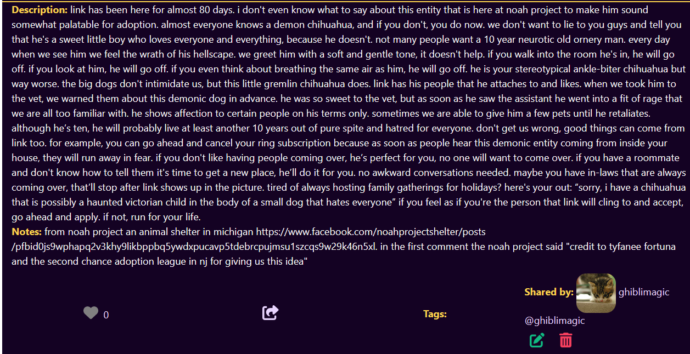

#

Fixed a thing!

My text was coming back correctly with its formatting information (ex: /n) but it wasn't showing in the browser.

After a decent amount of googling (it was weirdly hard to find the right words!), I figured out it was a html thing and I was able to fix it w/ tailwindcss

the logged description
> {
   description: 'although he's ten, he will probably live at least another 10 years out of pure spite and hatred for everyone.\n' + "don't get us wrong, good things can come from link too. for example, you can go ahead and cancel your ring subscription because as soon as people hear this demonic entity coming from inside your house, they will run away in fear. If you don't like having people coming over, hes perfect for you. no one will want to come over.}
>


```
{ */ ##### description SECTION ##### */ }

<div className="whitespace-pre-line> <====highlighted code
    <span className="text-amber-300 font-bold">
    Description: </span>
    {description.description}{""}
</div>

```




Heres some of the links that helped me figure out how to handle getting the /n formatting to show ! https://stackoverflow.com/questions/29608841/how-do-i-store-display-paragraphs-with-mongodb

Twitter Post Link: https://twitter.com/Janetthedev/status/1632383852491702272 6:13 AM · Mar 5, 2023

---

I moved the edit/delete buttons around to things mesh better. I figured I'd rather have them arranged like a spaced out triangle, so its a little harder to accidentally click on the wrong button.


changed the text to be a slightly more subtle yellow, so it hopefully looks sliiiightly better


Twitter Post Link: https://twitter.com/Janetthedev/status/1632387814049587206 6:29 AM · Mar 5, 2023

---

🐸did some project work when I got home, I ended up deciding to redo the layout for descriptions since I'm going to allow longer descriptions.
I'm soooo close to finishing the 1st version of the site, I wish I had more time to work on it uuuggh 

🌶️no anki/banki

Twitter Post Link: https://twitter.com/Janetthedev/status/1632390735092928512 6:40 AM · Mar 5, 2023

---

🐊Worked (got my 2nd break/anki time today! huzzah)

🐊did a TINY bit of project work (just changing the visuals a little bit). Alas, as much as I want to work on it more I've got to sleep


Did another small visual adjustment, it was a bit of a pain to get the flex to do exactly what I wanted. But I was victorious in the end! 🔥


Twitter Post Link: https://twitter.com/Janetthedev/status/1632693995875995649 2:45 AM · Mar 6, 2023

---

🐸did anki during work breaks today and yesterday

🐸did a little bit of project work before going into work at 8pm

Twitter Post Link: https://twitter.com/Janetthedev/status/1633463441003511812 5:43 AM · Mar 8, 2023

---

Finished with the description tags!

But now i'm going back and adding a "related names" section for descriptions, so users can easily find descriptions that are tailored to specific names

https://twitter.com/Janetthedev/status/1633733753301512192 11:37 PM · Mar 8, 2023

---

Did more project work! I decided instead of saving the tag directly ex: "dog". I'm saving the tag ids to the listings, and then using a populate to get all the information.

This way if the tags change, the filter option will still work, since the tags will update automatically


Twitter Post Link: https://twitter.com/Janetthedev/status/1633818776260218883 5:15 AM · Mar 9, 2023

---

🐸Did more project work (slowly, very slowly inching closer) 🐌
🐸Played a little bit of ff14
🌶️no anki
🐸caught up on sleep

tomorrow:
💫fix name/description listing deletion
💫fix description edit button
💫take the inspiration menu option off the nav, since I combined that idea with the description section
💫play some ff14
❓ gym/walk on treadmill?

Twitter Post Link: https://twitter.com/Janetthedev/status/1633819699975954433 5:19 AM · Mar 9, 2023

---

Got it mostly working on vercel! However when I try to load the dashboard page and profile page I'm getting this error 🤔

https://github.com/JSMarsh813/PetProfileTailor/blob/main/pages/dashboard.js
https://nextjs.org/docs/messages/client-side-exception-occurred

I'll fight with it tomorrow


uh the profile page is working now suddenly? still no luck with the dashboard though hmmm

or it was working, went i went back to it again, the profile page flashes and then that error message appears (smiling face with a tear)😂

even though getServerSideProps is working fine on other pages, I have a feeling this is because I was naughty and basically calling the internal api 🙈

Tomorrow I'll copy over the parts of the api i need, like the documentation says to, and see if it likes that better

Twitter Post Link: https://twitter.com/Janetthedev/status/1634173205991813126 4:43 AM · Mar 10, 2023

---

Slowly but surely making progress on debugging my next.js app!🫠
Moved the api logic into the getServerSideProps and oddly, I have to use JSON.Parse(JSON.Stringify()) to get the prop to pass correctly

Found the perfect thread for my issue
https://stackoverflow.com/questions/72176573/object-object-object-cannot-be-serialized-as-json-please-only-return-js

> REPLY
>
> Joe Prisk @jeprisk
>
> object Object might be getting logged because console.log returns a string value, you could try console.log(JSON.stringify(data)) to see the full payload

Thanks Joe for taking the time to offer some help!

My bad I should of clarified the bit of the question I was looking at was for the returned props, not the console.log. I need to use JSON.parse(JSON.stringify()) for it to be passed correctly, otherwise I get a client error.

Twitter Post Link https://twitter.com/Janetthedev/status/1634401162161197056 7:49 PM · Mar 10, 2023

---

🐸Moved most of the api logic into getserverside props
🐸 managed to replace most imgs with Next Image...and now i understand why so many people hate next image (for 12 not 13) 😭
🐸 added more alt tags
🐸 deleted used variables, notes ect

almost done (for the mvp version anyway) 🫠!
Need to:
💫fix a few errors
💫change the related name input for descriptions, so the user can enter any names rather than selecting from existing names. It works for now, but grabbing a list of EVERY name would be unweildly eventually

I'm thinking about removing the repeating image banners, but I'm not sure yet 🤔


This image is misbehaving juuuust a wee bit 😂Its grown to powerful with the power of next image!

ngl i cackled coming across this ridiculous error

<video src="images/2023-03-11-moved-most-of-the-api.mp4" width="320" height="240" controls></video>

Rejoice! the dino gif has been contained already, it was a nice escape attempt though I got to admit 😉


Twitter Post Link https://twitter.com/Janetthedev/status/1634556497287086082 6:06 AM · Mar 11, 2023

---

Hoping to borrow some of your big brains!

For the headers do you think it'd be better to

1. keep the repeating images
2. replace all header images with the one used in the dashboard
3. leave it blank
   🤔


Here's a poll for those who prefer them:

Keep the repeating image (0%)
use the dashboard image (72.7%)
leave it blank (27.3%)

> REPLY
> Jeremiah @acesupmedia
> Leaving it blank may look nice and also make it easier for testing responsiveness on different screen sizes ☺️

Very good point! And thanks Jeremiah taking a look and giving feedback, I might leave it blank for a few pages 😁

> REPLY
> Adam Morsa🏕 @RamblingAdam
> Dashboard image 100%!

Thanks adam for taking a look, super appreciate it! Looks like the dashboard image is the winner 🔥🔥🔥😁

Thanks everyone for the feedback! You'll all appreciated ❤️ looks like the dashboard image wins!

Twitter Post Link: https://twitter.com/Janetthedev/status/1634567376040787968 6:50 AM · Mar 11, 2023

---

🐢fixed share links so they no longer use localhost but instead grab the correct url from the env

🐢fixed next image issues

🐢improved filtering, so it doesn't flash at the user. Ended up being a dead simple fix that hit me as a random epiphany while showering

🐢changed headers!


Main pages have the same background image (thanks everyone who commented on the poll earlier for this!)

Pages for one specific item (ex: one name) I've decided to get rid of the header for

💫test everything to double check if everythings working, especially as a signed out user
💫 considering adding swr to the mvp, I was going to wait to implement it until later, but it really bugs me to not have this set up

Twitter Post Link: https://twitter.com/Janetthedev/status/1634953439758389249 9:24 AM · Mar 12, 2023

---

Think I may of turned into a bear for real, these two days off i've basically just been sleeping! aka waking up for a few hours, and then sleeping again.

Don't think i've ever slept this much, fam was checking on me to make sure i was alive


Twitter Post Link: https://twitter.com/Janetthedev/status/1636649948510048256 1:45 AM · Mar 17, 2023

---

Almost have swr to work but its being stubborn, I'm following the doc example but i'm confused why its loading all the names instead of just 10 at a time 😅ugggh so close!

Twitter Post Link: https://twitter.com/Janetthedev/status/1636768832068161537 9:37 AM · Mar 17, 2023

---

Couldn't get it to work with a true infinite scroll (aka grabs 10 more pieces of data when you scroll down). But I've got it to work with a load more button and it plays nicely with my filtering, after lots of fine tuning! 🎊

Though now it doesn't automatically show new data 🙃

So I figured out I can revalidate/mutate the data when the user clicks, so they'll get any new data without having to refresh the page.

Although I'd be nice to automatically have new names pop up, I worry having mutate run constantly would be too resource intensive 🤔

```
<button onClick={()=> setSize(size +1) && mutate()}>
   Load more names
```


Twitter Post Link: https://twitter.com/Janetthedev/status/1637111512778309637 8:19 AM · Mar 18, 2023

REPLY

> Adam Morsa https://twitter.com/RamblingAdam
>
> If your mutate function is running too often, you could either throttle its execution, or debounce it!
>
> This article is discusses functions that run on window resize, but you could definitely adapt the technique for your purposes!

---
