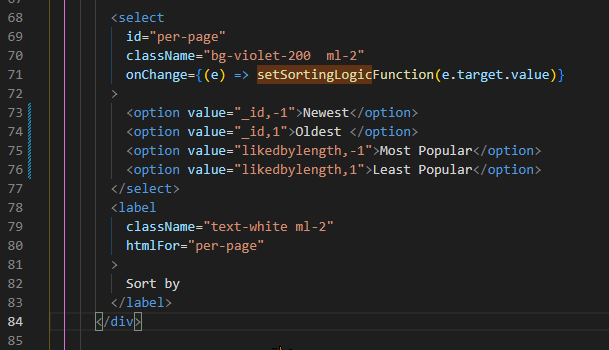

# Pagination & Aggregation Sorting Party Time! & The Afterparty: Punting Bugs into the Abyss

I'm thinking about making it so users can personalize how many names ect they want to show on each page.

And users can give a page number, so they can jump back and forth through the filtered list 🤔 

Twitter Post Link: https://twitter.com/Janetthedev/status/1637137770035679232 10:03 AM · Mar 18, 2023

---

I've been squeezing in tiny bits of code here and there, since i've been extra tired from getting that bread/working 😪 

But I made some progress on pagination! I had to make it from scratch because of my apps filtering system & because I didn't want to overtax my free mongo account 🎊 

<video src="images/2023-03-21-been-squeezing-in-tiny.mp4" width="320" height="240" controls></video>

Ideally I would of liked to make a "real" pagination, where we know exactly how many items match the filters. In other words, we would of known exactly how many pages there are. Aka, it would of been filtered on mongodbs side before starting swr/grabbing the data in bunches.

But that would require users submitting a new mongodb request EVERY time they change their filters.

So instead, users will get the data from mongodb, and the page numbers will increase the further along they go, until the server tells us "I got nothing left!". Filtering is done client side, to avoid extra requests

I'm going to move the pagination logic into a component, then add it to the bottom and the top, so the user won't have to scroll alllll the way back up to click to the next page

Then its time to add the pagination && swr to the description listings and community areas of the site

Twitter Post Link: https://twitter.com/Janetthedev/status/1638266915868254208 12:50 PM · Mar 21, 2023

---

Pagination is now in its own cozy and private component. Its also now on the top and the bottom 🥳
Progress!

Now time to roll back into bed for a before-work nap 😴 

<video src="images/2023-03-21-pagination-is-now-in.mp4" alt="showing the user clicking the next page and new names loading" width="640" height="480" controls></video>

> REPLY
>
> Adam Morsa🏕 @RamblingAdam
>
> Custom pagination! Super cool. Good way to limit Mongo traffic. Nice work Janet!

Thanks adam means a lot coming from you! my fellow 300+ hour long "100 project" friend😉

---

I was going to sleep but then I noticed huntober standup going on 👀 its been months since I was able to catch one! I've missed hearing leons voice so much and seeing the community hyping out in chat!

I also ended up working on pagination more, cause I just can't stop myself 😂 

<video alt="pagination now shows more than the previous, current and next page numbers" src="images/2023-03-21-i-was-going-to-sleep.mp4"  width="640" height="480" controls></video>

Twitter Post Link: https://twitter.com/Janetthedev/status/1638291369717547009 2:27 PM · Mar 21, 2023

---

alright time for bed for real this time!

But it looks like all thats left for the project is:

- adding pagination and swr to the community section && description
- bug hunting!/testing

Twitter Post Link: https://twitter.com/Janetthedev/status/1638311276068888580 3:47 PM · Mar 21, 2023

---

Finally fixed the bug that made me want to punt my code off a cliff!

The width wasn't being respected (see how the div with the white border respects it, but the one in red doesn't)

The reason? a very long "word" from a hyperlink!
I fixed it by telling it to break-all

<video src="images/2023-03-23-finally-fixed-the-bug.mp4" alt="showing that as the page is shrunk, the width is not shrinking at a certain point because of the long text name"  width="640" height="480" controls></video>

Twitter Post Link: https://twitter.com/Janetthedev/status/1638858527568719873 4:01 AM · Mar 23, 2023

---

I managed to find a way to make this image bow to the users' will! aka found a way to make a Next JS image to be responsive

```
  <div className="my-auto"> <===my-auto is the important bit
            <Image
              className=" mx-auto rounded-full lg:h-20"
              src="/batsignaldogsrunning.avif"
              width={140}
              height={120}
              alt=""
              style={{
                maxWidth: "100%",
                height: "auto"
              }} />
          </div>

```

<video alt="showing that the image warps strangely until it is put into a div with a my-auto property" src="images/2023-03-23-managed-to-find-a.mp4"  width="860" height="700"  controls></video>

Twitter Post Link: https://twitter.com/Janetthedev/status/1638930568795815939 8:47 AM · Mar 23, 2023

---

Wow, it doesn't feel real to say but, swr and pagination is done for the main pages!
Eventually I'll want to add it to the profile pages/ect but I've got to leave some things to future me haha

<video src="images/2023-03-23-wow-it-doesnt-feel-real.mp4" alt="showing check for more name button works" width="640" height="480" controls></video>

Now its just a matter of checking for bugs and deleting the dummy data from the database 🥳

Twitter Post Link: https://twitter.com/Janetthedev/status/1638932784155869187 8:56 AM · Mar 23, 2023

---

youtube.com/watch?v=qkdyum3L-kg&ab_channel=SanjayTechNPet Not me seeing how short this is and being tempted to add chatgpt to petProfileTailor😂

that way if the user submitted names and descriptions aren't cutting it, they can use it as a backup.

But! no, saving that for the maybe future


Twitter Post Link: https://twitter.com/Janetthedev/status/1638942533408673792 9:35 AM · Mar 23, 2023

---

Alas! Figures deployment wouldn't go without some hitches

I'm not sure why its giving me 500 when it works perfectly in the dev build?

and its showing me the message that pops up when the swr api file has been found...so its managed to get inside the right file?

<video src="images/2023-03-23-alas-figures-deployment.mp4" alt="showing a client side based error" width="640" height="480" controls></video>

this is such a weird error to me... running the dev and build locally work fine? But when deployed, i'll see all the data load and then woosh, theres 500 and client side errors?


the error isn't with swr infinite, since the error returned undefined.

Mongodb access is for all IPs (0.00 ect). Also its accessing the correct api file, since it shows the console.log at the start of the doc

not sure why the deployed version keeps getting 500 errors?? 🥴

I removed everything besides logging the various forms of the data

weird that its getting nothing back when in production mode 🤔triple checked my env variable and its correct with what i have in vercel...


```
return (
    <div className="bg-violet-900">
        <Layout
            profileImage={profileImage}
            userName={userName}
        />
        {`this is data ${JSON.stringify(data)}`}
        {`this is filtered names ${JSON.stringify(filterednames)}`}
        {`this is names ${JSON.stringify(names)}`}
    </div>
);
```


okay phew looks like i'm not insane! for some reason the production mode doesn't like the populates? (why is it always populate 😂)


My life as a dev in a nutshell 😂 


Alright, trying to add one of the populates back. Added the model it needs to find at the top, in case we're running into THAT issue again 🙄 

```
import dbConnect from "../../../../config/connectmongodb";
import Names from "../../../../models/Names";
import Users from "../../../../models/User";

export defaut async function handler(req,res){
    const method = req.method;
    const { page, limit } = req.query;
    console.log(`this is page ${page} with this many items ${limit}`);
    dbConnect();

    if( method ==="GET"){
        try {
            const individualNames = await Names.find()
            .skip((page-1) * limit)
            .limit(limit)
            .populate({
                path: "createdby",
                select: ["name","profilename","profileimage"],
            });
            / / .populate( {path: "tags", select: ["tag"]});
            res.status(200).json(individualNames);
        } catch (err) {
            res.status(500).json(err);
            console.log(`this is an error ${JSON.stringify(err)}`)
        }
    }
}
```


it flashed as undefined for a second but then figured itself out, time to add the second populate back


IT WAS POPULATE! Ugghhhh, my nemesis returns.

I had to add the models populate will use, since .populate() is a dumb little gremlin that is easily lost 🙃 


Twitter Post Link: https://twitter.com/Janetthedev/status/1638984856574230528 10:42 AM · Mar 23, 2023

---

alright now that the populate bug is defeated (again 🙃), time to sleep then hunt for some bugs && clear out the dummy data!

Twitter Post Link: https://twitter.com/Janetthedev/status/1638986900278226944 12:31 PM · Mar 23, 2023

---

Ended up adding sorting, because why not be an overachiever! 😂 

sadly sorting by likes/popularity looks like it'd be more complicated than just comparing the likedby property lengths, so alas maybe one day.

<video src="images/2023-03-23-ended-up-adding-sorting.mp4" width="320" height="240" controls></video>

> Reply
> User was deleted

Swr complicates things sadly `:(`
I get chunks of data at a time (because of swr) so it would have to be sorted on mongodb's end so i'm grabbing the most popular posts firsts.
Looks like aggregation would work but eh saving that for later. Thanks though for the thought!

Twitter Post Link: https://twitter.com/Janetthedev/status/1639096488394641408 7:47 PM · Mar 23, 2023

---

Felt like i was going a bit crosseyed by the end of it, but now users can sort by the most and least popular posts!

Thanks to the power of mongodb's aggregration 🥳
now to have a celebratory nap for 2 hours before work

<video src="images/2023-03-24-felt-like-i-was-going-a-bit.mp4" width="320" height="240" controls></video>

surprisingly aggregation wasn't too difficult despite lots of troubleshooting.

Found out the hard way you can't pass an object to sort like this =>
let sortObject = {"\_id": -1}
{ $sort: sortObject },

Instead you have to:
let sortObject= {};
sortObject["_id"] = -1🥴


```
{
([
...

{ $unwind: "$createdby"},
{
    $lookup: {
        from: "nametags",
        localField: "tags",
        foreignField: "_id",
        as: "tags",
    },
},
{
    $project: {
        name: 1,
        description: 1,
        tags: {tag: 1},
        comments: 1,
        createdby: {
            name: 1,
            profilename: 1,
            profileimage: 1,
        },
        likedby: 1,
        length: { $size: "$likedby"},
    },
},
]);

res.status(200).json(individualNames);
} catch (err){
    res.status(500).json(err);
    console.log(`this is an error ${JSON.stringify(err)}`);
}
```

```
<select
  id ="per-page"
  className="bg-violet-200 ml-2"
  onChange={(e)=> setSortingLogicFunction(e.target.value)} <== highlighted code>
  >
  <option value="_id,-1"> Newest </option>
  <option value="_id,1"> Oldest </option>
  <option value="likedbylength,-1"> Most Popular </option>
  <option value="likedbylength,-1"> Least Popular </option>
</select>

```




Twitter Post Link: https://twitter.com/Janetthedev/status/1639367607643176960 1:44 PM · Mar 24, 2023

---

Wild how much a few seconds (milliseconds) can change

Although my names page worked locally, when deployed to vercel I kept getting 504 errors (took too long for the api respond)
SO! I found out the hobby plan vercel will give up and send a 504 if your api is taking too long

So I ended up changing some logic around, and it now FINALLY works on vercel 🥳

Sorting value and property was split on the client side, before being sent to the api

parseInt was added within the aggregation


now to add to add the new sorting options to description!

or actually wait, realized i only have 3 hours to try to nap before work 😅 

well good luck to tomorrow me!

Twitter Post Link: https://twitter.com/Janetthedev/status/1639702046915063808 11:53 AM · Mar 25, 2023

---

I had wondered why swr was throwing 500 errors for the descriptions page, then I realized my butterfingers accidentally deleted a part of the query string! That'll do it 😂 

But its working now!


Twitter Post Link: https://twitter.com/Janetthedev/status/1640078702280318976 12:50 PM · Mar 26, 2023

---

Community section also uses aggregate sorting now!

ngl feel accomplished because my brain feels like fluff right now 🥴luckily any problems i faced were minor, no way I could of thought through anything major rn

welp time for a nap before work

<video src="images/2023-03-26-community-section-also-uses.mp4" width="320" height="240" controls></video>

https://twitter.com/Janetthedev/status/1640082816112402432 1:06 PM · Mar 26, 2023

---

Take that forcedReload whenever an item is edited or deleted! now with the power of swr, I can call mutate() and it'll automatically refresh and show the user the updated data!

```
/ / if itemChanged in the state is true, then we'll force a reload of the page. this is for BOTH the edit and delete functions

if (itemChanged){
    const forcedReload = () => {
      router.reload();
    }
    forceReload();
    setItemChanged(false);
}

```


Funny how the little things in life get so exciting!
I was laying in bed on the edge of sleep last night and mentally went !!! when I realized i could FINALLY get rid of that clunky forceReload 🥳

Twitter Post Link: https://twitter.com/Janetthedev/status/1640297986268991489 3:20 AM · Mar 27, 2023

---
