next share can be great. But even though a press on the enter key correctly sends the user to the right app (email, reddit, ect) its DETERMINED to not show the focus ring

But fear not I managed to make next-share behave with tailwindcss' focus-within option! 😤

<video src="images/2023-03-29-next-share-can-be-great.mp4" width="320" height="240" controls></video>

Twitter Post Link: https://twitter.com/Janetthedev/status/1640641300994355201 2:05 AM · Mar 28, 2023

---

me: at the stage to just test bugs

also me: decides I should give users the option to add an alt tag when uploading an image for a post

one of these days i'll stop thinking of "little improvements" and just debug

It has begun! Alas going to need to sleep soon 😴

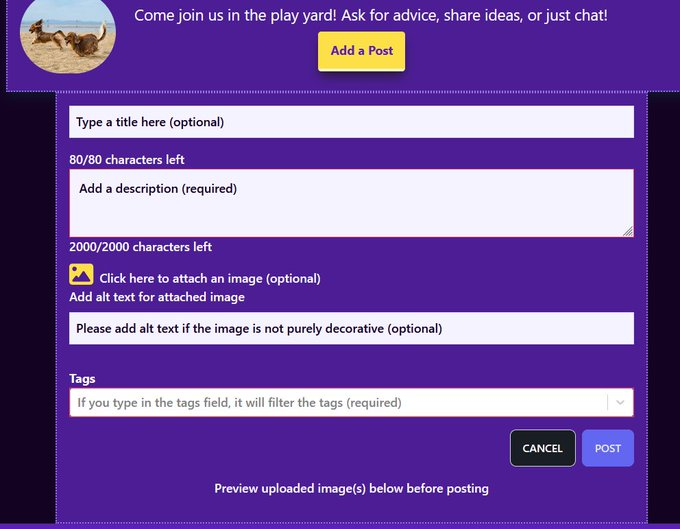

Twitter Post Link: https://twitter.com/Janetthedev/status/1640650819333935104 2:43 AM · Mar 28, 2023

---

🍈worked
🍈did a tiny bit of project work, tomorrow I'm going to edit the email sign in process. Instead of using sendgrid smtp i'm going to switch the web api
🍅no anki

Twitter Post Link: https://twitter.com/Janetthedev/status/1641075135989022720 6:49 AM · Mar 29, 2023

---

Well thats annoying, next auth pushes us to use smtp so I'll probably have to keep that.

BUT even though the smtp sendgrid magic email link works in production, vercels determined to say "the e-mail could not be sent" 🫠

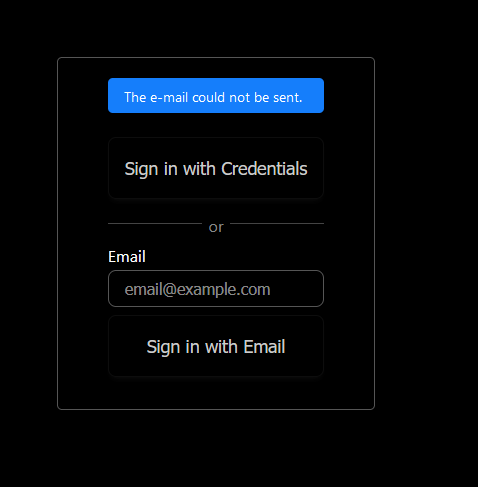

This seemed promising!
https://vercel.com/guides/can-i-get-a-fixed-ip-address
turns out vercel can't used a fix IP address. So I added 0.0.0.0 to sendgrid's allowed ips

no dice 😔

alright so found the actual error message in vercel 🧐

```[next-auth][error][SIGNIN_EMAIL_ERROR]
https://next-auth.js.org/errors#signin_email_error Invalid login: 535 Authentication failed: The provided authorization grant is invalid, expired, or revoked {
 error: {
   message: 'Invalid login: 535 Authentication failed: The provided authorization grant is invalid, expired, or revoked',
   stack: 'Error: Invalid login: 535 Authentication failed: The provided authorization grant is invalid, expired, or revoked\n' +
     '    at SMTPConnection._formatError (/var/task/node_modules/nodemailer/lib/smtp-connection/index.js:790:19)\n' +
     '    at SMTPConnection._actionAUTHComplete (/var/task/node_modules/nodemailer/lib/smtp-connection/index.js:1542:34)\n' +
     '    at SMTPConnection.<anonymous> (/var/task/node_modules/nodemailer/lib/smtp-connection/index.js:546:26)\n' +
     '    at SMTPConnection._processResponse (/var/task/node_modules/nodemailer/lib/smtp-connection/index.js:953:20)\n' +
     '    at SMTPConnection._onData (/var/task/ .....
     )
 }
```

console log of error

> providerid: 'email',

> message: 'invalid login: 535 Authentication failed: the provided authorization grand is inalid, expired, or revoked' }

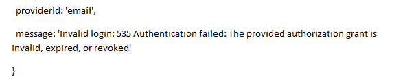

weird, the database is showing the verification token is created? So thats not the problem

Seems like somehow theres an error with the email?

the url shown was:

https : / / pet-profile-tailor.vercel.app/api/auth/signin?error=EmailSignin

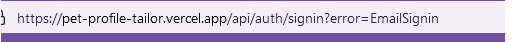

this gave me pause to double check my form

https://github.com/nextauthjs/next-auth/discussions/4990

and what do you know, it WAS my form. I forgot to set the buttons type to submit! 😂

why where you working locally then friend?!? WELP at least the button has been purified and plays nicely with vercel now


Today I committed the cardinal sin of forgetting to put a type on a button. Unforgivable!

may the world one day forgive me like vercel has 😔


Twitter Post Link: https://twitter.com/Janetthedev/status/1641191719583776769 2:32 PM · Mar 29, 2023

---

It was a journey of many, many small steps forwards and back. But! victory is mine!😤

I ended up being an overachiever again (suprise suprise). And I really, really wanted to figure out how to personalize the magic login link with next auth & add an image to the email

<video src="images/2023-03-30-it-was-a-journey.mp4" width="320" height="240" controls></video>

path.join(process.cwd()) was especially a lil' fun bug to figure out and squish!
I figured out process.cwd but vercel also required path.join() to work
three cheers for googling skills && gratitude for those many helpful threads

https://nextjs.org/docs/api-reference/data-fetching/get-static-props#reading-files-use-processcwd
https://vercel.com/guides/how-can-i-use-files-in-serverless-functions

One thing that was a bummer is I was hoping to make two buttons

Button 1. signs user in and sends them to dashboard
Button 2. signs user in and redirects to the settings page

seems that next auth only likes one callback for magic links though?

Thought of a workaround but its unweildly and ehh, i really need to get other stuff done 😂

Could of added a Boolean "wantsToResetPassword" property to the user objects in mongo. When the user clicks the forgot password button, it would send a put request.

when the magic link spits them out @ login.Then look at session.user.resetPassword...if false ==> redirect to dashboard. if true, send to settings

When the user goes to the settings page, check if session.user.resetPassword is true. If it is send a put request to change it to false

so. it'd be a lot of tedious code, AND I feel like it should be possible to do this more simply. So in the end I'd be tossing out all that code anyway

but eh as cumbersome as it feels to tell them how to manually reset their password, it works for now 🤷‍♀️

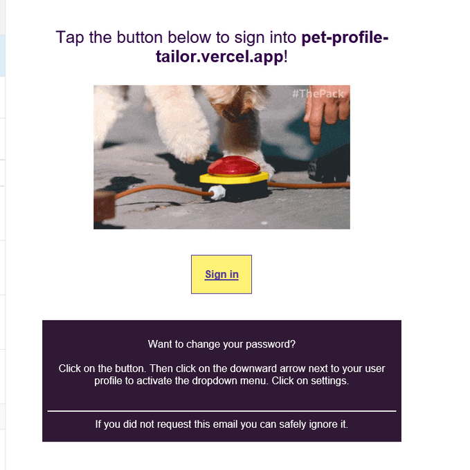

thought i was going to get ready for sleep, but ended up adding one more image! 😂

In the animal welfare industry, some users aren't tech literate. So i want to make the experience as painless as possible for them.

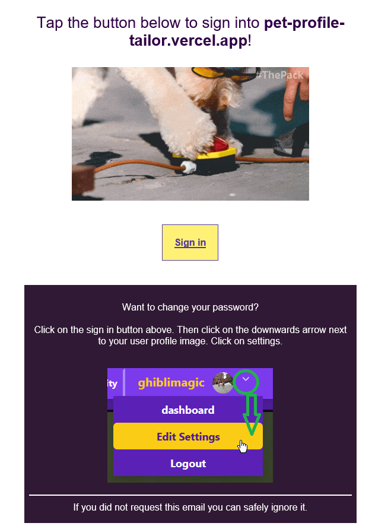

Twitter Post Link: https://twitter.com/Janetthedev/status/1641349466711281665 12:59 AM · Mar 30, 2023

---

so tomorrow should HOPEFULLY be the day i finish the last bits

mostly fixing some wonky width/margin properties on mobile

pray for me that no other feature occurs to me 😂

Twitter Post Link: https://twitter.com/Janetthedev/status/1641363162862882816 1:54 AM · Mar 30, 2023

---

Got lucky today that i was juuuust under the 100 maximum email requests from sendgrid :P (86).

Nothing like a good ol' debugging/developing party

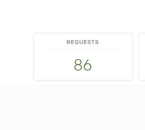

Twitter Post Link: https://twitter.com/Janetthedev/status/1641371280917299201 2:26 AM · Mar 30, 2023

---

Even though your first instinct can be to look at the wonky element, usually its because another element later on is stubbornly demanding it be bigger than the screen width allows!

the problem child here was the filtering area demanding that it wanted to be 80px. Not perfect

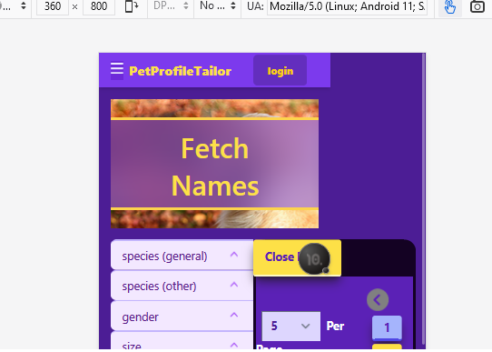
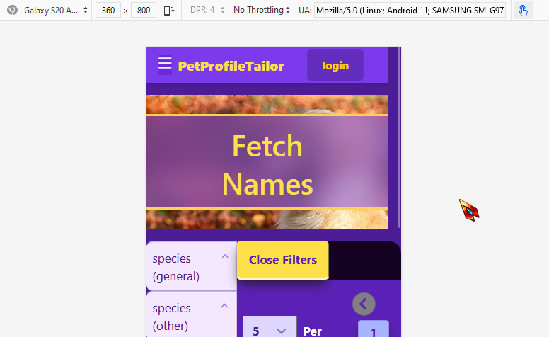

but close enough for my needs. Especially since that sliver only shows on super small mobile screens

I made it so the pages where tags and categories can be submitted are currently only submittable for me (my user id)

sooooomething terrible happened on the register page 😂 that image is supposed to be the size of a chicken not a t-rex!

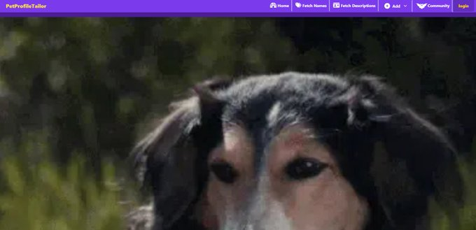

I realized i had converted it to a NextImage component from an img but hadn't checked on it 🙄ugh

<Image> my nemesis. Luckily flex continues to be my best bro!

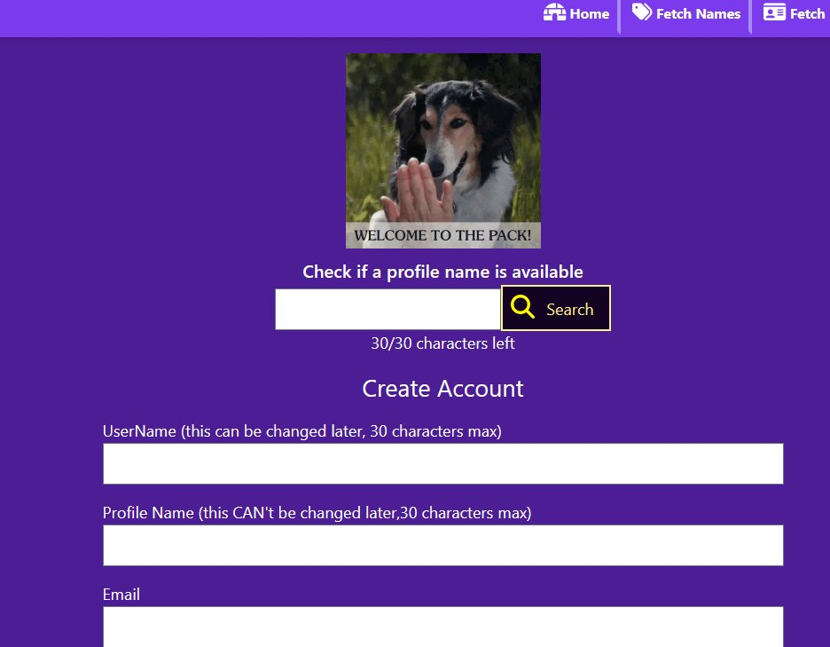

```
<div className="flex justify-center">
    <Image
        src="/welcoemtothepack.webp"
        alt=""
        width={220}
        height={220}
    />
</div>
```

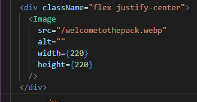

Twitter Post Link: https://twitter.com/Janetthedev/status/1641702978582380545 12:24 AM · Mar 31, 2023

---

So, I was getting a client side error sometimes on the community page.
But luckily I'm familiar with this tantrum! It was because these smaller apis still use populate, which needs the user model imported (its greyed out but trust me, its an extremely annoying bug with populate)

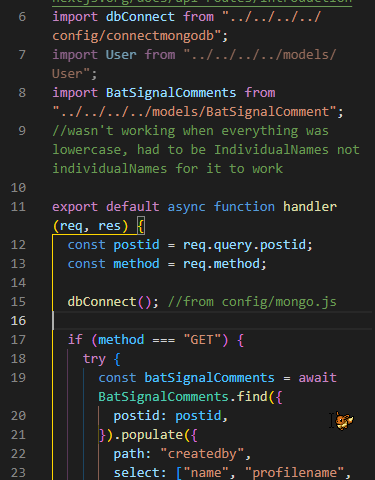

```
import dbConnect from "../../../../config/connectmongodb"
import User from "../../../../models/User"
import BatSignalComments from "../../../..models/BatSignalComment";
/ / wasn't working when everything was lowercase, had to be IndividualNames not individualnames for it to work

export default async function handler (req, res) {
    const postid = req.query.post;
    const method = req.method;

    dbConnect(); / / from config/mongo.js

    if (method === "GET") {
        try (
            const batSignalComments = await BatSignalCOmments.find({
                postid: postid,
            }).populate({
                path: "createdby",
                select: ["name", "profilename",
                ]
                ......
            })
        )
    }
}
```

Twitter Post Link: https://twitter.com/Janetthedev/status/1641713303255941120 1:05 AM · Mar 31, 2023

---
