so far most things are working but I discovered a tricky little problem! The blank space wasn't escaped as %20, so the twitter share link broke
hmm 🤔

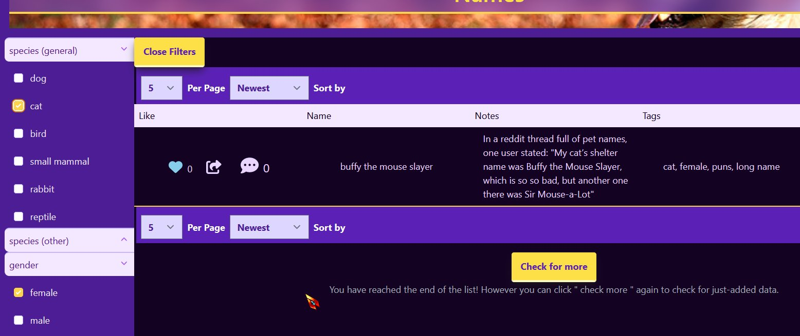
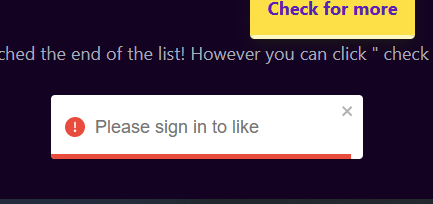

https : / / pet-profile-tailor.vercel.app/name/buff the mouse slayer
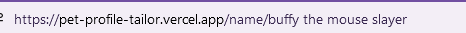
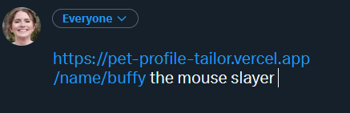

twitters share link works properly now! just had to break out my good ol' friend split and join

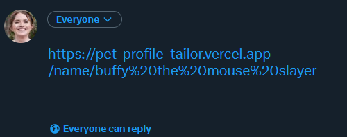

```
function SharingOptionsBar({linkToShare,localLink}){
    linkToShare = linkToShare.split(" ").join("%20");

    ...
}
```

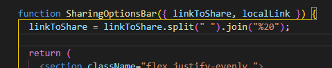

Error messages for uses who aren't logged in are showing propertly!

Though I realized I wanted to change the buttons text to "close" when the new post form is opened

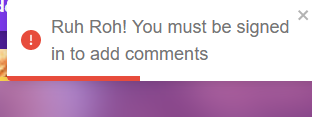
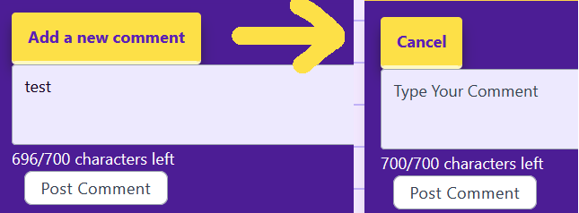

fixed! now the button shows as cancel when the add comment form shows

```
<GeneralButton
    text={` ${!showCommentForm? "Add a new comment" : "cancel"}`}
    onClick={()=>setShowCommentForm(!showCommentForm)}
    className=""
    />
```

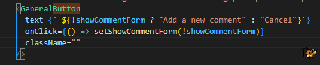

Fixed this so both cancel buttons will close the post form!

Had to pass a state update down as a function ect

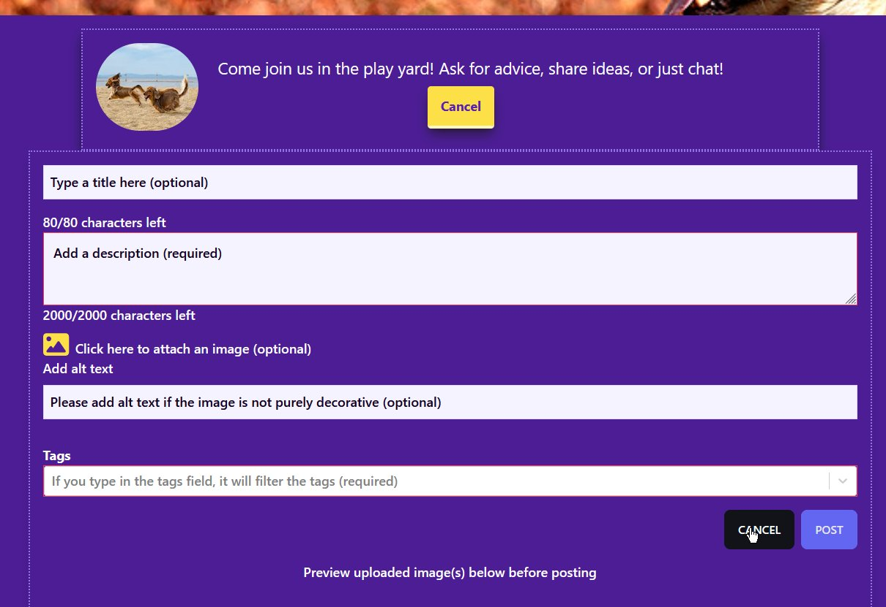

```
<button
    className="btn border border-gray-300 p-1 px-4 font-semibold cursor-pointer text-white ml-auto"
    onClick={()=>setAddingPostFunctioin()}>

    Cancel

    </button>
```

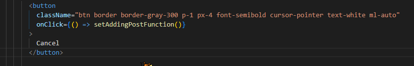

Twitter Post Link: https://twitter.com/Janetthedev/status/1641714938988359680 1:11 AM · Mar 31, 2023

---

Fixed a small bit of code that was keeping not-signed-in users from viewing profiles.

Fixed the mage that appears when followers/following is empty 🥳

<video src="images/2023-03-31-fixed-a-small-bit-of-code.mp4" width="320" height="240" controls></video>

Twitter Post Link: https://twitter.com/Janetthedev/status/1641892584682561537 12:57 PM · Mar 31, 2023

---

Huh weirdly though it works fine locally, the likes button is acting weird in builds

in builds, you can click the likes heart. but if you click a second you get this error. If you click a third time, it works like it should of on that second click?
"new connection" 🤔strange

> mongodb+srv : / / blllllannkkk net/pet_profile
> new connection
> typeError: Cannot read properties of undefined
> (reading '0')
> at Object.connect (D: \ janet\tech-magic\.....)

> already connected
> this is to update name {

}
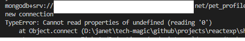
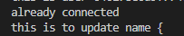


So it turns out, i'm a 🤡! i was TELLING it to disconnect. And turns out disconnect only works in production builds, thus the problem only appearing on builds

Got rid of that and the likes button works with npm run build && vercel

```
await db.connect();
const toUpdateName = await Names.findById(nameId);
console.log(`this is to update name ${toUpdateName}`);
toUpdateName.likedby.includes(user)
    ? (toUpdateName.likedby = toUpdateName.likedby.filter((userinlikedby)=> userinlikedby != user
    ))
    : (toUpdateName.likedby = toUpdateName.likedby.concat(user));

await toUpdateName.save();
    / / await db.disconnect(); <=== highlighted code
res.send({
    message:"Names likes updated",
});
```

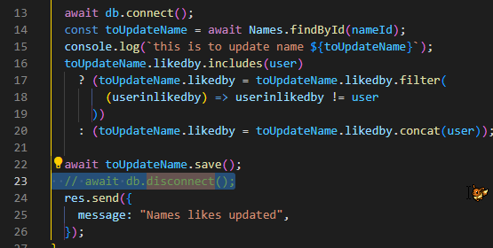

```
async function disconnect (){
    if (connection.isConnected){
        if(process.env.NODE_ENV === "production"){
            await mongoose.disconnect();
            connection.isConnected = false;
        } else {
            console.log("not disconnected");
        }
    }
}
```

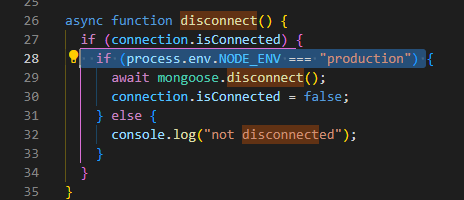

Twitter Post Link: https://twitter.com/Janetthedev/status/1641907144395202560 1:55 PM · Mar 31, 2023

---

Fixed another width problem! This time it was the nav bar 🙈

But its nothing "hidden && sm:block" won't fix!

(hidden in tailwind is short for display:none in css. So the logo is hidden until it reaches a small screen width)

<video src="images/2023-04-01-fixed-another-width-problem.mp4" width="320" height="240" controls></video>

Twitter Post Link: https://twitter.com/Janetthedev/status/1642296941047599104 3:44 PM · Apr 1, 2023

---

Fixed a few issues!

Adding a comment lead to a 500 error, I looked in the code and noticed there was a db.disconnect 🤦‍♀️removing that fixed it.

Realized the like, share and comment button we're accessible so i fixed that with tabindex="0". It looks a bit odd when focused on but eh

Twitter Post Link: https://twitter.com/Janetthedev/status/1642775602695643136 11:26 PM · Apr 2, 2023

---

🦠trying to mostly chill as my body fights covid 😤

🦠played ff14 for the first time in a long while

🦠caught some accessibility issues and database issues, issues seem to be fixed!

Twitter Post Link: https://twitter.com/Janetthedev/status/1642832141628342279 3:11 AM · Apr 3, 2023

---

Nothing like making changes to your local file and getting annoyed/wondering why it isn't showing on the live site 😂took me a minute to realize 🙈

Covid brain is real!

Twitter Post Link: https://twitter.com/Janetthedev/status/1643132105088696321 11:03 PM · Apr 3, 2023

---

I made a few small changes, like saying if the error response code is 409 let's directly tell the user that the name already exists, versus the general error message

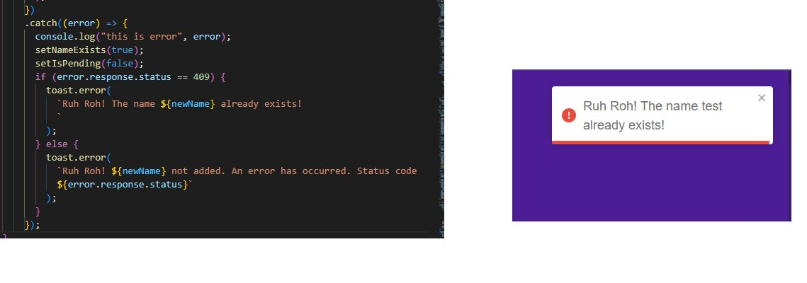

Twitter Post Link: https://twitter.com/Janetthedev/status/1643284064835891201 9:07 AM · Apr 4, 2023

---

Still working out a few bugs but if anyones dying to poke around here ya go! https://pet-profile-tailor.vercel.app

dummy account if anyone wants to use it instead:
email: test@ gmail.com
pass: testtest

Feel free to poke around but please don't change the email (in settings) because other users need that email to sign in

No biggie I can change it back if you make a goof though

> REPLY
> Adam Morsa🏕 @RamblingAdam
> I'm getting an error code 500 when I try to make an account 😿

noooo curses, luckily I was able to catch it in the vercel logs! It seems to be related to mongodb & nextauth, so i changed around the db file.

If you have time, give it another shot?

I need more devices to test with, 3 isn't enough! Running fine here but I don't trust it 😂

> REPLY
> Adam Morsa🏕 @RamblingAdam
> Success!
> 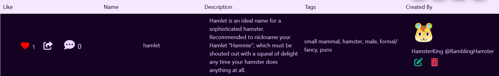

this is EVERYTHING i hoped for in a name with a description! A cute little summary as well as some helpful life tips to help them along their way 10/10 hamster squeaks! 😂

Seriously, words can't do justice to how much this made me laugh. Excellent work friend!

> REPLY
> Adam Morsa🏕 @RamblingAdam
> Yay!🐹🤣
>
> Notes:
> -Profile page is a 404 (you're prolly still building it)
> -The /dashboard route, if not logged in, returns a 500 if not logged in.
> -Related: Any /_randomtext_ route returns 404. Recommend setting up redirects to the main page if an unknown route is plugged in

Alright so I figured out what happened there! I was a goof and forgot to make it so profilenames are always lowercase! so when the url changed it to lowercase, it could never match the capitalization in the profilename! Should be fixed now 🙏🙇‍♀️

ah! Good idea about the redirect

Turns out next js has custom 500 & 404 pages, so I was able to create customized pages that still have a working nav bar, so users can easily escape the error messages!🥳

You're a real one! Seriously, thanks a mill for testing, the notes and ideas. You're a huge, huge help💕

> REPLY
> Khanh Tran 🌈 @khanhtncva
> I love the name "Bilbo Waggins", Janet! 😍
>
> By the way, just for your info, there's a 500 error.

hehe thanks! I must admit i shamelessly stole it, its such a fun name!

Boo @ mongodb/mongoose for being a brat, thanks for the heads up! Weirdly that particular error says its connected but mongo says it isn't? But I realized I didn't have an await, so hopefully thats it 🤷‍♀️

> new connection
> mongodb_srv(deletedstring)pet_profile_tailor?retryWrites=true&w=majority
> already connected
> MongoNotConnectedError: Client must be connected before running operations at executeOperationAsync
> (/var/task/node_modules/mongoose/node_modules/mongodb/lib/operations/execute_operation.js:24:19)
> 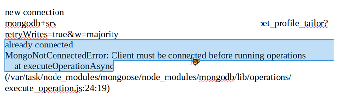

> REPLY
> ⚡️Shah⚡️@Shahx95
> I get a 500 Internal Server Error when i click on the link 😶

huh first time I saw an error for the landing page, but found it in the vercel logs!

Looks to be related to mongodb, so I changed the db file a bit. If you have some free time can you give it another shot?

I need more than 3 devices, its working fine here but I don't trust it😂

> REPLY
> ⚡️Shah⚡️@Shahx95
> i was able to login! yay! 😸😸

> REPLY
> ⚡️Shah⚡️@Shahx95
> When attempting to set my username (not previously set due to the magic link), I get a 500 error. And when attempting to add a description, it seems to continue forever. Probably because of no username.😄

ah! It feels silly it didn't even occur to me it would try to create a new user if the email didn't already exist/ was already registered versus just throwing an error! Thanks

Edited your profile in mongo so you have all the basic info/username ect now, thanks for your patience!

> REPLY
> ⚡️Shah⚡️@Shahx95
> Thanks for the vip access. 😆😸

> Reply
> Jason Jugo @HondaCivicChan
> 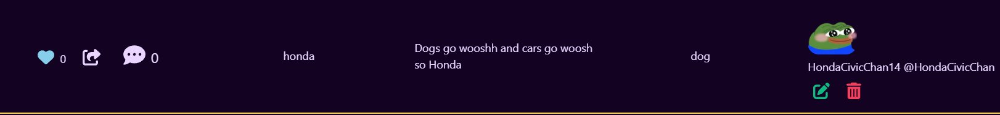

GLORIOUS! I am honored to have such a 11/10 name in the database and you are so right about that.

Honda really aught to be a name of a husky, whoosh there it gooooes


> Reply
> Jason Jugo @HondaCivicChan
> Haha so far the app is awesome! Works well on my end and I can see all the hard work you put in to it! 🔥

Twitter Post Link: https://twitter.com/Janetthedev/status/1644477741079887872 4:10 PM · Apr 7, 2023

---

🥝did banki for the first time in a long time!

🥝bit of project bug testing

🥝meditated

🥝played some ff14, read some omniscient reader on webtoon

🥝and most importantly gave ember some pets😜


Twitter Post Link: https://twitter.com/Janetthedev/status/1644612699962359809 1:06 AM · Apr 8, 2023

---

Alright so this is my first experience of working around existing users!

I discovered a bug where the profile link was using the user's name, instead of profilename🤦

I added profilename to session, but users who have an old session don't have it, so their nav bar freaks out and fails. So

```
{sessionFromServer.user.profilename && (
    <Menu.Item>
    {({active})=> (
        <MyLink
           href={`${
            process.env.NEXT.PUBLIC_BASE_FETCH_URL
           }/profile/${sessionFromServer.user.profilename.toLowerCase()}`}
           active={active}
        >
            Profile
        </MyLink>
    )}
    </Menu.Item>
)}
```

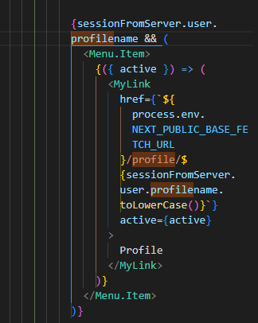

So i made it so the profile link only shows on the nav bar, if session.user.profilename exists! This way they can still logout if they have an old session

Twitter Post Link: https://twitter.com/Janetthedev/status/1645054342821732356 6:21 AM · Apr 9, 2023

---

alright so the error logs I got earlier was basically this and the core issue between them seems to be the mongoserver timing out?

So I switched db files (I had 2 different db files, one simplier and one more complex, no real good reason for it haha). & I added extra logic

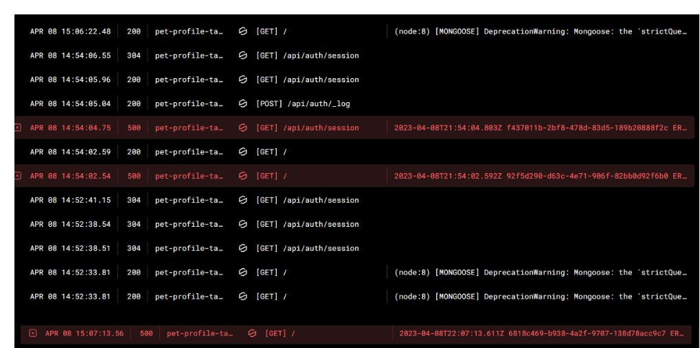

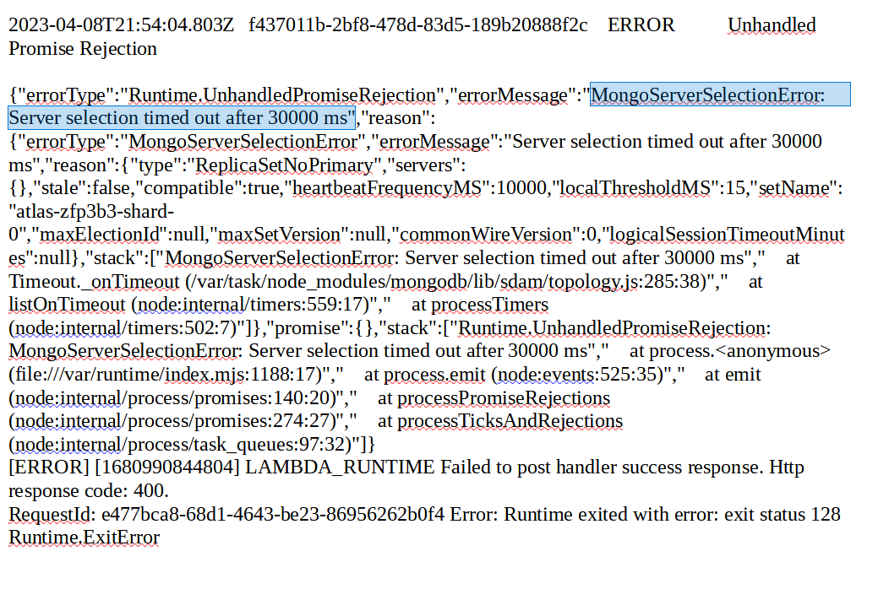
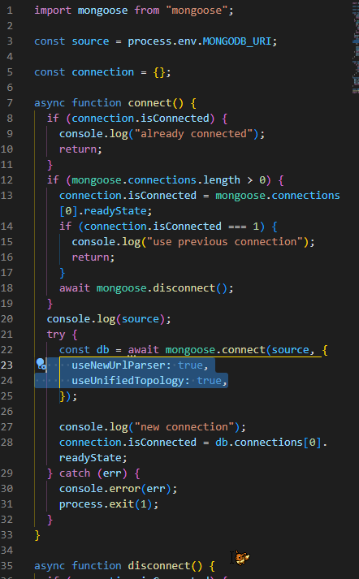

stackoverflow.com/questions/66231038/mongodb-failed-to-connect-connection-timed-out-connects-via-atlas

added that new bit based on this, heres for hoping that the first fix is miraculously the solution! working on all 3 of my devices but I only saw it pop up once in a blue moon before so 🤷‍♀️

This was the older simplier db file I got rid of. So I basically combined the two

```
import mongoose from "mongoose"

/ / process.env.MONGODB_URI gives us access to our query string password

const connectDB = async () => {
    try {
        const conn = await mongoose.connect(process.env.MONGODB_URI, {
            useNewUrlParser: true,
            useUnifiedTopology: true,
        });

        console.log(`MongoDB connected: ${conn.connection.host});
    } catch (err) {
        console.error(err);
        process.exit(1);
    }
};

modules.exports = connectDB;

```

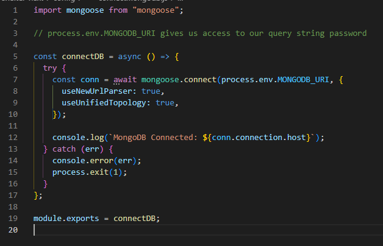

Twitter Post Link: https://twitter.com/Janetthedev/status/1645061354473295878 6:49 AM · Apr 9, 2023

---

Well!

thats a weird and new one 🤔either it was freaking out while the page was idling or someone got a weird error when trying it out

All IPs have access so 🤷‍♀️just a weird glitch maybe?

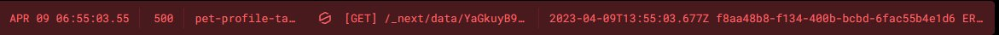

Log showed:

> " 2023-04-09T13:55:03:677z f8aafafsafd-adfasfdsf-afdafsd ERROR
> MongooseServerSelectionError: Could not connect to any servers in your MongoDB Atlas cluster. One common reason is that you're trying to access the database from an AP that
> isn't whitelisted. Make sure your current IP address is on your Atlas Cluster's IP whitelist

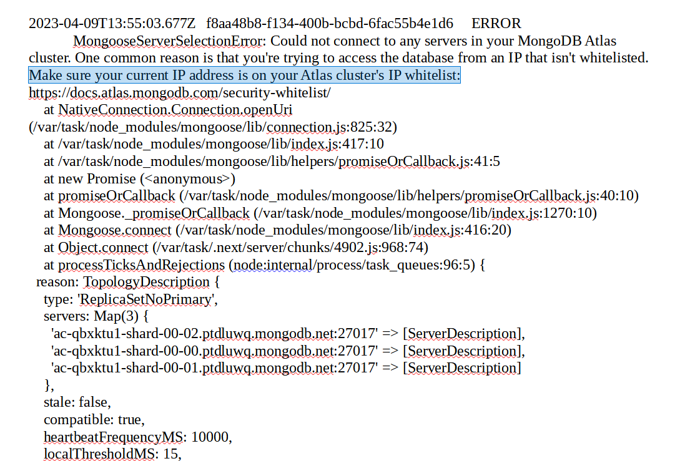

Log also showed:

> {..
> {...,
> stale: false,
> compatible: true,
> heartbeatFrequencyMS: 10000,
> localTheresholdMS: 15,
> setName: 'atlas-afdasfasfd-shard-0',
> maxElectionId: null,
> maxSetVersion: null,
> commonWireVersion: 0,
> logicalSessionTimeoutMinutes: null
> },
> code: undefined
> }
> RequestId: c2d234wffdafd-afdasfd-2334asf-43434-2434 Error: Runtime exited with error: exit status 2 Runtime.ExitError

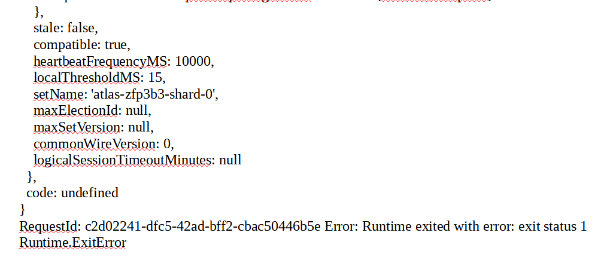

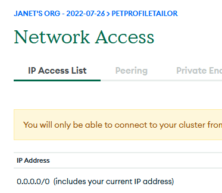

Twitter Post Link: https://twitter.com/Janetthedev/status/1645065281474265089 7:05 AM · Apr 9, 2023

---

nooo the errors still continue (occassionally) 🥲 1st one is strange one! since it says its connected but mongo doesn't see it?

But I realized some of the db.connect()s didn't have await, so hopefully changing it to async await will help...

log showed:

> already connected
> MongoNotConnectedError: Client must be connected before running operations at executeOperationAsynce

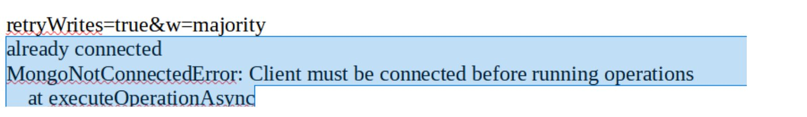

log also showed:

> Unhandled Promise Rejection
>
> {"errorType":"Runtime.UnhandledPromiseRejection",
> "errorMessage":"MongoNetworkTimeoutError: connection timed out",
> ....}

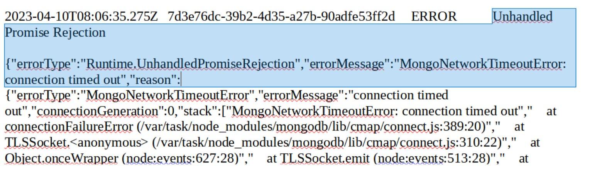

Twitter Post Link: https://twitter.com/Janetthedev/status/1645350753941463040 1:59 AM · Apr 10, 2023

---
