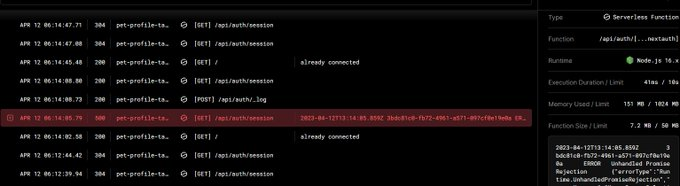
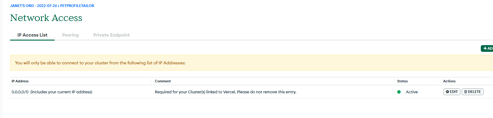
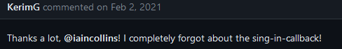
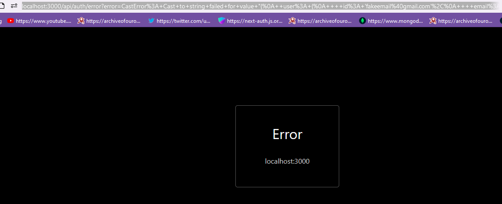
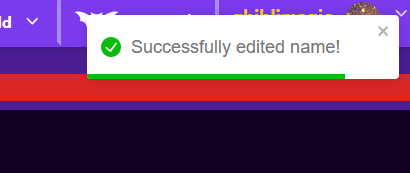
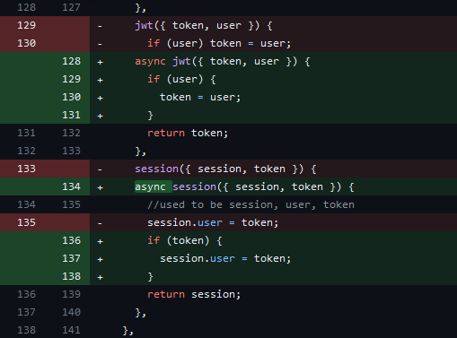
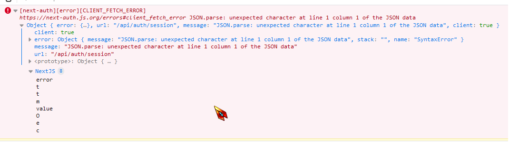
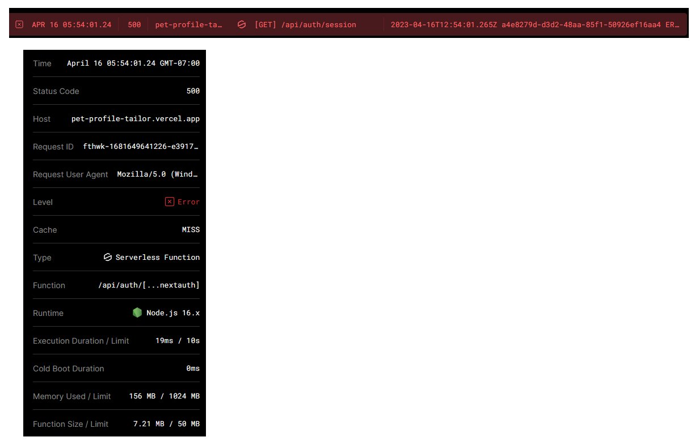

# Continuing the Database Connection Error Fight and Dealing with Edge Cases

Alright so I'm pretty sure the server problem is in here https://github.com/JSMarsh813/PetProfileTailor/blob/main/utils/db.js

But its frustrating that it very, very rarely occurs for me! I wish it was easier to test for 🥲

with any luck this tiny line on 28 I added will of fixed it, but I doubt it

The error message:

```
  2023-04-10T08:06:35.275Z	7d3e76dc-39b2-4d35-a27b-90adfe53ff2d
  ERROR	Unhandled Promise Rejection

 {"errorType":"Runtime.UnhandledPromiseRejection",
 "errorMessage":"MongoNetworkTimeoutError: connection timed out",
  "reason":
       {"errorType":"MongoNetworkTimeoutError",
       "errorMessage":"connection timed out",
        "connectionGeneration":0,
        "stack":
            ["MongoNetworkTimeoutError: connection timed out",
                "at connectionFailureError (/var/task/node_modules/mongodb/lib/cmap/connect.js:389:20)",
                "at TLSSocket.<anonymous> (/var/task/node_modules/mongodb/lib/cmap/connect.js:310:22)",
                "at Object.onceWrapper (node:events:627:28)",
                "at TLSSocket.emit (node:events:513:28)",
                "at TLSSocket.Socket._onTimeout (node:net:550:8)",
                "at listOnTimeout (node:internal/timers:559:17)","at processTimers (node:internal/timers:502:7)"
                ]
        },
 "promise":{},
 "stack":
    ["Runtime.UnhandledPromiseRejection: MongoNetworkTimeoutError: connection timed out",
    "at process.<anonymous> (file:///var/runtime/index.mjs......)]}
```

I had originally grabbed that code from coding with bashir https://youtube.com/watch?v=3kYkEVIZNZY&t=6964s&ab_channel=CodingwithBasir
at 1:51:55.

But the tutorial is 2 years old, so maybe the codes too old to work properly with the current mongodb ect? 🤷‍♀️
https://github.com/basir/next-amazona/blob/main/utils/db.js

I could try to use this example from vercel/next js https://github.com/vercel/next.js/blob/canary/examples/with-mongodb/lib/mongodb.ts but I liked how the other one would maintain the connection if one already existed. Versus remaking the connection a ton of times...

---

Yeah nope that didn't fix it

I didn't have high hopes but ugggh https://github.com/JSMarsh813/PetProfileTailor/blob/main/pages/api/auth/%5B...nextauth%5D.js

I doubt next auth itself is the issues, especially since its an await inside an async ... and the db.connect in the utils file has catch blocks... 🥴



once I wake up I guess my only choice at this point is to post in the 100devs discord and hope really hard that someone can point me in the right direction

I'm hoping its just my code syntax ect

I really don't want to update any dependencies if I can avoid it, though maybe its just because my mongodb and/or next auth is slightly older 🤷‍♀️

Its frustrating since it seems most people fixed this issue by making it so all IPs are allowed, but my database is already set up to allow all IPS 🙃

https://www.mongodb.com/community/forums/t/serverselectiontimeouterror-networktimeout-topology-type-replicasetnoprimary/179979



Its not my config/env since it usually DOES work?

WELP for better or worse I installed the newest versions of mongodb and mongoose. So far nothings on fire so it didn't seem to do any harm at least 🤷‍♀️

"dotenv": "^16.0.3"

Twitter Post Link: https://twitter.com/Janetthedev/status/1646130426493431809 5:37 AM · Apr 12, 2023

---

🐢did overtime for the last two days

🐢built a custom 404 and 500 pages, got session working on the static pages so the nav works right on those pages

🐤still fighting with the server error on pet profile tailor, lets see if updating mongodb & mongoose helped

🦀no anki/banki

Twitter Post Link: https://twitter.com/Janetthedev/status/1646173081889820672 8:27 AM · Apr 12, 2023

---

psst can any of you amazing people click around a bit and see if any errors pop up/it redirects you to a 500 page? https://pet-profile-tailor.vercel.app 🥺

Heres a begging shiba inu to pay the cute animal picture tax 🙏


Its working fine for 2 of my buddies but don't know if thats because we're all in california 🤔
Vercel had logged one 500 error, but it didn't effect them so _SHRUG_


if anyone wants to try logging in the dummy account is

test@ gmail.com
password: testtest

> REPLY
>
> Taeho @mcwhopper63
>
> awesome job!
>
> i used the dummy credentials and haven't come across a 500error. I did find the textArea doesn't clear after hitting the Post Comment button. This is in the Profile page section.

> REPLY
>
> Sophie @soph_m_e
>
> Cool project! I had a look and uploaded a post and didn’t see any errors or issues, I’m in England

> REPLY
> ?
> Cory N ✨death cab for coding✨ @3MonitorNelson
>
> I’m giving it a test and so far so good. Really great work!

> REPLY
>
> David Lenh @dlenh425
>
> Clicked around and didn't find any error pop-ups. I added Chris P. Bacon as a test. Aside from a pop-up that says name was added successfully, user doesn't get redirected elsewhere; it stays on the page with the form still filled out. Not sure if that was intended :)

Twitter Post Link: https://twitter.com/Janetthedev/status/1646375985061969920 9:53 PM · Apr 12, 2023

---

Plans for today 🚀

☄️ Write a letter of rec for one of my buddies

☄️ Make it so users can't register with the magic link

☄️ Fight w/ any errors petprofiletailor is still throwing if any

☄️get back on the anki/banki saddle

☄️ Some overdue down time with ff14 & friends

magic link is fixed! new users will be redirected to the registration page

only con is the registration page requires they add a password, so not ideal for users that will always be signing in with the magic link

🤷‍♀️not important enough to focus on for now though

Twitter Post Link: https://twitter.com/Janetthedev/status/1646380095635099648 10:09 PM · Apr 12, 2023

---

Okay looks like I have to create a sign in callback to make sure users can't sign up with the magic link

https://github.com/nextauthjs/next-auth/issues/1229

and if the email doesn't already exist in the database, send them to the registration page 🤔

this is the cutest typo😂



now I'm picturing people having to sing to sign in to their app 🎵 software dev meets musical!

---

Alright so the docs are annoying since they ONLY show the properties of Oauth provider and only vaguely hint at one property of the email provider 🙄

luckily i'm stubborn and figured out how to grab the error from the url to piece together the object https://next-auth.js.org/configuration/callbacks#sign-in-callback

```
{"user":
    {"id": "fakeemail@gmail.com",
    "email":"fakeemails@gmail.com",
    "emailVerified":null},
"account":
    {"providerAccountId":"fakeemail@gmail.com",
    "userId:"fakeemail@gmail.com",
    "type":"email",
    "provider":"email"},
"email":
    {"verificationRequest":true}
}
```



it works locally! Now to deploy and make sure its working on the build version/vercel too

---

Users who use the magic link will be redirected to the registration page if the email does not exist in the users collection yet 🥳

<video alt="showing users that try to sign in with a magic link without registering, being redirected to the registration page if the email does not exist in the database yet" src="images/2023-04-12-it-works-locally.mp4" width="640" height="480" controls></video>

So theres 3 properties for the email provider: user, account and email

```
{"user":
    {"id": "fakeemail@gmail.com",
    "email":"fakeemails@gmail.com",
    "emailVerified":null},
"account":
    {"providerAccountId":"fakeemail@gmail.com",
    "userId:"fakeemail@gmail.com",
    "type":"email",
    "provider":"email"},
"email":
    {"verificationRequest":true}
}
```

I need the email they enter, so I can ask my database if the user collection has a document with that email.

So I grabbed user. email . If it doesn't exist (null), they'll be punted to the registration page

```
callbacks: {
    async signIn({user, account, email}){
        console.log(JSON.stringify(user.email));
        await db.connect();
        const userExists = await User.findOne({
            email: user.email,
        });
        console.log(userExists);
        if (userExists){
            return true;
        } else {
            return "/regiser";
        }
    },
    .....
}
```

sweet the fix also works on the deployed version 🥳

Twitter Post Link: https://twitter.com/Janetthedev/status/1646395922434375680 11:12 PM · Apr 12, 2023

---

Fixed the error that @Polymath_Jesus found! Turns out I had forgotten to add the edit function for names to the profile page, whoops 😂🤦‍♀️



> there was an error when sending your edits
>
> TypeError: setEditedFunction is not a function

```
<section className="">
    {nameList.map((name)=> {
        return (
            <NameListingsAsSections
                name={name}
                key={name._id}
                sessionFromServer={sessionFromServer}
                taglist={nameTagList}
                setNameEditedFunction={setNameEditedFunction}
                />
        );
    })}
</section>
```

Thanks for the heads up friend!

Twitter Post Link: https://twitter.com/Janetthedev/status/1646853634100191235 5:31 AM · Apr 14, 2023

---

Got home from work and did a bit of project work.

Guess what, those three buttons on the landing page have finally found their lifes purpose! 🥳

Thanks @alexisintech for reminding me! I had half-forgotten about finding a job for those buttons

<video alt="when the buttons are clicking different iframes appear of different animal related videos" src=images/2023-04-16-got-home-from-work.mp4" width="640" height="480" controls></video>

It ended up being a bit interesting since iframes tend to flash white at first.

So I stored the onLoad property in the "loaded" state. And made it so the iframe and button only shows when the iframe is fully loaded

On vercel it still shows a brief flash🤷‍♀️

better than it was though

```
...
const [loaded, setLoaded]= useState(false);

return (
    <div ....>
        {!loaded && <span className="text-white text-xl"> Loading ... </span>}

    <GeneralButton
      text="close X"
      className={`...... ${ loaded? "block":"hidden"}`}
      ........../>

    <iframe
        className={`mx-auto aspect-video w-11/12 lg:w-7/12 ${styling} ${
            loaded? "block" : "hidden"
        }`}
        width="mx-auto"
        scr={`https://www.youtube-nocookie.com/embed/${embedId}`}
        title={`${title}`}
        allow="web-share"
        onLoad={()=>setLoaded(true)} <====== highlighted code
        allowFullScreen
        ></iframe>
    </div>
)
```

also I'm still SO in love with modules/react!

It was so satisfying to set up allll the embedding logic in a component, so the index page has the minimal needed information 😊

```
{ImpactfulClicked && (
    <div className="relative">
        <YouTubeEmbed
            embedId="y4randomnumbers">
            styling="aspect-video"
            title="fishtopher the cat gets adopted after going viral"
            showVideoFunction={()=>updateImpactfulState()}
            key="y4randomnumbers"/>
    </div>
)}

{funClicked && (
    <div className="relative">
        <YouTubeEmbed
            embedId="k4randomnumbers">
            styling="aspect-video"
            title="Woman writes hilariously honest adoption post for her wild foster dog | The Dodo Adopt me!"
            showVideoFunction={()=>updateFunState()}
            key="k4randomnumbers"/>
    </div>
)}

{tailorClicked && (
    <div className="relative">
        <YouTubeEmbed
            embedId="a4randomnumbers"">
            styling="aspect-video"
            title="Woman's brutally honest pet adoption ad goes Viral"
            showVideoFunction={()=>updateTailorState()}
            key="a4randomnumbers""/>
    </div>
)}
```

> REPLY
>
> Mujibur Rahman @devMujib
>
> You can use headless ui, that's Simple and you can easy make

Thanks 😁! I used headless ui for other parts of my app, but for this section I preferred just to use state && my own components ect. And its already done at this point

Twitter Post Link: https://twitter.com/Janetthedev/status/1647586882501619713 6:04 AM · Apr 16, 2023

---

stackoverflow.com/questions/71159356/nextauth-throwing-client-fetch-error-error-in-session-callback

Found this little tidbit and crossings fingers this will cure the randomly occuring next auth 500 errors!

Basically, I realized jwt and session weren't async and I added extra if statements







so far logging in still works, so it seems like those additions didn't break everything at least!

Promising so far but I'm wary to get my hopes up


Twitter Post Link: https://twitter.com/Janetthedev/status/1647596091125415936 6:41 AM · Apr 16, 2023

---

alright, I need to stop fiddling with the app and finally pass out 😂

🦎mostly just slept and worked today

🦎 knocked out a few more hours of project work

Tomorrow:

🚀work

🚀anki/banki

❓improve SEO of pet profile tailor

Twitter Post Link: https://twitter.com/Janetthedev/status/1647602496783929344 7:07 AM · Apr 16, 2023

---

wow adding Pet Profile Tailors meta info for SEO took all of 5 minutes, I feel like a goof for not adding this earlier! 😂 but I thought for sure it'd be more of a pain https://shopify.com/blog/how-to-write-meta-descriptions ah well, alls well that ends well

In the future maybe I'll add some personalization for some pages, but for now this should be good enough! 🎊

```
function MyApp({ Component, pageProps: {session, ...pageProps} }){
    return (
        <SessionFromProvider
            session={session}
            limit={1}
        >

          <Head>
            <title>
                Improve Adoption Rates by Creating Impactful, Fun, and Tailor-FItted Pet Adoption Profiles!
            </title>
            <meta
                name="Pet Profile Tailor"
                content="Pet profile tailor is a community powered assistant which helps you fid the perfect pet name or create pet profiles which are impactful, fun, and tailor fitted. Animal welfare professionals can use the community submitted names or descriptions to create engaging pet profiles to improve adoptions rates!"
                />
          </Head>
          <Component {...pageProps}/>
          <ToastContainer/>
    )
}
```

Twitter Post Link: https://twitter.com/Janetthedev/status/1647898116828565507 2:41 AM · Apr 17, 2023

---

🦎 finally added a head to pet profile tailor (getting those SEO gains 💪!)

🦎 fixed bug in pet profiles followers list (showed follow button instead of unfollow)

🦎 added most of my recent projects to portfolio

🦎 worked

🦎 did a tiny bit of anki/banki

its 5am, time to sleep! 😴

https://twitter.com/Janetthedev/status/1647947324147265537 5:57 AM · Apr 17, 2023

---

I finished the 1st version of my project Pet Profile Tailor (my "100" hours project for 100devs)! 🎊 https://lnkd.in/gFttmaxh

It empowers animal lovers to help adoption counselors create impactful, fun, and tailor-fitted adoption profiles!
code: https://lnkd.in/gizc8zPV #100devs

<video alt="video clicking through the site" src="images/2023-04-21-I-finished-the-1st.mp4" width="640" height="480" controls></video>

I worked as an adoption counselor in animal shelters for ~5 years. Although pet profiles are vital to boost adoption rates, there's only so much creativity a person can have at the crack of dawn.

Coffee can only do so much 😛 So I was inspired to create this site!

<video alt="clicking through more site features" src="images/2023-04-21-I-worked-as-an-adoption.mp4" width="640" height="480" controls></video>

After signing up, users can submit new names and descriptions, save favorites and follow other users.

Users can easily search and filter through community submitted names and descriptions.

New pet parents can also use it to brainstorm pet names for their new family member 😁

I just noticed this vid still had the likes number glitch 😂 whoops! thats what I get for using an oldish file

> REPLY
>
> Katy Smith @thesewhocan
>
> Hi Janet, I saw your 100 hour project -love it! I’d never thought that the adoption counsellors have to make up new names and stories etc for all of the animals! I made a cat name/cat backstory generator at the weekend using OpenAI:
>
> https://the-cats-meow.netlify.app
>
> If you’re interested in adding something like this to your project just let me know and I can share my GitHub repo with you!
>
> ☺️(I love the community/crowdsourcing aspect of your site though!)

!!! So cool to see someone use chatGPT for this! I've been playing around with using chatGPT as a little section to my site so this gives me hope it won't be pain itself to setup

CatPastLives cracks me up, super cute & unique feature 😂

Also may I say, your UI is gorgeous 👌🔥

> REPLY
>
> Katy Smith @thesewhocan
>
> Thanks Janet! I can’t take any credit for the UI as I just got a bootstrap theme for it (my eye for design is abysmal, but I really loved the colours and buttons on this one! ☺️)

Twitter Post Link: https://twitter.com/Janetthedev/status/1649658183273828353 11:15 PM · Apr 21, 2023
