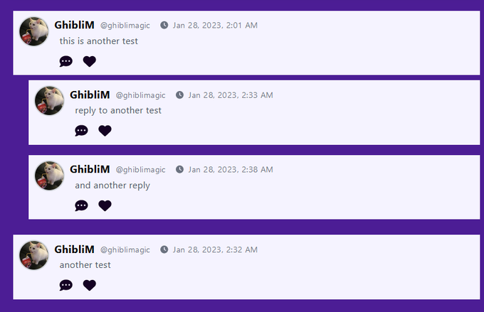

# It's "Time" to Get Wild! Let's Unlock Sorting, Format Dates and Link Mongodb Collections

Getting the newest posts to show up first was easier than I thought!

I just had to add a sort({\_id:-1})

I thought i'd have to use the timestamps but here they mentioned the ids could be used instead, so I did some digging and....

https://mongodb.com/community/forums/t/sorting-with-mongoose-find/158594

```
export default async function handler(req,res){
  const {method} = req;

  dbConnect() / / from config/mongo.js

  if(method ==="GET"){
      try {
        const individualPosts= await individualPosts.find()
        .sort({_id:-1}); <=== highlighted code
        res.status(200).json(individualPosts);
      }
      catch (err){
        res.status(500).json(err)
      }
      .....
  }
}
```

I found out why .sort({ \_id:-1}) worked to get the most recent documents!

It turns out each ObjectID in mongoDB contains a 4 byte timestamp! 🤯
https://www.mongodb.com/docs/manual/reference/bson-types/#std-label-objectid

From a screenshot from a page talking about ObjectId:

> ObjectId
>
> ObjectIds are small, likely unique, fast to generate, and ordered. ObjectId values are 12 bytes in length, consisting of:
>
> - a 4-byte timestamp, representing the ObjectId's creation, measured in seconds since the Unix Epoch.

Twitter Post Link: https://twitter.com/Janetthedev/status/1618229992416251905 4:51 AM · Jan 25, 2023

---

I've been working on my project in little bits of time but its been adding up!

1. Filtering now works

2. Edited my api so the newest posts show first

3. Each post has the users id. So EACH post COMPONENT calls an api. The api then finds a user w/ that id & grabs the posters username and picture

<iframe src="https://ucarecdn.com/33b84c11-5bed-496b-a2af-d2a81eff7035/20230125beenworkingonmyproject.mp4" width="640" height="480" title="progress on community page, filtering works and comments are loading" frameborder="0" allow="accelerometer; autoplay; clipboard-write; encrypted-media; gyroscope; picture-in-picture; web-share" referrerpolicy="strict-origin-when-cross-origin" allowfullscreen></iframe

Twitter Post Link: https://twitter.com/Janetthedev/status/1618233433662316551 5:04 AM · Jan 25, 2023

---

hmm making the post's creation date show up correctly in the current users timezone is more complicated than I thought...

It looks like its not recommended to use the timestamps??
so i guess I'll have to add a dateCreated property. Then somehow convert it w/ luxon or something??

Twitter Post Link: https://twitter.com/Janetthedev/status/1618234181926150147 5:07 AM · Jan 25, 2023

REPLY

> Jesse Pence @JessePence5
>
> This sent me down a rabbit hole.
>
> So, you have to ask the user for their current time zone and save it as part of their model.
>
> Then, you can make a new Date object with localestring and a modifier.
>
> https://stackoverflow.com/a/54453990
>
> The other thing that comes to mind would be middleware in Next.JS that tries to figure out the user's location and set the time zone from there.
>
> https://www.jamesperkins.dev/post/using-next-middleware-for-geolocation

REPLY

> Jesse R @jesseranon
>
> I went down this rabbit hole too. Luckily, if you're using mongodb, it converts timestamps to UTC for storage and all that's left is doing conversion on the client's browser.
>
> For me, it meant passing date-fns addMinutes function to front-end templates and using Date.offset.
>
> I got the idea from reading this article:
>
> https://www.toptal.com/software/definitive-guide-to-datetime-manipulation
>
> It took a bit to get to my solution, as I had to really get down in the weeds of playing with Date objects. But it works for my project and I understand Date objects a bit better than when I started out. Happy to help if you still need it.

MY REPLY

@JessePence5 @skadadark I'm amused that both of my fav jesses came rushing to my aid to fight time itself, I can now confirm jesse is clearly the name of time lords! Thanks both for sharing the gems of your deep dives 🙏 

Funnily enough I stumped across a simple solution

```
/ / ##### FORMATTING DATE ######

const dateFormatter = new Intl.dateTimeFormat(undefined,{dateStyle: "medium",
timeStyle: "short",
})

let formattedPostDate= dateFormatter.format(Date.parse(postDate))

```


@58:00 he goes over managing the time https://youtube.com/watch?v=lyNetvEfvT0&ab_channel=WebDevSimplified

So i was able to take my timestamp from mongodb/mongoose and convert it to a date that will show in the users timezone!

Thanks again both of you, you're the best truly 💖 

REPLY

> Jesse Pence @JessePence5
>
> I heard about the Intl API, but I didn't know it could be used for this! That is super handy and easy to write out. Great tip, Janet! `:)`

---

alright I want to keep going but its 5am I really need to go to bed 😂 

 🐍 did some anki during work breaks

 🐍 worked on my project when I got home, I figured out a part that made me nervous: making an api that lets me grab user info from the database within a component!💪

Twitter Post Link: https://twitter.com/Janetthedev/status/1618236190339256320 5:15 AM · Jan 25, 2023

---

🤯This changes everything! https://youtube.com/watch?v=o7dZWGiXcA8&t=191s&ab_channel=HuzaifaAsif

Found out how to link two mongoDB collections and WOW, its SO much easier!

So now when I grab post data, and it automatically knows to look at the user collection and grab the data for that userID!🎉🎉🎉

```
const mongoose = require("mongoose")

const PostSchema = new mongoose.Schema({
  image: {
    type: Array,
    required: false,
    unique: false,
  },
  title: {
    type: String,
    required: false,
    unique: false,
  },
  description: {
    type: String,
    required: true,
    unique: false,
  },
  createdby: { <===highlighted code
    type: String,
    required: true,
    ref: 'User'
  },
  ....
})
```

```
export default async function handler (req,res){
   const {method} = req;

   dbConnect() / / from config/mongo.js

   if (method === "GET"){
    try {
      const individualPosts = await individualPosts.find()
      .populate({path:"createdby", select:["name","profilename","profileimage"]}) <=== highlighted code
      .sort({_id:-1});
      / / this way we get the most recent posts first, we use id since mongoDB's objectID has a 4 byte timestamp naturally built in
      res.status(200).json(individualPosts)
    }
    catch (err){
      res.status(500).json(err);
    }
    .....
   }
}
```

console.log

> this is post list
>
> [{"\_id":"342424saf",
>
> "image:[],
>
> "title":"Test",
>
> description:"testy test",
>
> "createdby":{"\_id":"5354feffds", "name": "GhibliM", "profileimage":"https : / / res.cloudinary. com/dueafafaf/image/upload/v2324234/profileimage/g2fasfasf.jpg","profilename":"ghiblimagic"}}]


now i can delete that extra api I made, where i had the userID as an end point to grab all their data from the database 😁 

Twitter Post Link: https://twitter.com/Janetthedev/status/1618839109526773760 9:11 PM · Jan 26, 2023

---

me, wondering why an async function was being console.logged when it wasnt called???

So! turns out I forgot I had console.logged the variable earlier for something else, before reusing it for this function😂

whoops!


Twitter Post Link: https://twitter.com/Janetthedev/status/1618886932158889985

---

I FINALLY figured out how to get populate to work with an array of objectIds

I had to change the formatting a bit and change up the type 🥳

```
const mongoose = require("mongoose");

const PostSchema = new mongoose.Schema({
  image: {
     type:Array,
     required: false,
     unique: false,
  },
  title: {
    type: String,
    required: false,
    unique: false,
  },
  description: {
    type: String,
    required: true,
    unique: false,
  },
  createdBy:{
    type: String,
    required: true,
    ref: 'User',
  },
  comments:{
    type: Array,
    ref: "BatSignalComment",
  }, <===============highlighted code
 ......

},{timestamps: true})

const Post = mongoose.models.posts | | mongoose.model("Posts",postSchema);
export default Post
```

changed the highlighted code to

```

comments: [{
   type: Schema.Types.ObjectId,
   ref: 'BatSignalComment',
}]
```

Twitter Post Link: https://twitter.com/Janetthedev/status/1619061498365751296

---

Welp turns out that populate doesn't like it when some objects don't have any object ids for the field you want to populate 💀 

so I either need to find a way to tell mongoose, hey if theres no object id in the path, do not populate. Or switch to apis for grabbing comments 😢 

populate works fine when every post has comments though! So for now, I figured out the api logic for adding comments, and replies to comments ect, not letting replies nest too far ect ect



Twitter Post Link: https://twitter.com/Janetthedev/status/1619284632775823360 2:41 AM · Jan 28, 2023

---
